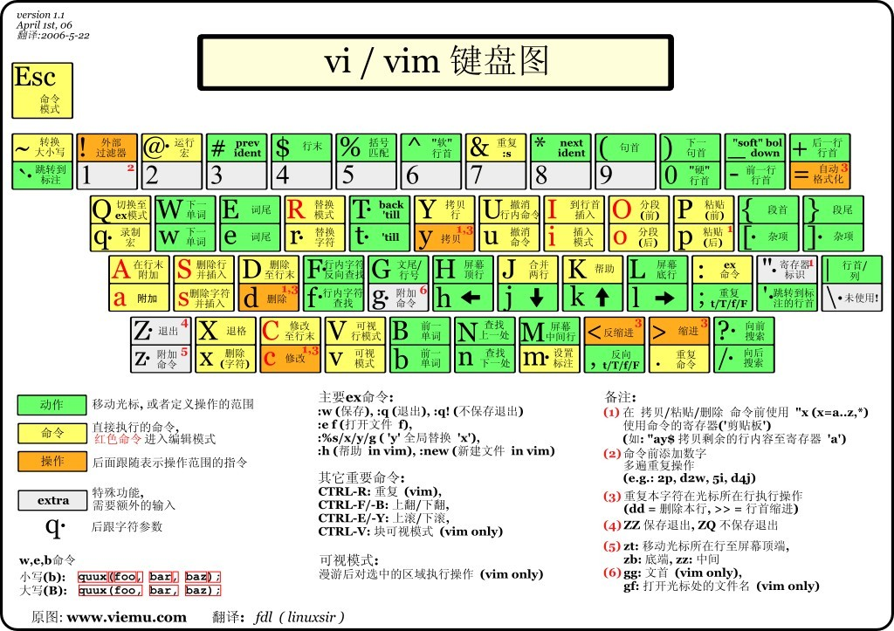

# Linux
一套免费使用和自由传播的类Unix操作系统，是一个基于Posix和Unix多用户、多任务、支持多线程和多CPU的操作系统。  
目前市面上较知名的发行版本有：Ubuntu、RedHat、CentOS等。

## Linux系统启动过程
* 内核引导
* 运行init
* 系统初始化
* 建立终端
* 用户登录

## Linux系统目录结构
| 目录	| 用途  |
|-------|-------|
| /bin	| Binary(二进制的)，最常用的命令	|
| /boot	| 核心文件	|
| /dev	| Device(设备)，Linux的外部设备	|
| /etc	| 系统管理所需要的配置文件和子目录	|
| /home	| 用户的主目录，一般以用户账号命名	|
| /lib  | 动态链接共享库	|
| /lost+found   | 非法关机后存放一些文件，一般为空	|
| /media    | 外挂的一些存储设备	|
| /mnt	| 临时挂载别的文件系统	|
| /opt	| 给主机额外安装的软件	|
| /proc	| 内存映射	|
| /root	| 系统管理员的用户主目录	|
| /sbin	| 存放系统管理员使用的系统管理程序	|
| /selinux	| 安全机制（防火墙）	|
| /srv	| 存放一些服务启动后需要提取的数据	|
| /sys	| 内核设备树的直接反映	|
| /tmp	| 临时文件	|
| /usr	| 存放用户的应用程序和文件，类似 program files	|
| /urr/bin	| 系统用户使用的应用	|
| /usr/sbin	| 超级用户使用的应用	|
| /usr/src	| 内核源代码    |
| /var	| 常修改的文件（日志等）	|

 
## Linux文件基本属性
### 查看文件类型命令
`ls -l`

### 文件类型
* [`d`] 目录
* [`-`] 文件
* [`I`] 链接文件
* [`b`] 可供存储的接口设备
* [`c`] 串行接口设备（鼠标、键盘等）

### 文件属性

<table>
	<tr>
	    <th>文件类型</th>
	    <th colspan="3">属主权限</th>
	    <th colspan="3">属组权限</th>
    	<th colspan="3">其他用户权限</th>
	</tr>
	<tr align="center">
    	<td >0</td>
    	<td>1</td>
    	<td>2</td>
    	<td>3</td>
    	<td>4</td>
    	<td>5</td>
    	<td>6</td>
    	<td>7</td>
    	<td>8</td>
    	<td>9</td>
	</tr>
	<tr align="center">
    	<td>d</td>
    	<td>r</td>
    	<td>w</td>
    	<td>x</td>
    	<td>r</td>
    	<td>-</td>
    	<td>x</td>
    	<td>r</td>
    	<td>-</td>
    	<td>x</td>
	</tr>
	<tr align="center">
    	<td>目录文件</td>
    	<td>读</td>
    	<td>写</td>
    	<td>执行</td>
    	<td>读</td>
    	<td>写</td>
    	<td>执行</td>
    	<td>读</td>
    	<td>写</td>
    	<td>执行</td>
	</tr>
</table>

### 文件属主和属组
对于文件来说，它都有一个特定的所有者，也就是对该用户有所有权的用户。同时Linux系统中，用户按组分类，一个用户属于一个或多个组。  
因此，Linux系统按文件所有者、同组用户、其他用户来规定不同的文件访问权限。

### 更改文件属性
* `chgrp [-R] 属组名 文件或目录` 更改文件属组 [`-R`] 递归
* `chown [-R] 属主名 属组名 文件或目录` 更改文件属主，也可以同时更改文件属组
* `chmod [-R] xyz 文件或目录` 更改文件9个属性，xyz为rwx属性值相加，r、w、x 分别为 4、2、1 
* `chmod u=rwx,g=rx,o=r 文件名` 也可以用来更改文件9个属性

## Linux文件与目录管理
### 处理目录的常用命令
`ls` `cd` `owd` `mkdir` `rmdir` `cp` `rm`

##### ls(列出目录)
* `-a` 全部文件
* `-d` 列出目录本身
* `-l` 列出文件属性、权限等信息

##### cd(切换目录)
##### pwd(显示目前所在目录)
##### mkdir(创建新目录)
* `-m` 配置文件权限
* `-p` 递归创建

##### rmdir(删除空目录)
* `-p` 递归删除

##### cp(复制文件或目录)
* `-a` 相当于`-pdr`
* `-d` 若来源档为连结档的属性(link file)，则复制连结档属性而非文件本身
* `-f` (force) 强制覆盖
* `-i` 文档存在时会询问是否覆盖
* `-l` (hand link)硬式连结的连结档创建，而非复制文件本身
* `-p` 文件属性一同复制，常用于备份
* `-r` 递归复制
* `-s` (symbolic link)复制成为符号连接档
* `-u` 若destination比source旧则覆盖

##### rm(移除文件或目录)
* `-f` force
* `-i` 互动模式，删除前询问
* `-r` 递归删除

##### mv(移动文件或目录，或修改名称)
* `-f` force
* `-i` 已存在则询问
* `-u` 若destination比source新则覆盖

### 文件内容查看
`cat` `tac` `nl` `more` `less` `head` `tail`

##### cat
由第一行开始显示文件内容

* `-b` 列出行号，仅针对空白行。
* `-n` 列出行号，针对所有行。

##### tac
与 `cat` 正好相反，从最后一行开始显示文件内容

##### nl
花式显示行号

##### more
一页一页翻动，功能不如`less`多，不常用

##### less
一页一页翻动，比`more`更强大，`less`运行时可进行以下操作：

* `[space]` 下翻页
* `[enter]` 下滚行
* `[up] [down] [left] [right]` 滚动
* `[pagedown]` 下翻页
* `[pageup]` 上翻页
* `/string` 向下搜索`string`
* `?string` 向上搜索`string`
* `n` 重复前一个搜索
* `N` 反向重复前一个搜索
* `q` 退出

##### head
显示文件前面几行

* `-n number` 显示`number`行。

##### tail
显示文件后面几行

* `-n number` 显示`number`行。
* `-f` 持续监测追加的内容，并显示出来。

## Linux用户和用户组管理
### 系统用户账号管理

* 添加 	`useradd option username`
* 删除	`userdel option username`
* 修改 `usermod option username`
* 管理口令 `passwd option username`

### 系统用户组管理

* 添加 `groupadd option groupname`
* 删除 `groupdel option groupname`
* 修改 `groupmod option groupname`
* 用户换组 `newgrp groupname`

## Linux磁盘管理
`df` `du` `fdisk`

##### df(列出文件系统的整体磁盘使用量)
* `-a` 显示所有文件系统
* `-h` 以易阅读的格式显示

##### du(检查磁盘空间使用量)
* `-a` 显示所有
* `-h`	易阅读格式
* `-s` 列出总量
* `-S`	列出不包括子目录的总量

##### fdisk(磁盘分区)

##### fsck(磁盘检验)

##### mount(磁盘挂载) umount(磁盘卸载)

## Linux vi/vim

### 常用快捷键
##### 移动光标的方法

| 快捷键    | 作用  |
|-----------|-------|
| `Ctrl+f` `Shift+⬇` `pageDown` | 向下翻页	|
| `Ctrl+b` `Shift+⬆` `pageUp`   | 向上翻页	|
| `0` `Home` `^`    | 行首	|
| `End` `$` | 行尾	|
| `H`   | 屏幕第一行	|
| `M`   | 屏幕中间行	|
| `L`   | 屏幕最后一行	|
| `G`   | 档案最后一行	|
| `gg`  | 档案第一行	|

##### 搜索替换

| 快捷键	| 作用	|
|-----------|-------|
| `/word`	| 寻找下一个word字符串	|
| `?word`	| 寻找上一个word字符串	|
| `n`	| 重复上一个搜索	|
| `N`	| 反向重复上一个搜索	|
| `:%s/word1/word2/g`	| word1替换为word2	|
| `:n1,n2s/word1/word2/g`	| n1行至n2行替换	|
| `:1,$s/word1/word2/g`	| 1行到最后一行替换	|
| `:1,$s/word1/word2/gc`	| 1行到最后一行替换，替换前询问	|

##### 复制、粘贴、删除

| 快捷键    | 作用	|
|-----------|-------|
| `J`	| 将光标所在行与下一行结成同一行	|
| `u`	| 撤销	|
| `Ctrl+r`	| 反向撤销	|
| `.`	| 重复上一个操作	|

##### vim环境修改
| 快捷键	| 作用	|
|-----------|-------|
| :set nu   | 显示行号	|
| :set nonu	| 不显示行号	|

## Shell
Shell 是一个用 C 语言编写的程序，它是用户使用 Linux 的桥梁。
Shell 既是一种命令语言，又是一种程序设计语言。

[Shell教程链接](https://github.com/Alex-wfh/Learn/tree/master/languages/others/shell)
