# MarkDown

一种轻量级标记语言，用易读易写的纯文本格式编写文档，然后转换成XHTML或HTML。

## 标题

```markdown
# 一级标题
## 二级标题
### 三级标题
#### 四级标题
##### 五级标题
###### 六级标题
```

## 列表
#### 无序列表

* 文本1
* 文本2
* 文本3

```markdown
* 文本1
* 文本2
* 文本3
```

#### 有序列表

1. 文本1
2. 文本2
3. 文本3

```markdown
1. 文本1
2. 文本2
3. 文本3
```

## 链接和图片
#### 链接

[Learn](https://github.com/Alex-wfh/Learn)

```markdown
[Learn](https://github.com/Alex-wfh/Learn)
```

#### 图片


```markdown

```

## 引用

>引用一段话

```markdown
>引用一段话
```

## 粗体和斜体

**粗体**  
*斜体*  

```markdown
**粗体**
*斜体*
```

## 代码引用
#### 单段代码

`单段代码`

```markdown
`单段代码`
```

#### 含\`的代码

``含`的代码``

```markdown
``含`的代码``
```

#### 多段代码

```python
#!usr/bin/env python
# -*- coding: utf-8 -*-
#多段代码
```

```markdown
​```python
#!usr/bin/env python
# -*- coding: utf-8 -*-
#多段代码
​```
```

## 表格

| th1   | th2   | th3   | th4   |
|-------|-------|-------|-------|
| td11  | td12  | td13  | td14  |
| td21  | td22  | td23  | td24  |
| td31  | td32  | td33  | td34  |


```markdown
| th1   | th2   | th3   | th4   |
|-------|-------|-------|-------|
| td11  | td12  | td13  | td14  |
| td21  | td22  | td23  | td24  |
| td31  | td32  | td33  | td34  |
```

## 分割线

* * *

```markdown
* * *
```

## 画图

- 节点名不能与关键字同名
- 使用引号可以避免一些不必要的麻烦

#### 流程图（graph）

关键字graph表示一个流程图的开始，同时需要指定该图的方向

##### 图方向

* TB，TD，BT，RL，LR
* T=TOP，B=BOTTOM，L=LEFT，R=RIGHT，D=DOWN

```markdown
​```mermaid
graph LR
	A-->B
	B-->C
	C-->D
	D-->A
​```
```

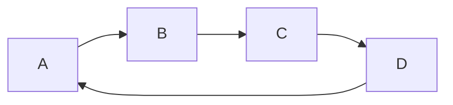

##### 节点形状

* 默认节点 A
* 文本节点 B[bname]
* 圆角节点 C(cname)
* 圆形节点 D((dname))
* 非对称节点 E>ename]
* 菱形节点 F{fname}
* A~F 是当前节点名字，类似于变量名，画图时便于引用
* [b~f]name 是节点中显示的文字，默认节点的名字和显示的文字都为A

```markdown
​```mermaid
graph TB
	A
	B[bname]
	C(cname)
	D((dname))
	E>ename]
	f{fname}
​```
```

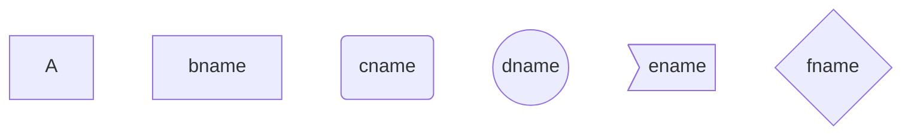

##### 连线

节点间的连接线有多种形状，可以在连接线中加入标签：

* 箭头连接  A1-->B1
* 开放连接 A2---B2
* 标签连接 A3--text---B3
* 箭头标签连接 A4--text-->B4
* 虚线开放连接 A5-.-B5
* 虚线箭头连接 A6-.->B6
* 标签虚线连接 A7-.text.-B7
* 标签虚线箭头连接 A8-.text.->B8
* 粗线开放连接 A9===B9
* 粗线箭头连接 A10==>B10
* 标签粗线开放连接 A11==text===B11
* 标签粗线箭头连接 A12==text==>B12


```markdown
​```mermaid
graph TB
    A1-->B1
    A2---B2
    A3--text---B3
    A4--text-->B4
    A5-.-B5
    A6-.->B6
    A7-.text.-B7
    A8-.text.->B8
    A9===B9
    A10==>B10
    A11==text===B11
    A12==text==>B12
​```
```

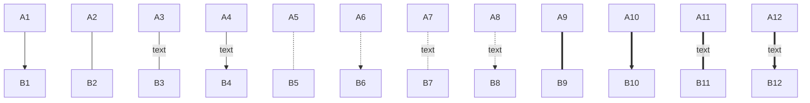

##### example

```markdown
​```mermaid
graph LR
	start("input x") --> handler("x>0?")
	handler --yes--> yes("output x")
	handler --no--> start
	yes --> exit("exit")
​```
```

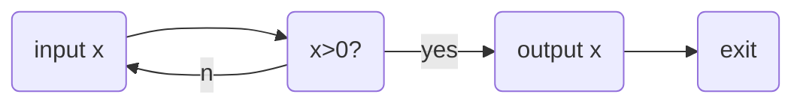

#### 子图（subgraph）

子图中的节点名不是隔离的，可以认为是全局变量

```markdown
​```mermaid
graph LR
	subgraph g1
		a1 --> b1
	end
	subgraph g2
		a2 --> b2
	end
	subgraph g3
		a3 --> b3
	end
	a3 --> a2
​```
```


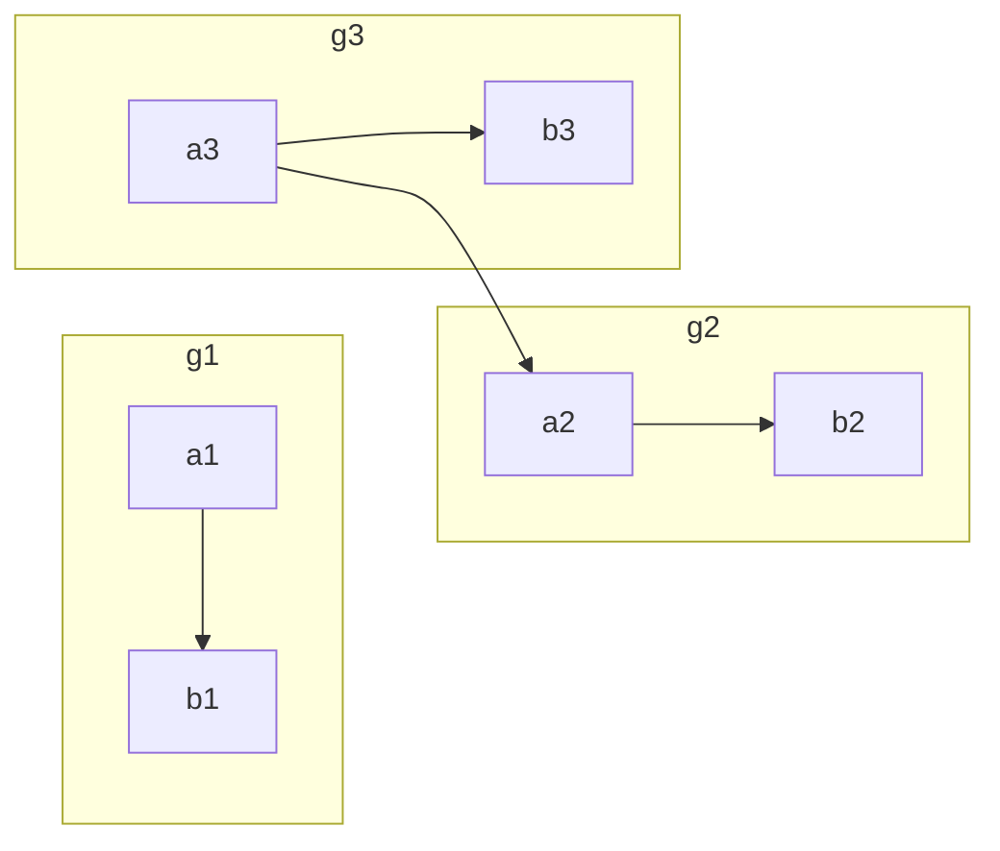

#### 序列图（sequence diagram）

##### 关键字

* participant，参与者，相当先定义模块，可通过设定参与者（participant）的顺序控制展示顺序

* note，便签，格式如下：

```
note [right of|left of][Actor]:Text

# 给多个模块做标签，通过逗号分割

note over [Actor1, Actor2...]:Text
```

* 循环

```
loop Loop_text
...statements...
end
```

* 选择

```
alt Describing_text
...statements...
else
...statements...
end

# 推荐在没有else的情况下使用opt（option，选择）

opt Describing_text
...statements...
end
```

```markdown
​```mermaid
sequenceDiagram
	Alice->>Bob: Hello Bob, how are you?
	alt is sick
		Bob->>Alice: not so good :(
	else is well
		Bob->>Alice: good
	end
	opt Extra response
		Bob->>Alice: Thanks for asking
	end
​```
```

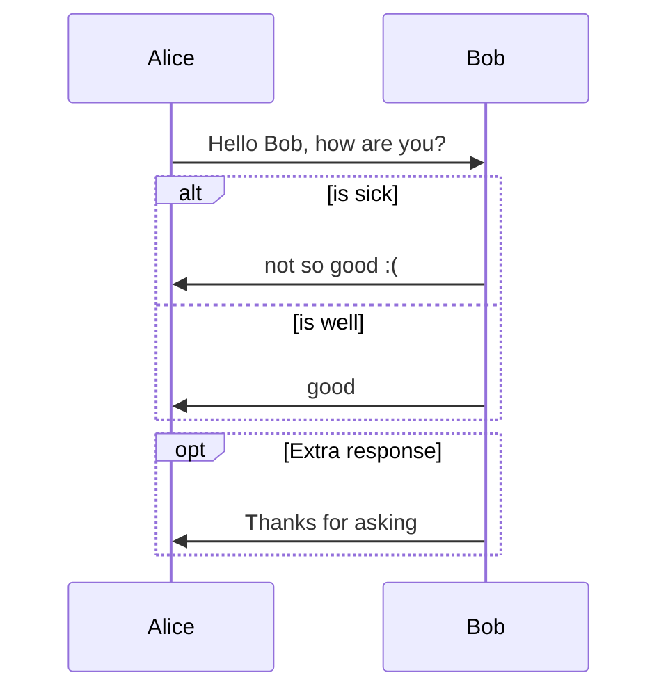

##### 连线

* 无箭头实线 ->
* 有箭头实线 ->>
* 无箭头虚线 ->
* 有箭头虚线 ->>
* 带x实现 -x
* 带x虚线 --x

```markdown
​```mermaid
sequenceDiagram
	note right of A: 倒霉，碰到B了
	A->B: Hello B, how are you?
	note left of B: 倒霉，碰到A了
	B-->A: Fine, thx, and you?
	note over A, B: 快点溜，太麻烦了
	A->>B: I'm fine too.
	note left of B: 快点打发了A
	B-->>A: Great!
	note right of A: 溜之大吉
	A-xB: Wait a moment
	loop Look B every minute
		A->>B: look B, go?
		B->>A: let me go?
	end
	B--xA: I'm off, byte
	note right of A: 太好了，他走了
​```
```

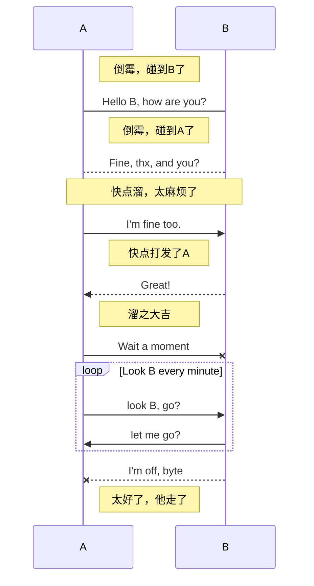

想改变AB的顺序怎么办呢？

```markdown
​```mermaid
sequenceDiagram
	# 通过设定参与者（participant）的顺序控制展示顺序
	participant B
	participant A
	note right of A: 倒霉，碰到B了
	A->B: Hello B, how are you?
	note left of B: 倒霉，碰到A了
	B-->A: Fine, thx, and you?
	note over A,B: 快点溜，太麻烦了。。。
	A->>B: I'm fine too.
	note left of B: 快点打发了A
	B-->>A: Great!
	note right of A: 溜之大吉
	A-xB: Wait a moment
	loop Look B every minute
		A->>B: look B, go?
		B->>A: let me go?
	end
	B--xA: I'm off, byte
	note right of A: 太好了，他走了
​```
```

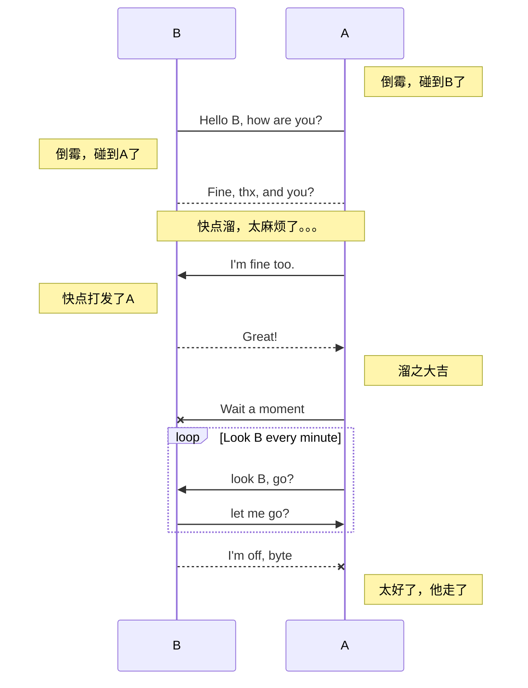

```markdown
​```mermaid
sequenceDiagram
	# 通过设定参与者（participants）的顺序控制展示模块控制
	participant Alice
	participant Bob
	participant John
	Alice->John: Hello John, how are you?
	loop Healthcheck
		John->John: Fight against hypochondria
	end
	note right of John: Rational thoughts <br/> prevail...
	John-->Alice: Great!
	John-->Bob: How about you?
	Bob-->John: Good!
​```
```

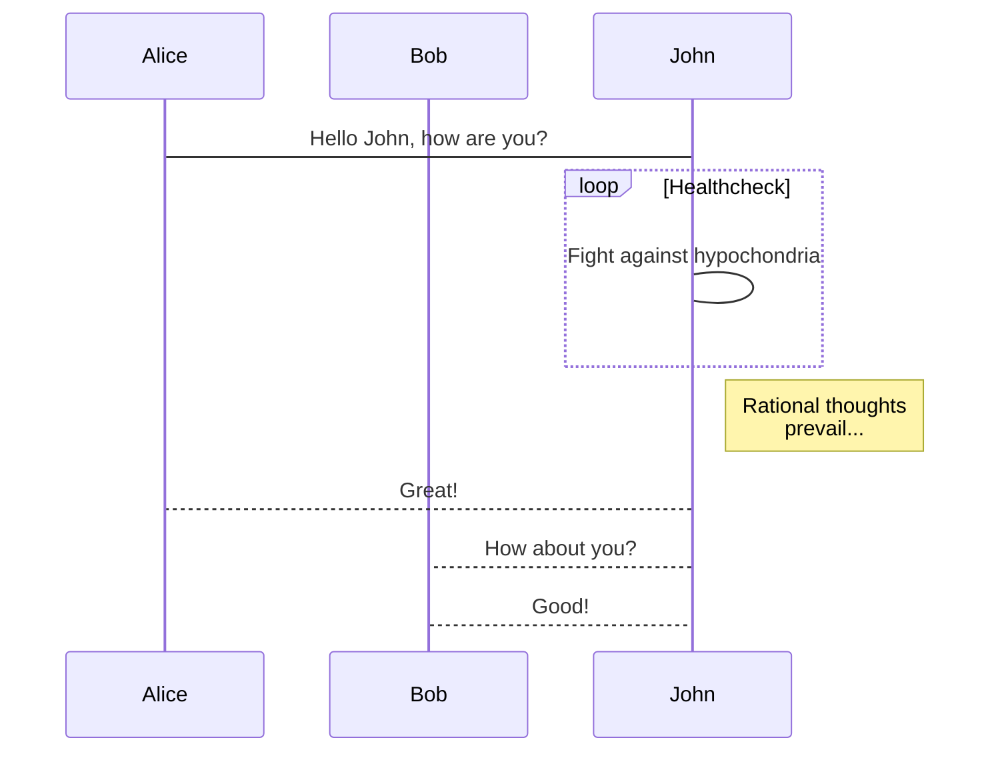

#### 甘特图（gantt diagram）

甘特图是一类条形图，通常用在对项目终端元素和总结元素的开始及完成时间进行描述

关键字如下：

| title      | 标题               |
| ---------- | ------------------ |
| dateFormat | 日期格式           |
| section    | 模块               |
| Completed  | 已经完成           |
| Active     | 当前正在进行       |
| Future     | 后续待处理         |
| crit       | 关键阶段           |
| 日期缺失   | 默认从上一项完成后 |

```markdown
​```mermaid
gantt
dateFormat YYYY-MM-DD
section S1
T1: 2014-01-01, 9d
section S2
T2: 2014-01-11, 9d
section S3
T3: 2014-01-02, 9d
​```
```

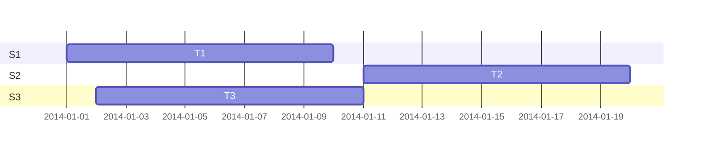

```markdown
​```mermaid
gantt
    dateFormat  YYYY-MM-DD
    title Adding GANTT diagram functionality to mermaid

    section A section
    Completed task            :done,    des1, 2014-01-06,2014-01-08
    Active task               :active,  des2, 2014-01-09, 3d
    Future task               :         des3, after des2, 5d
    Future task2               :         des4, after des3, 5d

    section Critical tasks
    Completed task in the critical line :crit, done, 2014-01-06,24h
    Implement parser and jison          :crit, done, after des1, 2d
    Create tests for parser             :crit, active, 3d
    Future task in critical line        :crit, 5d
    Create tests for renderer           :2d
    Add to mermaid                      :1d

    section Documentation
    Describe gantt syntax               :active, a1, after des1, 3d
    Add gantt diagram to demo page      :after a1  , 20h
    Add another diagram to demo page    :doc1, after a1  , 48h

    section Last section
    Describe gantt syntax               :after doc1, 3d
    Add gantt diagram to demo page      : 20h
    Add another diagram to demo page    : 48h
​```
```

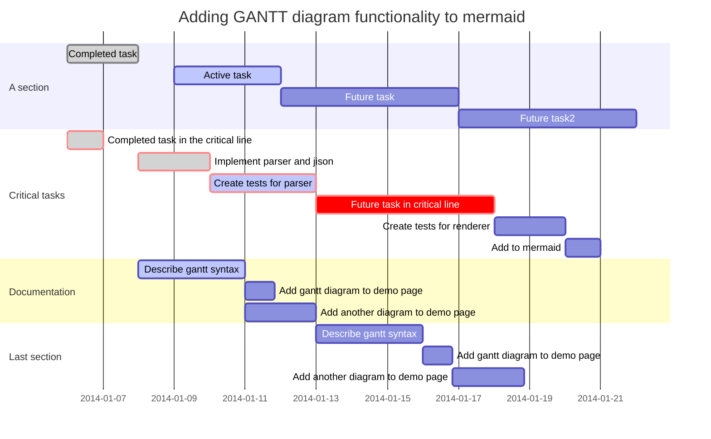

#### 序列图（sequence）

##### 关键字

* title，定义序列图的标题
* participant，定义时序图中的对象
* note，定义对时序图中的部分说明
* 方向控制
  * left of，当前对象左侧
  * right of，当前对象右侧
  * over，覆盖在当前对象（们）的上面
* {actor}，表示时序图中的具体对象（名称自定义）
* 箭头分为以下几种：
  * -> 实线实箭头
  * --> 虚线实箭头
  * ->> 实线虚箭头
  * -->> 虚线虚箭头

##### example

```markdown
​```sequence
title: 序列图sequence 示例
# participant, 参与者
participant A
participant B
participant C

note left of A: A左侧说明
note over B: 覆盖B的说明
note right of C: C右侧说明

# - 代表实线, -- 代表虚线; > 代表实箭头, >> 代表虚箭头
A->A:自己到自己
A->B:实线实箭头
A-->C:虚线实箭头
B->>C:实线虚箭头
B-->>A:虚线虚箭头
​```
```

```sequence
title: 序列图sequence 示例
# participant, 参与者
participant A
participant B
participant C

note left of A: A左侧说明
note over B: 覆盖B的说明
note right of C: C右侧说明

# - 代表实线, -- 代表虚线; > 代表实箭头, >> 代表虚箭头
A->A:自己到自己
A->B:实线实箭头
A-->C:虚线实箭头
B->>C:实线虚箭头
B-->>A:虚线虚箭头
```

定义可以省略如：

```markdown
​```sequence
A->B: 吃饭了没？
# 可在文本中使用换行符\n
note right of B: B思考n秒\n如何回答
B--A: 吃过了。你咧？
A->>B: 吃过了，吃过了！
​```
```

```sequence
A->B: 吃饭了没？
# 可在文本中使用换行符\n
note right of B: B思考n秒\n如何回答
B--A: 吃过了。你咧？
A->>B: 吃过了，吃过了！
```

#### 流程图（flow）

##### 关键字

* start/end，程序开始与结束
* operation，程序的处理块
* subroutine，子程序块
* condition，程序的条件判断
* inputoutput，程序的输入输出
* right/left，当前连线在当前模块上的起点（默认从下端开始）
* yes/no，condition判断的分支（可以和right，left同时使用）

通过定义模块与连接，再结合以上关键字即可定义简单流程图的各个模块。

##### 模块定义（模块标识与模块名称可以任意定义，但不能为关键字）

```markdown
模块标识(相当于变量名)=>模块关键词: 模块名称(模块中显示的文字)
```

##### 连接定义如下：

```markdown
模块标识1->模块标识2
模块标识1->模块标识2->模块标识3
...
```

##### 进行连接的时候，可以通过right，left确定箭头的起点，使用condition关键词定义的判断框的连接需要结合yes或者no使用：

```markdown
cond1=>condition: x>0?
cond1(yes)->module1
cond1(no)->moudle2

# 指定方向,如果后面占用了这个方向, 前面的无效
cond1(yes,right)->module1
cond1(no)->moudle2
```

```markdown
​```flow
# 先自定义变量,然后画图
st=>start: 开始
e=>end: 结束
op=>operation: 输入x
sub=>subroutine: 是否重新输入
cond1=>condition: x>0?
cond2=>condition: yes/no
io=>inputoutput: 输出x

st(right)->op->cond1
cond1(yes)->io(right)->e
cond1(no)->sub(right)->cond2()
cond2(yes, right)->op
cond2(no)->e
​```
```

```flow
# 先自定义变量,然后画图
st=>start: 开始
e=>end: 结束
op=>operation: 输入x
sub=>subroutine: 是否重新输入
cond1=>condition: x>0?
cond2=>condition: yes/no
io=>inputoutput: 输出x

st(right)->op->cond1
cond1(yes)->io(right)->e
cond1(no)->sub(right)->cond2()
cond2(yes, right)->op
cond2(no)->e
```

