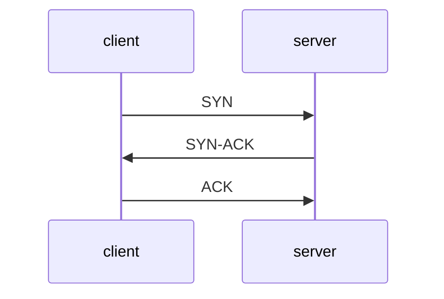
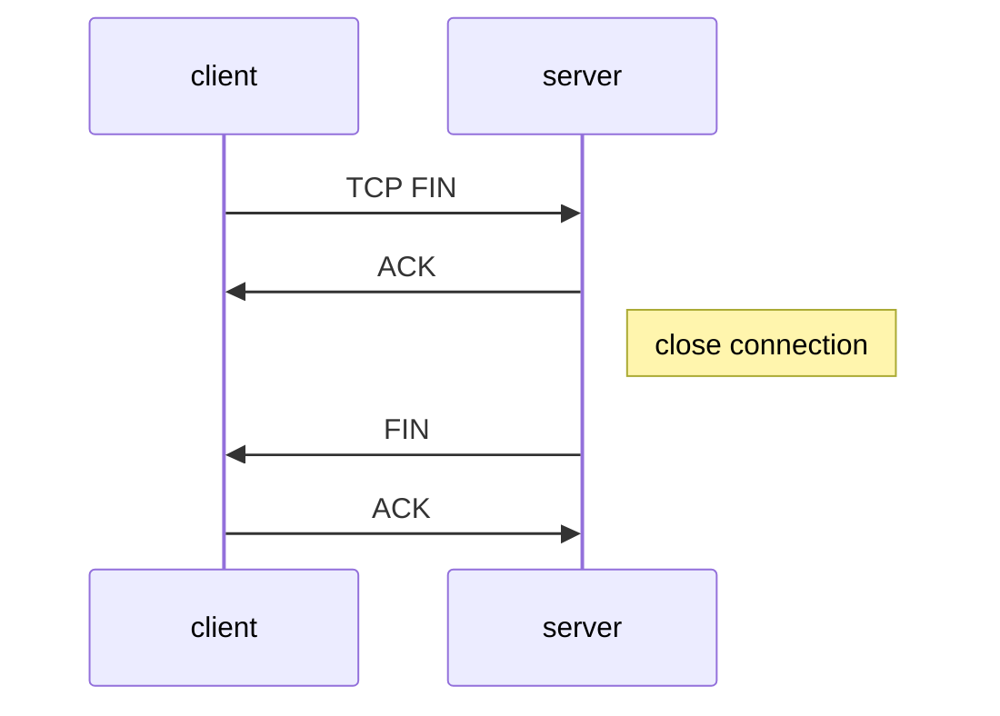
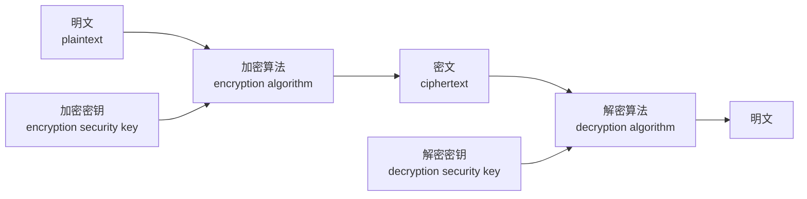
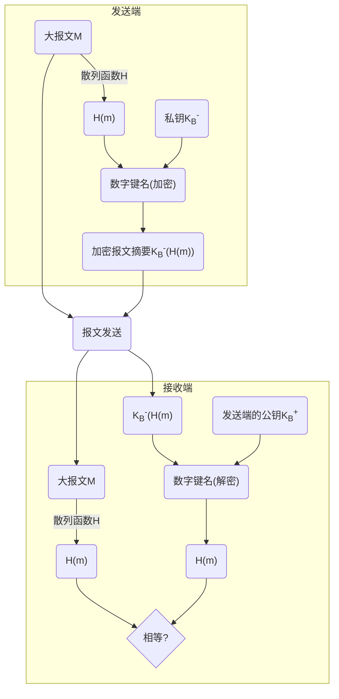
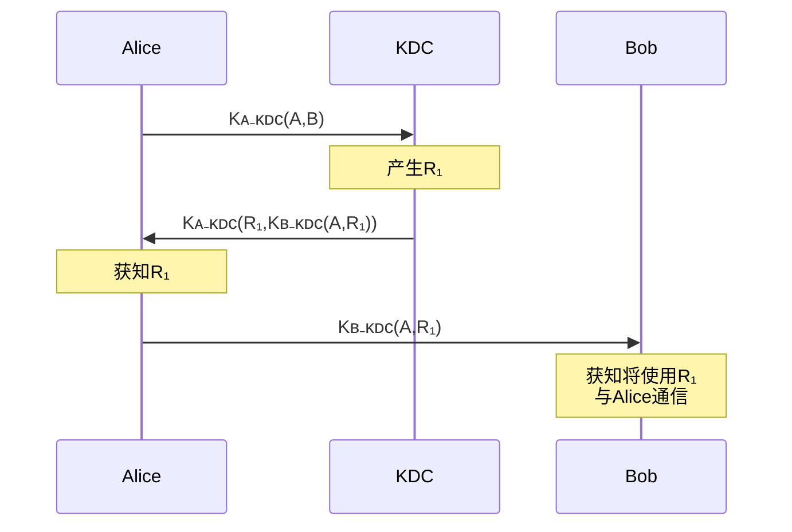
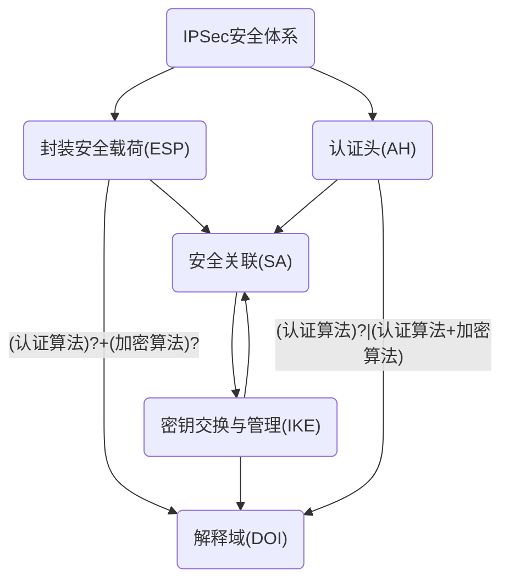

# 计算机网络（Computer Network）

## 计算机网络基础

#### 计算机网络：互联的、自治的计算机集合

- 互联：互联互通
- 自治：无主从关系

#### 计算机网络结构

* 网络边缘
* 接入网络
* 网络核心

#### 数据交换

* 电路交换（circult switching）
* 报文交换（message switching）
* 分组交换（package switching）

#### 多路复用（multiplexing）

* 频分多路复用（frequency division multiplexing, FDM）
* 时分多路复用（time division multiplexing, TDM）
* 波分多路复用（wavelength division multiplexing, WDM）
* 码分多路复用（code division multiplexing, CDM）
* 统计多路复用（statistical division multiplexing）

前四种用于电路交换,最后一种用于分组交换

#### 性能参数

* 速率（data rate/bit rate）
* 带宽（bandwidth）
* 延迟/时延（delay/latency）
* 时延带宽积：传播时延*带宽
* 分组丢失率（丢包率）
* 吞吐量/率（throughput）

## 计算机网络体系结构（network architecture）

#### OSI参考模型

1. 应用层
2. 表示层
3. 会话层
4. 传输层
5. 网络层
6. 数据链路层
7. 物理层

#### TCP/IP参考模型

<table>
  <tr>
    <td style="text-align:center;">1. 应用层</td>
    <td style="text-align:center;">HTTP(Web)</td>
    <td style="text-align:center;">SMTP(Email)</td>
    <td style="text-align:center;">DNS</td>
    <td style="text-align:center;">RTP(流媒体)</td>
  </tr>
  <tr>
    <td style="text-align:center;">2. 运输层</td>
    <td style="text-align:center;" colspan="2">TCP</td>
    <td style="text-align:center;" colspan="2">UDP</td>
  </tr>
  <tr>
    <td style="text-align:center;">3. 网络层</td>
    <td style="text-align:center;" colspan="4">IP</td>
  </tr>
  <tr>
    <td style="text-align:center;">4. 网络接口层</td>
    <td style="text-align:center;" colspan="4"></td>
  </tr>
</table>

#### 5层参考模型

1. 应用层		网络应用
2. 传输层		端口
3. 网络层		源/目的主机
4. 链路层		相邻节点
5. 物理层		bit

主机包含全部5层,路由器包含下三层,交换机包含下两层

##  应用层

#### 网络应用体系结构

* 客户端/服务器结构（Client-Server, C/S）
* 点对点结构（Peer to Peer, P2P）
* 混合结构（Hybrid）

#### HTTP Request Method

* 1.0
  * GET      请求    实体主体
  * HEAD   请求    实体头
  * POST    提交    新增/修改
* 1.1
  * PUT               修改
  * DELETE         删除
  * CONNECT    转发    建立加密连接
  * OPTIONS 	查看性能
  * TRACE          测试、诊断

#### HTTP Status Code

* 1**	信息
* 2**    成功
* 3**    重定向
* 4**    客户端错误
* 5**    服务器错误

#### HTTP 非持久连接 vs 持久连接

* 非持久连接（Nonpersistent HTTP），HTTP 1.0 版本
  * 每个连接只允许传输一个对象
* 持久连接（Persistent HTTP），HTTP 1.1 版本
  * 每个连接允许传多个对象
  * 无流水的持久性连接每个对象1个RTT
  * 带有流水机制的持久性连接所有对象只需1个RTT

#### Cookie 技术

* HTTP 协议无状态，很多应用需要服务器掌握客户端的状态。
* Cookie 组件
  * HTTP 消息的 Cookie 头部行
  * 保存在客户端主机上的 Cookie 文件，由浏览器管理，存储在 Web 服务端的后台数据库
* Cookie 问题：隐私问题

#### Web 缓存/代理服务器技术

* 功能：在不访问服务器的前提下满足客户端 HTTP 请求
* 好处：
  * 缩短客户请求的响应时间
  * 减少机构/组织的流量
  * 在大范围内（Internet）实现有效的内容分发
* 实现：
  * 用户设定浏览器通过缓存进行 Web 访问
  * 浏览器像缓存/代理服务器发送所有的 HTTP 请求
* 缓存即充当服务器，也充当客户端

###### 条件性 GET 方法

* 目标：如果缓存有最新的版本，则需发送请求对象
* 实现：在 HTTP 请求中声明持有版本的日期，如版本是最新的，则响应消息中不包含对象

#### Email 应用

* 邮件客户端（User Agent）读写收发 Email
* 邮件服务器（Mail Server）
  * 邮箱：存储发送给该用户的 Email
  * 消息对列（message queue）：存储待发送的 Email
* SMTP 协议：邮件服务器之间传递消息所使用的协议
  - 使用 TCP 进行 Email 消息的可靠传输
  - 25端口
  - 传输过程的三个阶段：握手、消息传输、关闭
  - 命令/响应交互模式

#### DNS（Domain Name System）

* 服务：域名翻译成 IP 地址
* 实现方式：分布式层次式数据库
* 查询方式：
  * 迭代查询
  * 递归查询
* 缓存和更新：只要域名解析服务器获得域名-IP映射，即缓存这一映射

#### P2P 应用

###### 纯 P2P 架构，Peer-to-Peer

* 没有服务器
* 任意端系统间直接通信
* 节点阶段性接入 Internet
* 节点可能更换 IP 地址

###### 文件分发：BitTorrent

* torrent：交换同一文件的文件块的节点组
* tracker：跟踪参与 torrent 的节点
* 文件被分为256KB的 chunk
* 节点加入torrent
  * 没有chunk，但会逐渐累积
  *  向 tracher 注册以获得节点清单，与某些节点（邻居）建立连接
* 下载同时，节点需要向其他节点上传chunk

- 节点可能加入或离开

###### 获取 chunk

* 给定任一时刻，不同的节点持有文件的不同 chunk 集合
* 节点定期查询每个邻居所持有的 chunk 列表
* 节点发送请求，请求获取缺失的 chunk，稀缺优先

###### 发送 chunk

* 节点向四个邻居发送chunk（正在向其发送 chunk 速率最快的四个）
* 每一段时间（10s）重新评估 top4
* 一段时间（每30s）随机选择一个其他节点，向其发送 chunk

###### P2P索引

* 集中式索引
* 洪泛式查询
* 层次式覆盖网络

#### Socket Programming（应用编程接口）

###### client

* TCP
  1. get server IP, host
  2. create Socket
  3. set client IP host
  4. connect to server
  5. communication
  6. close connection
* UDP
  1. get server IP, host
  2. create Socket
  3. set client IP host
  4. set server IP host, build UDP datagram
  5. communication
  6. close Socket

###### Server

* Iterative connectionless communication
  1. create UDP Socket
  2. set server IP, host
  3. get requests from client iteratively
  4. send message
* Iterative connection-oriented communication
  1. create TCP Socket, and set host
  2. set Socket to monitor mode
  3. get next connect request, create new Socket to build connection with client
  4. communication with client
  5. finish, close connection, goto step 3
* Concurrent connectionless communication
  1. create main UDP Socket, and set IP, host
  2. get next client request, create new thread to handle it
  3. child thread get the request
  4. child thread send message
  5. close the child thread
* Concurrent connection-oriented communication
  1. create main TCP Socket and set IP, host
  2. set main Socket to monitor mode
  3. get next request, create new thread to handle it
  4. child thread get the request
  5. communication
  6. close connection and release the child thread

#### 可靠数据传输

不错，不丢，不乱

###### 可靠数据传输协议（rdt）

* 对应用层、传输层、链路层都很重要
* 网络 TOP-10 问题
* 信道的不可靠性决定了可靠数据传输协议的复杂性

###### Rdt演进

* 1.0 可靠信道
* 2.0 产生位错误的信道
  * 差错检测
  * 接受方反馈控制信息 ACK/NAK
  * 重传
* 2.1 发送方应对 ACK/NAK 破坏
  * 分组增加序列号（ID）
  * 增加 ACK/NAK 校验
* 2.2 无 NAK 消息协议
  * 接收方通过 ACK 告知最后一个正确接收的分组
* 3.0 信道极可能错误，也可能丢失分组
  * 发送方等待合理时间，需要定时器
  * 能够正确工作，但性能很差

###### 流水线机制与滑动窗口协议

* 允许发送方收到 ACK 之前连续发送多个分组
  * 需要更大的序列号范围
  * 发送方和/或接收方需要更大的缓存空间
* 滑动窗口协议（Sliding-Window Protocol）
  * 窗口：允许使用的序列号范围，窗口范围为N则最多有N个等待确认的消息
  * 滑动窗口：随着协议运行，窗口在序列号空间内向前滑动
  * 两种常见的滑动窗口协议：
    * GBN（Go-Back to N）
      * 累计确认机制：ACK(n) 确认到序列号n（包含n）的分组均已被正确接受
      * 超市 Timeout(n) 事件：重传序列号大于等于 n，还未收到 ACK 的所有分组
      * 乱序到达的分组，直接丢弃，重新确认序列号最大的按序到达的分组，发送 ACK
    * SR（Selective Repeat）
      * 接收方对每一个分组单独进行确认，为每个分组设置定时器
      * 设置缓存机制，缓存乱序到达的分组
      * 发送方只重传没收到 ACK 的分组
      * 发送方窗口尺寸N<sub>S</sub>，接收方尺寸N<sub>R</sub>，序列号位数：k，N<sub>S</sub>+N<sub>R</sub> <= 2<sup>k</sup>

#### TCP 可靠数据传输

在 IP 层提供的不可靠的服务基础上实现可靠数据传输

* 流水线机制
* 累计确认
* TCP 使用单一重传定时器
* 触发重传的时间：超时，收到重复 ACK

#### TCP 流量控制（Flow Control）

* 接收方为 TCP 连接分配 buffer

#### TCP 拥塞控制

* 端到端控制
* 加性增，乘性减

#### TCP Three-Way Handshake

1. The client sends a SYN packet to the server to initiate a handshake
2. Upon receipt of this, the server sends a SYN-ACK packet to the client
3. Finally, the client sends an ACK packet to the server to indicate that it has received the server's SYN-ACK packet

* SYN：同步序列编号（Synchronization Sequence Numbers）：TCP/IP 建立连接时使用的握手信号
* ACK：确认字符（Acknowledgement）



#### Closing a connection

1. client host sends TCP FIN segment to server
2. server host receives FIN, replies ACK, close connection, send FIN
3. client host receives FIN, replies ACK
4. server host receives ACK, TCP real close



## 网络层

#### 核心功能

* 路由与转发
* 连接建立

#### 路由（routing）vs 转发（forwarding）

* routing：确定分组从源主机到目的主机经过的路径
* forwarding：将分组从路由器的输入端口转移到合适的输出端口

#### 无连接服务 vs 连接服务

* connection-less：不事先为系列分组确定传输路径，每个分组独立确定传输路径
  * 典型：数据报网络
* connection：首先为系列分组的传输确定从源到目的经过的路径，然后沿该路径（连接）传输系列分组，传输结束后拆除连接
  * 典型：虚电路网络

#### 数据报 vs 虚电路

* datagram：
  * 简化网络，复杂“边缘”
  * “弹性服务”，没有严格时间要求
  * 典型：Internet
  * 网络层无连接，每个分组携带目的地址
* vitual-circuit：
  * 简化“边缘”，复杂网络
  * 电话网络演化而来
  * 严格的时间、可靠性需求
  * 典型：ATM
  * 呼叫建立->数据传输->拆除呼叫
  * 每个分组携带虚电路标识（VCID）

#### Internet 网络层

* 主要功能：路由协议 + IP协议 + ICMP协议
* 最大传输单元（MTU）：链路层数据帧可封装数据的上线
* IP 分片与重组，大 IP 分组向较小 MTU 链路转发时，可以被分片（fragmented），IP 分片到达目的主机后进行重组（reassembled）

#### IP 编址

* IP 地址：32bit(IPv4)，标识主机、路由器的接口，网络号（NetID）+ 主机号（HostID）
* IP 子网：具有相同网络号的设备接口，不跨越路由器，可以彼此物理互联

#### 有类 IP 地址（有类编址）

| 类别 | 占比  | IP范围                    | 说明                                                         |
| ---- | ----- | ------------------------- | ------------------------------------------------------------ |
| A类  | 50%   | 0.0.0.0~127.255.255.255   | NetID占8位，首位是“0”                                        |
| B类  | 25%   | 128.0.0.0~191.255.255.255 | NetID占16位，头两位是“10”                                    |
| C类  | 12.5% | 192.0.0.0~223.255.255.255 | NetID占24位，头三位是“110”                                   |
| D类  | 6.25% | 224.0.0.0~239.255.255.255 | 不区分NetID，头四位是“1110”  多波（阻波）地址，只能做目的地址 |
| E类  | 6.25% | 240.0.0.0~255.255.255.255 | 保留，作为研究使用                                           |

注：可根据第一个“0”在第几位出现区分是哪类地址，除 E 类外，1~4 类，第 n 类地址范围可表示为：

( 1 - 1/n ) * 2<sup>32 </sup> ~ ( 1 - 1/(n+1) ) * 2<sup>32</sup> - 1

#### 特殊 IP 地址

| NetID  | HostID       | 作源 | 作目的 | 用途               |
| ------ | ------------ | ---- | ------ | ------------------ |
| 全0    | 全0          | yes  | no     | 本机               |
| 全0    | 特定值       | no   | yes    | 内网某主机         |
| 全1    | 全1          | no   | yes    | 内网广播地址       |
| 特定值 | 全0          | no   | no     | 某网络             |
| 特定值 | 全1          | no   | yes    | 某网络广播地址     |
| 127    | 非全0或非全1 | yes  | yes    | 环回地址，本地测试 |

#### 私有 IP 地址

* A类：10.0.0.0/8
* B类：172.16.0.0/12
* C类：192.168.0.0/16

#### IP 协议子网划分与子网掩码

* IP 地址：网络号（NetID）+ 子网号（SubID）+ 主机号（HostID）
* 子网掩码：形如 IP 地址
  * NetID，SubID取”1“，HostID 取”0“

#### CIDR 与 路由聚合

CIDR：Classless Inter Domain Routin（无类域间路由）

* 消除传统A、B、C、D类地址界限
* 融合子网地址与子网掩码，方便子网划分
* 提高 IPv4 地址空间分配效率
* 提高路由效率

#### DHCP 协议

DHCP：Dynamic Host Configuration Protocol（动态主机配置协议）

* 从服务器动态获取 IP，CIDR
* “即插即用”

#### 网络地址转换（NAT）

一个 IP 可以连多个网络设备，替换、记录、替换

16bit 端口号字段，可同时支持2<sup>16</sup> 左右的并行连接

###### 主要争议

* 路由器只应处理到网络层
* 违背端到端通信原则，应用开发者需要考虑 NAT 存在
* 地址短缺问题应由 IPv6 来解决

###### NAT 穿透问题解决方案

1. 静态配置
2. UpnP 协议（Universal Play and Play）
3. 中继

#### ICMP 协议

ICMP：Internet Control Message Protocol（互联网控制报文协议）

支持主机或路由器：差错（或异常）报告，网络探寻

###### 差错报告（5种）

* 目的不可达
* 源抑制
* 超时
* 参数问题
* 重定向

###### 网络探询报文（2种）

* 回声请求与应答报文
* 时间戳请求与应答报文

#### IPv6 vs IPv4

###### IPv6 的变化

* 128bit
* 40bit 基本首部
* 不允许分片
* 彻底移除校验和

###### 共存方式：隧道

IPv6数据报作为 IPv4 数据报的载和进行分装，穿越 IPv4 网络

#### 路由算法

确定去往目的主机/网络的最佳路径

###### 分类

* 静态路由 vs 动态路由
* 全局信息 vs 分散信息

###### 算法

* Dijkstra
* 距离向量（Distance Vector）
* 层次路由

###### 协议

* RIP（Routing Information Protocol）
* OSPF（Open Shortest Path Protocol）
* BGP（Border-Gateway Protocol)

## 链路层

#### 链路层服务

* 组帧（framing）

* 链路接入（link access）
* 相邻结点间可靠交付
* 流量控制（flow control）
* 差错控制（error detection）
* 差错纠正（error correction）
* 全双工和半双工通信控制

#### 差错编码

D -> DR

D：Datagram

R：差错检测，差错纠正比特

#### MAC 协议

MAC：Media Accesss Control（多路访问控制协议），采用分布式算法决定节点如何共享信道

三大类：

* 信道划分（channel partitioning），多路复用
* 随机访问（random access），允许冲突
* 轮转（taking turns），结点轮流使用信道

#### MAC 地址

32位 IP 地址，接口的网络层地址，每块网卡都有唯一的 MAC 地址

#### 以太网

不可靠，无连接服务

目前主流网络拓扑：星型，中心交换机（switch），每个结点一个单独冲突域（彼此间不冲突）

#### 路由器 vs 交换机

###### 均为存储转发设备

* 路由器：网络层设备（检测网络层分组首部）
* 交换机：链路层设备（检测链路层帧的首部）

###### 均使用转发表

* 路由器：利用路由算法计算，依据 IP 地址
* 交换机：利用自学习，洪泛构建转发表，依据 MAC 地址

#### 网络设备对比

|            | 集线器 | 交换机 | 网桥 | 路由器 |
| ---------- | ------ | ------ | ---- | ------ |
| 层次       | 1      | 2      | 2    | 3      |
| 流量隔离   | no     | yes    | yes  | yes    |
| 广播域隔离 | no     | no     | no   | yes    |
| 即插即用   | yes    | yes    | yes  | no     |
| 优化路由   | no     | no     | no   | yes    |
| 直通传输   | yes    | yes    | yes  | no     |

#### 虚拟局域网（VLAN）

VLAN：Vitual Local Area Network

一组逻辑上的设备，根据某些因素将它们组织起来，相互间通信就好像在同一个网段中一样

工作在链路层和网络层

特点：

* 网络设备移动、添加、修改的管理开销少
* 可控制广播活动
* 提高网络的安全性

#### 802.11 无线局域网

###### 概念：

* 基站（Base Station） =  访问点（Access Point，AP）

* 基本服务集（Basic Server Set，BSS），也称为单元（cell）

###### 主机必须与某个 AP 关联

* 被动扫描
  * 各 AP 发送信标帧
  * 主机向选择的 AP 发送请求帧
  * AP 向主机发送响应帧
* 主动扫描
  * 主机主动广播探测请求帧
  * AP 发送探测响应帧
  * 主机向选择的 AP 发送关联请求帧
  * AP 向主机发送响应帧

###### 多路访问控制

CSMA/CA

* 发送端首先利用 CSMA 向 AP 发送一个很短的 RTS（request-to-send）帧，RTS 帧可能彼此冲突，但 RTS 很短

* AP 广播一个 CTS（clear-to-send）帧作为对 RTS 的响应

* CTS 帧可被所有结点接收，消除隐藏站影响
* 发送端可以发送数据帧，其他节点推迟发送

## 网络安全

#### 概念

网络系统的硬件、软件及其系统中的数据受到保护，不因偶然的或恶意的原因而受到破坏、更改、泄露，系统连续可靠正常地运行，网络服务不断中断。

#### 基本属性

* 机密性（confidentiality）
* 身份认证（authentication）
* 信息完整性（message integrity）
* 可访问与可用性（access and availability）

#### 基本特征

* 相对性
* 时效性
* 相关性
* 不确定性
* 复杂性
* 重要性

#### 研究领域

* 入侵者（bad guys）如何攻击计算机网络
* 如何防护网络对抗攻击
* 如何设计网络体系结构免疫攻击

#### 拟人模型

拟人场景：Alice、Bob、Trudy

Bob 与 Alice 是期待进行安全通信的双方

Trudy 是企图破坏 Bob 和 Alice 通信的入侵者（intruder），试图拦截、删除或添加信息

#### 威胁

窃听、插入、假冒、劫持、拒绝服务Dos

#### Internet 安全威胁

* 映射（Mapping）
  * 发起攻击前“探路”，ping 确定网络上的主机地址+端口扫描（Port-scanning），依次尝试与每个端口建立连接
* 分组“嗅探”（sniffing）
  * 广播介质
  * 混合（promiscuous）模式网络接口可以接受记录所有经过的帧/分组
* IP 欺骗（Spoofing）
  * 直接由应用生成“原始” IP 分组，可以设置分组的源 IP 地址字段为任意值
* 拒绝服务 Dos（Denial of service）
  * 向接收方恶意洪泛（flood）分组，淹没（swamp）接收方
    * 带宽耗尽
    * 资源耗尽
  * 分布式拒绝服务攻击（DDos），多个源主机协同淹没接收方

#### DDos 攻击过程

1. 选择目标
2. 入侵（break into）网络中主机（构造僵尸网络）
3. 控制僵尸主机向目标发送分组

###### 反射式 DDos 攻击

1. 选择目标
2. 入侵网络中主机
3. 选择反射服务器
4. 借助反射服务器向目标发起攻击

#### 密码学基础（cryptography）



* m：明文
* K<sub>A</sub>(m)：密文，利用密钥 K<sub>A</sub> 加密
* K<sub>B</sub>(K<sub>A</sub>(m)) = m：看用 K<sub>B</sub> 解密
* 对称密钥加密：Bob 和 Alice 共享相同（对称）密钥 K<sub>S</sub>
* 公开密钥加密：发送者用接收者的公开密钥加密，接收者用自己的私有密钥解密

#### 加密破解方法

* 唯密文攻击：只有密文
  * 暴力破解
  * 统计分析
* 已知明文攻击：已知（部分）明文以及与之匹配的密文
* 选择明文攻击：可以获取针对选择的明文的密文

#### 现代加密技术分类

* 对称密钥加密
  * 流密码(stream ciphers)
  * 分组密码，也称块密码（block ciphers）
* 非对称密钥加密（公开密钥加密）

#### 流密码 vs 分组密码

* 流密码

  * 首先利用密钥 K 产生一个密钥流 Z = Z<sub>0</sub>Z<sub>1</sub>Z<sub>2</sub>...
  * 利用如下规则对明文串 X =  X<sub>0</sub>X<sub>1</sub>X<sub>2</sub>... 加密：Y = Y<sub>0</sub>Y<sub>1</sub>Y<sub>2</sub>... = E<sub>Z<sub>0</sub></sub>(X<sub>0</sub>)E<sub>Z<sub>1</sub></sub>(X<sub>1</sub>)E<sub>Z<sub>2</sub></sub>(X<sub>2</sub>)...
  * 解密时，使用相同的密钥流与密文做运算
  * 通常情况下加密解密均使用异或（XOR）操作

* 分组密码

  * 将明文序列分成长为 m 的明文组
  * 各明文组在长为 i 的密钥组的控制下变换成长度为 n 的密文组
    * 通常 n=m
    * n>m：扩展分组密码
    * n<m：压缩分组密码

* 区别

  流密码可以看作以1bit为一个分组，（流）密钥与明文长度相同的，（流）密钥是通过密钥K生成的，加密算法和解密算法都为异或的普通的分组密码

 #### 公钥密码学

对称密钥加密缺点：需要发送方与接收方知道共享的密钥。

* 公开密钥加密

  * 公开密钥（公开），又称公钥，K<sub>B</sub><sup>+</sup>
  * 私有密钥（只有接收方知道），又称私钥，K<sub>B</sub><sup>-</sup>

* 公钥加密算法

  * 需求：
    * K<sub>B</sub><sup>+</sup> 和  K<sub>B</sub><sup>-</sup> 满足：K<sub>B</sub><sup>-</sup>(K<sub>B</sub><sup>+</sup>(m)) = m
    * 给定 K<sub>B</sub><sup>+</sup> 不可能计算出 K<sub>B</sub><sup>-</sup>
  * 最常见的公钥加密算法：RSA（以三个人的名字命名）

* RSA 前提条件（模运算）

  x mod n = x % n 有以下性质：

  * [ ( a mod n ) + ( b mod n ) ] mod n = ( a + b ) mod n

  * [ ( a mod n ) - ( b mod n ) ] mod n = ( a - b ) mod n

  * [ ( a mod n ) * ( b mod n ) ] mod n = ( a * b ) mod n

  * 由此可知：

    ( a mod n )<sup>d</sup> mod n = a<sup>d</sup> mod n

* RSA 预备知识

  * 报文/信息（message）仅仅是一个比特模式（bit pattern）
  * 每个比特模式可以表示为一个唯一的整数
  * 因此，加密一个报文等于加密一个整数
  * 例如：
    * m = 10010001，可以唯一表示为十进制数145
    * 为了加密 m，我们可以加密对应的数（145），得到一个新的数（即密文）

* RSA 生成 公钥/私钥 对

  1. 选择两个大质数 p 和 q（e.q. 1024bit 的大质数）
  2. 计算 n = pq，z = (p-1)(q-1)
  3. 选择 e（满足 e<n），使 e 与 z 之间没有公因子，即 e，z 互质（relatively prime）
  4. 选择 d 使得 ed - 1 刚好可以被 z 整除，即 ed mod z = 1
  5. 公钥：(n, e)，私钥：(n, d)

* RSA 加密，解密

  1. 给定公钥 (n, e) 和私钥 (n, d)

  2. 加密报文 m (m<n) 时，计算：

     c = m<sup>e</sup> mod n

  3. 解密密文 c 时，计算：

     m = c<sup>d</sup> mod n

  m = ( m<sup>e</sup> mod n )<sup>d</sup> mod n

* RSA 举例

  * p = 5, q = 7, 于是 n = 35, z = 24, e = 5 ( e, z 互质 ), d = 29 ( ed - 1 刚好被 z 整除 )

  * 加密 8bit 报文

  * 加密：

    | 比特模式 | m    | m<sup>e</sup> | c = m<sup>e</sup> mod n |
    | -------- | ---- | ------------- | ----------------------- |
    | 00001100 | 12   | 248832        | 17                      |

  * 解密

    | c    | c<sup>d</sup>   | m = c<sup>d</sup> mod n |
    | ---- | --------------- | ----------------------- |
    | 17   | 17<sup>29</sup> | 12                      |

* RSA 理论依据

  * 必须满足：c<sup>d</sup> mod n = m，其中 c = m<sup>e</sup> mod n

  * 可以证明：对于任意的 x 和 y，存在  x<sup>y</sup> mod n = x<sup>y mod z</sup> mod n

    其中 n = pq，z = ( p - 1 )( q - 1 )

  * 因此：c<sup>d</sup> mod n = ( m<sup>e</sup> mod n )<sup>d</sup> mod n

    ​							 = m<sup>ed</sup> mod n

    ​                             = m<sup>ed mod z</sup> mod n

    ​							 = m<sup>1</sup> mod n

    ​							 = m

* RSA 另一个重要性质

  * K<sub>B</sub><sup>-</sup>(K<sub>B</sub><sup>+</sup>(m)) = m = K<sub>B</sub><sup>+</sup>(K<sub>B</sub><sup>-</sup>(m))

  * 利用公钥加密，可以利用私钥解密

  * 利用私钥加密，可以利用公钥解密

  * Why？

  * ( m<sup>e</sup> mod n )<sup>d</sup> mod n = m<sup>ed</sup> mod n                                       

    ​									  = m<sup>de</sup> mod n

    ​									  = ( m<sup>d</sup> mod n )<sup>e</sup> mod n
  
* RSA 为什么安全

  RSA 的安全性建立在“大数分解和素性检测”这个数论难题的基础上，即将两个大素数相乘在计算上容易实现，而将该乘积分解的计算量相当大

  已知公钥 (n, e)，那么有多大难度确定 (n, d)，即确定d？本质上需要在不知道两个因子 p 和 q 的前提下，找出 n 的因子。

* RSA 的实际应用

  * RSA 的幂运算强度很大，DES 至少比 RSA 快 100 倍。
  * 实际应用中：
    * 利用公钥加密建立安全连接，然后建立第二个密钥——对称会话密钥，用于加密数据。
    * 会话密钥（session key，K<sub>s</sub>）

#### 身份认证（Authentication）

* AP1.0：直接声明身份
* AP2.0：在 IP 分组中声明身份，IP 分组包含源 IP 地址
* AP3.0：声明同时，发送秘密口令“证明”
* AP3.1：发送加密的口令
  * ap3.1及以下无法避免回放攻击
  * 回放攻击（playback attack）：记录发送端分组，稍后“回放”给接收端
  * 为了避免回放攻击，使用一次性随机数（nonce）：一个生命期内只用一次的数
* AP4.0：为了证明是真实的发送端，接收端向发送端发送一个随机数 R，发送端必须返回 R，并利用共享密钥进行加密
* AP5.0：利用一次性随机数及公钥加密技术
  * ap5.0安全漏洞：中间人攻击（man in the middle attack）

#### 报文完整性

报文/消息完整性（message integrity），也称为报文/消息认证（或报文鉴别）

目标：

* 证明报文确实来自声称的发送方
* 验证报文在传输过程中没有被篡改
* 预防报文的时间、顺序被篡改
* 预防报文持有期被修改
* 预防抵赖（发送/接收方否认）

#### 密码散列函数 (Cryptographic Hash Function): H(m)

特点：

* 散列算法公开
* 计算速度快
* 对任意长度报文进行多对一映射，均产生定长输出
* 对任意报文无法预知其散列值
* 不同报文不能产生相同的散列值

性质：

* 单向性：无法用散列值逆推报文
* 抗弱碰撞性
* 抗强碰撞性

#### 散列函数算法

* MD5
  * 被广泛应用的散列函数
  * 通过4个步骤，对任意长度报文输入，计算出128位的散列值
  * 不够安全
* SHA-1 (Secure Hash Algorithm)
  * 另一种正在使用的散列算法
  * US 标准
  * 要求输入消息长度小于2<sup>64</sup>
  * SHA-1 的散列值位160位
  * SHA-1 安全性优于 MD5，速度慢于 MD5

#### 报文摘要（Message digests）

对报文 m 应用散列函数 H，得到一个固定长度的散列码，称为报文摘要，记为 H(m)，可以作为报文的数字指纹

##### 报文认证

* 简单方案：报文 + 报文摘要 => 扩展报文 (m, H(m))
* 报文认证码 (MAC，Message Authentication Code)：报文 m + 认证密钥 S + 密码散列函数 H => 扩展报文(m, H(m+s))

#### 数字签名

##### Q：如何解决下列与报文完整性相关的问题：

* 否认：发送方不承认自己发送过某一报文
* 伪造：接收方自己伪造一份报文，并声称来自发送方
* 冒充：某个用户冒充另一个用户接受或发送报文
* 篡改：接收方对收到的信息进行篡改

##### A：数字签名（Digital Signatures）

* 数字签名技术是实现安全电子交易的核心技术之一
* 可验证性（verifiable）
* 不可伪造性（unforgeable）
* 不可抵赖性（non-repudiation）

##### 对报文 m 的简单签名（报文加密技术是数字签名的基础）

1. 发送方通过利用其私钥 K<sub>B</sub><sup>-</sup> 对 m 进行加密，创建签名报文，K<sub>B</sub><sup>-</sup>(m)

2. 假设接收方收到报文 m，以及签名 K<sub>B</sub><sup>-</sup>(m)

3. 接收方利用发送方的公钥 K<sub>B</sub><sup>+</sup> 解密 K<sub>B</sub><sup>-</sup>(m)，并检验  K<sub>B</sub><sup>+</sup>(K<sub>B</sub><sup>-</sup>(m))=m，来证实报文 m 是发送方签名的

4. 于是，接收方可以证实：

   * 发送端签名了 m

   * 没有其他人签名 m 的可能

   * 发送方签名的是 m，不是其他报文 m'

     不可抵赖（non-repudiation）

##### 签名报文摘要




#### 密钥分发中心（KDC）

* 回顾 AP4.0，需要共享对称密钥，如何共享？

  解决方案：可信任的密钥分发中心（Key Distribution Center）作为实体间的中介（Intermediary）

* Alice 与 Bob 需要共享对称密钥，KDC：一个服务器

  每个注册用户（很多用户）共享其与 KDC 的密钥，Alice 与 Bob 只知道自己与 KDC 之间的对称密钥，用于分别于 KDC 进行通信

##### KDC 如何支持 Bob 和 Alice 确定用于彼此通信的共享对称密钥




#### 认证中心（CA）

* 回顾 AP5.0，存在中间人攻击

  公钥问题：如何确定公钥真伪！？

  解决方案：可信任的认证中心（Certification Authority — CA）

* 认证中心 (CA)：实现特定实体 E 与其公钥的绑定
* 每个 E 在 CA 上注册其公钥
  * E 向 CA 提供“身份证明”
  * CA 创建绑定 E 及其公钥的证书
  * 证书包含由 CA 签名的 E 的公钥
* 当 Alice 想要 Bob 的公钥时：
  * 首先获取 Bob 的公钥证书
  * 应用 CA 的公钥，解密证书中签名的公钥，获取 Bob 的公钥
* 公钥证书主要内容：
  * 序列号
  * 证书持有者信息
  * 证书发行者信息
  * 有效期
  * 发行者数字签名

#### 安全电子邮件基本原理

##### 电子邮件安全威胁

* 垃圾邮件
  * 增加网络符合、占用服务器空间
* 诈骗邮件
* 邮件炸弹
  * 短时间向同一邮箱发送大量邮件
* 通过电子邮件/附件传播网络蠕虫/病毒
* 电子邮件欺骗，钓鱼式攻击

##### 电子邮件安全需求

* 机密性
  * 只有真正的接收方才能阅读邮件
* 完整性
  * 传输过程中不被修改
* 身份认证性
  * 电子邮件的发送者不被假冒
* 抗抵赖性
  * 发信人无法否认发过电子邮件

##### 安全电子邮件基本原理

* 邮件具有单向性和非实时性
* 公钥私钥加密 + 对称密钥 + 数字签名

##### 安全电子邮件标准

* PEM 标准（Privacy Enhanced Mail），满足4种安全需求

* PGP 标准（Pretty Good Privacy），所用算法被证实为非常安全

  * 公钥加密算法：RSA、DSS 或 Diffie-Hellman
  * 对称加密算法：CAST、3DES 或 IDEA
  * 散列算法：MD5 或 SHA-1

* PGP 特点

  * 对邮件内容进行数字签名，保证邮件内容不被篡改
  * 使用公钥和对称加密保证邮件内容机密且不可否认
  * 公钥的权威性由收发双方或信任的第三方签名认证，事先不需要任何保密信道来传递对称的会话密钥

* PGP 功能框架

  ```mermaid
  graph LR
  	m(报文m) --> s(SHA-1) 
  	s --> r(RSA)
  	ka(K<sub>A</sub><sup>-</sup>) --> r
  	r --> ka2("K<sub>A</sub><sup>-</sup>(H(m))")
  	ka2 --> add((+))
  	m --> add
  	add --> compress(压缩)
  	compress --> 3DES
  	ks(K<sub>S</sub>) --> 3DES
  	ks2(K<sub>S</sub>) --> r2(RSA)
  	kb(K<sub>B</sub><sup>+</sup>) --> r2
  	r2 --> kb2("K<sub>B</sub><sup>+</sup>(K<sub>S</sub>)")
  	3DES --> add2((+))
  	kb2 --> add2
  	add2 --> b(Base64)
  	b --> Internet
  ```

  PGP 使用者可对功能进行挑选

* PGP密钥

  安装 PGP 时，软件为用户生成一个公开密钥对

  * 公钥放在用户网站或某公钥服务器
  * 私钥则使用用户口令进行保护
    * 用户为随机生成的 RSA 私钥指定一个口令，只有给出口令才能将私钥释放出来使用

* PGP 公钥认证机制与传统 CA 差异较大

  * PGP 公钥可以通过可信的 web 认证
  * 用户可以自己认证其信任的“公钥/用户名”对
  * 用户还可以为其他公钥认证提供”担保“

* 防止篡改公钥的方法（Alice）

  * 直接从 Bob 手中得到公钥
  * 通过电话认证密钥
  * 从双方信任的 David 那里获得 Bob 的公钥
  * 通过 CA

##### S/MIME 标准（Secure/Multipurpose Internet Mail Extensions）

* 不仅限于邮件使用，可用于任何支持 MIME 数据传输的机制，如 HTTP
* 只保护邮件主体，对头部不进行加密
* 认证机制依赖于层次结构的 CA（Tree of Trust）

#### Web 应用安全

##### Web 安全威胁

* 攻击与破坏事件层出不穷，需要安全 Web 服务
  * Web 应用广泛，服务器底层软件复杂，可能存在安全漏洞

* Web 安全的分类
  * 主动攻击：篡改 C/S 之间信息或篡改 Web 站点信息（难防易检）
  * 被动攻击：监听数据流获取信息或进行信息量分析（难检易防）
* 机密性
  * 网络监听
  * 窃取数据
* 完整性
  * 修改用户数据
  * 修改传输信息
* 拒绝服务
  * 伪造请求淹没服务器
* 身份认证
  * 冒充合法用户，伪造数据

##### Web 服务器的安全威胁

* Web 服务越强大，包含安全漏洞的概率就越高
* HTTP 可在不同权限下运行

##### Web 浏览器的安全威胁

* 活动 Web 页可能隐藏恶意程序

##### 通信信道的安全威胁

* 监听程序会威胁通信信道中所传输信息的机密性
* 伪造、篡改、重放会威胁所传信息的完整性
* 缺乏身份认证使得 Trudy 冒充他人身份进行中间人攻击
* 缺乏数字签名机制，使得通信双方能互相攻击
* 拒绝服务攻击使得通信信道不能保证可用性

##### 基于应用层实现 Web 安全

为特定应用定制特定安全服务，将安全服务直接嵌入应用程序中

<table>
    <tr>
        <td rowspan="3" style="text-align:center;">Kerberos</td>
        <td style="text-align:center;">S/MIME</td>
        <td style="text-align:center;">PGP</td>
        <td style="text-align:center;">SET</td>
        <td></td>
    </tr>
    <tr>
        <td colspan="2" style="text-align:center;">SMTP</td>
        <td style="text-align:center;">HTTP</td>
        <td style="text-align:center;">FTP</td>
    </tr>
    <tr>
        <td colspan="4" style="text-align:center;">SSH</td>
    </tr>
    <tr>
        <td style="text-align:center;">UDP</td>
        <td colspan="4" style="text-align:center;">TCP</td>
    </tr>
    <tr>
        <td colspan="5" style="text-align:center;">IP</td>
    </tr>
</table>

##### 基于传输层实现 Web 安全

SSL 或 TLS 可作为基础协议栈的组成部分，对应用透明，也可以直接嵌入浏览器中使用

<table>
    <tr>
        <td style="text-align:center;">SMTP</td>
        <td style="text-align:center;">HTTP</td>
        <td style="text-align:center;">FTP</td>
    </tr>
    <tr>
   		<td colspan="3" style="text-align:center;">SSL 或 TLS</td> 
    </tr>
    <tr>
        <td colspan="3" style="text-align:center;">TCP</td> 
    </tr>
    <tr>
        <td colspan="3" style="text-align:center;">IP</td> 
    </tr>
</table>

使用 SSL 或 TLS 后，传送的应用层数据会被加密，保证通信的安全

##### 基于网络层实现 Web 安全

IPSec 提供端到端（主机到主机）的安全机制通用解决方案

各种应用程序均可利用 IPSec 提供的安全机制，减少安全漏洞的产生

<table>
    <tr>
        <td style="text-align:center;">SMTP</td>
        <td style="text-align:center;">HTTP</td>
        <td style="text-align:center;">FTP</td>
    </tr>
    <tr>
   		<td colspan="3" style="text-align:center;">TCP</td> 
    </tr>
    <tr>
        <td colspan="3" style="text-align:center;">IP/IPSec</td> 
    </tr>
</table>

#### 安全套接字层 SSL（Secure Sockets Layer）

##### 简介

* 广泛部署的安全协议
  * 几乎所有浏览器和 Web 服务器都支持
  * https
* 变体：TLS
* 提供：
  * 机密性（confidentiality）
  * 完整性（integrity）
  * 认证（authentication）
* 可用于所有基于 TCP 的网络应用
  * 安全 Socket 接口

##### SSL 和 TCP/IP

- 正常应用：
  - Application
  - TCP
  - IP
- 采用 SSL 的应用：
  - Application
  - SSL
  - TCP
  - IP
- SSL 为网络应用提供应用编程接口（API）

##### 简化的 SSL：一个简单的安全信道

* 握手（handshake）

  * Alice 和 Bob 利用他们的证书、私钥认证（鉴别）彼此，共享交换共享密钥

* 密钥派生（key derivation）

  * Alice 和 Bob 利用共享密钥派生出一组密钥

* 数据传输（data transfer）

  * 待传输数据分割成一系列数据记录

* 连接关闭（connection closure)

  * 通过发送特殊消息，安全关闭连接

* 简单握手：

  ```mermaid
  sequenceDiagram
  	Alice->>Bob: Hello
  	Bob->>Alice: Kʙ⁺
  	Alice->>Bob: Kʙ⁺(MS)=EMS
      note over Alice,Bob: MS:主密钥，EMS:加密的主密钥
  	
  ```

* 密钥派生

  不同加密操作使用不同密钥会更加安全，4 个密钥

  * K<sub>c</sub>：用于加密客户向服务器发送的数据密钥
  * M<sub>c</sub>：用于客户向服务器发送的 MAC 密钥
  * K<sub>s</sub>：用于加密服务器向客户发送的密钥
  * M<sub>s</sub>：用于服务器向客户发送的 MAC 密钥

  通过密钥派生函数（KDF）实现密钥派生

* 数据记录

  将字节流分割为一系列记录

  * 每个记录携带一个 MAC
  * 接收方可以对每个记录进行完整性检验

* 序列号

  在 MAC 中增加序列号，避免乱序

* 控制信息

  记录类型，一类记录专门用于断连，防截断攻击

* SSL 协议栈

  * 介于 HTTP 与 TCP 之间的一个可选层
  * 绝大多数应用层协议可直接建立在 SSL 之上

#### 虚拟专用网络（VPN）

##### 专用网（PN，Private Networks）

动机：安全

基于专属的网络设备、链路或协议等建设的专门服务于特定组织机构的网络

##### 虚拟专用网（VPN，Virtual Private Networks）

动机：安全 + 成本

通过建立在公共网络（如Internet）上的安全通道，实现远程用户、分支机构、业务伙伴等与机构总部网络的安全连接，从而构建对特定组织机构的专用网络

虚拟：“安全通道”不独占公共网络的资源，是一条逻辑的、穿过公共网路的、安全的、稳定的隧道

通过隧道技术、加密技术、密钥管理、认证和访问控制等实现与专用网类似的安全性能

##### VPN 的功能

* 数据机密性保护
* 数据完整性认证
* 数据源身份认证
* 防重放攻击
* 访问控制

##### VPN 关键技术

* 隧道技术
* 数据加密
* 身份认证
* 密钥管理
* 访问控制
* 网络管理

##### 隧道技术

隧道：通过 Internet 提供安全的点到点（或端到端）的数据传输“安全通道”，实质上是一种封装

VPN 隧道利用隧道协议对通过隧道传输的数据进行封装

* 使数据安全穿越公共网络（通常是 Internet）
* 通过加密和认证以确保安全
* 数据包进入隧道时，由 VPN 封装成 IP 数据报
* 通过隧道在 Internet 上安全传输
* 离开隧道后，进行解封装，数据便不再被保护

##### 隧道协议

* 协议分类
  * 乘客协议（Passenger Protocol）
  * 封装协议（Encapsulating Protocol）
  * 承载协议（Carrier Protocol）
* 常规 VPN 隧道协议
  * 第二层隧道：PPTP、L2TP
    * 主要用于远程客户机访问局域网方案
  * 第三层隧道：IPSec
    * 主要用于网关到网关或网关到主机的方案
    * 不支持远程拨号访问

##### 典型 VPN 实现技术

* IPsec：最安全，适用范围最广
* SSL：具有高层安全协议的优势
* L2TP： 最好的实现远程接入 VPN 的技术

##### 典型 VPN 技术结合

* IPSec 与 SSL
* IPSec 与 L2TP

#### IP 安全（IPSec）

##### IPSec 体系结构



##### IPSec 服务

* 机密性（confidentiality）
* 数据完整性（data integrity）
* 源认证/鉴别（origin authentication）
* 重放攻击预防（replay attack prevention）

##### 提供不同服务模型的两个协议

* AH：认证头
* ESP：封装安全载荷

##### IPSec 的传输（transport）模式

* IPSec数据报的发送与接收均由端系统完成
* 主机是 IPSec 感知的（IPSec-ware）

##### IPSec 的隧道模式（tunneling）

* 边缘路由器是 IPSec 感知的（IPSec-ware）

##### 认证头协议 AH（Authentication Header）

* 提供源认证/鉴别和数据完整性校验，但不提供机密性

##### 封装安全协议 ESP（Encapsulation Security Protocol）

* 提供源认证/鉴别、数据完整性检验以及机密性，比 AH 应用更广泛

##### IPSec 模式与协议的四种组合

* 传输模式 AH
* 传输模式 ESP
* 隧道模式 AH
* 隧道模式 ESP（最普遍、最重要）

##### 安全关联（SA)

* 发送数据前，从发送实体到接受实体之间需要建立安全关联 SA（Security Association）
  * SA是单工的
* 发送实体与接收实体均需维护 SA 的状态信息
  * IP 是无连接的，IPSec 是面向连接的

##### 安全关联主要参数

* 安全参数索引（SPI）：32位唯一标识（ID）
* 加密密钥，认证密钥
* 密码算法标识
* 序列号（32位），抗重放攻击
* 抗重播窗口：接收方使用滑动窗口检测重放数据报
* 生存周期：SA 使用的周期
* 运行模式：传输模式或隧道模式
* IPSec隧道源地址、目的地址

##### 安全关联数据库（SAD，Security Association Database）

IPSec 端点将 SA 状态保存在安全关联数据库 SAD 中，在处理 IPSec 数据报时，定位这些信息

* 对于 n 个销售人员，1个分支机构的 VPN，总部的路由器 R1 的 SAD 中存储 2+2n 条 SAs
* 当发送 IPSec 数据报时，R1 访问 SAD，确定如何处理数据报
* 当 IPSec 数据报到达 R2，R2 检验 IPSec 数据包中的 SPI，利用 SPI 检索 SAD，之后处理数据报

##### 安全策略数据库（SPD，Security Policy Database）

* 定义了对什么样的数据流实施什么样的安全处理（应用 IPSec、绕过、丢弃）
* 安全策略组成了 SPD，每一条记录就是一条 SP
  * 提取关联信息到一个称为“选择符”的结构
  * 利用选择符去搜索 SPD，检索匹配到 SP
* 安全处理需要的参数存储在 SP 指向的 SA 结构

##### SA 的建立和密钥管理

IPSec 支持两种方式的 SA 建立和密钥管理

* 手工方式
  * 所有的信息需要手工配置
  * SA 永远存在
  * 适用于结构简单的网络
* 自动方式
  * SA 可以通过协商方式产生
  * SA 过期以后重新协商，提高了安全性
  * 适用于复杂拓扑和较高安全性的网络

##### Internet 密钥交换（IKE）

* IKE 协议可自动管理 SA 的建立、协商、修改和删除，是 IPSec 唯一的密钥管理协议

* IKE 为 IPSec 提供服务：
  * 密钥交换与管理
  * 身份认证：通信对等体间的认证
  * IPSec SA 的协商与管理

* IKE：PSK 与 PKI

  * 身份认证可以通过：
    * 预共享密钥（PSK）
    * 公钥基础设施（PKI，公开/私有密钥对及证书）
  * PSK：基于共享的秘密密钥
    * 运行 IKE 认证彼此，并建立 IPSec SAs（每个方向一个），包括加密密钥和认证密钥
  * PKI：基于公开/私有密钥对及证书
    * 运行 IKE 认证彼此，并建立 IPSec SAs（每个方向一个），类似于 SSL 的握手过程

* IKE 的阶段

  1. 建立双向 IKE SA，也称为 ISAKMP（Internet Security Association Key Management Protocol）安全关联，为双方进一步的 IKE 提供机密性、数据完整性以及数据源认证服务

     注意：IKE SA 不同于 IPSec SA

     两种模式：

     * 野蛮模式：3个消息交互，使用较少的信息
     * 主模式：6个消息交互，提供身份保护，并且更灵活

  2. 基于 ISAKMP 协议，进行 IPSec SA 的安全协商

##### IPSec 总结

* IKE 用于交换算法、秘密密钥、SPI
* 采用 AH 协议或者 ESP 协议（或者两者一起）
  * AH 提供完整性、源认证服务
  * ESP 提供完整性、源认证以及机密性服务
* IPSec 对等端可以是：
  * 两个端系统
  * 两个路由器/防火墙
  * 一个路由器/防火墙与一个端系统

#### 无线局域网的安全

##### 有线等效保密（Wired Equivalent Privacy，WEP）协议

设计目标：

* 对称密钥加密
  * 机密性
  * 主机认证
  * 报文完整性
* 自同步（每个分组单独加密）
  * 给定加密分组和密钥，便可以解密。即便前序分组丢失，也可以继续成功解密分组（与 CBC 不同）
* 高效：可以由硬件或软件实现

已被淘汰：有安全漏洞、易被破解、不安全

##### 802.11i（无线安全标准）

* 改进的安全
  * 多种（更强的）加密方法
  * 提供密钥分发
  * 利用独立于 AP 的认证服务器

* IEEE 802.11i 服务：

  * 认证、访问控制、数据与完整性加密

* IEEE 802.11i 的四个阶段

  ```mermaid
  sequenceDiagram
  	participant STA as STA(客户站点)
  	participant AP as AP(访问点)
  	participant WN as WN(有线网络)
  	participant AS as AS(认证服务器)
  	
  	STA->AP: 步骤1
  	note over STA,AP: 1.安全能力的发现
  	STA->AS: 步骤2
  	note over STA,AS: 2.STA与AS相互认证，共同生成密钥(MK)，AP作为“穿越通道”
  	AS->>AP: 步骤3
  	note over AP,AS: 3.STA导出成对主密钥(PMK),AS导出相同的PMK，并发送给AP
  	STA->AP: 步骤4
  	note over STA,AP: 4.STA AP使用PMK导出用于<br/>报文加密与完整性的临时密钥(TK)
  
  
  ```

  

##### EAP：扩展认证协议

* 客户端（移动端）与认证服务器间的端到端协议
* EAP 运行在两段独立的“链路上”
  * 移动端到AP
  * AP到认证服务器

#### 防火墙 firewall

隔离组织内部网络与公共互联网，允许某些分组通过，而阻止其他分组进入/离开内部网络的软件/硬件设施

##### 为什么要防火墙？

* 预防拒绝服务攻击（Dos）
* 预防非法修改/访问内部数据
* 只允许对内部网络的授权访问

##### 三类防火墙

* 无状态分组过滤器（Stateless Packet Filters）
* 有状态分组过滤器（Stateful Packet Filters）
* 应用网关（Application Gateways）

##### 无状态分组过滤

内部网络通过路由器防火墙（router firewall）与 Internet 连接

路由器逐个分组过滤，决策是否转发/丢弃分组，依据：

* 源 IP 地址、目的 IP 地址
* TCP/UDP 源、目的端口号
* ICMP 报文类型
* TCP、SYN和ACK标志位

##### 访问控制列表（Access Control Lists）

规则表，自顶向下应用于到达的分组（action，condition 对）

##### 有状态分组过滤

无状态：笨拙，不加以区分放行满足条件的所有分组

有状态：跟踪每个 TCP 连接

* 跟踪连接建立（SYN），拆除（FIN），根据状态确定是否放行进入或外出分组
* 超时的非活动连接：不允许再通过分组
* 扩展 ACL：以便在放行分组前，检测连接状态表

##### 应用网关

基于应用数据以及 IP/TCP/UDP 头部字段过滤分组

例如：允许特定用户 telnet 外部网络

1. 要求所有 Telnet 用户通过网关 Telnet 外部网络
2. 对于授权的用户，网关代理用户与目的主机建立 Telnet 连接，并且在两个连接之间进行数据中继
3. 路由器阻止所有不是由网管发起的 Telnet 连接

##### 防火墙、应用网关的局限性

* IP 欺骗（spoofing）：路由器不知道数据是否来自于声称的源
* 应用网关不具备通用性
* 客户端软件必须知道如何连接网关
* 过滤器经常对 UDP 流量使用“全部通过”或者“全部不通过”策略
* 折衷（tradeoff）：确定安全级别，与外部网络的通信度
* 很多安全防护级别很高的网站仍然遭受攻击
