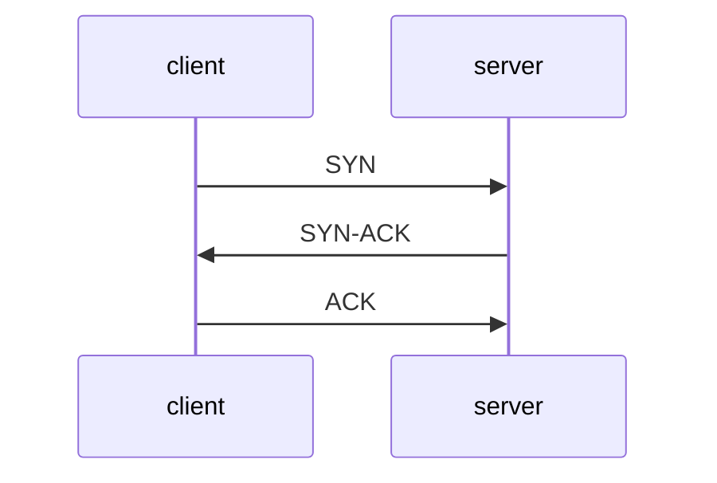
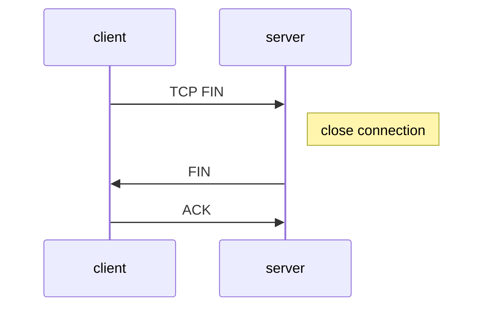
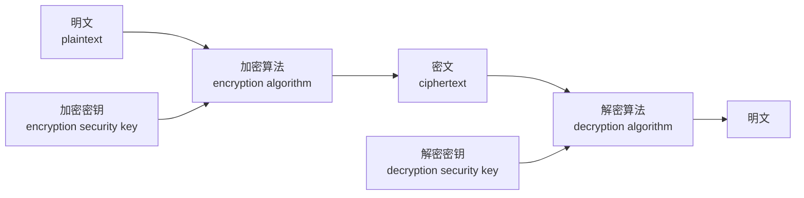

# 计算机网络（Computer Network）

计算机网络：互联的、自治的计算机集合

* 互联：互联互通
* 自治：无主从关系

## 计算机网络基础

#### 计算机网络结构

* 网络边缘
* 接入网络
* 网络核心

#### 数据交换

* 电路交换（circult switching）
* 报文交换（message switching）
* 分组交换（package switching）

#### 多路复用（multiplexing）

* 频分多路复用（frequency division multiplexing, FDM）
* 时分多路复用（time division multiplexing, TDM）
* 波分多路复用（wavelength division multiplexing, WDM）
* 码分多路复用（code division multiplexing, CDM）
* 统计多路复用（statistical division multiplexing）

前四种用于电路交换,最后一种用于分组交换

#### 性能参数

* 速率（data rate/bit rate）
* 带宽（bandwidth）
* 延迟/时延（delay/latency）
* 时延带宽积：传播时延*带宽
* 分组丢失率（丢包率）
* 吞吐量/率（throughput）

## 计算机网络体系结构（network architecture）

#### OSI参考模型

1. 应用层
2. 表示层
3. 会话层
4. 传输层
5. 网络层
6. 数据链路层
7. 物理层

#### TCP/IP参考模型

1. 应用层				HTTP(Web)	SMTP(Email)	 DNS	RTP(流媒体)
2. 运输层								  TCP								UDP
3. 网际层													    IP
4. 网络接口层

#### 5层参考模型

1. 应用层		网络应用
2. 传输层		端口
3. 网络层		源/目的主机
4. 链路层		相邻节点
5. 物理层		bit

主机包含全部5层,路由器包含下三层,交换机包含下两层

##  应用层

#### 网络应用体系结构

* 客户端/服务器结构（Client-Server, C/S）
* 点对点结构（Peer to Peer, P2P）
* 混合结构（Hybrid）

#### HTTP Request Method

* 1.0
  * GET			 请求	实体主体
  * HEAD		  请求    实体头
  * POST		   提交    新增/修改
* 1.1
  * PUT             修改
  * DELETE       删除
  * CONNECT  转发    建立加密连接
  * OPTIONS   查看性能
  * TRACE        测试、诊断

#### HTTP Status Code

* 1**	信息
* 2**    成功
* 3**    重定向
* 4**    客户端错误
* 5**    服务器错误

#### HTTP 非持久连接 vs 持久连接

* 非持久连接（Nonpersistent HTTP），HTTP 1.0 版本
  * 每个连接只允许传输一个对象
* 持久连接（Persistent HTTP），HTTP 1.1 版本
  * 每个连接允许传多个对象
  * 无流水的持久性连接每个对象1个RTT
  * 带有流水机制的持久性连接所有对象只需1个RTT

#### Cookie 技术

* HTTP 协议无状态，很多应用需要服务器掌握客户端的状态。
* Cookie 组件
  * HTTP 消息的 Cookie 头部行
  * 保存在客户端主机上的 Cookie 文件，由浏览器管理，存储在 Web 服务端的后台数据库
* Cookie 问题：隐私问题

#### Web 缓存/代理服务器技术

* 功能：在不访问服务器的前提下满足客户端 HTTP 请求
* 好处：
  * 缩短客户请求的响应时间
  * 减少机构/组织的流量
  * 在大范围内（Internet）实现有效的内容分发
* 实现：
  * 用户设定浏览器通过缓存进行 Web 访问
  * 浏览器像缓存/代理服务器发送所有的 HTTP 请求
* 缓存即充当服务器，也充当客户端

###### 条件性 GET 方法

* 目标：如果缓存有最新的版本，则需发送请求对象
* 实现：在 HTTP 请求中声明持有版本的日期，如版本是最新的，则响应消息中不包含对象

#### Email 应用

* 邮件客户端（User Agent）读写收发 Email
* 邮件服务器（Mail Server）
  * 邮箱：存储发送给该用户的 Email
  * 消息对列（message queue）：存储待发送的 Email
* SMTP 协议：邮件服务器之间传递消息所使用的协议
  - 使用 TCP 进行 Email 消息的可靠传输
  - 25端口
  - 传输过程的三个阶段：握手、消息传输、关闭
  - 命令/响应交互模式

#### DNS（Domain Name System）

* 服务：域名翻译成 IP 地址
* 实现方式：分布式层次式数据库
* 查询方式：
  * 迭代查询
  * 递归查询
* 缓存和更新：只要域名解析服务器获得域名-IP映射，即缓存这一映射

#### P2P 应用

###### 纯 P2P 架构，Peer-to-Peer

* 没有服务器
* 任意端系统间直接通信
* 节点阶段性接入 Internet
* 节点可能更换 IP 地址

###### 文件分发：BitTorrent

* torrent：交换同一文件的文件块的节点组
* tracker：跟踪参与 torrent 的节点
* 文件被分为256KB的 chunk
* 节点加入torrent
  * 没有chunk，但会逐渐累积
  *  向 tracher 注册以获得节点清单，与某些节点（邻居）建立连接
* 下载同时，节点需要向其他节点上传chunk

- 节点可能加入或离开

###### 获取 chunk

* 给定任一时刻，不同的节点持有文件的不同 chunk 集合
* 节点定期查询每个邻居所持有的 chunk 列表
* 节点发送请求，请求获取缺失的 chunk，稀缺优先

###### 发送 chunk

* 节点向四个邻居发送chunk（正在向其发送 chunk 速率最快的四个）
* 每一段时间（10s）重新评估 top4
* 一段时间（每30s）随机选择一个其他节点，向其发送 chunk

###### P2P索引

* 集中式索引
* 洪泛式查询
* 层次式覆盖网络

#### Socket Programming（应用编程接口）

###### client

* TCP
  1. get server IP, host
  2. create Socket
  3. set client IP host
  4. connect to server
  5. communication
  6. close connection
* UDP
  1. get server IP, host
  2. create Socket
  3. set client IP host
  4. set server IP host, build UDP datagram
  5. communication
  6. close Socket

###### Server

* Iterative connectionless communication
  1. create UDP Socket
  2. set server IP, host
  3. get requests from client iteratively
  4. send message
* Iterative connection-oriented communication
  1. create TCP Socket, and set host
  2. set Socket to monitor mode
  3. get next connect request, create new Socket to build connection with client
  4. communication with client
  5. finish, close connection, goto step 3
* Concurrent connectionless communication
  1. create main UDP Socket, and set IP, host
  2. get next client request, create new thread to handle it
  3. child thread get the request
  4. child thread send message
  5. close the child thread
* Concurrent connection-oriented communication
  1. create main TCP Socket and set IP, host
  2. set main Socket to monitor mode
  3. get next request, create new thread to handle it
  4. child thread get the request
  5. communication
  6. close connection and release the child thread

#### 可靠数据传输

不错，不丢，不乱

###### 可靠数据传输协议（rdt）

* 对应用层、传输层、链路层都很重要
* 网络 TOP-10 问题
* 信道的不可靠性决定了可靠数据传输协议的复杂性

###### Rdt演进

* 1.0 可靠信道
* 2.0 产生位错误的信道
  * 差错检测
  * 接受方反馈控制信息 ACK/NAK
  * 重传
* 2.1 发送方应对 ACK/NAK 破坏
  * 分组增加序列号（ID）
  * 增加 ACK/NAK 校验
* 2.2 无 NAK 消息协议
  * 接收方通过 ACK 告知最后一个正确接收的分组
* 3.0 信道极可能错误，也可能丢失分组
  * 发送方等待合理时间，需要定时器
  * 能够正确工作，但性能很差

###### 流水线机制与滑动窗口协议

* 允许发送方收到 ACK 之前连续发送多个分组
  * 需要更大的序列号范围
  * 发送方和/或接收方需要更大的缓存空间
* 滑动窗口协议（Sliding-Window Protocol）
  * 窗口：允许使用的序列号范围，窗口范围为N则最多有N个等待确认的消息
  * 滑动窗口：随着协议运行，窗口在序列号空间内向前滑动
  * 两种常见的滑动窗口协议：
    * GBN（Go-Back to N）
      * 累计确认机制：ACK(n) 确认到序列号n（包含n）的分组均已被正确接受
      * 超市 Timeout(n) 事件：重传序列号大于等于 n，还未收到 ACK 的所有分组
      * 乱序到达的分组，直接丢弃，重新确认序列号最大的按序到达的分组，发送 ACK
    * SR（Selective Repeat）
      * 接收方对每一个分组单独进行确认，为每个分组设置定时器
      * 设置缓存机制，缓存乱序到达的分组
      * 发送方只重传没收到 ACK 的分组
      * 发送方窗口尺寸NS，接收方尺寸NR，序列号位数：k，NS+NR <= 2k

#### TCP 可靠数据传输

在 IP 层提供的不可靠的服务基础上实现可靠数据传输

* 流水线机制
* 累计确认
* TCP 使用单一重传定时器
* 触发重传的时间：超时，收到重复 ACK

#### TCP 流量控制（Flow Control）

* 接收方为 TCP 连接分配 buffer

#### TCP 拥塞控制

* 端到端控制
* 加性增，乘性减

#### TCP Three-Way Handshake

1. The client sends a SYN packet to the server to initiate a handshake
2. Upon receipt of this, the server sends a SYN-ACK packet to the client
3. Finally, the client sends an ACK packet to the server to indicate that it has received the server's SYN-ACK packet

* SYN：同步序列编号（Synchronization Sequence Numbers）：TCP/IP 建立连接时使用的握手信号
* ACK：确认字符（Acknowledgement）

#### Ｃlosing a connection

1. client host sends TCP FIN segment to server
2. server host receives FIN, replies ACK, close connection, send FIN
3. client host receives FIN, replies ACK
4. server host receives ACK, TCP real close

## 网络层

#### 核心功能

* 路由与转发
* 连接建立

#### 路由（routing）vs 转发（forwarding）

* routing：确定分组从源主机到目的主机经过的路径
* forwarding：将分组从路由器的输入端口转移到合适的输出端口

#### 无连接服务 vs 连接服务

* connection-less：不事先为系列分组确定传输路径，每个分组独立确定传输路径
  * 典型：数据报网络
* connection：首先为系列分组的传输确定从源到目的经过的路径，然后沿该路径（连接）传输系列分组，传输结束后拆除连接
  * 典型：虚电路网络

#### 数据报 vs 虚电路

* datagram：
  * 简化网络，复杂“边缘”
  * “弹性服务”，没有严格时间要求
  * 典型：Internet
  * 网络层无连接，每个分组携带目的地址
* vitual-circuit：
  * 简化“边缘”，复杂网络
  * 电话网络演化而来
  * 严格的时间、可靠性需求
  * 典型：ATM
  * 呼叫建立->数据传输->拆除呼叫
  * 每个分组携带虚电路标识（VCID）

#### Internet 网络层

* 主要功能：路由协议 + IP协议 + ICMP协议
* 最大传输单元（MTU）：链路层数据帧可封装数据的上线
* IP 分片与重组，大 IP 分组向较小 MTU 链路转发时，可以被分片（fragmented），IP 分片到达目的主机后进行重组（reassembled）

#### IP 编址

* IP 地址：32bit(IPv4)，标识主机、路由器的接口，网络号（NetID）+ 主机号（HostID）
* IP 子网：具有相同网络号的设备接口，不跨越路由器，可以彼此物理互联

#### 有类 IP 地址（有类编址）

| 类别 | 占比  | IP范围                    | 说明                                                         |
| ---- | ----- | ------------------------- | ------------------------------------------------------------ |
| A类  | 50%   | 0.0.0.0~127.255.255.255   | NetID占8位，首位是“0”                                        |
| B类  | 25%   | 128.0.0.0~191.255.255.255 | NetID占16位，头两位是“10”                                    |
| C类  | 12.5% | 192.0.0.0~223.255.255.255 | NetID占24位，头三位是“110”                                   |
| D类  | 6.25% | 224.0.0.0~239.255.255.255 | 不区分NetID，头四位是“1110”  多波（阻波）地址，只能做目的地址 |
| E类  | 6.25% | 240.0.0.0~255.255.255.255 | 保留，作为研究使用                                           |

注：可根据第一个“0”在第几位出现区分是哪类地址，除 E 类外，1~4 类，第 n 类地址范围可表示为：

( 1 - 1/n ) * 232  ~ ( 1 - 1/(n+1) ) * 232 - 1

#### 特殊 IP 地址

| NetID  | HostID       | 作源 | 作目的 | 用途               |
| ------ | ------------ | ---- | ------ | ------------------ |
| 全0    | 全0          | yes  | no     | 本机               |
| 全0    | 特定值       | no   | yes    | 内网某主机         |
| 全1    | 全1          | no   | yes    | 内网广播地址       |
| 特定值 | 全0          | no   | no     | 某网络             |
| 特定值 | 全1          | no   | yes    | 某网络广播地址     |
| 127    | 非全0或非全1 | yes  | yes    | 环回地址，本地测试 |

#### 私有 IP 地址

* A类：10.0.0.0/8
* B类：172.16.0.0/12
* C类：192.168.0.0/16

#### IP 协议子网划分与子网掩码

* IP 地址：网络号（NetID）+ 子网号（SubID）+ 主机号（HostID）
* 子网掩码：形如 IP 地址
  * NetID，SubID取”1“，HostID 取”0“

#### CIDR 与 路由聚合

CIDR：Classless Inter Domain Routin（无类域间路由）

* 消除传统A、B、C、D类地址界限
* 融合子网地址与子网掩码，方便子网划分
* 提高 IPv4 地址空间分配效率
* 提高路由效率

#### DHCP 协议

DHCP：Dynamic Host Configuration Protocol（动态主机配置协议）

* 从服务器动态获取 IP，CIDR
* “即插即用”

#### 网络地址转换（NAT）

一个 IP 可以连多个网络设备，替换、记录、替换

16bit 端口号字段，可同时支持216 左右的并行连接

###### 主要争议

* 路由器只应处理到网络层
* 违背端到端通信原则，应用开发者需要考虑 NAT 存在
* 地址短缺问题应由 IPv6 来解决

###### NAT 穿透问题解决方案

1. 静态配置
2. UpnP 协议（Universal Play and Play）
3. 中继

#### ICMP 协议

ICMP：Internet Control Message Protocol（互联网控制报文协议）

支持主机或路由器：差错（或异常）报告，网络探寻

###### 差错报告（5种）

* 目的不可达
* 源抑制
* 超时
* 参数问题
* 重定向

###### 网络探询报文（2种）

* 回声请求与应答报文
* 时间戳请求与应答报文

#### IPv6 vs IPv4

###### IPv6 的变化

* 128bit
* 40bit 基本首部
* 不允许分片
* 彻底移除校验和

###### 共存方式：隧道

IPv6数据报作为 IPv4 数据报的载和进行分装，穿越 IPv4 网络

#### 路由算法

确定去往目的主机/网络的最佳路径

###### 分类

* 静态路由 vs 动态路由
* 全局信息 vs 分散信息

###### 算法

* Dijkstra
* 距离向量（Distance Vector）
* 层次路由

###### 协议

* RIP（Routing Information Protocol）
* OSPF（Open Shortest Path Protocol）
* BGP（Border-Gateway Protocol)

## 链路层

#### 链路层服务

* 组帧（framing）

* 链路接入（link access）
* 相邻结点间可靠交付
* 流量控制（flow control）
* 差错控制（error detection）
* 差错纠正（error correction）
* 全双工和半双工通信控制

#### 差错编码

D -> DR

D：Datagram

R：差错检测，差错纠正比特

#### MAC 协议

MAC：Media Accesss Control（多路访问控制协议），采用分布式算法决定节点如何共享信道

三大类：

* 信道划分（channel partitioning），多路复用
* 随机访问（random access），允许冲突
* 轮转（taking turns），结点轮流使用信道

#### MAC 地址

32位 IP 地址，接口的网络层地址，每块网卡都有唯一的 MAC 地址

#### 以太网

不可靠，无连接服务

目前主流网络拓扑：星型，中心交换机（switch），每个结点一个单独冲突域（彼此间不冲突）

#### 路由器 vs 交换机

###### 均为存储转发设备

* 路由器：网络层设备（检测网络层分组首部）
* 交换机：链路层设备（检测链路层帧的首部）

###### 均使用转发表

* 路由器：利用路由算法计算，依据 IP 地址
* 交换机：利用自学习，洪泛构建转发表，依据 MAC 地址

#### 网络设备对比

|            | 集线器 | 交换机 | 网桥 | 路由器 |
| ---------- | ------ | ------ | ---- | ------ |
| 层次       | 1      | 2      | 2    | 3      |
| 流量隔离   | no     | yes    | yes  | yes    |
| 广播域隔离 | no     | no     | no   | yes    |
| 即插即用   | yes    | yes    | yes  | no     |
| 优化路由   | no     | no     | no   | yes    |
| 直通传输   | yes    | yes    | yes  | no     |

#### 虚拟局域网（VLAN）

VLAN：Vitual Local Area Network

一组逻辑上的设备，根据某些因素将它们组织起来，相互间通信就好像在同一个网段中一样

工作在链路层和网络层

特点：

* 网络设备移动、添加、修改的管理开销少
* 可控制广播活动
* 提高网络的安全性

#### 802.11 无线局域网

###### 概念：

* 基站（Base Station） =  访问点（Access Point，AP）

* 基本服务集（Basic Server Set，BSS），也称为单元（cell）

###### 主机必须与某个 AP 关联

* 被动扫描
  * 各 AP 发送信标帧
  * 主机向选择的 AP 发送请求帧
  * AP 向主机发送响应帧
* 主动扫描
  * 主机主动广播探测请求帧
  * AP 发送探测响应帧
  * 主机向选择的 AP 发送关联请求帧
  * AP 向主机发送响应帧

###### 多路访问控制

CSMA/CA

* 发送端首先利用 CSMA 向 AP 发送一个很短的 RTS（request-to-send）帧，RTS 帧可能彼此冲突，但 RTS 很短

* AP 广播一个 CTS（clear-to-send）帧作为对 RTS 的响应

* CTS 帧可被所有结点接收，消除隐藏站影响
* 发送端可以发送数据帧，其他节点推迟发送

## 网络安全

#### 概念

网络系统的硬件、软件及其系统中的数据受到保护，不因偶然的或恶意的原因而受到破坏、更改、泄露，系统连续可靠正常地运行，网络服务不断中断。

#### 基本属性

* 机密性（confidentiality）
* 身份认证（authentication）
* 信息完整性（message integrity）
* 可访问与可用性（access and availability）

#### 基本特征

* 相对性
* 时效性
* 相关性
* 不确定性
* 复杂性
* 重要性

#### 研究领域

* 入侵者（bad guys）如何攻击计算机网络
* 如何防护网络对抗攻击
* 如何设计网络体系结构免疫攻击

#### 拟人模型

拟人场景：Alice、Bob、Trudy

Bob 与 Alice 是期待进行安全通信的双方

Trudy 是企图破坏 Bob 和 Alice 通信的入侵者（intruder），试图拦截、删除或添加信息

#### 威胁

窃听、插入、假冒、劫持、拒绝服务Dos

#### Internet 安全威胁

* 映射（Mapping）
  * 发起攻击前“探路”，ping 确定网络上的主机地址+端口扫描（Port-scanning），依次尝试与每个端口建立连接
* 分组“嗅探”（sniffing）
  * 广播介质
  * 混合（promiscuous）模式网络接口可以接受记录所有经过的帧/分组
* IP 欺骗（Spoofing）
  * 直接由应用生成“原始” IP 分组，可以设置分组的源 IP 地址字段为任意值
* 拒绝服务 Dos（Denial of service）
  * 向接收方恶意洪泛（flood）分组，淹没（swamp）接收方
    * 带宽耗尽
    * 资源耗尽
  * 分布式拒绝服务攻击（DDos），多个源主机协同淹没接收方

#### DDos 攻击过程

1. 选择目标
2. 入侵（break into）网络中主机（构造僵尸网络）
3. 控制僵尸主机向目标发送分组

###### 反射式 DDos 攻击

1. 选择目标
2. 入侵网络中主机
3. 选择反射服务器
4. 借助反射服务器向目标发起攻击

#### 密码学基础（cryptography）

* m：明文
* KA(m)：密文，利用密钥 KA 加密
* KB(KA(m)) = m：看用 KB 解密
* 对称密钥加密：Bob 和 Alice 共享相同（对称）密钥 KS
* 公开密钥加密：发送者用接收者的公开密钥加密，接收者用自己的私有密钥解密

#### 加密破解方法

* 唯密文攻击：只有密文
  * 暴力破解
  * 统计分析
* 已知明文攻击：已知（部分）明文以及与之匹配的密文
* 选择明文攻击：可以获取针对选择的明文的密文

