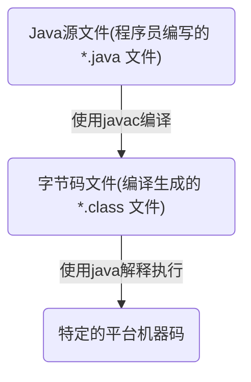
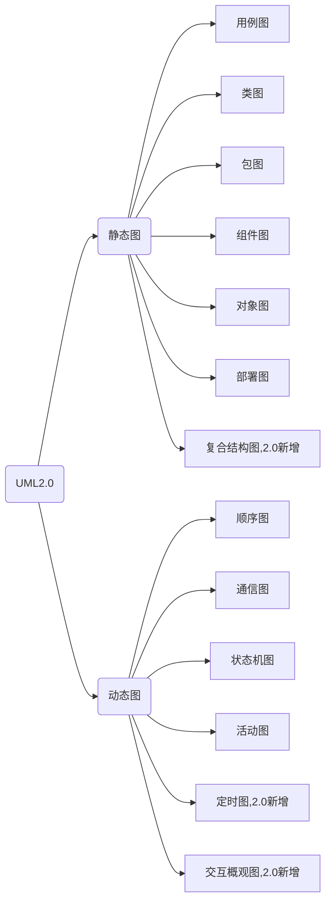
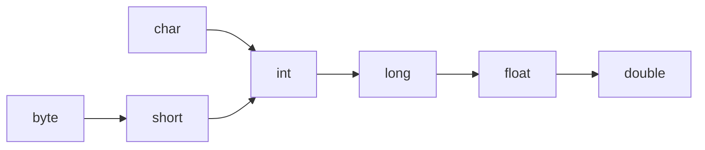
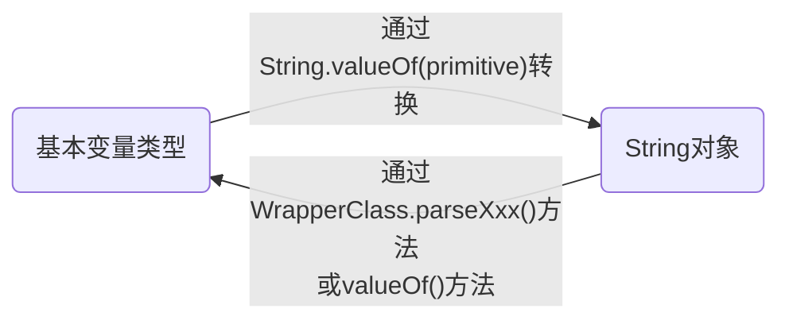
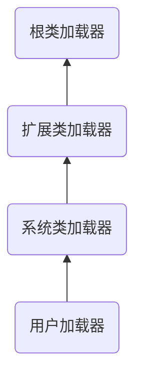

# Java

使用 Java 有段时间了，当初工作需要开始接触，摸着石头过河，绝大部分对 Java 的理解源自平时搬砖，说实话目前我所看到的 Java 并不符合我的审美，甚至某些 Java 项目（这里的项目是指工作中涉及业务的 Java 项目，我不觉得自己有资格评价 Java 及被广泛使用的 Java 开源项目）的架构与我的技术观出入极大。即日起，我准备系统性地学习 Java，很期待对 Java 理解渐渐深入的我回头看今日我的肤浅及粗糙。
2019/6/12

系统性地学习了一遍 Java 语法，回头来以 Python 为参照物，简单说说我对 Java 的理解。Java 就像是比卢普斯，代表规矩，可以中规中矩地进攻、防守，必要的时候也能完成个人表演；而 Python 就好比艾佛森，代表自由，可以天马行空地进攻、羚羊挂角地防守，需要的话也能串联队友。由于 Java 的语法是规矩的、有一定纪律的，所以不同水准的 Java 项目在不同水平程序员间可以较为流畅的交接，但这种纪律也会限制程序员，代码密度往往不高；Python 是相对自由的，所以程序员可能很好、也可能很不好。好的 Python 程序员要有所为有所不为、要慎独，这样才能真正发挥出 Python 的威力。

总结一下，本人还是更喜欢 Python 一些。

2019/11/11

## Java语言概述与开发环境

### Java 程序运行机制

#### 编译型语言 vs 解释型语言

Java 是一种特殊的高级语言，Java 程序要经过先编译，后解释两个步骤，所以 Java 同时具有编译型语言和解释型语言的特性。

* 编译型语言（一次性”翻译“）
  * 使用专门的编译器，针对特定平台（操作系统）将某种高级语言代码一次性“翻译”成可被该平台硬件执行的机器码（包括机器指令和操作数），并包装成该平台所能识别的可执行性程序的格式，这个转换过程称为编译（Compile）。编译生成的可执行性程序可以脱离开发环境，在特定平台上独立运行。
  * 机器码可脱离开发环境独立运行，运行效率较高，无法移植到其他平台使用。
  * 典型编译型语言：C、C++、Object-C、Swift、Kotlin。
* 解释型语言（逐行”翻译“）
  * 使用专门的解释器对源程序逐行解释成特定平台的机器码并立即执行的语言。解释型语言通常不会进行整体性的编译和链接处理，解释型语言相当于把编译型语言中的编译和解释过程混合到一起同时完成。
  * 可以认为：每次执行解释型语言的程序都需要进行一次编译，因此解释型语言的程序运行效率通常较低，而且不能脱离解释器独立运行。但跨平台比较容易，只需特定平台的解释器即可。
  * 典型解释型语言：JavaScript、Python、Ruby。
* 伪编译型语言（半编译型语言）
  * 首先编译成特定的半机器码（介于语言和机器码中间的代码），并将解释引擎封装在可执行性程序内，当运行程序时，半机器码会被解析成真正的机器码。
  * 伪编译型语言看起来可以脱离开发环境，在特定平台上运行，实际上跟编译型语言还是有很大差别的。
  * 典型的伪编译语言：Visual Basic，他的半机器码：P-代码。

#### Java 程序的运行机制和 JVM

Java 语言比较特殊，由 Java 语言编写的程序需要经过编译步骤，但这个编译步骤并不会生成特定平台的机器码，而是生成一种与平台无关的字节码（也就是 *.class 文件）。当然，这种字节码不是可执行的，必须使用 Java 解释器来解释执行。



Java 语言里负责执行字节码文件的是 Java 虚拟机，即 JVM（Java Virtual Machine）。JVM 是可运行 Java 字节码文件的虚拟计算机。所有平台上的 JVM 向编译器提供相同的编程接口，而编译器只需要面向虚拟机，生成虚拟机能理解的代码，然后由虚拟机来解释执行。在一些虚拟机的实现中，还会将虚拟机代码转换成特定系统的机器码执行，从而提高执行效率。

当使用 Java 编译器编译 Java 程序时，生成的是与平台无关的字节码，这些字节码不面向任何具体的平台，只面向 JVM。不同平台的 JVM 都是不同的，但他们提供了相同的接口。JVM 是 Java 程序跨平台的关键部分，只要为不同平台实现了相应的虚拟机，编译后的 Java 字节码就可以在该平台上运行。显然，相同的字节码程序需要在不同的平台上运行，这几乎是”不可能的“，只有通过中间的转换器才可以实现，JVM 就是这个转换器。

JVM 是一个抽象的计算机，和实际的计算机一样，它具有指令集并使用不同的存储区域。它负责执行指令，还要管理数据、内存和寄存器。

Oracle 公司制定的 Java 虚拟机规范在技术上规定了 JVM 的统一标准，具体定义了 JVM 的如下细节：

* 指令集
* 寄存器
* 类文件的格式
* 栈
* 垃圾回收堆
* 存储区

### Java 准备

安装并配置 JDK

#### JDK vs JRE

* JDK（Java SE Development Kit），即 Java 标准版开发包，提供了编译、运行 Java 所需要的各种工具和资源，包括 Java 编译器、Java 运行环境、常用的 Java 类库等。
* JRE（Java Running Envirenment），即 Java 运行环境，包括 JVM（运行 Java 程序的核心虚拟机）、类加载器、字节码校验器、大量的基础类库。

#### Java SE vs Java EE vs Java Me

* Java SE（Java Platform，Standard Edition）标准版本，桌面应用开发。
  Java EE（Java Platform，Enterprise Edition）企业版本，Web 程序开发。
  Java ME（Java Platform，Micro Edition）微型版本，手机应用开发。

#### 安装目录结构

* bin：JDK 的各种工具命令，例如 javac、java，一般安装成功后在 PATH 中加入该路径。
* conf：JDK 的相关配置文件。
* include：平台特定的头文件。
* jmods：JDK 的各种模块。
* legal：JDK 各种模块的授权文档。
* lib：JDK 工具的一些补充 JAR 包。
* README 和 COPYRIGHT 文档说明。

###第一个 Java 程序

1. 编辑 Java 源代码

2. 编译 Java 程序

   ```shell
   javac -d destdir srcFile
   # -d destdir 是javac命令的选项，用以指定编译生成的字节码文件存放的路径
   # srcFile 是 Java 源文件所在的位置
   # 例如：
   javac -d HelloWorld.java
   ```

3. 运行 Java 程序

   ```shell
   java Java类名
   # 例如：
   java HelloWorld
   ```

### Java 程序的基本规则

#### 组织形式

Java 程序是一种纯粹的面向对象的程序设计语言，必须以类（Class）的形式存在，类是 Java 程序的最小程序单位。Java 程序不允许可执行性语句、方法等成分独立存在，所有的程序部分必须放在类里。

```java
public class HelloWorld{
	public static void main(String[] args){
    System.out.println("Hello World!");
  }
}
```

一个 Java 程序往往只需要一个入口，也就只有一个类包含 main 方法，而其他类都是被 main 方法直接或间接调用的。

#### 命名规则

* Java 文件的扩展名必须是 .java。
* 如果 Java 程序源代码里定义了一个 public 类，则该源文件的主文件名必须与该 public 类的类名相同，如果没定义 public 类，则主文件名可以任意，但推荐与类名相同。
* 一个 Java 源文件只能定义一个类，不同的类使用不同的源文件定义。

### 垃圾回收机制

Java 程序的内存分配和回收都是由 JRE 在后台自动进行的（隐式的），所有的 JVM 实现都有一个由垃圾回收器管理的堆内存，这种实现方式有以下优点：

* 提高编程效率。
* 保护程序的完整性。

垃圾回收特点：

* 垃圾回收器只回收内存资源，对其他物力资源，如数据库连接、磁盘I/O等资源则无能为力。
* 为了让垃圾回收器更快回收那些不再被使用的对象，可以将对象的引用变量设置为 null。
* 垃圾回收发生不可预知，不同 JVM 采用不同的垃圾回收机制和垃圾回收算法，可以调用对象的 gc() 或  System.gc() 等方法建议系统进行垃圾回收，但仅仅是建议，依旧不能精准控制垃圾回收机制的执行。
* 垃圾回收的精确性主要包括两个方面：
  * 能够精确地标记活着的对象。
  * 能够精确地定位对象之间的引用关系。
* 现在的 JVM 有多种不同的垃圾回收实现。


## 理解面向对象

### 面向对象

目前软件开发领域有两种主流的开发方法：结构化开发方法和面向对象开发方法。

#### 结构化程序设计

结构化程序设计方法主张按功能来分析系统需求，其主要原则可概括为自订向下、逐步求精、模块化等，也称面向功能的程序设计、面向数据流的处理方式。

结构化程序设计里最小的程序单元是函数，程序入口为主函数，主函数调用普通函数、普通函数间相互调用，完成整个软件系统的功能。

#### 程序的三种基本结构

* 顺序
* 选择
* 循环
  * 当型循环
  * 直到型循环

#### 面向对象程序设计

面向对象的基本思想是使用类、对象、继承、封装、消息等基本概念进行程序设计。强调以现实世界中的的事物（即对象）为中心思考，并根据这些事物的本质特点，把它们抽象地表示为系统中的类。

成员变量（状态数据）+ 方法（行为）= 类定义

#### 面向对象的基本特征

面向对象三个基本特征：

* 封装（Encapsulation）
  * 将对象的实现细节隐藏起来，然后通过一些公用方法来暴露该对象的功能。
* 继承（Inheritance）
  * 子类继承父类后，子类作为一种特殊的父类，将直接获得父类的属性和方法。
* 多态（Polymorphism）
  * 子类对象可以直接赋给父类变量，但运行时依然表现出字类的行为特征，这意味着同一个类型的对象在执行统一方法时，可能表现出多种行为特征。
* 抽象（面向对象的重要部分，非特征，因为所有语言都需要抽象）
  * 忽略一个主题中与当前目标无关的那些方面。

面向对象还支持如下几个功能：

* 对象是面向对象方法中最基本的概念，他的基本特点有：标识唯一性、分类性、多态性、封装性、模块独立性等。
* 类是具有共同属性、共同方法的一类事物。类是对象的抽象；对象则是类的实例。
* 对象间相互合作需要一个机制协助进行，这个机制称为“消息”。消息是一个实例与另一个实例之间相互通信的机制。
* 面向对象方法中，类之间共享属性和操作的机制称为继承。继承具有传递性，继承可分为单继承和多继承，由于多继承可能引起继承结构混乱，降低程序的可理解性，所以 Java 不支持多继承。

如果想判断一门语言是否是面向对象的，通常可以通过该语言是否有继承和多态两种特性来判断。

### UML（统一建模语言）

面向对象的方式由 OOA（面向对象分析）、OOD（面向对象设计）、OOP（面向对象编程）三部分有机组成，OOA 和 OOD 的结构需要一种方式来描述并记录，目前业界统一采用 UML（统一建模语言）。

UML 是一种定义良好、易于表达、功能强大且普遍适用的建模语言，它的作用域不限于支持面向对象的分析与设计，还支持从需求分析开始的软件开发全过程。



### Java 的面向对象特征

Java 是纯粹的面向对象编程语言。

#### 一切都是对象

在 Java 语言中，除8个基本数据类型值之外，一切都是对象。对象不仅能表示具体的事物，也能表示抽象的规则、计划或事件。

* 对象具有状态，Java 通过定义成员变量来描述对象的状态。
* 对象还有操作，这些操作可以改变对象的状态，操作也被称为行为，Java 通过定义方法来描述对象的行为。
* 对象实现了数据和操作的结合。
* 对象是 Java 程序的核心，所以 Java 里的对象具有唯一性，每个对象都有一个标识来引用它，某个对象失去了标识，这个对象将变成垃圾，只能等垃圾回收机制来回收它。
* Java 语言不允许直接访问对象，而是通过对象的引用来操作对象。

#### 类和对象

具有相同或相似性质的一组对象的抽象就是类，类是对一类事物的描述，是抽象的、概念上的定义；对象是实际存在的该类事物的个体，因而也称为实例（instance）。

对象的抽象化是类，类的具象化是对象。

Java 语言使用 class 关键字定义类，定义类时可使用成员变量来描述该类对象的数据，可使用方法来描述该类对象的行为特征。

* 一般 → 特殊关系：典型继承关系。
* 整体 → 部分结构关系：组装结构，典型组合关系。


## 数据类型和运算符

Java 提供了丰富的基本数据类型：

* 数值类型（所有数值类型之间可以进行类型转换）
  * 整型
  * 字符型
  * 浮点型
* 布尔类型

Java 提供了功能丰富的运算符（运算符和操作数连接在一起就形成了表达式）：

* 算数运算符
* 位运算符
* 比较运算符
* 逻辑运算符

### 注释

#### 添加注释的必要性

* 永远不要相信自己的理解力！
* 可读性第一，效率第二！
* 代码即文档！

#### 单行注释

在程序中注释一行代码，将 “//” 放在需要注释的内容前。

#### 多行注释

一次性地将多行代码注释掉，使用 “/\*” 和 “\*/“ 将程序中需要注释的内容包含起来。

#### 文档注释

如果编写 Java 源代码时添加了合适的文档注释，然后通过 JDK 提供的 javadoc 工具可以直接将源代码里的文旦注释提取成一份系统的 API 文档。

文档注释以 “/\*\*” 开，以 “\*/“ 结束，中间部分全部是文档注释，会被提取到 API 文档中。

常见的 javadoc 标记：

* @author：指定 Java 程序的作者
* @version：指定源文件的版本
* @deprecated：不推荐使用的方法
* @param：方法的参数说明
* @return：方法的返回参数说明
* @see：“参见”，用于指定交叉参考的被容
* @exception：抛出异常的类型
* @throws：抛出的异常，和 @exception 同义

### 标识符和关键字

#### 分隔符

Java 语言里的分号、花括号、方括号、圆括号、空格、句号 都具有特殊的分隔作用，统称为分隔符。

#### 标识符规则

* 可以由字母、数字、下划线和美元符组成，其中数字不能打头。
* 不能是 Java 关键字和保留字。
* 不能包含空格。
* 不能是单独的数字或下划线或美元符。

#### Java 关键字

Java 一共包含50个关键字

| abstract    | continue    | for            | new           | switch           |
| ----------- | ----------- | -------------- | ------------- | ---------------- |
| **assert**  | **default** | **if**         | **package**   | **synchronized** |
| **boolean** | **do**      | **goto**       | **private**   | **this**         |
| **break**   | **double**  | **implements** | **protected** | **throw**        |
| **byte**    | **else**    | **import**     | **public**    | **throws**       |
| **case**    | **enum**    | **instanceof** | **return**    | **transient**    |
| **catch**   | **extends** | **int**        | **short**     | **try**          |
| **char**    | **final**   | **interface**  | **static**    | **void**         |
| **class**   | **finally** | **long**       | **strictfp**  | **volatile**     |
| **const**   | **float**   | **native**     | **super**     | **while**        |

### 数据类型分类

#### Java 是一门强类型（strongly typed）语言

- 所有变量必须先声明、后使用。
- 指定类型的变量只能接受类型与之匹配的值。

#### 声明变量

```java
type varName[= 初始值];
```

#### 数据类型分类

* 基本类型（Primitive Type）
  * 数字类型
  * 布尔类型
* 引用类型（Reference Type）
  * 类
  * 接口
  * 数组
  * null

空引用（null）只能被转换成引用类型，不能被转换成基本类型，因此不要把 null 赋给基本数据类型的变量。

### 基本数据类型

#### 整数类型

* byte
  * 1个字节（内存里占8位）
  * -2<sup>7 </sup> ~ 2<sup>7</sup>-1
* short
  * 2个字节
  * -2<sup>15</sup>  ~ 2<sup>15</sup>-1
* int
  * 4个字节
  * -2<sup>31</sup>  ~ 2<sup>31</sup>-1
* long：8个字节
  * -2<sup>63</sup>  ~ 2<sup>63</sup>-1
* 如果直接将一个较小的整数（在 byte 或 short 范围内）赋给一个 byte 或 short 变量，系统会自动把这个整数值当成 byte 或 short 类型来处理。
* 如果使用一个巨大的整数（超出了 int 范围）时，Java 不会自动把这个整数值当成 long 类型来处理。如果希望系统把一个整数型当成 long 类型来处理，应该在这个整数值后增加 l 或者 L 作为后缀，推荐使用 L，避免混淆。
* Java 中整数值有4种表示形式：十进制、二进制、八进制、十六进制。二进制以 0b 或 0B 开头；八进制以 0 开头；十六进制以 0x 或 0X 开头。

#### 字符类型

* char
  * 2个字节
  * 必须使用单引号括起来。
  * 字符型值有三种表达形式：
    * 单个字符
    * 转义字符
    * Unicode 值
* Java 没有提供表示字符串的基本数据类型，而是通过 String 类来表示字符串，由于字符串由多个字符组成，因此字符串要使用双引号括起来。

#### 浮点类型

* float：
  * 4个字节
  * 第1位是符号位，接下来8位表示指数，再接下来23位表示尾数。
* double
  * 8个字节
  * 第1位是符号位，接下来11位表示指数，再接下来52位表示尾数。
* 因为 Java 浮点数使用二进制数据的科学计算法表示浮点数，因此可能不能精确表示一个浮点数，使用 double 比 float 更准确，如要求精准，可以考虑 BigDecimal 类。
* Java 语言的浮点数有两种表达形式：
  * 十进制数形式
  * 科学计数法形式，例如：5.12e2（即 5.12*10<sup>2</sup>）
* 浮点数默认是 double 类型，如希望 float 类型，可在该浮点数后紧跟 f 或 F。
* Java 还提供三个特殊的浮点数：正无穷大（POSITIVE_INFINITY）、符无穷大（NEGATIVE_INFINITY）、非数（NaN）。

#### 布尔类型

* boolean
  * true
  * false

### 基本类型的类型转换

Java 语言所提供的7种数值类型之间可以相互转换，有两种转换方式：自动类型转换和强制类型转换。

#### 自动类型转换

* 系统支持把某种基本类型的值直接赋给另一种基本类型的变量，这种方式被称为自动类型转换。
* 当把一个表数范围小的数值或变量直接赋给另一个表数范围大的变量时，系统将可以进行自动类型转换；否则需要强制类型转换。



* 注意：是数的范围，并非占的空间。
* 当任何基本类型的值和字符串值进行连接运算时，基本类型的值将自动类型转换为字符串类型。

#### 强制类型转换

* 强制类型转换的语法格式：(targetType)value 。
* 当试图强制把表数范围大的类型转换为表数范围小的类型时，必须格外小心信息丢失。
* Java 为8种基本类型都提供了对应的包装类：boolean 对应 Boolean、byte 对应 Byte、short 对应 Short、int 对应 Integer、long 对应 Long、char 对应 Character、float 对应 Float、double 对应 Double。8个类都提供了一个 parseXxx(String str) 静态方法用于将字符串转换成基本类型。

#### 表达式类型的自动提升

* 所有的 byte 类型、short 类型和 char 类型将被提升到 int 类型。
* 整个算数表达式的数据类型自动提升到表达式中最高等级操作数相同的类型。

### 直接量

#### 直接量的类型

* 能指定直接量的通常只有三种类型：基本类型、字符串、null 类型。

#### 直接量的赋值

* 把一个直接量赋值给对应类型的变量是合法的。
* 在系统支持自动类型转换的前提下，允许把一个数值直接量直接赋值给另一种类型的变量。
* null 类型的直接量可以直接赋值给任何引用类型的变量。

### 运算符

#### 算数运算符

\+  -  *  /  %  ++  --

#### 位运算符

* &：按位与
* |：按位或
* ~：按位非
* ^：按位异或
* <<：左移
* \>\> ：右移
* \>\>\>：无符号右移

#### 扩展后的赋值运算符

+=  -=  *=  /= %=  &=  |=  ^=  <<=  >>=  >>>=

#### 比较运算符

\>  >=  <  <=  ==  !=

#### 逻辑运算符

* &&：与
* &：不短路与
* ||：或
* |：不短路或
* !：非
* ^：异或

#### 三目运算符

三目运算符的语法格式如下：

```java
(expression) ? if-true-statement : if-false-statement
```

#### 运算符的结合性和优先级

* 单目运算符、赋值运算符、三目运算符是从右向左结合的（从右向左运算），其他的都是从左向右结合的。
* 运算符优先级（上面优先）：

| 运算符说明         | Java 运算符                                    |
| ------------------ | ---------------------------------------------- |
| 分隔符             | .  ()  []  {}  ,  ;                            |
| 单目运算符         | ++  —  ~  !                                    |
| 强制类型转换运算符 | (type)                                         |
| 乘法/除法/求余     | *  /  %                                        |
| 加法/减法          | +  -                                           |
| 移位运算符         | <<  >>  >>>                                    |
| 关系运算符         | <  <=  >  >=  instanceof                       |
| 等价运算符         | ==  !=                                         |
| 按位与             | &                                              |
| 按位异或           | ^                                              |
| 按位或             | \|                                             |
| 条件与             | &&                                             |
| 条件或             | \|\|                                           |
| 三目运算符         | ?:                                             |
| 赋值               | =  +=  -=  *=  /=  &=  \|=  ^=  <<=  >>=  >>>= |

* 不要把一个表达式写得过于复杂，过于复杂就该分成几步来完成。
* 不要过多依赖运算符的优先级来控制执行顺序，可读性太差，尽量用 () 来控制。


## 流程控制与数组

### 顺序结构

从上到下依次执行。

### 分支结构

#### if 条件语句

```java
if (logic expression) {
	statement;
}

if (logic expression) {
	statement;
} else {
  statement;
}

if (logic expression) {
	statement;
} else if (logic expression) {
  statement;
}
```

* 如果执行体只有一行，可省略执行体的花括号，但不建议这样做。
* 使用 if…else 语句时，应先处理范围更小的情况。

#### switch 分支语句

```java
switch (expression){
	case condition1:
	{
		statement;
		break;
	}
	case condition2:
	{
		statement;
		break;
	}
	...
	case conditionN:
	{
		statement;
		break;
	}
	default:
	{
		statement;
	}
}
```

* switch 语句后面的控制表达式的数据类型只能是 byte、short、char、int 四种整数类型，String 和枚举类型。

### 循环结构

循环语句可能包含如下4个部分：

* 初始化语句（init_statement）
* 循环条件（test_expression）
* 循环体（body_statement）
* 迭代语句（interation_statement）

#### while 循环语句

```java
[init_statement]
while (test_expression) {
	statement;
	[iteration_statement]
}
```

#### do while 循环语句

```java
[init_statement]
do{
	statement;
	[interation_statement]
}while (test_expression)
```

#### for 循环语句

```java
for ([init_statement]; [test_expression]; [iteration_statement]) {
	statement;
}
```

#### 控制循环结构

* break ：结束循环。
* continue ：忽略本次循环剩下的语句。
* return ：结束方法。

### 数组类型

#### 理解数组

* Java 中，一个数组里只能存储同一种数据类型的数据。
* 一旦数组初始化完成，它在内存中所占的空间将被固定下来，因此数组的长度将不可改变。
* Java 数组即可存储基本类型的数据，也可以存储引用类型的数据。

#### 定义数组

```java
type[] arrayName;
type arrayName[];
```

* 推荐使用第一种定义方式。
* 定义数组时不能指定数组的长度。
* 定义数组只是定义了个引用变量，并未指向任何有效的内存空间，所以还不能使用，只有对数组进行初始化之后才能使用。

#### 初始化数组

* 静态初始化

  * 初始化时由程序员显示指定数组每个元素的初始值，由系统决定数组长度。

    ```java
    arrayName = new type[]{element1, element2...};
    ```

  * 在定义数组的同时执行初始化操作可简化成以下格式：

    ```java
    type[] arrayName = {element1, element2...};
    ```

* 动态初始化

  * 初始化时程序员只指定数组长度，由系统为数组元素分配初始值。

    ```java
    arrayName = new type[length];
    ```

  * 定义同时初始化：

    ```java
    type[] arrayName = new type[length];
    ```

    

  * 系统默认初始值

    * 整数类型（byte、short、int、long）：0
    * 浮点类型（float、double）：0.0
    * 字符类型（char）：'\u0000'
    * 布尔类型（boolean）：false
    * 引用类型（类、接口、数组等）：null

#### 使用数组

```java
objArr[idx];
```

#### foreach 循环

```
for (type variableName : array | collection) {
	variableName statement;
}
```

### 深入数组

数组是一种引用数据类型，数据引用变量只是一个引用，数组元素和数组变量在内存里是分开存放的。

#### 栈(stack)内存 vs 堆(heap)内存

* 实际的数组对象被存储在堆内存中，如果引用该数组对象的引用变量是一个局部变量，那么它被存储在栈内存中。
* 所有在方法中定义的局部变量都放在栈内存中，方法结束栈内存自然销毁。
* 在程序中创建对象时，对象被保存到栈内存，以便重复利用（因为对象创建成本较大），堆内存中的对象不会随方法结束而销毁，只有当没有任何引用变量引用该对象时，系统的垃圾回收器才会在合适的时候回收它。
* 为了让垃圾回收机制回收一个数组所占的内存空间，可以将该数组变量赋值为 null，也就切断了引用变量和实际数组间的引用关系，数组也就成了垃圾。

#### Java8 增强的工具类 Arrays

Arrays 类处于 java.util 包下，使用时必须导入 Java.util.Arrays 类。

Arrays 类包含如下几个 static 方法（static 修饰的方法可以直接通过类名调用）

* int binarySearch(type[] a, type key):
* int binarySearch(type[] a, int fromIndex, int toIndex, type key):
* type[] copyOf(type[] original, int length):
* type[] copyOfRange(type[] original, int from, int to):
* boolean equals(type[] a, type[] a2):
* void fill(type[], type val):
* void fill(type[] a, int fromIndex, int toIndex, type val):
* void sort(type[] a):
* void sort(type[] a, int fromIndex, int toIndex)
* String toString(type[] a):

Java8 为 Arrays 类增加的工具方法如下：

* void parallelPrefix(xxx[] a, XxxBinaryOperator op):
* void parallelPrefix(xxx[] a, int fromIndex, int toIndex, XxxBinaryOperator op):
* void setAll(xxx[] a, IntToXxxFunction generator):
* void parallelSetAll(xxx[] a, IntToXxxFunction generator):
* void parallelSort(xxx[] a):
* void parallelSort(xxx[] a, int fromIndex, int toIndex):
* Spliterator.OfXxx spliterator(xxx[] a):
* Spliterator.OfXxx spliterator(xxx[] a, int startInclusive, int endExclusive):
* XxxStream stream(xxx[] a):
* XxxStream stream(xxx[] a, int startInclusive, int endExclusive):


## 面向对象（上）

Java 是面向对象的程序设计语言，提供了定义类、成员变量、方法等最基本的功能。类可被认为是一种自定义的数据类型，可以使用类来定义变量，所有类定义的变量都是引用变量，它们将会引用到类的对象。Java 程序使用类的构造器来创建该类的对象。

Java 支持面向对象的三大特性：封装、继承、多态。

* Java 提供来 private、protected、public 三个访问控制修饰符来实现良好的封装。
* 提供了 extends 关键字来让子类继承父类，子类可以继承到父类的成员变量和方法。
* 使用继承关系来实现复用时，子类对象可以直接赋值给父类变量，这个变量具有多态性。

构造器用于对类实例进行初始化操作，构造器支持重载，如果多个重载的构造器包含了相同的初始化diamanté，则可以把这些初始化代码放置在普通初始化块里完成，初始化块总在构造器执行之前被调用。Java 还提供了一种静态初始化块，用于初始化类，在类初始化阶段被执行。如果继承树里的某一个类需要被初始化，系统将会同时初始化该类的所有父类。

### 类和对象

#### 定义类

##### Java 语言里定义类的简单语法如下：

```java
[修饰符] class 类名
{
	零到多个构造器定义...
	零到多个成员变量...
	零到多个方法...
}
```

对定义类的语法格式的详细说明如下：

* 修饰符可以是 public、final、abstract，或者完全省略这三个修饰符。
* 类名是合法标识符即可，但一般是由一个或多个有意义的单词连缀而成的，单词首字母大写，其余字母小写。
* 类里各成员之间的定义顺序没有任何影响，各成员之间可以相互调用，但 static 修饰的成员不能访问没有 static 修饰的成员。
* 成员变量用于定义该类或该类的实例所包含的状态数据。
* 方法则用于定义该类或该类的实例的行为特征或功能实现。
* 构造器用于构建该类的实例，Java 语言通过 new 关键字来调用构造器，从而返回该类的实例。
* 构造器是一个类创建对象的根本途径，Java 语言提供一个功能：如果程序员没有为一个类编写构造器，系统会为该类提供一个默认的构造器。

##### 定义成员变量的语法如下：

```java
[修饰符] 类型 成员变量名 [= 默认值];
```

对定义成员变量的语法格式的详细说明如下：

* 修饰符：修饰符可以省略，也可以是 public、protected、private、static、final，其中 public、protected、private 三个最多只能出现其中之一，可以与 static、final 组合起来修饰成员变量。
* 类型：可以是任何类型，包括基本类型和引用类型。
* 成员变量名：合法标识符即可，一般是驼峰式的单词（组合）
* 默认值：定义成员变量可指定一个可选的默认值。
* 成员变量由 field 意译而来，早期有些书籍称之为属性，但实际上在 Java 世界里属性（由 property 意译）是指一组 setter 和 getter 方法。

##### 定义方法的语句格式如下：

```java
[修饰符] 方法返回值类型 方法名[形参列表]
{
	// 零到多条可执行性语句组成的方法体
}
```

对定义方法的语法格式的详细说明如下：

* 修饰符：可省略，也可以是 public、protected、privite、static、final、abstrict，其中 public、protected、privite 最多出现一个；final、abstrict 最多出现一个；可以与 static 组合起来修饰方法。
* 方法返回值类型：任何类型，如果声明了返回值类型，则方法体内必需有一个有效的 return 语句，返回的类型必须与此处声明的类型匹配。如果没有返回值，则必须使用 void 来声明没有返回值。
* 方法名：与成员变量命名规则相同。
* 行参列表：用于定义该方法可接受的参数，由零到多组”参数类型 参数名“组成，多组参数间用英文逗号隔开，一旦定义方法时指定了行参列表，则调用该方法时必须传入对性的参数值。
* static 可用于修饰方法、成员变量等成员，表明所修饰的成员属于这个类本身，而不属于该类的单个实例，通常称为类变量、类方法，也称为静态变量、静态方法。

##### 构造器是一个特殊的方法，定义语法格式如下：

```java
[修饰符] 构造器名(行参列表)
{
	// 零到多条可执行性语句组成的构造器执行体
}
```

对定义构造器的语法格式的详细说明如下：

* 修饰符：可省略，也可是 public、protected、private 之一。
* 构造器名：必须和类名相同。
* 行参列表：与定义方法的行参列表格式相同。

##### Java 中类的大致作用

* 定义变量
* 创建对象
* 调用类方法或者访问类变量

#### 对象的产生和作用

创建对象的根本途径是构造器，通过 new 关键字来调用某个类的构造器即可创建这个类的实例。

```java
// 定义 Person 类型的变量
Person p;
// 通过 new 调用 Person 类的构造器，返回一个 Person 实例，赋给 p
p = new Person();

// 简写
Person p = new Person();
```

##### Java 中对象的大致作用

* 访问对象的实例变量
* 调用对象的方法

static 修饰的方法和成员变量，既可通过类来调用，也可通过实例来调用；没使用 static 修饰的普通方法和成员变量，只能通过实例来调用。

#### 对象、引用和指针

与数组相似，类也是一种引用数据类型。因此程序中定义的 Person 类型的变量实际上是一个引用，它被存放在栈内存里，指向实际的 Person 队形，真正的 Person 对象则存放在堆内存中。

当程序访问引用变量的成员变量或方法时，实际上是访问该引用变量所引用的数组、对象的成员变量或方法。

#### 对象的 this 引用

Java 提供了一个 this 关键字，this 关键字总是指向调用该方法的对象。根据 this 出现位置的不同，this 作为对象的默认引用有两种情形

* 构造器中引用构造器正在初始化的对象。
* 在方法中引用调用该方法的对象。

this 关键字的最大作用就是让类中的一个方法访问该类里的另一个方法或实例变量。

当 this 出现在某个方法体中时，它所代表的对象是不确定的，但他的类型是确定的，只能代表当前类的实例。谁调用这个方法，this 就代表谁。

大部分时候，一个方法访问该类中定义的其他方法、成员变量时加不加 this 前缀效果是完全一致的。

对于 static 修饰的方法而言，可以使用类来直接调用该方法，如果在 static 修饰的方法中使用的关键字，则这个关键字就无法指向合适的对象。所以 static 修饰的方法中不能使用 this 引用，所以 static 修饰的方法不能访问不使用 static 修饰的普通成员，因此 Java 语法规定：静态成员不能直接访问非静态成员。

Java 语法允许对象调用 static 修饰的成员变量、方法，但实际编程时应尽量避免。

如果某个方法把 this 作为返回值，则可以连续多次调用同一个方法从而使代码更加简洁，但可能造成实际意义的模糊。

### 方法详解

方法是类或对象的行为特征的抽象，是类和对象最重要的组成部分。

#### 方法 vs 函数

* 方法是由传统的函数发展而来的，定义语法和功能都很相似。
* 结构化编程语言中，系统是由函数组成，面向对象编程语言中系统是由类组成。因此，Java 里方法不能单独存在，必须属于类或对象。

#### 方法的所属性

* 方法不能独立定义，只能在类体里定义。
* 从逻辑上看，方法要么属于该类本身，要么属于该类的一个对象。
* 不能独立执行方法，执行方法必须使用类或对象作为调用者。
* 使用 static 修饰的方法属于类本身，类和对象都可以为调用者，但任何对象调用这个方法都会得到相同的执行结果。
* 没有 static 修饰的方法属于该类的对象，只能通过对象调用，不同对象调用可能得到不同结果。

#### 方法的参数传递机制

如果声明方法时包含了形参声明， 则调用方法时必须给这些行参指定参数值，调用方法时实际传给行参的参数值也被称为实参。

Java 里方法的参数传递方式只有一个：值传递。所谓值传递就是将实际参数值的副本（复制品）传入方法内，参数本身不会受到任何影响。

传引用变量时，传的是栈内存中引用变量（指针）的复制品，而两引用变量指向统一堆内存。

#### 参数个数可变的方法

定义方法时，在最后一个行参的类型后面加上三点(…)，则表明该行参可以接受多个参数值。多参数值传入后，方法内部当作数组处理。

```java
public void test1(int a, String... b);
public void test2(int a, String[] b);
// 两方法内部实现可以完全相同，但调用时存在差别。
test1(1, "a", "b");
test2(2, new String[]{"a", "b"});
// 对比两种调用代码，可见第一种形式更简洁。
```

#### 递归方法

一个方法体内调用它的自身，被称为方法递归。方法递归包含了一种隐式的循环，他会重复执行某段代码。

递归一定要向已知方向进行。

#### 方法重载

Java 允许同一个类里面定义多个同名方法，只要行参列表不同就行。称之为方法重载。

Java 中确定一个方法需要三个要素：

1. 调用者，也就是方法的所属者。
2. 方法名，方法的标识。
3. 行参列表，调用方法时，系统将会根据传入的实参列表匹配。

方法重载要求（两同一不同）：

* 同一类中方法名相同
* 行参列表不同

如果由于可变参数导致方法重载，系统会匹配只传一个参数的方法（类似于最小匹配原则）。一般情况下不推荐重载行参个数可变的方法。

### 成员变量和局部变量

#### 定义

成员变量指的是类里定义的变量，局部变量指的是方法里定义的变量

* 成员变量
  * 类变量（以 static 修饰），与类共存，类准备阶段起到类销毁止有效，无须显示初始化。
  * 实例变量（不以 static 修饰），与实例共存，实例被创建起到完全销毁止有效，无须显示初始化。
* 局部变量
  * 行参（方法签名中定义的变量），整个方法有效，无须显示初始化。
  * 方法局部变量（方法内定义的变量），从定义开始到方法结束截止有效，必须显示初始化。
  * 代码块局部变量（代码块内定义的变量），定义开始到代码块结束截止有效，必须显示初始化。

Java 允许局部变量和成员变量同名，局部变量会覆盖成员变量，成员变量可使用 this（对于实例变量）或类名（对于类变量）作为调用者来限定访问成员变量。

#### 成员变量的初始化和内存中的运行机制

当系统加载类或创建该类的实例时，系统自动为成员变量分配内存空间，并在分配内存空间后，自动为成员变量指定初始值。

#### 局部变量的初始化和内存中的运行机制

定义局部变量后，系统并没有为这个变量分配内存空间，直到程序为这个变量赋初始值，系统才会为局部变量分配内存，并将初始值保存到这块内存中。

局部变量总是保存在其所在方法的栈内存中。

#### 变量的使用规则

遵循物理规则的基础上，使用尽可能“小”的变量。

变量范围扩大的害处：

* 增大变量生存时间，导致更大的内存开销。
* 扩大变量作用域，不利于提高程序的内聚性。

应该考虑成员变量的情形：

* 用于描述某个类或某个对象的固有信息。
* 某个类中需要以一个变量保存该类或者实例运行时的状态信息。
* 某个信息需要在某个类的多个方法之间进行共享。

### 隐藏和封装

#### 理解封装

封装（Encapsulation）是面向对象的三大特性之一，指的是将对象的状态信息隐藏在对象内部，不允许外部程序直接访问对象内部信息，而是通过该类所提供的方法来实现对内部信息的操作和访问。

对类或对象实现良好的封装可实现一下目的：

* 隐藏类的实现细节。
* 让使用者只能通过事先预定的方法来访问数据，限制对成员变量的不合理访问。
* 可进行数据检查，有利于保证对象信息的完整性。
* 便于修改，提高代码的可维护性。

为了实现良好的封装，需要从两方面考虑：

* 将对象的成员变量和实现细节隐藏起来，不允许外部直接访问。
* 把方法暴露出来，让方法来控制这些成员变量，进行安全的访问和操作。

#### 使用访问控制符

Java 提供了三个访问控制符：private、protected、public，也可以不加访问控制符，所以提供了4个访问控制级别，从小到大分别是 private、default、protected、public。

* private（当前类访问权限）：适合用于修饰成员变量，可以把成员变量隐藏在该类内部。

* dafault（包访问权限）：可被相同包下的其他类访问。

* protected（子类访问权限）：即可被同一包中其他类访问，也可以被不同包中的子类访问，使用 protected 通常是希望子类重写这个方法。

* public（公共访问权限）

  访问控制级别表：

  |            | private | default | protected | public |
  | :--------: | :-----: | :-----: | :-------: | :----: |
  | 同一个类中 |    √    |    √    |     √     |   √    |
  | 同一个包中 |         |    √    |     √     |   √    |
  |   子类中   |         |         |     √     |   √    |
  | 全局范围内 |         |         |           |   √    |

如果 Java 源文件中没有 public 修饰的类，则这个 Java 源文件的文件名可以是一切合法的文件名，如果 Java 源文件中定义了一个 public 修饰的类，则这个源文件的文件名必须与 public 修饰的类的类名相同。

如果一个 Java 类的每个实例变量都被使用 private 修饰，并为每个实例变量都提供了 public 修饰符的 setter 和 getter 方法，那么这个类就是一个符合 JavaBean 规范的类（封装良好的类）。

访问控制符使用的基本规则：

* 类里的绝大部分成员变量都应该使用 private 修饰，只有一些 static 修饰的、类似全局变量的成员变量才可以考虑使用 public 修饰。
* 如果某个类主要用做其他类的父类，该类里包含的大部分方法可能仅希望被其子类重写，而不被外界直接调用，则应该使用 protected 修饰这些方法。
* 希望暴露出来给其他类自由调用的方法应该使用 public 修饰符。

#### package、import、import static

##### package

Java 引入包（package）机制，提供了类的多层命名空间，用于解决类的命名冲突、类文件管理等问题。

Java 允许将一组功能相关的类放在同一个 package 下，从而组成逻辑上的类库单元。如果希望把一个类放在指定的包结构下，应该在 Java 源程序的第一个非注释行放置如下格式的代码：

```java
package packageName;
```

一旦在 Java 源文件中使用了这个 package 语句，就意味着该源文件里定义的所有类都属于这个包。位于包中的每个类的完整类名都应该是包名和类名的组合。

Java 规定：位于包中的类，在文件系统中也必须有与包名层次相同的目录结构。

JVM 在装载带有包名的类时，会先搜索 CLASSPATH 下的子路径，然后在这些目录中按与包层次对应的目录结构去查找 class 文件。同一个包中的类不必位于相同的目录下，只要让 CLASSPATH 包含这些个路径即可。虽然如此，也应该把 Java 源文件放在一个目录下。

Oracle 建议使用公司 Internet 域名倒些来作为包名。

父包和子包之间确实表示了某种内在的逻辑关系，但用法上则不存在任何关系，如果父包的类需要使用子包的类，则必须使用子包的全名。

##### import

如果需要使用不同包中的其他类时，总是需要使用该类的全名，这是一件很繁琐的事情，为了简化编程，Java 引入 import 关键字，import 可以向某个 Java 文件中导入指定包层次下某个类或全部类，import 语句应该出现在 package 语句（如果有）之后、类定义之前，import 用法如下：

```java
// 导入单个类
import package.subpackage...ClassName;
// 导入指定包下的全部类
import package.subpackage...*;
// * 只能代表类，不能代表包
```

Java 默认为所有源文件导入 java.lang 包下的所有类。

JDK 1.5 以后增加了静态导入的语法，用于导入指定类的某个（或全部）静态成员变量、方法，语法如下：

```java
// 导入单个静态成员变量、方法
import static package.subpackage...ClassName.fieldName|methodName;
// 导入指定包下的全部静态成员变量、方法
import static package.subpackage...ClassName.*;
```

使用 import 可以省略写包名，而使用 import static 则可以连类名都省略。

现在可以总结出 Java 源文件的大体结构如下：

```java
// 0或1个，必须放在文件开始
package 语句
// 0或多个，必须放在类定义之前
import | import static 语句
// 0或1个publilc类、接口或枚举定义
public classDefinition | interfaceDefinition | enumDefinition
// 0或多个普通类、接口或枚举定义
classDefinition | interfaceDefinition | enumDefinition
```

#### Java 的常用包

* java.lang：Java 语言的核心类，如 String、Math、System、Thread 等，系统自动导入，无需 import。
* java.util：大量工具类/接口和集合框架类/接口，例如 Arrays、List、Set 等。
* java.net：网络编程相关类/接口。
* java.io：输入输入相关类/接口。
* java.text：格式化相关类。
* java.sql：JDBC 数据库编程相关类/接口。
* java.awt：抽象窗口工具集（Abstract Window Toolkits）相关类/接口，主要用于构建图形用户界面（GUI）程序。
* java.swing：Swing 图形用户界面编程的相关类/接口，可用来构建平台无关的 GUI 程序。

### 深入构造器

构造器是一个特殊的方法，用于创建实例时执行初始化。是创建对象的重要途径（即便使用工厂模式、反射等方式创建对象，其实质依然是依赖于构造器），因此 Java 类必须至少包含一个构造器。

构造器名必须与类名相同包。

如果程序员没有为 Java 类提供任何构造器，则系统会为这个类提供一个无参数的、执行体为空的构造器。一旦程序员提供了自定义的构造器，系统就不再提供默认的构造器了。

如果希望有多个初始化过程，可以重载多个构造器。因为构造器主要用于被其他方法调用以返回该类的实例，所以一般使用 public 修饰符。

使用 this 调用另一个重载的构造器只能在构造器中使用，而且必须作为构造器执行体的第一条语句。

### 类的继承

继承是面向对象的三大特征之一，也是实现软件复用的重要手段。Java 的继承具有单继承的特点，每个子类只有一个直接父类。

#### 继承的特点

Java 的继承通过 extends 关键字来实现，实现继承的类被称为子类，被继承的类被称为父类（基类、超类）。

父类和子类是中一般和特殊的关系，子类是种特殊的父类，父类的范围总比子类要大。

Java 子类继承父类的语法如下：

```java
修饰符 class SubClass extends SupperClass
{
	// 类定义部分
}
```

extends 是扩展的意思，子类是父类的扩展。

Java 的子类不能获得父类的构造器。

从子类角度来看，子类扩展（extends）了父类；从父类的角度来看，父类派生（derive）出了子类。也就是说扩展和派生描述的是同一个动作，只是观察角度不同。

#### 重写父类的方法

子类包含与父类同名方法的现象被称为方法重写（Override），也被称为方法覆盖。

方法的重写要遵循“两同两小一大”规则：

* 两同：方法名称相同、行参列表相同。
* 两小：子类方法的返回值类型应小于等于父类方法，子类方法声明抛出的异常类应小于等于父类方法的。
* 一大：子类方法的访问权限应大于等于父类方法的。
* 覆盖和被覆盖的方法要么都是类方法，要么都是实例方法。

当子类覆盖了父类方法后，子类的对象将无法访问父类中被覆盖的方法，但可以在子类方法中调用父类中被覆盖的方法。使用 super（被覆盖的是实例方法），使用父类名称（被覆盖的是类方法）作为调用者来调用父类中被覆盖的方法。

如果父类方法有 private 访问权限，则该方法对子类是隐藏的，子类定义同名方法不属于重写，只是定义了个新方法。

##### 重载（overload）vs 重写（override）

* 没啥对比的意义。
* 重载发生在一个类的多个同名方法之间，多个不同方法。当然子类和父类方法直接也可能重载。
* 重写发生在子类和父类的同名方法之间，覆盖方法。

#### super 限定

supper 是 Java 提供的一个关键字，用于限定该对象从父类继承得到的变量或方法。正如 this 一样，supper 也不能出现在 static 修饰的方法中。static 修饰的方法是属于类的，该方法的调用者可能是一个类，而不是对象，因而 super 限定也就失去了意义。

如果在构造器中使用 super，则 super 用于限定该构造器初始化的是该对象从父类继承得到的实例变量，而不是该类自己定义的。

如果在某个方法中访问名为 a 的成员变量，但没有显示指定调用者，则系统查找 a 的顺序为：

1. 查找该方法中是否有名为 a 的局部变量。
2. 查找当前类中是否包含名为 a 的成员变量。
3. 依次上溯当前类的所有父类，直到 java.land.Object 类，查找名为 a 的成员变量，如未找到则系统出现编译错误。

#### 调用父类的构造器

子类不会获得父类的构造器，但子类构造器里可以调用父类构造器的初始化代码，类似于前面介绍的一个构造器调用另一个重载的构造器。在一个构造器中调用另一个重载的构造器使用 this，子类构造器中调用父类构造器使用 super。与 this 调用一样，super 调用也必须出现在子类构造器执行体的第一行。

当调用子类构造器来初始化子类对象时，父类构造器总会在子类构造器之前执行，递归，创建任何 Java 对象，最先执行的总是 Java.land.Object 类的构造器。

### 多态

Java 引用变量有两个类型：

* 编译时类型，由声明该变量时使用的类型决定。
* 运行时类型，由实际赋给该变量的对象决定。

如果编译时类型和运行时类型不一致，就可能出现所谓的多态（Polymorphism）。

#### 多态性

因为子类其实是一种特殊的父类，因此 Java 允许把一个子类对象直接赋给一个父类引用变量，无须任何类型转换，或者被称为向上转型（upcasting），向上转型由系统自动完成。当运行时调用该引用变量的方法时，其方法行为总是变现出子类方法的行为特征，这就可能出现：相同类型的变量、调用同一方法时呈现出多种不同的行为特征，这就是多态。

与方法不同，对象的实例变量不具备多态性。

引用变量在编译阶段只能调用其编译时类型所具有的方法，但运行时则执行它运行时类型所具有的方法，因此，编写 Java 代码时只能调用声明该变量所用类里包含的方法。

通过引用变量来访问其包含的实例变量时，系统总是试图访问它编译时类型所定义的成员变量，而不是它运行时类型所定义的成员变量。

#### 引用变量的强制类型转换

强制类型转换需要借助于类型转换运算符，小括号，用法：`(type)variable`，这种用法可以将 variable 变量转换成一个 type 类型的变量。当进行强制类型转换时应注意：

* 基本类型之间的转换只能在数值类型之间进行。
* 引用类型之间的转换只能在具有继承关系的两个类型之间进行。
* 在进行强制类型转换之前，应先用 instanceof 运算符判断是否可以转换成功，从而避免出现 ClassCastException 异常。

#### instanceof 运算符

instanceof 运算符的前一个操作数通常是一个引用变量，后面一个操作数通常是一个类（也可以是接口，可以把接口理解成一种特殊的类），它用于判断前面的对象是否是后面的类，或者其子类、实现类的实例。

使用时应注意：运算符前面的操作数的编译时类型要么与后面的类型相同，要么与后面的类具有父子继承关系，否则会引起编译错误。

### 继承与组合

继承是实现类复用的重要手段，但继承带来了一个最大坏处：破坏封装。相比之下，组合也是实现类复用的重要方式，而采用组合方式来实现类复用则能提供更好的封装性。

#### 使用继承的注意点

设计父类通常应遵循如下规则：

* 尽量隐藏父类的内部数据。
* 不要让子类可以随意访问、修改父类的方法。不希望子类访问应使用 private，不希望子类重写可以使用 final 修饰符，希望子类重写，不希望其他类自由访问可使用 protected。
* 尽量不要在父类构造器中调用将要被子类重写的方法。

何时需要从父类派生子类：

* 保证子类是一种特殊的父类。
* 子类需要额外增加属性，而不是仅仅改变属性值。
* 子类需要增加自己独有的行为方式（包括增加新的方法或重写父类的方法）。

#### 利用组合实现复用

通过把该类当成另一个类额组合部分来实现复用，从而允许新类直接复用该类的 public 方法。

把旧类对象作为新类的成员变量组合进来，用以实现新类的功能。

继承设计与组合设计的系统开销不会有本质的差别。

选择继承还是选择组合实现复用最好遵循物理逻辑。

### 初始化块

#### 使用初始化块

初始化块是 Java 类里可出现的第4种成员（前面依次有成员变量、方法和构造器），一个类里可以有多个初始化块，相同类型的初始化块之间有顺序：前面定义的先执行，后面定义的后执行。初始化块语法格式如下：

```java
[修饰符] {
	// 初始化块的可执行性代码
	...
}
```

初始化块的修饰符只能是 static，使用 static 修饰的初始化块被称为静态初始化块。初始化块里的代码可以包含任何可执行性语句，包括定义局部变量、调用其他对象的方法，以及使用分支、循环语句等。

当创建 Java 对象时，系统总是先调用该类里定义的初始化块。

初始化块虽然也是 Java 类的一种成员，但它没有名字，也没有标识，因此无法通过类、对象来调用。初始化块只有在创建 Java 对象时隐式执行，而且在执行构造器之前执行。

虽然 Java 允许一个类里定义两个初始化块，但这没有任何意义，完全可以将多个初始化块合并，从而让程序更加简洁，可读性更强。

当 Java 创建一个对象时，系统先为该对象的所有实例变量分配内存（前提是该类已经被加载过了），接着开始对这些实例变量执行初始化，其初始化顺序是：先执行初始化块或声明实例变量时指定的初始值（这两个地方指定初始值的执行允许与它们在源代码中的排列顺序相同），再执行构造器里指定的初始值。

#### 初始化块和构造器

初始化块是一段固定的代码，它不能接收任何参数。因此初始化块对同一个类的所有对象所进行的初始化处理完全相同。基于这个原因，不难发现初始化块的基本用法，如果有一段初始化处理代码对所有对象完全相同，且无需接收任何参数，就可以把这段初始化处理代码提取到初始化块中。

实际上初始化块是一个假象，使用 javac 命令编译 Java 类后，该 Java 类中的初始化块会消失——初始化块中的代码会被“还原”到每个构造器中，且位于构造器所有代码的前面。

与构造器类似，创建一个 Java 对象时，不仅会执行该类的普通初始化块和构造器，而且会一直上溯到 Java.lang.Object 类，依次向下执行初始化块、构造器。

#### 静态初始化块

如果定义初始化块时使用了 static 修饰符，则这个初始化块就变成了静态初始化块，也被称为类初始化块（普通初始化块负责对对象执行初始化，类初始化块则负责对类进行初始化）。静态初始化块是类相关的，系统将在类初始化阶段执行静态初始化块，因此静态初始化块总比普通初始化块先执行。上溯到 java.lang.Object，自上向下，所有静态初始化块执行完后，才开始自上向下执行普通初始化块和构造器。

静态初始化块也属于类的静态变量，不能访问非静态成员。

当 JVM 第一次主动使用某类时，系统会在类准备阶段为该类的所有静态成员变量分配内存；在初始化阶段则负责初始化这些静态成员变量，初始化静态成员变量就是执行类初始化代码或者声明类成员变量时指定的初始值，它们的执行顺序与源代码中的排列顺序相同。


## 面向对象（下）

### Java8 增强的包装类

Java 是面向对象的编程语言，但它也包含了8种不支持面向对象编程机制的基本类型，为了解决8种基本类型的变量不能当成 Object 类型变量使用的问题，Java 提供了包装类（Wrapper Class）的概念，为8种基本类型分别定义了相应的引用类型，并称之为基本数据类型的包装类。

基本数据类型和包装类型的对应关系如下：

| 基本数据类型 |  包装类   |
| :----------: | :-------: |
|     byte     |   Byte    |
|    short     |   Short   |
|     int      |  Integer  |
|     long     |   Long    |
|     char     | Character |
|    float     |   Float   |
|    double    |  Double   |
|   boolean    |  Boolean  |

JDK1.5 提供了自动装箱（Autoboxing）和自动拆箱（AutoUnboxing）功能，

* 自动装箱：可以把一个基本类型直接赋给对应的包装类变量，或者赋给 Object 变量（Object 是所有类的父类，子类对象可以直接赋给父类变量）。
* 自动拆箱：允许直接把包装类对象赋给一个对应的基本类型变量。

包装类还可以实现基本类型变量和字符串之间的转换，把字符串转换为基本类型有两种方式：

* 利用包装类提供的 parseXxx(String s) 静态方法（处 Character 外所有包装类都提供了该方法）。
* 利用包装类提供的 valueOf(String s) 静态方法。

String 类也提供了多个重载的 valueOf() 方法，用于将基本类型转换成字符串。



如果希望把基本类型变量转换成字符串，还有一种更简单的方法：将基本类型变量和空字符串("")进行连接运算，系统会自动把基本类型变量抓换成字符串。

Q：同样两个 int 类型的数值自动装箱成 Integer 实例后，如果两个2装箱后就相等，但两个128就不相等，原因如下：

A：查看 Integer 源代码发现，系统把一个 -128~127 之间的整数自动装箱成 Integer 实例，并放入一个名为 cache 的数组中缓存起来。如果以后把一个 -128~127 之间的整数自动装箱成一个 Integer 实例时，实际上是直接指向对应的数组元素，因此 -128~127 之间的同一个整数自动装箱成 Integer 实例时，永远都是引用 cache 数组的同一个数组元素，所以它们全部相等；每次把一个不在 -128~127 范围内的整数自动装箱成 Integer 实例时，系统总是重新创建一个 Integer 实例，所以它们不相等。

Q：Java 为什么要对这些数据进行缓存？

A：Java 把一些创建成本大、需要频繁使用的对象缓存起来，从而提高程序的运行性能。

Java7 增强了包装类的功能，所有包装类都提供了一个静态的 conpare(xxx val1, xxx val2)，同来比较两个基本类型“值”的大小。Java7 还为 Character 包装类增加了大量的工具方法来对一个字符串进行判断。

Java8 再次增强包装类，为整形包装类增加了支持无符号的运算方法。

### 处理对象

#### 打印对象和 toString 方法

toString() 方法是 object 类里的一个实例方法，是个非常特殊的方法，用于“自我描述”。如果用户需要自定义类能实现“自我描述”的功能，就必须重写 Object 类的 toString() 方法。

#### == 和 eqluals 方法

均用类测试两个变量是否相等。

* ==
  * 对于基础类型变量，用来比较两变量值是否相等。
  * 对于引用变量，用来比较它们是否指向同一对象（值相等不一定==）。
* equals
  * Object 提供的一个实例方法，与 == 作用完全相同。
  * 如果希望采用自定义标准，可以重写该方法。
  * String、Integer 等类已经重写了 Object 的 equals() 方法，通常是判断两变量值是否相等。
  * 通常而言，正确地重写 equals() 方法应满足系列条件：
    * 自反性：对任意 x，x.equals(x) 一定返回 true。
    * 对称性：对任意 x 和 y，如果 y.equals(x) 返回 true，则 x.equals(y) 也返回 true。
    * 传递性：对任意 x、y、z，如果 x.equals(y) 返回 true，y.equals(z) 返回 true，则 x.equals(z) 一定也返回 true。
    * 一致性：对任意 x、y，如果对象中用于等价比较的信息没有改变，那么无论调用 x.equals(y) 多少次，返回的结果应保持一致。
    * 对任何不是 null 的 x，x.equals(null) 一定返回 false。

### 类成员

#### 理解类成员

Java 类里只能包括成员变量、方法、构造器、初始化块、内部类（包括接口、枚举）5种成员，其中 static 可以修饰处构造器外的4种成员，以 static 修饰的成员就是类成员。类成员属于整个类，不属于单个对象。

当系统第一次准备使用该类时，系统会为该类变量分配内存空间，类变量开始生效，直到该类被卸载，该类的类变量所占的内存才被系统的垃圾回收机制回收。类变量生存范围几乎等同于该类的生存范围。

类变量既可以通过类来访问，也可以通过对象来访问，但本质上都是通过类访问。           

类方法也是类成员的一种，属于类，即可通过类访问，也可通过对象访问，本质上都是通过类访问的。即使某个实例为 null，它也可以访问它所属类的类成员。

如果一个 null 对象访问实例成员（包括实例变量和实例方法），将会引发 NullPointerException 异常，因为 null 表示该实例根本不存在，那么它的实例变量和实例变量方法自然也不存在。

静态初始化块也是类成员的一种，用于执行类的初始化动作。一旦类初始化结束后，静态初始化块将永远不会获得执行机会。

对 static 关键字而言，有一条非常重要的规则：类成员不能访问实例成员。因为类成员是属于类的，类成员的作用域比实例成员的更大，完全可能出现类成员已经初始化完，实例成员还不曾初始化的情况，如果允许类成员访问实例成员将会引起大量错误。

#### 单例（Singleton）类

大部分时候都把类的构造器定义为 public 访问权限，允许任何类创建该类的对象。但某些时候，允许其他类自由创建该类的对象没有意义，还可能造成系统性能下降，例如系统可能只有一个窗口管理器、一个数据库引擎访问点等。

如果一个类始终只能创建一个实例，则这个类被称为单例类。

为了避免其他类自由创建该类的实例，应该把该类的构造器使用 private 修饰。根据良好封装的原则：一旦把该类的构造器隐藏起来，就需要提供一个 public 方法作为该类的访问点，用于创建该类的对象，且该方法必须用 static 修饰符（因为调用该方法前还不存在对象，因此只能是类方法）。

此外，该类必须缓存已创建的对象，否则无法知道是否曾经创建过对象，也就无法保证只创建一个对象。为此需要一个 static 修饰的成员变量来保存曾经创建的对象。

### final 修饰符

final 关键字可用于修饰类、变量和方法，用来表示不可改变。

final 修饰变量时，表示该变量一旦获得了初始值就不可被改变。

#### final 成员变量

final 修饰的成员变量必须由程序员显式地指定初始值，指定初始值的地方如下：

* 类变量：静态初始化块或声明该类变量时指定初始值。
* 实例变量：非静态初始化、声明该实例变量或构造器中指定初始值。

尽量避免在 final 变量显示初始化之前访问它。

#### final 局部变量

使用 final 修饰局部变量时，既可以在定义时指定默认值，也可以在后面代码中指定默认值，但只能一次。

final 修饰行参，因为行参在调用该方法时，由系统根据传入的参数来完成初始化，因此使用 final 修饰的行参不能在方法执行体中被赋值。

#### final 修饰基本类型变量和引用类型变量的区别

* 基本类型：不能改变。
* 引用类型：引用的地址不能改变，引用的对象可以改变。

#### 可执行“宏替换”的 final 变量

对于一个 final 变量来说（不管是类变量、实例变量还是局部变量），只要变量满足三个条件，这个 final 变量就不再是一个变量，而是相当于一个直接量。

* 使用 final 修饰符修饰。
* 在定义该 final 变量时指定了初始值。
* 该初始值在编译时就被确定下来。

这个 final 变量本质上就是一个“宏变量”，编译器会把程序中所有用到该变量的地方直接替换成该变量的值。

除符合上述条件的 final 变量外，如果变量被赋的表达式只是基本的算术表达式或字符串连接运算，没有访问普通变量、调用方法，Java 编译器同样会将这种 final 变量当成“宏变量”理解。

#### final 方法

final 修饰的方法不可被重写。例如 Object 类里的 getClass() 就是 final 方法。

#### final 类

final 修饰的类不可以有子类。例如 java.lang.Math 类就是一个 final 类，它不可以有子类。

#### 不可变类

不可变（immutable）类的意思是创建该类的实例后，该实例的实例变量是不可变的。Java 提供的8个包装类和 java.lang.String 类都是不可变，当创建它们的实例后，其实例的实例变量不可改变。

如果需要创建自定义的不可变类，可遵守如下规则：

* 使用 private 和 final 修饰符来修饰该类的成员变量。
* 提供代参数的构造器，用于根据传入参数来初始化类里的成员变量。
* 仅为该类的成员变量提供 getter 方法，不提供 setter 方法。
* 如果必要，重写 Object 类的 hashCode() 和 equals() 方法。

如果需要设计一个不可变类，尤其要注意其引用类型的成员变量，如果引用类型的成员变量的类是可变的，就必须采取必要的措施来保护该成员变量所引用的对象不会被修改，这样才能创建真正的不可变类。

#### 缓存实例的不可变类

不可变类的实例状态不可改变，可以很方便地被多个对象所共享，如果程序经常需要使用相同的不可变类实例，可以考虑将其缓存。

### 抽象类

#### 抽象类和抽象方法

抽象方法和抽象类必须使用 abstract 修饰符来定义，有抽象方法的类只能被定义为抽象类，抽象类里可以没有抽象方法。

抽象方法和抽象类的规则如下：

* 必须使用 abstract 修饰符修饰，抽象方法不能有方法体。
* 抽象类不能被实例化，无法使用 new 关键字来调用抽象类的构造器。
* 抽象类可以包含成员变量、方法（普通方法和抽象方法）、构造器、初始化块、内部类（接口、枚举）5种成分。抽象类的构造器不能用于创建实例，主要是用于被其子类调用。
* 含有抽象方法的类（包括直接定义了一个抽象方法；或继承了一个抽象父类，但没有完全实现父类包含的抽象方法；或实现了一个接口，但没有完全实现接口包含的抽象方法三种情况）能被定义成抽象类。 

归纳起来，抽象类：

* 可以定义抽象方法。
* 不能创建实例。

抽象方法和空方法不是同一个概念。

final 和 abstrict 不能同时使用。

static 和 abstric 并不是绝对互斥的，它们虽然不能同时修饰某个方法，但可以同时修饰内部类。

private 和 abstric 不能同时修饰方法。

#### 抽象类的作用

从语义的角度来看，抽象类是从多个具体类中抽象出来的父类，它具有更高层次的抽象。抽象类作为其子类的模版，避免了子类设计的随意性。

抽象类体现的就是一种模版模式的设计，抽象类作为多个子类的通用模版，子类在抽象类的基础上进行扩展、改造，但子类会大致保留抽象类的行为方式。

模版模式在面向对象的软件中很常用，下面是其一些规则：

* 抽象父类可以只定义需要使用的一些方法，把不能实现的部分抽象成抽象方法，留给其子类去实现。
* 父类中可能包含需要调用其他系列方法的方法，这些被调方法既可以由父类实现，也可以由其子类实现。父类里提供的方法只是定义了一个通用算法，其实现也许并不完全由自身实现，而是必须依赖其子类的辅助。

### Java 9 改进的接口

#### 接口的概念

接口定义了一种规范，接口定义了某一批类所需要遵守的规范，接口不关心这些类的内部状态数据，也不关心这些类里方法的实现细节，只规定这批类里必须提供某些方法，提供这些方法的类就可以满足实际需要。

* 接口是从多个相似类中抽取出来的规范。
* 接口不提供任何实现。
* 接口体现的是规范和实现分离的设计哲学。

#### Java9 中接口的定义

定义接口使用 interface 关键字，定义的基本语法如下：

```java
[修饰符] interface 接口名 extends 父接口1, 父接口2...
{
  零到多个常量定义...
  零到多个抽象方法定义...
  零到多个内部类、接口、枚举定义...
  零到多个私有方法、默认方法或类方法定义...
}
```

对定义接口的语法格式的详细说明如下：

* 修饰符可以是 public 或者省略，如果省略了 public 访问控制符，则默认采用包权限访问控制符，即只有在相同包结构下才可以访问控制该接口。
* 接口名应与类名采用相同的命名规则，接口名称通常能够使用形容词。
* 一个接口可以有多个直接父接口，但接口只能继承接口，不能继承类。
* 在上面的语法定义中，只有在 Java8 以上的版本中才允许接口中定义默认方法、类方法。

由于接口是一种规范，因此接口里不能包含构造器和初始化块定义。接口里可以包含以下成员（全部成员都必须是 public 修饰的，public 可省略不写）：

* 成员变量
  * 静态变量
    * 接口相关，默认 static 和 final 修饰（当然也包括 public），修饰符可省略不写。
* 方法
  * 抽象实例方法
    * 默认 abstract 修饰
    * 不能有方法体。
  * 类方法
    * Java8 新增。
    * 必须使用 static 修饰。
    * 不能使用 default 修饰。
    * 必须有方法体。
  * 默认方法
    * Java8 新增。
    * 必须使用 default 修饰。
    * 不能使用 static 修饰。
    * 必须有方法体。
    * 接口的默认方法其实就是实例方法，但由于早期 Java 设计：接口的实例方法不能有方法体，Java8 不能直接推倒以前的规则，只好重新定义一个“默认方法”
  * 私有方法
    * Java9 新增。
    * 不能用 default 修饰。
    * 可以使用 static 修饰，也就是说，即可是类方法、也可是实例方法。
    * 必须有方法体。
* 内部类
  * 内部接口
    * 默认 public、static 修饰，可省略。
  * 枚举
    * 默认 public、static 修饰，可省略。

从某个角度来看，接口可以被当成一个特殊的类，因此一个 Java 源文件里最多只能有一个 public 接口，该接口名必须与该源文件的主文件名相同。

#### 接口的继承

接口支持多继承

#### 使用接口

接口不能用于创建实例，主要有以下用途：

* 定义变量，也可用于进行强制类型转换。
* 调用接口中定义的常量。
* 被其他类实现。

一个类可以实现多个接口，继承使用 extends 关键字，实现则使用 implements。实现接口继承的语法如下：

```java
[修饰符] class 类名 extends 父类 implements 接口1, 接口2...
{
  类体部分...
}
```

实现接口与继承父类相似，一样可以获得接口里定义的常量（成员变量）、方法（抽象方法、默认方法）。

类实现一个或多个接口后，必须完全实现这些接口里所定义的全部抽象方法（也就是重写这些抽象方法），否则，该类将保留父接口那里继承到的抽象方法，该类也必须定义成抽象类。

实现接口方法时，必须使用 public 访问控制修饰符，因为接口里的方法都是 public 的，而子类重写父类方法时访问权限只能大于或等于。

接口不能显式继承任何类，但所有接口类型的引用变量都可以直接赋给 Object 类型的引用变量。

#### 接口和抽象类

接口和抽象类很像，都有如下特征：

* 接口和抽象类都不能被实例化，它们都位于继承树的顶端，用于被其他类继承和实现。
* 接口和抽象类都可以包含抽象方法，实现接口或继承抽象类的普通子类都必须实现这些抽象方法。

接口和抽象类设计目的的区别：

* 接口作为系统与外界交互的窗口，接口体现的是一种规范。
* 抽象类作为系统中多个子类的共同父类，体现的是一种设计模式。

接口和抽象类用法区别：

* 接口里只能包含抽象方法、静态方法、默认方法和私有方法，不能为普通方法提供方法实现；抽象类可以包含普通方法。
* 接口里只能定义静态变量，不能定义普通成员变量；抽象类里都可以定义。
* 接口里不包含构造器和初始化块；抽象类里可以包含，用于让子类调用它们完成初始化操作。
* 接口支持多继承；抽象类不支持。

#### 面向接口编程

接口体现的是一种规范和实现分离的设计哲学，充分利用接口可以极好地降低程序各模块之间的耦合，从而提高系统的可扩展性和可维护性。基于这种原则，很多软件架构设计理论都倡导“面向接口”编程。

#### 设计模式

对经常出现的软件设计问题的成熟解决方案，对待问题的一种惯性思维。

### 内部类

大部分时候，类被定义成一个独立的程序单元。在某些情况下，也会把一个类放在另一个类的内部定义，这个定义在其他类内部的类就被称为内部类，包含内部类的类也被称为外部类。内部类主要作用如下：

* 内部类提供了更好的封装，可以把内部类隐藏在外部类之内，只有在外部类里才有意义。
* 内部类成员可以直接访问外部类的私有数据，因为内部类被当成其外部类的成员变量，同一个类的成员变量之间可以互相访问。但外部类不能访问内部类的实现细节，例如内部类的成员变量。
* 匿名内部类适合用于创建那些仅需要一次使用的类。
* 内部类比外部类可以多使用三个修饰符：private、protected、static。
* 非静态内部类不能拥有静态成员。

#### 非静态内部类

定义内部类非常简单，只要把一个类放在另一个类内部定义即可（外部类中的任何位置，包括方法中），定义语法格式如下：

```
public class OuterClass
{
	// 此处可以定义内部类
}
```

大部分时候，内部类都被作为成员内部类定义，而非局部内部类。成员内部类是一种与成员变量、方法、构造器和初始化块相似的类成员；局部内部类和匿名内部类则不是类成员。

成员内部类可分为两种：静态内部类和非静态内部类。

外部类的上级程序是包，所以只能有两个作用域：同一包内或任意位置；内部类上级程序是外部类，所以能有四个作用域：同一个类、同一个包、父子类和任意位置。

非静态内部类对象必须寄生在外部类对象里，而外部类对象则不必一定有非静态内部类对象寄生。

#### 静态内部类

如果使用 static 修饰内部类，这个内部类就属于外部类本身，称为类内部类或静态内部类。

static 关键字的作用是把类的成员变量变成类相关，而不是实例相关，即 static 修饰的成员属于整个类，而不属于单个对象。所以内部类可以使用 static 关键字。

接口中可定义内部类和内部接口，系统默认添加 public static 两个修饰符，内部接口一般没什么意义，很少见。

#### 使用内部类

定义类的主要作用是定义变量、创建实例、和作为父类被继承。定义内部类的主要作用也如此，但使用内部类定义变量和创建实例与外部类存在一些差异，下面分三种情况讨论内部类的用法。

* 在外部类内部使用内部类

  * 与普通类没有太大区别，直接通过内部类类名来定义变量。

* 在外部类以外使用非静态内部类

  * 省略访问控制符的内部类，只能与外部类处于同一包中的其他类所访问。

  * 使用 protected 修饰的内部类，可被与外部类处于同一包中的其他类和外部类的子类所访问。

  * 使用 public 修饰的内部类，可以在任何地方被访问。

  * 在外部类以外的地方定义内部类变量的语法格式如下：

  * ```java
    OuterClass.InnerClass varName;
    ```

  * 在外部类以外的地方创建非静态内部类实例的语法如下：

  * ```java
    OuterInstance.new InnerConstructor();
    ```

  * 非静态内部类的子类可能是个外部类，但其子类实例需要保留一个引用，指向其父类所在外部类的对象。

* 在外部类以外使用静态内部类

  * 静态内部类是外部类类相关的，因此创建对象时无需创建外部类对象。语法如下：

  * ```java
    new OuterClass.InnerConstructor();
    ```

  * 因为创建静态内部类对象时无需创建外部类对象，所以创建静态内部类的子类也比较简单，语法如下：

  * ```java
    public class StaticSubClass extends StaticOut.StaticIn();
    ```

  * 使用静态内部类比非静态内部类简单很多，只要把外部类当成静态内部类的包空间即可，因此需要内部类时，优先考虑静态内部类。

#### 局部内部类

如果把一个内部类放在方法里定义，那它就是一个局部内部类，仅在该方法里有效，局部内部类不能使用访问控制符和 static 修饰符。

局部内部类是一个非常“鸡肋”的语法。

#### Java8 改进的匿名内部类

匿名内部类适合创建那种只需要使用一次的类。匿名内部类的语法有点奇怪，创建匿名内部类时会立即创建一个该类的实例，这个类定义立即消失，匿名内部类不能重复使用。语法如下：

```java
new 实现接口() | 父类构造器(实参列表)
{
	// 匿名内部类的类体部分
}
```

从上面的定义可以看出额，匿名内部类必须且只能继承一个父类或实现一个接口。

关于匿名内部类还有如下两条规则：

* 匿名内部类不能是抽象类，因为需要立即创建实例。
* 匿名内部类不能定义构造器，因为没有类名。

### Java8 新增的 Lambda 表达式

Lambda 表达式支持将代码块作为方法参数，Lambda 表达式允许使用更简洁的代码来创建只有一个抽象方法的接口（这种接口被称为函数式接口）的实例。

#### Lambda 表达式入门

Lambda 表达式的主要作用是代替匿名内部类的繁琐语法，此时，Lambda 表达式的代码块将会代替实现抽象方法的方法体，Lambda 表达式就相当于一个匿名方法，它由三部分组成：

* 行参列表：行参列表允许省略行参类型，如果只有一个行参，连圆括号也可省略。
* 箭头(->)
* 代码块：如果代码块只包含一条语句，可省略花括号，如果代码块只有一条 return 语句，甚至可以省略 return 关键字。Lambda 表达式需要返回值，而它的代码块中仅有一条省略了 return 的语句，Lambda 表达式会自动返回这条语句的值。

#### Lambda 表达式与函数式接口

Lambda 表达式的类型，也被称为“目标类型（target type）”，Lambda 表达式的目标类型必须是“函数式接口（functional interface）”。函数式接口代表只能包含一个抽象方法的接口。函数式接口可以包含多个默认方法、类方法，但只能声明一个抽象方法。

Java8 专门为函数式接口提供了 @FunctionalInterface 注解，该注解通常放在接口定义前面，对程序没有任何作用，用于告诉编译器执行更严格的检查。

Lambda 表达式实现的是匿名方法，因此它只能实现特定函数式接口中的唯一方法。这意味着 Lambda 表达式有如下两个限制：

* Lambda 表达式目标类型必须是明确的函数式接口。
* Lambda 表达式只能为函数式接口创建对象。

为保证 Lambda 表达式的目标类型是一个明确的函数式接口，有如下三种常见方式：

* 将 Lambda 表达式赋值给函数式接口类型的变量。
* 将 Lambda 表达式作为函数式接口类型的参数传给某个方法。
* 使用函数式接口对 Lambda 表达式进行强制类型转换。

Java8 在 java.util.function 包下预定义了大量函数式接口，典型地包含如下4类接口：

* XxxFunction：通常用于对指定数据进行转换处理。通常包含一个 apply() 抽象方法，该方法对参数进行处理、转换（apply()方法的处理逻辑由 Lambda 表达式来实现），然后返回一个新的值。
* XxxConsumer：通常包含一个 accept() 抽象方法，负责对参数进行处理，通常不会返回处理结果。
* XxxPredicate：通常用于判断参数是否满足特定条件，经常用于筛选数据。通常包含一个 test() 抽象方法，通常用于对参数进行某种判断，然后返回一个 Boolean 值。 
* XxxSupplier：通常包含一个 getAsXxx() 抽象方法，该方法不需要输入参数，会按某种逻辑算法返回一个数据。

#### 方法引用与构造器引用

如果 Lambda 表达式的代码块只有一条代码，可以在代码块中使用方法引用和构造器引用。这可使 Lambda 表达式的代码块更加简洁。方法引用和构造器引用都需要使用两个英文冒号。Lambda 表达式支持一下几种引用方式：

* 引用方法
  * 示例：类名::类方法
  * 说明：函数式接口中被实现方法的全部参数传给该类方法作为参数
  * 对应的 Lambda 表达式：`(a,b,…)-> 类名.方法名)(a,b,…)`
* 引用特定对象的实例方法
  * 示例：特定对象::实例方法
  * 说明：函数式接口中被实现方法的全部参数传给该方法作为参数
  * 对应的 Lambda 表达式：`(a,b,…)-> 特定对象.实例方法(a,b,...)`
* 引用某类对象的实例方法
  * 示例：类名::实例方法
  * 说明：函数式接口中被实现方法的第一个参数作为调用者，后面的参数全部传给该方法作为参数
  * 对应的 Lambda 表达式：`(a,b,...)->a.实例方法(b,...)`
* 引用构造器
  * 示例：类名::new
  * 函数式接口中被实现方法的全部参数传给该构造器作为参数
  * 对应的 Lambda 表达式：`(a,b,...)->new 类名(a,b,...)`

 #### Lambda 表达式与匿名内部类的联系和区别

相同点：

* 都可以访问”effectively final“的局部变量，以及外部类的成员变量。
* 创建的对象一样，都可以调用从接口中继承的默认方法。

主要区别：

* 匿名内部类可以为任意接口创建实例，不管接口包含多少个抽象方法，只要匿名内部类实现所有的抽象方法即可；但 Lambda 表达式只能为函数式接口创建实例。
* 匿名内部类可以为抽象类甚至普通类创建实例；但 Lambda表达式只能为函数式接口创建实例。
* 匿名内部类实现的抽象方法的方法体允许调用接口中定义的默认方法；但 Lambda 表达式的代码块不允许调用接口中定义的默认方法。

### 枚举类

在某些情况下，一个类的对象是有限而且固定的，比如季节类。这种实例有限而且固定的类，在 Java 里被称为枚举类。

#### 手动实现枚举类

在早期代码中，可能会直接使用简单的静态常量来表示枚举，这种定义方法简单明了，但会存在如下几个问题：

* 类型不安全
* 没有命名空间
* 打印输出的意义不明确

枚举确实有存在的意义，因此早期也可以采用通过定义类的方式来实现，可以采用如下设计方式：

* 通过 private 将构造器隐藏起来。
* 把这个类的所有可能实例都使用 public static final 修饰的类变量来保存。
* 如果有必要，可以提供一些静态方法，允许其他程序根据特定参数来获取与之匹配的实例。
* 使用枚举类可以使程序更加健壮，避免创建对象的随意性。

但通过定义类来实现枚举的代码量比较大，实现起来也比较麻烦，Java 从 JDK1.5 后增加了对枚举类的支持。

#### 枚举类入门

Java5 新增了一个 enum 关键字（它与 class、interface 关键字的地位相同），用以定义枚举类。枚举类是一种特殊的类，它可以有自己的成员变量、方法，可以实现一个或多个接口，也可以定义自己的构造器。一个 Java 源文件中最多只能定义一个 public 访问权限的枚举类，且该 Java 源文件也必须和该枚举类的类名相同。

枚举类与普通类有如下简单区别：

* 枚举类可以实现一个或多个接口，使用 enum 定义的枚举类默认继承类 java.land.Enum 类，而不是 Object 类，因此枚举类不能显式继承其他父类。其中 java.lang.Enum 类实现了 java.lang.Serializable 和 Java.land.Comparable 两个接口。
* 使用 enum 定义非抽象的枚举类默认会使用 final 修饰，因此枚举类不能派生子类。
* 枚举类的构造器只能且默认使用 private 访问控制符。
* 枚举类的所有实例必须在枚举类的第一行显式列出，否则这个枚举类永远都不能产生实例。列出这些实例时，系统会自动添加 public  static final 修饰，无需程序员1显式添加。

枚举类默认提供了一个 values() 方法，该方法可以很方便地便利所有枚举值。

所有枚举值之间以英文逗号(,)隔开，枚举值列举结束后以英文分号作为结束。这些枚举值代表了该枚举类的所有可能的实例。

所有的枚举类都继承了 java.land.Enum 类，所以枚举类可以直接使用 java.land.Enum 类中所包含的方法，包括如下几个方法：

* int  compareTo(E o)：该方法用于与指定枚举对象比较顺序，同一个枚举实例只能与相同类型的枚举实例进行比较。若果该枚举对象位于指定枚举对象之后，则放回正整数；如果该枚举对象位于指定枚举对象之前，则返回负整数，否则返回零。
* String name()：返回次枚举实例的名称，这个名称就是定义枚举类时列出的所有枚举值之一。与此方法相比，大多数程序员应该优先考虑使用 toString() 方法，因为 toString() 方法返回更加友好的名称。
* int ordinal()：返回枚举值在枚举类中的索引值(就是枚举值在枚举声明中的位置，第一个枚举值的索引值为零)。
* String toString()：返回枚举常量的名称，与 name 方法相似，但更常用。
* public static <T extends Enum<T>> T valueOf(Class<T> enumType, String name)：这是一个静态方法，用于返回指定枚举类中指定名称的枚举值。名称必须与在该枚举类中声明枚举值时所用的标识符完全匹配，不允许使用额外的空白字符。

#### 枚举类的成员变量、方法和构造器

枚举是种特殊的类，因此一样可定义成员变量、方法和构造器。

枚举类的实例只能是枚举值，而不是随意地通过 new 来创建枚举类对象。它的成员变量值不应该允许改变，因此建议将枚举类的成员变量都用 private final 修饰。如果都用 final 修饰，那么必须在构造器中为这些成员变量指定初始值，因此应该为枚举类显式定义带参数的构造器。

#### 实现接口的枚举类

枚举类实现接口与普通类实现接口方式完全相同。

如果由枚举类来实现接口里的方法，则每个枚举值在调用该方法时都有相同的行为方式，如果需要每个枚举值在调用该方法时呈现出不同的行为，则可以让每个枚举值分别来实现该方法，每个枚举值提供不同的实现方式。

### 对象与垃圾回收

Java 的垃圾回收是 Java 语言的重要功能之一。当程序创建对象、数组等引用类型实体时，系统都会在堆内存中为之分配一块内存区，对象就保存在这块内存区中，当这块内存不再被任何引用变量引用时，这块内存都变成垃圾，等待垃圾回收机制进行回收。垃圾回收机制具有如下特征：

* 垃圾回收机制只负责回收堆内存中的对象，不会回收任何物力资源（如数据库连接、网络 IO 等资源）。
* 程序无法精确控制垃圾回收的运行，垃圾回收会在合适的时候进行。当对象永久性地失去引用后，系统就会在合适的时候回收它所占的内存。
* 在垃圾回收机制回收任何对象之前，最会先调用它的 finalize() 方法，该方法可能使对象重新复活（让一个引用变量重新引用该对象），从而导致垃圾回收机制取消回收。

#### 对象在内存中的状态

当一个对象在堆内存中运行时，根据它被引用变量所引用的状态，可以把它所处的状态分成如下三种：

* 可达状态

  * 有引用变量引用
  * 程序可通过引用变量调用该对象的实例变量和方法

* 可恢复状态

  * 没有引用变量引用
  * 系统的垃圾回收机制准备回收该对象所占用的内存，在回收该对象之前，系统会用所有可恢复状态对象的 finalize() 方法进行资源清理。如果此过程中有引用变量重新引用该对象，对象回到可达状态，否则对象进入不可达状态

* 不可达状态

  * 没有引用变量引用，且系统已经调用所有对象的 finalize() 方法，那么这个对象将永久性地失去引用，最后变成不可达状态
  * 只有当对象处于不可达状态时，系统才会真正回收该对象所占有的资源

  ```mermaid
  graph LR
  	S((开始))-->kd("可达状态")
  	kd--失去引用-->kh("可恢复状态")
  	kh--重新获得引用-->kd
  	kh--彻底失去引用-->bk("不可达状态")
  	bk--垃圾回收-->E((结束))
  ```

#### 强制垃圾回收

程序无法精确控制 Java 垃圾回收的时机，但依然可以强制系统进行垃圾回收。这种强制机制只是通知系统进行垃圾回收，但系统是否进行垃圾回收依然不确定。大部分时候，程序强制系统垃圾回收后总会有一些效果。强制系统垃圾回收有如下两种方式：

* 调用 System 类的 gc() 静态方法：System.gc()
* 调用 Runtime 对象的 gc() 实例方法：Runtime.getRuntime().gc()

#### finalize 方法

在垃圾回收机制回收某个对象所占用的内存之前，通常要求程序调用适当的方法来清理资源，在没有明确指定清理资源的情况下，Java 提供了默认机制来清理该对象的资源，这个机制就是 finalize() 方法。该方法是定义在 Object 里的实例方法，方法原型为：

```java
protected void finalize() throws Throwable
```

任何 Java 类都可以重写 Object 类的 finalize() 方法，在该方法中清理该对象占用的资源。垃圾回收机制何时调用对象的 finalize() 方法是完全透明的，只有当程序认为需要更多的额外内存时，垃圾回收机制才会进行垃圾回收。

finalize() 方法具有如下4个特点：

* 永远不要主动调用某个对象的 finalize() 方法，该方法应交给垃圾回收机制调用。
* finalize() 方法何时被调用，是否被调用具有不确定性，不要把 finnaliz() 方法当成一定会被执行的方法。
* 当 JVM 执行可恢复对象的 finalize() 方法时，可能使该对象或系统中其他对象重新变成可达状态。
* 当 JVM 执行 finalize() 方法时出现异常时，垃圾回收机制不会报告异常，程序继续执行。

#### 对象的软、弱、虚引用

对于大部分对象而言，程序里会有一个引用变量引用该对象，这是最常见的引用方式。除此之外， java.lang.ref 包下提供了3个类：SoftReference、PhantomReference 和 WeakReference，它们分别代表了系统对对象的3种引用方式：软引用、虚引用和弱引用。因此，Java 语言对对象的引用有如下4种方式。

* 强引用（StrongReference）
  * 创建一个对象，并把这个对象赋值给一个引用变量，程序通过该引用变量来操作实际的对象。
* 软引用（SoftReference）
  * 通过 SoftReference 类来实现，当一个对象只有软引用时，它有可能被垃圾回收机制回收。对于软引用的对象而言，当系统内存空间足够时，它不会被系统回收，程序也可以使用该对象；当系统内存不足时，系统可能会回收它。软引用通常用于对内存敏感的程序中。
* 弱引用（WeakReference）
  * 弱引用通过 WeakReference 类来实现，弱引用和软引用很像，但弱引用的引用级别更低。对于只有弱引用的对象而言，当系统垃圾回收机制运行时，不管系统内存是否足够，总会回收该对象所占用的内存。
* 虚引用（PhantomReference）
  * 虚引用通过 PhantomReference 类实现，虚引用完全类似于没有引用。虚引用对对象本身没有太大影响，对象甚至感觉不到虚引用的存在。如果一个对象只有一个虚引用时，那么它和没有引用的效果大致相同。虚引用主要用于跟踪对象被垃圾回收的状态，虚引用不能单独使用，必须和引用队列（ReferenceQueue）联合使用。

### 修饰符的适用范围

|              | 外部类/接口 | 成员属性 | 方法 | 构造器 | 初始化块 | 成员内部类 | 局部成员 |
| ------------ | ----------- | -------- | ---- | ------ | -------- | ---------- | -------- |
| public       | √           | √        | √    | √      |          | √          |          |
| protected    |             | √        | √    | √      |          | √          |          |
| 包访问控制符 | √           | √        | √    | √      | o        | √          | o        |
| private      |             | √        | √    | √      |          | √          |          |
| abstract     | √           |          | √    |        |          | √          |          |
| final        | √           | √        | √    |        |          | √          | √        |
| static       |             | √        | √    |        | √        | √          |          |
| strictfp     | √           |          | √    |        |          | √          |          |
| synchronized |             |          | √    |        |          |            |          |
| native       |             |          | √    |        |          |            |          |
| transient    |             | √        |      |        |          |            |          |
| volatile     |             | √        |      |        |          |            |          |
| default      |             |          | √    |        |          |            |          |

* 包访问控制符是一个特殊的修饰符，不用任何访问控制符就是包访问控制。对于初始化块和局部成员而言，它们不能使用任何访问控制符，所以看起来像使用了包访问控制符。
* strictfp 关键字的含义是 FP-strict，也就是精确浮点的意思。在 Java 虚拟机进行符点运算时，如果没有指定 strictfp 关键字，Java 的编译器和运行时环境在浮点运算上不一定令人满意。一旦使用了 strictfp 来修饰类、接口、方法时，那么在所修饰的范围内 Java 的编译器和运行时环境会完全依照符点规范 IEEE-754 来执行。
* native 关键字主要用于修饰一个方法，使用 native 修饰的方法类似于一个抽象方法。与抽象方法不同的是，native 方法通常采用 C语言来实现。如果某个方法需要利用平台相关特性，或者访问系统硬件等，则可以使用 native 修饰该方法，再把该方法交给 C 去实现。一旦 Java 程序中包含了 native 方法，这个程序将失去跨平台的功能。
* 修饰符 synchronized、transient 后续将会介绍。

### Java9 的多版本 JAR 包

JAR 文件的全程是 Java Archive File，意思就是 Java 档案文件。通常 JAR 文件是一种压缩文件，与常见的 ZIP 压缩文件兼容，通常也被称为 JAR 包。JAR 文件与 ZIP 文件区别就是在 JAR 文件中默认包含了一个名为 METE-INF/MANIFEST.MF 的清单文件，这个清单文件是在生成 JAR 文件时由系统自动创建的。

当开发一个应用程序后，这个应用程序包含了很多类，如果需要把这个应用程序提供给别人使用，通常将会降这些类文件打包成一个 JAR 文件，把这个 JAR 文件提供给别人使用。只要别人在系统的 CLASSPATH 环境变量中添加这个 JAR 文件，则 Java 虚拟机就可以自动在内存中解压这个 JAR 包，把这个 JAR 文件当成一个路径，在这个路径中查找所需要的类或包层次对应的路径结构。

使用 JAR 文件有以下好处。

* 安全。能够对 JAR 文件进行数字签名，只让能够识别数字签名的用户使用里面的东西。
* 加快下载速度。
* 压缩。
* 包封装。能够让  JAR 包里面的文件依赖于同一版本的类文件。
* 可移植性。JAR 包作为内嵌在 Java 平台内部处理的标准，能够在各种平台上直接使用。

#### jar 命令详解

jar 是随 JDK 自动安装的，在 JDK 安装目录下的 bin 目录中，Windows 下文件名为 jar.exe，Linux 下文件名为 jar。

`jar -h` 命令用来提示 jar 命令的用法，一些常用用法如下：

* 创建 JAR 文件：`jar cf test.jar -C dist/ .`
  * 该命令没有显示压缩过程，执行结果是将当前路径下的 dist 路径下的全部内容生成一个 test.jar 文件。如果当前目录中已存在 test.jar 文件，那么该文件将被覆盖。
* 创建 JAR 文件，并显示压缩过程：`jar cvf test.jar -C dist/ .`
* 不使用清单文件：`jar cvfM test.jar -c dist/ .`
  * M 选项表明不生成清单文件。因此生成的 test.jar 中没有包含 META-INF/MANIFEST.MF 文件，打包过程的信息也略有差别。
* 自定义清单文件内容：`jar cvfm test.jar manifest.mf -C dist/ .`
  * m 选项指定读取用户清单文件信息。
* 查看 JAR 包内容：`jar tf test.jar`
* 查看 JAR 包详细内容：`jar tvf test.jar`
* 解压缩：`jar xf test.jar`
* 带提示信息解压缩：`jar xvf test.jar`
* 更新 JAR 文件：`jar uf test.jar Hello.class`
  * 更新 test.jar 中的 Hello.class 文件
* 更新时显示详细信息：`jar uvf test.jar Hello.class`
* 创建多版本 JAR 包：`jar cvf test.jar -C dist7/ . --release 9 -C dist/ .`
  * JDK9 新功能，允许同一个 JAR 包内包含针对多个 Java 版本的 class 文件。

#### 创建可执行的 JAR 包

当一个程序开发成功后，大致有如下三种发布方式：

* 使用平台相关的编译器将整个应用变异成平台相关的可执行性文件。这种方式通常需要第三方编译器的支持，而且编译器生成的可执行性文件丧失了跨平台特性，甚至可能有一定的心更能下降。
* 为应用编辑一个批处理文件。
* 将一个应用程序制作成可执行的 JAR 包，通过 JAR 包来发布应用程序。

把应用程序压缩成 JAR 包来发布是比较典型的做法。下面介绍如何制作可执行的 JAR 包。

创建可执行的 JAR 包的关键在于：让 javaw 命令知道 JAR 包中哪个类是主类，javaw 命令也可以通过运行该主类来运行程序。

jar 命令的 -e 选项用来指定 JAR 包中作为程序入口的主类的类名，因此只做一个可执行的 JAR 包命令如下：

```shell
jar cvfe test.jar test.Test test
```

上面命令把 test 目录下的所有文件都压缩到 test.jar 包中，并指定使用 test.Test 类作为程序入口，运行这个 JAR 包有两种方式：

* 使用 java 命令：`java -jar test.jar`
* 使用 javaw 命令：`java test.jar`


## Java 基础类库

Oracle 为 Java 提供了丰富的基础类库，Java8 提供了4000多个基础类，通过这些基础类可以提高开发效率，降低开发难度。

Java 提供 String、StringBuffer 和 StringBuildear 处理字符串，提供 Date 和 Calendar 处理时间，提供 Pattern 和 Matcher 支持正则表达式。

### 与用户互动

#### 运行 Java 程序的参数

main() 方法的方法签名：

```java
// Java 程序入口：main() 方法
public static void main(String[] args){...}
```

下面详细介绍 main() 方法为什么采用这个方法签名。

* public 修饰符：Java 类由 JVM 调用，为了让 JVM 可以自由调用这个 main() 方法，所以使用 public 修饰符把这个方法暴露出来。
* static 修饰符：JVM 调用这个主方法时，不会先创建该主类的对象，然后通过对象来调用该主方法。JVM 直接通过该类来调用主方法，因此使用 static 修饰该主方法。
* void 返回值：因为主方法被 JVM 调用，该方法的返回值将返回给 JVM，这没有任何意义，因此 main() 方法没有返回值。
* 字符串数组形参：谁调用方法，谁负责为行参赋值，也就是说 args 行参应该由 JVM 负责赋值。
  * 如果运行 Java 程序时在类名后紧跟一个或多个字符串（多个字符串之间以空格隔开），JVM 就会把这些字符串依次赋给 args 数组元素。
  * 如果某参数本身包含了空格，则应该将该参数用双引号（""）括起来。

#### 使用 Scanner 获取键盘输入

 使用 Scanner 类可以很方便地获取用户的键盘输入，Scanner 是一个基于正则表达式的文本扫描器，它可以从文件、输入流、字符串中解析出基本类型和字符串值。Scanner 类提供了多个构造器，不同的构造器可以接收文件、输入流、字符串中解析数据。

### 系统相关

Java 程序在不同操作系统上运行时，可能需要取得平台相关的属性，或者调用平台命令来完成特定功能。Java 提供了 System 类和 Runtime 类来与程序的运行平台进行交互。

#### System 类

System 类代表当前 Java 程序的运行平台，程序不能创建 System 类的对象，System 类提供了一些类变量和类方法，允许直接通过 System 类来调用这些类变量和类方法。

System 类提供了代表标准输入、标准输出和错误输出的类变量，并提供了一些静态方法用于访问环境变量、系统属性的方法，还提供了加载文件和动态链接库的方法。

#### Runtime 类与 Java9 的 ProcessHandle

Runtime 类代表 Java 程序的运行时环境，可以访问 JVM 的相关信息，如处理器数量、内存信息等。每个 Java 程序都有一个与之对应的 Runtime 实例，应用程序通过该对象与其运行时环境相连。应用程序不能创建自己的 Runtime 实例，但可以通过 getRuntime() 方法获取与之相关的 Runtime 对象。

Java9 还新增了一个 ProcessHandle 接口，通过该接口可获取进程的 ID、父进程和后代进程；通过该接口的 onExit() 方法可在进程结束时完成某些行为。

### 常用类

#### Object 类

Object 类是所有类、数组、枚举类的父类，也就是说，Java 允许把任何类型的对象赋给 Object 类型的变量。当定义一个类时没有使用 extends 关键字为它显示指定父类，则该类默认继承 Object 父类。

因为所有的 Java 类都是 Object 类的子类，所以任何 Java 对象都可以调用 Object 类的方法。Object 类提供了如下几个常用方法：

* boolean equals(Object obj)：判断指定对象与该对象是否相等。此处相等的标准是两个对象是同一个对象，因此该 equals() 方法通常没有太大的价值。
* protected void finalize()：当系统中没有引用变量引用到该对象时，垃圾回收器调用次方法来清理该对象的资源。
* Class<?> getClass()：返回该对象的运行时类。
* int hashCode()：返回该对象的 hashCode 值。在默认情况下，Object 类的 hashCode() 方法根据该对象的地址来计算（即与 System.identityHashCode(Object x) 方法的计算结果相同）。但很多类都重写了 Object 类的 hashCode() 方法。
* String toString()：返回该对象的字符串表示，当程序使用 System.out.println() 方法输出一个对象，或者把某个对象和字符串进行连接运算时，系统会自动调用该对象的 toString() 方法返回该对象的字符串表示。Object 类的 toString() 方法返回“运行时类名@十六进制 hashCode 值”格式的字符串，很多类都重写了 Object 类的 toString() 方法。
* Object 类还提供了 wait()、notify()、notifyAll() 几个方法，通过这几个方法可以控制线程的暂停和运行。
* Object 类还提供了一个 protected 修饰的 clone() 方法，该方法用于帮助其他对象实现“自我克隆”，即得到一个当前对象的副本，且二者完全隔离。
  * 由于 Object 类的 clone() 方法使用了 protected 修饰，因此该方法只能被子类重写或调用。
  * clone() 方法十分高效，比如 clone 一个包含 100 个元素的  int[] 数组，系统默认的 clone 方法比静态 copy 方法快近2倍。
  * Object 类的 clone() 方法只是一种“浅克隆”，只克隆该对象的所有成员变量值，不会对引用变量的成员变量值所引用的对象进行克隆。

#### Java7 新增的 Objects 类

Java7 新增类一个 Objects 工具类，它提供了一些工具方法来操作对象，这些工具方法大多是“空指针”安全的。

#### Java9 改进的 String、StringBuffer 和 StringBuilder 类

##### 主要差别

* String：不可变。
* StringBuffer：可变且线程安全。
* StringBuilder：可变且线程不安全，效率略高于 StringBuffer，优先考虑。

Java9 以前字符串采用 char[] 数组来保存，每个字符占两个字节，Java9 开始，字符串采用 byte[] 数组再加一个 encoding-flag 字段来保存，因此每个字符只占一个字节。字符串的功能方法没有受到任何影响。

#### Math 类

* 用来完成复杂的数学运算。
* 是一个工具类，构造器被定义为 private 的，因此无法创建 Math 类的对象。
* Math 类中的所有方法都是类方法，可以直接通过类名来调用它们。
* 除提供类大量静态方法外，还提供类两个变量：PI 和 E，分别是 π 和 e。

#### Java7 的 ThreadLocalRandom 与 Random

* Random 类专门用于生成一个伪随机数。
* ThreadLocalRandom 是 Random 的增强版。有更好的线程安全性。

#### BigDecimal 类

* 用来精确表示、计算浮点数。
* 创建 BigDecimal 对象时，优先使用 String 作为构造器参数来调用构造器，如使用 double，会发生精度丢失的问题。

### 日期、时间类

Java 提供了 Data 和 Calendar 用于处理日期、时间的类，包括创建日期、时间对象，获取系统当前日期、时间等操作。

* Date 无法实现国际化，对不同属性也使用了前后矛盾的偏移量，已被淘汰。
* Calendar 比较复杂。
* Java8 提供了一套全新的日期时间库。

#### Date 类

Date 类已被淘汰，不推荐使用。

#### Calendar 类

Calendar 类是一个抽象类，所以不能使用构造器来创建 Calendar 对象。但它提供了几个 getInstance() 方法来获取 Calendar 对象，这些方法根据 TimeZone，Locale 类来获取特定的 Calendar。

Calendar 与 Date 都是表示日期的工具类，它们可以直接自由转换。

```java
// 创建一个默认的 Calendar 对象
Calendar calendar = Calendar.getInstance();
// 从 Calendar 对象中取出 Date 对象
Date date = calendar.getTime();
// 通过 Date 对象获取对应的 Calendar 对象
Calendar calendar2 = Calendar.getInstance();
calendar2.setTime(date);
```

Calendar 类有如下几个注意点：

* add 与 roll 的区别
* 设置 Calend 的容错率
* set() 方法延迟修改

#### Java8 新增的日期、时间包

Java8 开始专门新增了一个 java.time 包，包含很多常用的类，很好用。

### 正则表达式

String 类中有几个支持正则表达式的方法。除此之外 Java 还提供了 Pattern 和 Matcher 两个类专门用于提供正则表达式支持。

Java 字符串中反斜杠本身需要转移，因此两个反斜杠（\\\\）实际上相当于一个。

Pattern 对象用来保存正则表达式。Matcher 对象用来保存执行匹配所涉及的状态。因此正则表达式字符串须先被编译为 Pattern 对象，再利用该 Pattern 对象创建对应的 Matcher 对象。

### 变量处理和方法处理

Java9 引入类一个新的 VarHandle 类，并增强了原有的 MethodHandle 类。通过这两个类，Java 可以像动态语言一样引用变量、引用方法，并调用它们。

#### MethodHandle

MethodHandles.Lookup 方法专门用于获取 MethodHandle 和 VarHandle。

为 Java 增加了方法引用的功能，方法引用的概念类似于 C 的“函数指针”。可以让 Java 动态调用某个方法。

#### VarHandle

VarHandle 也是一种动态调用机制，用来处理成员变量。

### Java 的格式化

* 使用 MessageFormat 处理包含占位符的字符串
* 使用 NumberFormat 格式化数字
* 使用 DateFormat 格式化日期、时间
* 使用 SimpleDateFormat 格式化日期
* Java8 在 java.time.format 包下提供了一个 DateTimeFormatter 格式器类，功能非常强大，相当于 DateFromat 和 SimpleDateFormat 的合体。

## Java 集合

Java 集合类是一种特别有用的工具类，可用于存储数量不等的对象，并可以实现常用的数据结构。Java 集合大致可分为 Set、List、Queue 和 Map 四种体系。

### Java 集合概述

Java 的集合类主要由两个接口派生而出：Collection 和 Map，Collection 和 Map 是根接口，这两个接口又包含了一些字接口或实现类。

### Collection 和 Iterator 接口

Collection 接口是 List、Set 和 Queue 接口的父接口。

#### 使用 Lambda 表达式遍历集合

```java
Collection books = new HashSet();
books.forEach(obj -> System.out.println("iteator book:" + obj));
```

#### 使用 Java8 增强的 Iterator 遍历集合元素

```java
...
Iterator it = books.iterator();
while (it.hasNext())
{
	String book = (String)it.next();
  System.out.println("iteator book:" + book);
}
```

#### 使用 Lambda 表达式遍历 Iterator

```java
...
it.forEachRemaining(obj -> System.out.println("iteator book:" + obj);
```

#### 使用 foreach 循环遍历集合元素

```java
...
for (Object obj : books)
{
	String book = (String)obj;
  System.out.println("iteator book:" + book);
}
```

#### 使用 Java8 新增的 Predicate 操作集合

```java
...
Predicate p = ele -> ((String)ele).length() < 10;
books.removeIf(p);
System.out.println(book);
```

#### 使用 Java8 新增的 Stream 操作集合

使用步骤如下：

* 使用 Stream 的 builder() 类创建该 Stream 对应的 Builder；
* 重复调用 Builder 的 add() 方法向该流种添加多个元素；
* 调用 Builder 的 build() 方法获取对应的 Stream；
* 调用 Stream 的聚集方法。

### Set 集合

Set 集合与 Collection 基本相同，只是不允许包含重复元素。

#### HashSet 类

HashSet 类具有以下特点：

* 不保证元素的排列顺序
* 不同步，多线程使用需要通过代码保证其同步
* 集合元素值可以是 null

HashSet 去重原理：

* equals() 方法判断是否存在，hashCode() 方法决定存储位置。
* 若 equals() 方法返回 false 且 hashCode() 方法返回值不相等，正常存入。
* 若 equals() 返回 true 但 hashCode() 返回值不相等，则存入 set，但位置不相同。
* 若 equals() 返回 false 但 hashCode() 方法返回值相等，则存入 set，保存在同一位置，会在这个位置上用链式结构来保存多个对象。
* 若 equals() 方法返回 true 且 hashCode() 方法返回值相等，不会进行存储操作。

HashSet 中添加可变对象时必须十分小心，因为修改 HashSet  中的可变对象可能导致该对象与集合中其他对象相等，导致 HashSet 无法准确访问该对象

#### LinkedHashSet 类

HashSet 的子类，使用元素 hashCode 值来决定存储位置的同时，使用链表维护元素的次序。

所以可按元素插入顺序来访问 LinkedHashSet

#### TreeSet 类

TreeSet 是 SortedSet 接口的实现类，它可以确保集合元素处于排序状态。

TreeSet 排序方案可采用自然排序，也可定制排序。

自然排序原理：

* 调用集合元素的 compareTo(Object obj) 方法来比较元素之间的大小关系，然后将集合元素按升序排列。
* 若 compareTo() 返回0，但 equals() 返回 false，TreeSet 不会让第二个元素添加进去。
* 如果向 TreeSet 添加可变元素，并修改元素值，TreeSet 不会再次调整其顺序，这就可能导致操作该元素是出现错误。

定制排序：

* 定制排序规则，其他与自然排序原理相同。

#### EnumSet 类

EnumSet 是一个专门为枚举类设计的集合类，其中所有元素都必须是指定枚举类型的枚举值。EnumSet 也是有序的，以枚举值在 EnumSet 类内的定义顺序决定。

EnumSet 不允许加入 null 元素。

EnumSet 类没有暴漏任何构造器，应通过其提供的类方法来创建对象。

#### 各 Set 实现类的性能分析

性能对比：

* HashSet vs TreeSet：HashSet 总是性能好些（特别是常用的添加、查询元素等操作）。
* HashSet vs LinkedHashSet：插入、删除等操作 HashSet 性能略好，遍历 LinkedHashSet 性能好。
* EnumSet vs others：EnumSet 性能好。

所有 Set 都是线程不安全的，多线程时通常可以通过 Collections 工具类的 synchronizedSortedSet 方法来“包装”该 Set 集合。

### List 集合

元素有序、可重复的集合，集合中没个元素都有其对应的顺序索引，可以通过索引来访问指定位置的集合元素。List 默认按元素的添加顺序设置元素的索引。

#### Java8 改进的 List 接口和 ListIterator 接口

List 作为 Collection 接口的子接口，在 Collection 接口的全部方法基础上增加了一些根据索引操作集合元素的方法。

与 Set 只提供了一个 iterator() 方法不同，List 还额外提供了一个 listIterator() 方法，该方法返回一个 ListIterator 对象，相比于 Iterator，ListIterator 增加了向前迭代的功能，而且还可以通过 add() 方法向 List 集合中添加元素。

#### ArrayList 和 Vector 实现类

ArrayList 和 Vector 作为 List 类的两个典型实现，完全支持 List 接口的全部功能。

ArrayList 和 Vector 类都是基于数组实现的 List 类，所以 ArrayList 和 Vector 类封装类一个动态的、允许再分配的 Object[] 数组。ArrayList 和 Vector 对象使用 initialCapacity 参数来设置该数组的长度，当添加元素超出数组长度时，它的 initalCapacity 会自动增加。

如果向 ArrayList 或 Vector 中添加大量元素时，可使用 ensureCapacity(int minCapacity) 方法一次性地等价 initialCapacity，减少重新分配次数，从而提高性能。

如不指定 initialCapacity，ArrayList 和 Vector 长度默认为 10。

ArrayList 和 Vector 用法几乎相同，区别如下：

* Vector 更老，有些重复的方法；
* ArrayList 线程不安全，Vector 线程安全；
* ArrayList 运行效率高于 Vector；

不推荐使用 Vector。

#### 固定长度的 List

介绍数组时介绍了一个操作数组的工具类 Arrays，该工具提供了 asList(Object… a) 方法，该方法可以把一个数组或指定个数的对象转换成一个 List 集合，这个 List 集合既不是 ArrayList 实现类的实例，也不是 Vector 实现类的实例，而是 Arrays 的内部类 ArrayList 的实例。

Arrays.ArrayList 是一个固定长度的 List 集合，程序只能遍历访问集合里的元素，不可增加、删除。

### Queue 集合

Queue 用于模拟队列这种数据结构，通常不允许随机访问队列中的元素。

Queue 接口有一个 PriorityQueue 实现类，除此之外还有一个 Deque 接口，Deque 代表一个 “双端队列”，可以从两端来添加、删除元素。因此 Deque 也可以当成栈来使用。

#### PriorityQueue 实现类

PriorityQueue 保存队列元素的顺序不是按加入队列的顺序，而是按队列元素的大小进行重新排序。因此，当调用 peek() 方法或者 poll() 方法取出的是队列中最小的元素。

PriorityQueue 支持自然排序和定制排序。

#### Deque 接口与 ArrayDeque 实现类

Deque 接口是 Queue 接口的子接口，代表一个“双端队列”。

Deque 接口提供了一个典型的实现类：ArrayDeque，从名称就可以看出，它是一个基于数组实现的双端队列，与 ArrayList 实现机制类似。

#### LinkedList 实现类

LinkedList 类是 List 接口的实现类，它是一个 List 集合，可以根据索引来随机访问集合中的元素。除此之外，LinkedList 还实现了 Deque 接口，可以被当成双端队列来使用。

LinkedList 与 ArrayList、ArrayDeque 的实现机制完全不同，ArrayList、ArrayDeque 内部以数组的形式来保存集合中的元素，因此随机访问集合元素时性能较差，但在插入、删除元素时性能比较出色（只需要改造指针所指的地址即可）。

#### 各种线性表的性能分析

Java 提供的 List 就是一个线性表接口，而 ArrayList、LinkedList 又是线性表的两种典型实现：基于数组和线性表和基于链的线性表。Queue代表了队列，Deque 代表了双端队列，下面对各种实现的性能进行分析。

一般来说，数组以一块连续内存区来保存所有的数组元素，所以数组在随机访问时性能最好；而链表在执行插入、删操作时性能较好。总体来讲，ArrayList 的性能比 LinkedList 的性能要好。

使用 List 集合有如下建议：

* 对于 ArrayList，应使用随机访问方法（get）来遍历集合元素；对于 LinkedList，则应该采用迭代器（Iterator）来遍历。
* 经常需要执行插入、删除操作来改变包含大量数据的 List 集合，可以考虑使用 LinkedList 集合。
* 如果有多个线程需要同时访问 List 集合中的元素，应考虑使用 Collections 将集合包装成线程安全的集合。

### Java8 增强的 Map 集合

Map 用于保存具有映射关系的数据。

Set 与 Map 之间的关系非常密切。如果把 Map 中 key-value 对中的 value 当成 key 的附庸，就可以像对待 Set 一样对待 Map 了。事实上，Map 提供了一个 Entity 内部类来封装 key-value 对，而计算 Entity 存储时则只考虑 Entity 封装的 key。

Map 里的全部 value 放在一起，类似于一个 List，只不过这个“List”的索引是 Map 的 key。

从 Java 源码来看，Java 是先实现了 Map，然后通过包装一个所有 value 都为 null 的 Map 就实现了 Set。但要注意，通常 Map 和 Set 在处理插入已存在的 key/元素 时逻辑不同，Map 是覆盖，而 Set 则是保留。

Map 中包含一个内部类 Entity，该类封装了一个 key-value 对。

#### Java8 改进的 HashMap 和 Hashtable 实现类

HashMap 和 Hashtable 都是 Map 接口的典型实现类，它们之间的关系完全类似于 ArrayList 和 Vector。

#### LinkHashMap 实现类

使用双向链表来维护 key-value 对的次序，该链表负责维护 Map 的迭代顺序，迭代顺序与插入顺序保持一致。

#### 使用 Properties 读写属性文件

Properties 类是 Hashtable 类的子类，该对象在处理属性文件时特别方便，可以把 Map 对象和属性文件关联起来。常用的属性文件有 ini 文件、XML 文件等。

#### SortedMap 接口和 TreeMap 实现类

类似 SortedSet 和 TreeSet，Map 接口派生出 SortedMap 子接口，SortedMap 接口也有一个 TreeMap 实现类。

TreeMap 就是一个红黑树数据结构，TreeMap 存储 key-value 对（节点）时，需要根据 key 对节点进行排序。TreeMap 可以保证所有的 key-value 处于有序状态。TreeMap 支持自然排序和定制排序。

再此强调，Set 和 Map 的关系十分密切，Java 源码就是先实现了 HashMap、TreeMap 等集合，再通过包装一个所有 value 都为 null 的 Map 的集合实现了 Set 集合类。

#### WeakHashMap 实现类

WeakHashMap 与 HashMap 的用法基本相似，区别在于 HashMap 的 key 保留了对实际对象的强引用；WeakHashMap 的 key 只保留了对实际对象的弱引用。

#### IdentityHashMap 实现类

IdentityHashMap 实现类的机制与 HashMap 基本相同，区别在于 IdentityHashMap 处理两个 key 相等时判断的是完全相等（key1==key2），而 HashMap 则通过 equal() 方法判断。

#### EnumMap 实现类

EnumMap 是一个与枚举值一起使用的 Map 实现，EnumMap 中的所有 key 都必须是单个枚举类的枚举值。创建 EnumMap 时必须显式或隐式指定它对应的枚举类。EnumMap 具有如下特征：

* EnumMap 内部以数组形式保存，紧凑、高效。
* EnumMap 根据 key 的自然顺序（即枚举值在枚举类中的定义顺序）来维护 key-value 对的顺序。
* EnumMap 不允许 null 做 key，允许 null 做 value。

#### 各 Map 实现类的性能分析

通常情况下：

* HashMap 比 Hashtable 要快。
* TreeMap 比 HashMap、Hashtable 要慢（尤其插入、删除操作）。
* LinkedHashMap 比 HashMap 慢一点。
* IdentityHashMap 与 HashMap 基本相同。
* EnumMap 性能最好，但它只能使用同一个枚举值作为 key。

### HashSet 和 HashMap 的性能选项

HashSet 和 HashMap 都采用 hash 算法来决定 元素/key 的存储位置，并通过 hash 算法来控制集合的大小。

hash 表里可以存储元素的位置被称为”桶（bucket）“，一般一个桶存一个元素，但 hash 表的状态是 open 的：再发生”hash 冲突“的情况下，单个桶会储存多个元素，这些元素以链表的形式存储。

hash 表包含以下属性：

* 容量（capacity）：hash 表中通的数量。
* 初始化容量（initial capacity）。
* 尺寸（size）：当前 hash 表中记录的数量。
* 负载因子（load factor）：size/capacity，轻负载的 hash 表冲突少、适宜插入与查询，但使用 Iterator 迭代元素时比较慢。
* 负载极限：决定了 hash 表的最大填满程度。默认为 0.75。

这里体现了计算机技术的空间成本和时间成本互换和折中的理念。

### 操作集合的工具类：Collections

Collections 工具类提供了大量方法对集合元素进行排序、查询和修改等操作，还提供了将集合对象设置为不可变、对集合对象实现同步控制等方法。

## 泛型

所谓泛型，就是允许在定义类、接口时使用类型形参，这个类型形参（或叫泛型）将在声明变量、创建对象、调用方法时动态地指定（即传入实际的参数类型，也可称为类型实参）。

### 深入泛型

#### 定义泛型接口、类

```java
public interface List<E>{}
public class Test<T>{}
```

 尖括号中的内容就是泛型的实质。允许在定义接口、类时声明泛型形参，泛型形参在整个接口、类体内可以当成类型使用，几乎所有可使用普通类型的地方都可以使用这种泛型形参。

包含泛型声明的类型可以在定义变量、创建对象时传入一个类型实参，从而可以动态地生成无数多个逻辑上的子类，但这种子类在物理上并不存在。

#### 并不存在的泛型类

不管为泛型形参传入哪一种类型实参，对于 Java 来说，它们依然被当成同一个类处理，在内存中也只占用一块内存空间，因此在静态方法、静态初始化块或者静态变量的声明和初始化中不允许使用泛型形参。

### 类型通配符

如果 Foo 是 Bar 的一个子类型（子类或子接口），而 G 是具有泛型声明的类或接口， G<Foo> 并不是 G<Bar> 的子类型。

#### 使用类型通配符

为了表示各种泛型 List 的父类，可以使用类型通配符，类型通配符是一个问号（?），将一个问号作为类型实参传给 List 集合，写作：List<?>（意思是元素类型未知的 List）。这个问号（?）被称为通配符，它的元素类型可以匹配任何类型。

#### 设定类型通配符的上限

```java
// 泛型形参必须是 Test 子类的 List
List<? extend Test>
```

#### 设定类型通配符的下限

```java
// 泛型形参必须是 Test 父类的 List
List<? super Test>
```

#### 设定泛型形参的上限

Java 泛型不仅允许在使用通配符形参时设定上限，也可以在定义泛型形参时设定上限。

```java
// 表示 T 类型必须是 Number 类或其子类，并且实现 java.io.Serializable 接口
public class Test<T extends Number & java.io.Serializable>{}
```

### 泛型方法

```java
修饰符 <T, S> 返回值类型 方法名(形参列表){}

static <T> void Collection(T[] a, Collection<T> c){}
```

该泛型方法定义了一个 T 泛型形参，这个 T 类型就可以在该方法内当成不同类型使用。

#### 泛型方法和类型通配符的区别

大部分时候可以使用泛型方法来代替类型通配符

```java
public interface Collection<E>{
	void Collection(Collection<?> c);
	void addAll(Collection<? extends E> c);
}

public interface Collection<E>{
 <T> void Collection(Collection<T> c);
 <T extends E> void addAll(Collection<T> c); 
} 
```

这种情况下应该使用通配符：通配符就是被设计用来支持灵活的子类变化的。

泛型方法允许泛型形参被用来表示一个或多个形参之间的类型依赖关系，或者方法返回值与参数之间的类型依赖关系。如果没有这样的依赖关系，就不应该使用泛型方法。

如果有需要，可以同时使用泛型方法和通配符。

类型通配符和泛型方法还有一个显著的区别：通配符既可以在方法签名中定义形参类型，也可以用于定义变量的类型；但泛型方法中的泛型形参必须在对应方法中显示声明。

#### Java7 的“菱形”语法与泛型构造器

一旦定义了泛型构造器，接下来在调用构造器时，就不仅可以让 Java 根据数据参数的类型来“推断”泛型形参的类型，而且程序员也可以显式地为构造器中的泛型形参指定实际的类型。

Java7 新增的“菱形”语法允许调用构造器时在构造器后使用一对尖括号来代表泛型信息。但如果程序显示指定了泛型构造器中声明的泛型形参的实际类型，则不可以使用“菱形”语法。

#### 泛型方法与方法重载

重载泛型方法时要注意，泛型需要有上下限，且不能有交集，否则调用时可能报错，编译器可能无法确定调用哪个方法。

#### Java8 改进的类型推断

Java8 改进了泛型方法的类型推断能力，类型推断主要有如下两方面：

* 可通过调用方法的上下文来推断泛型的目标类型。
* 可在方法调用链中，将推断得到的泛型传递到最后一个方法。

泛型推断不是万能的

### 擦除和转换

在严格的泛型代码里，带泛型声明的类总应该带着类型参数。但为了与老的 Java 代码保持一致，也允许在使用带泛型声明的类时不指定实际的类型。如果没有为这个泛型类指定实际的类型，此时被称作 raw type（原始类型），默认是声明该泛型形参时指定的第一个上限类型。

当把一个具有泛型信息的对象赋给另一个没有泛型信息的变量时，所有尖括号之间的类型信息都将被扔掉。比如一个 List<String> 类型被转换为 List，则该 List 对集合元素的类型检查变成了泛型参数的上限（即 Object）。这种现象被称为“擦除”。

从逻辑上看，List<String> 是 List 的子类，如果直接把一个 List 对象赋值给一个 List<String> 对象应该引起编译错误，但实际上并不会，编译器只会提示“未经检查的转换”，这种现象被称为“转换”。

### 泛型和数组

Java 泛型有一个很重要的设计原则：如果一段代码在编译时没有提出”[unchecked] 未经检查的转换“警告，则程序在运行时不会引发 ClassCastException 异常。正是基于这个原因，数组元素的类型不能包含泛型变量或泛型形参，除非是无上限的类型通配符。但可以声明元素类型包含泛型变量或泛型形参的数组。也就是说，只能声明 List<String>[] 形式的数组，不能创建 ArrayList<String>[10] 这样的数组对象。

```java
// 下面代码不合法
List<String>[] l = new ArrayList<String>[10];

// 可改用通配符
List<?>[] l = new ArrayList<?>[10];
```

## 异常处理

异常机制已经成为判断一门编程语言是否成熟的标准，异常机制可以使程序中的异常处理代码和正常业务代码分离，保证程序代码更加优雅，并可以提高程序的健壮性。

Java 的异常机制主要依赖于 try、catch、finally、throw、throws 五个关键字，其中 try 关键字后紧跟一个花括号扩起来的代码块（花括号不可省略），简称 try 块，它里面放置可能引发异常的代码。catch 后跟对应的一个或多个异常类型和一个代码块，用于表明该 catch 块用于处理这种类型的代码块。多个 catch 块后还可以跟一个 finally 块，finally 块用于回收在 try 块里打开的物理资源，异常机制会保证 finally 块总被执行。throws 关键字主要在方法签名中使用，用于声明该方法可能抛出的异常；而 throw 用于抛出一个实际的异常，throw 可以单独作为语句使用，抛出一个具体的异常对象。

Java 将异常分为两种，Checked 异常和 Runtime 异常，Java 认为 Checked 异常都是可以在编译阶段被处理的异常，所以它强制程序处理所有的 Checked 异常；而 Runtime 异常则无须处理。Checked 异常可以提醒程序员需要处理所有可能发生的异常，但 Checked 异常也给变成带来一些烦琐之处，所以 Checked 异常也是 Java 领域一个备受争议的话题。

### 异常概述

对于一个程序设计人员，需要尽可能的预知所有可能发生的情况，尽可能地保证程序在所有糟糕的情形下都可以运行。

程序员开发程序的过程，是一个创造的过程，这个过程需要有全面的考虑，仅做“对”的事是远远不够的。

通过条件判断做错误处理的机制主要有如下两个缺点：

* 无法穷举所有的异常情况。因为人类知识的限制，异常情况总比可考虑到的情况多，总有“漏网之鱼”的异常情况，所以程序总是不够健壮。
* 错误处理代码和业务实现代码混杂。严重影响程序的可读性，会增加程序维护的难度。

使用 Java 的异常处理机制可以解决以上问题。

### 异常处理机制

Java 的异常处理机制可以让程序具有更好的容错性，让程序更加健壮。当程序运行出现意外情形时，系统会自动生成一个 Exception 对象来通知程序，从而实现将“业务功能实现代码”和“错误处理代码”分离，提供更好的可读性。

#### 使用 try…catch 捕获异常

把系统业务实现代码放在 try 块中定义，所有的异常处理逻辑放在 catch 块中进行处理。

如果程序代码出现异常，系统会自动生成一个异常对象，该异常对象被提交给 Java 运行时环境，这个过程被称为抛出（throw）异常。

当 Java 运行时环境收到异常对象时，会寻找能处理该异常对象的 catch 块，如果找到合适的 catch 块，则把该异常对象交给该 catch 块处理，这个过程被称为捕获（catch）异常；如果 Java 运行时环找不到捕获异常的 catch 块，则运行时环境终止，Java 程序也将退出。

#### 异常类的继承体系

Java 把所有的非正常情况分成两种：异常（Exception）和错误（Error），它们都继承 Throwable 父类。

Error 错误，一般是指与虚拟机相关的问题，如系统崩溃、虚拟机错误、动态链接失败等，这种错误无法恢复或不可捕获，会导致应用程序中断。

Exception 异常，一般指应用程序相关的问题，是程序设计时需要考虑的错误。

异常捕获时，一定要先捕获小异常，再捕获大异常。

#### Java7 新增的多异常捕获

在 Java7 之前，没个 catch 块只能捕获一种类型的异常；从 Java7 开始，一个 catch 块可以捕获多种类型的异常。

使用一个 catch 块捕获多种类型的异常时需要注意如下两个地方：

* 多种异常类型之间用竖线（|）隔开。
* 异常变量有隐式的 final 修饰，因此程序不能对异常变量重新赋值。

#### 异常访问信息

如果程序需要在 catch 块中访问异常对象的相关信息，则可以通过访问 catch 块的后异常形参来获得。

#### 使用 finally 回收资源

有些时候，程序在 try 块里打开了一些物理资源（例如数据库连接、网络连接和磁盘文件等），这些物理资源都必须显示回收。

Java 的垃圾回收机制不会回收任何物理资源，只能回收对内存中对象所占用的内存。

为了保证一定能回收 try 块中打开的物理资源，异常处理机制提供了 finally 块。除非在 try 块、finally 块中调用了退出虚拟机的方法，否则 finally 块总会被执行。

尽量避免在 finally 块里使用 return 或者 throw 等导致方法终止的语句，否则可能出现一些奇怪的情况。

#### 异常处理的嵌套

异常处理可以互相嵌套，嵌套的深度没有明确的限制，但通常没有必要使用超过两层的嵌套异常处理，层次太深没有太大的必要，而且导致程序可读性降低。

#### Java9 增强的自动关闭资源的 try 语句

Java7 允许在 try 关键字后紧跟一对圆括号，圆括号可以声明、初始化一个或多个资源，此处的资源指的是必须在程序结束时显示关闭的资源，try 语句在该语句结束时自动关闭这些资源。

Java9 再次增强了这种 try 语句，不要求在 try 后的圆括号内声明并创建资源，只需要自动关闭的资源有 final 修饰符或者是有效的 final，Java9 允许将资源变量放在 try 后面的圆括号内。

### Checked 异常和 Runtime 异常体系

只有 Java 语言提供了 Checked 异常，Checked 异常体现了 Java 的严谨性，它要求程序员必须注意该异常——要么显式声明抛出，要么显式捕获并处理它，总之不允许对 Checked 异常不闻不问。这是一种严谨的设计哲学，可以增加程序的健壮性。问题是：大部分的方法总是不能明确地知道如何处理异常，因此只能声明抛出该异常。所以 Checked 异常降低了程序开发的生产率和代码的执行效率。关于 Checked 异常的优劣，在 Java 领域是一个备受争论的问题。

#### 使用 throws 声明抛出异常

使用 throws 声明抛出异常的思路是，当前方法不知道如何处理这种类型的异常，该异常应该由上一级调用者处理。如果 main 方法也不知道如何处理这种类型的异常，也可以使用 throws 声明抛出异常，该异常将交给 JVM 处理。JVM 对异常的处理方法是：打印异常的跟踪栈信息，并终止程序运行。

#### 方法重写时声明抛出异常的限制

方法重写时，子类方法声明抛出的异常类型应该是父类方法声明抛出的异常类型或其子类。

由此可见，使用 Checked 异常存在如下两大不便之处：

* 必须显式处理 Checked 异常，增加变成复杂度。
* 显示声明抛出 Checked 异常，会导致方法和异常耦合，重写该方法是会受到异常限制。

使用 Runtime 异常比较方便，这种方式既可以享受“正常代码与错误处理代码分离”，“保证程序具有较好的健壮性”的优势，又可以避免因使用 Checked 异常带来的编程繁琐性。

### 使用 throw 抛出异常

#### 抛出异常

如果需要在程序中自行抛出异常，则应使用 throw 语句，throw 语句可以单独使用，throw 语句抛出的不是异常类，而是一个异常实例，且每次只能抛出一个异常实例。

#### 自定义异常类

用户自定义的异常都应该继承 Exception 基类，若果希望自定义 Runtime 异常，则应该继承 RuntimeException 基类。定义异常类时通常需要提供两个构造器：一个无参数构造器和一个带一个字符串参数的构造器，这个字符串将作为该异常对象的描述信息。

#### catch 和 throw 同时使用

目前介绍的异常处理方式有如下两种：

* 在出现异常的方法内捕获并处理异常，该方法的调用者将不能再次捕获该异常。
* 在方法的签名中声明抛出该异常，将该异常完全交给方法调用者处理。

在实际应用中往往需要更复杂的处理方式——当一个异常出现时，需要几个方法协作才能完全处理该异常。这就可以将 catch 和 throw 结合起来使用。

#### 异常链

对于真实的企业级应用而言，常常有严格的分层关系。当底层出现异常时，顶层通常不该将底层的异常抛给用户，原因如下：

* 对于正常用户而言，底层没有任何帮助。
* 对于恶意用户而言，将底层异常暴漏出去不安全。

通常的做法是捕获原始异常，然后抛出新的异常，并把原始异常信息保存下来。这种操作称为“异常链”。

JDK1.4 以后，所有 Throwable 的子类在构造器中都可以接受一个 cause 对象作为参数。这个 cause 就用来表示原始异常，这样可以把原始异常传递给新的异常，使得即使在当前位置创建并抛出了新的异常，也能通过这个异常链追踪到异常最初发生的位置。

### Java 的异常跟踪栈

异常对象的 printStackTrace() 方法用于打印异常的跟踪栈信息，根据 printStackTrace() 方法的输出结果，开发者可以找到异常的源头，并跟踪到异常一路触发的过程。

### 异常处理规则

成功的异常处理应实现如下4个目标：

* 是程序代码混乱最小化。
* 捕获并保留诊断信息。
* 通知合适的人员。
* 采用合适的方法结束异常活动。

为达到这些目标，下面介绍一些异常处理的基本准则。

#### 不要过度使用异常

滥用异常的表现：

* 把异常和普通错误混淆在一起，不在编写任何错误处理代码，而是以简单地抛出异常来代替所有的错误处理。
* 使用异常处理来代替流程控制。

异常处理机制的初衷是将不可预期异常的处理代码和正常的业务逻辑处理代码分离，因此绝不要使用异常处理来代替正常的业务逻辑判断。

异常机制的效率比正常的流程控制效率差，所以不要使用异常处理来代替正常的程序流程控制。

#### 不要使用过于庞大的 try 块

过于庞大的 try 块中出现异常的可能性大大增加，从而导致分析异常原因的难度也大大增加。

把大块的 try 块分割成多个可能出现异常的程序段落，并把它们放在单独的 try 块中，从而分别捕获并处理异常。

#### 避免使用 Catch All 语句

所谓 Catch All 语句指的是一种异常捕获模块，它可以处理程序发生的所有可能异常。这种处理方式有如下两点不足之处：

* 所有的异常都采用相同的处理方式，导致无法对不同异常分情况处理，如果要分情况处理，则需要在 catch 块中使用分支语句进行控制，这是得不偿失的做法。
* 可能将程序中的错误、Runtime 异常等可能导致程序终止的情况全部捕获到，从而“压制”了异常。一些“关键”异常，也会被“静悄悄”地忽略。

#### 不要忽略捕获到的异常

通常建议对异常采取适当措施，如：

* 处理异常。
* 重新抛出新异常。
* 在合适的层处理异常。

## MySQL 数据库与 JDBC 编程

### JDBC 基础

JDBC 的全程是 Java Database Connectivity，即 Java 数据库连接，它是一种可以执行 SQL 语句的 Java API。

#### JDBC 简介

通过使用 JDBC 就可以使用同一种 API 访问不同的数据库系统。Sun 公司制定了一组标准的 API，它们只是接口，没有提供实现类，这些实现类由各个数据库厂商提供实现。

Sun 提供的 JDBC 可以完成以下三个基本工作：

* 建立与数据库的连接。
* 执行 SQL 语句。
* 获得 SQL 语句的执行结果。

#### JDBC 驱动程序

数据库驱动程序是 Java 应用程序和数据库之间的转换层，数据库驱动程序负责将 Java 通过 JDBC 的调用映射成特定的数据库调用。

### SQL 概述

数据库会在标准的 SQL 语句基础上进行扩展，增加一些额外功能，显然这些功能不能在所有数据库系统上通用。因此，如果想让数据库应用程序可以跨数据库运行，则应尽量少用这些特定的扩展。

#### 关系型数据库基本概念

严格来说，数据库（Database）仅仅是存放用户数据的地方。当用户访问、操作数据库中的数据时，需要数据库管理系统（Database Management System，简称 DBMS）的帮助。习惯上常常把数据库和数据库管理系统笼统地称为数据库。

DBMS 是所有数据的知识库，它负责管理数据的存储、安全、一致性、并发、恢复和访问等操作。DBMS 有一个数据字典（有时也被称为系统表），用于存储他拥有的每个事物的相关信息，例如名字、结构、位置和类型，这种关于数据的数据也被称为元数据（metadata）。

从数据库发展历史中，按时间顺序主要出现如下几种类型的数据库系统：

* 网状型数据库
* 层次型数据库
* 关系数据库
* 面向对象数据库

MySQL 数据库常用的两种存储机制：

* MyISAM：早期，对事务支持不够好
* InnoDB：提供事务安全的存储机制

#### SQL 语句基础

SQL（Structured Query Language），结构化查询语言，主要用于完成如下任务：

* 在数据库中检索信息
* 对数据库信息进行更新
* 改变数据库结构
* 更改系统的安全设置
* 增加或回收用户对数据库、表的许可权限

后面2个任务一般由数据库管理员（DBA）来执行。

标准的 SQL 语句通常可分为如下类型：

* 查询语句：select
* DML（Data Manipulation Language，数据操作语言）：instert、update、delete
* DDL（Data Definiton Language，数据定义语言）：create、alter、drop、truncate
* DCL（Data Control Language，数据控制语言）：grant、revoke
* 事务控制语句：commit、rollback、savepoint

### JDBC 的典型用法

#### 常用的接口和类

* DriverManager：用于管理 JDBC 驱动的服务类，主要用来获取 Connection 对象。
* Connection：代表数据库连接对象，每个 Connection 代表一个物理连接会话。
* Statement：用于执行 SQL 语句的工具接口。
* PreparedStatement：预编译的 Statement 对象。PreparedStatement 是 Statement 的子接口，允许数据库预编译 SQL 语句（语句中通常带有参数），以后每次执行只改变 SQL 命令的参数，性能更好。
* ResultSet：结果集对象。

#### JDBC 编程步骤

1. 加载数据库驱动；
2. 通过 DriverManager 获取数据库连接；
3. 通过 Connection 对象创建 Statement 对象；
4. 使用  Statement 对象执行 SQL 语句；
5. 操作结果集；
6. 回收数据库资源。

### 执行 SQL 语句的方式

* executeQuery() & executeUpdate() & excuteLargeUpdate()：执行查询、更新方法。
* excute()：执行不确定类型的 SQL 语句。
* PreparedStatement：反复执行类似的 SQL 语句。
* CallableStatement：用于调用存储过程。

PrepareStatement 好处：

* 预编译，性能更好；
* 无须拼接 SQL 语句，编程更简单；
* 可以防止 SQL 注入，安全性更好。

### 管理结果集

#### 可滚动、可更新的结果集

JDBC 使用 ResultSet 来封装执行查询得到的查询结果，然后通过移动 ResultSet 的记录指针来取出结果集中的内容。

以默认方式打开的 ResultSet 是不可更新的，如需更新，需要在创建 Statement 或 PreparedStatement 时传入额外参数。

#### 处理 Blob 类型数据

Blob，Binary Long Object（二进制长对象）。当需要从 ResultSet 里取出 Blob 数据时，可以调用 ResultSet 的 getBlob(int columnIndex) 方法。

#### 使用 ResultSetMetaData 分析结果集

ResultSet 里包含一个 getMetaData() 方法，该方法返回该 ResultSet 对应的 ResultSetMetaData 对象，ResultSetMetaData 提供了大量返回 ResultSet 的描述信息的方法。

### RowSet

RewSet 接口继承了 ResultSet 接口。与 ResultSet 相比，RowSet 默认是可滚动、可更新、可序列化的结果集，而且作为 JavaBean 使用，因此能方便地在网络上传输，用于同步两端的数据。对于离线 RowSet 而言，程序在创建 RowSet 时已把数据从底层数据库读取到内存，因此可充分利用计算机内存，从而降低数据库服务器的负载，提高程序性能。

### 事务处理

事务是保证底层数据完整的重要手段，没有事务支持的数据库应用会非常脆弱。

#### 事务的概念和 MySQL 事务支持

事务是由一步或几步数据库操作序列组成的逻辑执行单元，这系列操作要么全部执行，要么全部放弃执行。

##### 事务的四个特性（ACID）：

* 原子性（Atomicity）：事务是程序中最小的执行单位。
* 一致性（Consistency）：事务执行的结果，必须使数据库从一个一致性状态，变到另一个一致性状态。
* 隔离性（Isolation）：各个事务的执行互不干扰。
* 持续性（Durability）：也称为持久性（Persistence），事务一旦提交，操作将持久化。

##### 数据库的事务由下列语句组成：

* 一组 DML 语句
* 一条 DDL 语句
* 一条 DCL 语句

DDL 和 DCL 语句最多只能有一条，因为 DDL 和 DCL 语句都会导致事务立即提交。

##### 事务提交的两种方式：

* 显式提交：使用 commit。
* 自动提交：执行 DDL 或 DCL 语句，或程序正常退出。

##### 事务回滚的两种方式

* 显式回滚：使用 rollback。
* 自动回滚：系统错误或强行退出。

##### 事务语法

```mysql
set autocommit=0; # 开启事务，该命令行窗口里所有的 DML 语句都不会立即生效，使用 commit 来提交事务，或正常退出，或运行 DDL、DCL 语句会导致事务提交。

start transaction; # 临时性地开始一次事务，正常退出不会导致事务提交。
begin; # 同上

commit; # 提交事务
rollback; # 回滚事务

savepoint a; # 设置事务中间点，可以让事务回滚到指定中间点。
rollback to a; # 回滚到指定中间点。
```

#### JDBC 的事务支持

JDBC 连接的事务支持由 Connection 提供，Connection 默认打开自动提交。

当 Connection 遇到一个未处理的 SQLException 异常时，系统将会非正常退出，事务也会自动回滚。但如果程序捕获了该异常，就需要在异常处理块中显示地回滚事务。

#### Java8 增强的批量更新

JDBC 还提供了一个批量更新功能，使用批量更新时，多条 SQL 语句将被作为一批操作被同时收集，并同时提交。

批量更新必须得到底层数据库支持。

### 分析数据库信息

大部分时候，只需要对指定数据表进行插入、查询、修改、删除等 CRUD 操作；但某些时候，程序需要动态地获取数据库的相关信息，例如数据表信息、列信息。此外，如果希望在程序中动态地利用底层数据库所提供的特殊功能，都需要动态分析数据库相关信息。

JDBC 提供了 DatabaseMetaData 来封装数据库连接对应数据库的信息，通过 Connection 的 getMetaData() 方法就可以获取数据库对应的 DatabaseMetaData 对象。

除使用 DatabaseMetaData 外，如果确定应用程序所使用的数据库系统，就可以通过数据库的系统表来分析数据库信息。

##### DatabaseMetaData  与 数据库系统表的优缺点

* DatabaseMetaData：更好的跨数据库特性，应用程序可做到与数据库无关，无法准确获得数据库的更多细节。
* 数据库系统表：数据库系统信息更细、更精准，与底层数据库耦合严重。

### 使用连接池管理连接

数据库连接的建立及关闭是极耗费系统资源的操作，在多层结构的应用环境中，这种消耗对系统性能影响尤为明显。通过前面介绍的方式（DriverManager）获得的数据库连接，一个数据库连接对象均对应一个物理数据库连接，每次操作都打开一个物理连接，使用完后立即关闭连接。频繁地打开、关闭连接将造成系统性能低下。

数据库连接池的解决方案是：当程序启动时，系统主动建立足够的数据库连接，并将这些连接组成一个连接池。每次应用请求数据库连接时，无须重新打开连接，而是从连接池中取出已有的连接使用，使用完后不再关闭数据库连接，而是直接将连接归还给连接池。连接池可大大提高程序的运行效率。

资源池（Resource Pool）是对于资源共享情况的一种通用的设计模式，用于解决资源的频繁请求、释放所造成的性能下降。

数据库连接池是 Connection 对象的工厂，其常用参数如下：

* 数据库的初始连接数。
* 连接池的最大连接数。
* 连接池的最小连接数。
* 连接池每次增加的容量。

JDBC 的数据库连接池使用 javax.sql.DataSource 来表示，DataSource 只是一个接口，该接口通常由商用服务器（如 WebLogic、WebSphere 等）提供实现及开源组织提供实现（如 DBCP 和 C3P0 等）。

DataSource 通常被称为数据源，它包含连接池和连接池管理两部分，但习惯上称之为连接池。

## 注解（Annotation）

注解是代码里的特殊标记，这些标记可以在编译、类加载、运行时被读取，并执行相应的处理。通过使用注解，程序开发人员可以在不改变原有逻辑的情况下，在源文件中嵌入一些补充的信息。代码分析工具、开发工具和部署工具可以通过这些补充信息进行验证或进行部署。

注解提供了一种为程序元素设置元数据的方法，从某些方面来看，注解就像修饰符一样，可用于修饰包、类、构造器、方法、成员变量、参数、局部变量的声明，这些信息被储存在注解的“name=value”对中。

注解能被用来为程序元素（类、方法、成员变量等）设置元数据。值得指出的是，注解不影响程序代码的执行，无论增加、删除注解，代码都始终如一地执行。如果希望让程序中的注解在运行时起一定的作用，只有通过某种配套的工具对注解中的信息进行访问和处理，访问和处理注解的工具统称 APT（Annotation Processing Tool）。

### 基本注解

使用注解时要在其前面增加 @ 符号，并把该注解当成一个修饰符使用，用于它支持的程序元素。

Java 提供的5个基本注解如下：

* @Override（覆盖、覆写）
* @Deprecated（不赞成、弃用）
* @SuppressWarnings（压抑告警）
* @SafeVarargs（堆污染）
* @FunctionalInterface（函数式接口）

这5个基本注解都定义在 java.lang 包下。

#### 限定重写父类方法：@Override

@Override 用来指定方法覆载，可以强制一个子类必须覆盖父类方法。告诉编译器检查这个方法，保证父类要包含一个被该方法重写的方法，否则就会编译出错。

@Override 只是修饰方法，不能修饰其他程序元素。

#### 已过时方法：@Deprecated

@Deprecated 用于表示某个程序元素（类、方法等）已过时，当程序使用已过时的类、方法时，编译器将会给出警告。

#### 抑制编译器警告：@SupressWarnings

@SupressWarnings 所修饰的程序元素（以及该程序元素中的所有子元素）取消指定的编译器警告。@SupressWarnings 会一直做用于该元素的所有子元素。

#### ”堆污染“警告：@SafaVaragrgs

把一个不带泛型的对象赋给一个带泛型的变量时，往往会发生”堆污染“。

Java7 会在定义可能产生”堆污染“的方法是就发出”堆污染“警告，保证开发者”更早“地注意到程序中可能存在的”漏洞“。有些时候，开发者不希望看到这个警告，则可以使用如下三个方法来”抑制“这个警告。

* @SafaVaragrgs 修饰方法。
* @SuppressWarnings（”unchecked“）修饰方法。
* 编译时使用 -Xlint:varargs 选项。

#### 函数式接口：@FunctionalInterface

@FunctionalInterface 用来指定某个接口必须是函数式接口。

### JDK 的元注解

JDK 除在 java.lang 下提供了5个基本注解外，还在 java.lang.annotation 包下提供了6个 Meta 注解（元注解），此处先介绍常用的4个元注解。

* @Retention 只能用于修饰注解定义，用于指定被修饰的注解可以保留多长时间（作用域）。
* @Target 只能用于修饰注解定义，用于指定被修饰的注解能用于修饰哪些程序单元。
* @Documented 用于指定被该元注解修饰的注解类将被 javadoc 工具提取成文档，如果定义注解类时使用了 @Documented 修饰，则所有该注解修饰的程序元素的 API 文档中将会包含该注解说明。
* @Inherited 用与指定被它修饰的注解将具有继承性——如果某个类使用了 @Xxx 注解（定义该注解时使用了 @Inherited 修饰）修饰，则其子类将自动被 @Xxx 修饰。

### 自定义注解

#### 定义注解

定义新的注解类型使用 @interface 关键字（在原有的 interface 关键字前增加 @ 符号）。

```java
// 定义一个简单的注解类型
public @interface Test{}
```

定义了该注解之后，就可以在程序的任何地方使用该注解，注解通常可用于修饰程序中的类、方法、变量、接口等定义。通常会把注解放在所有修饰符之前，而且由于使用注解时可能还需要为成员变量指定值，因而注解的长度可能较长，所以通常把注解单放一行。

```java
// 使用 @Test 修饰类定义
@Test
public class MyClass{
	// 使用 @Test 修饰方法
	@Test
	public void info(){}
}
```

注解可以带成员变量，成员变量在注解定义中以无形参的方法形式来声明，其方法名和返回值定义了该成员变量的名字和类型。

```java
public @interface MyTag{
	// 定义带两个成员变量的注解
	// 注解中的成员变量以方法的形式来定义
	String name();
	int age();
}
```

一旦在注解里定义了成员变量之后，使用该注解时就应该为它的成员变量指定值。

```java
public class Test{
	// 使用带成员变量的注解
	@MyTag(name="xxx", age=6)
	public void info(){}
}
```

也可以在定义注解的成员变量时为其指定初始值（默认值），指定成员变量的初始值可用 default 关键字。

```java
public @interface MyTag{
	// 定义两个带初始值的成员变量
	String name() default "Alex";
	ing age() default 17;
}
```

如果为注解的成员变量指定了默认值，使用该注解时则可以不为这些成员变量指定值。

根据注解是否可以包含成员变量，可以把注解分为如下两类：

* 标记注解：没有定义成员变量的注解类型，仅利用自身的存在与否来提供信息。
* 元数据注解：包含成员变量，可以接受更多的元数据。

#### 提取注解信息

使用注解修饰了类、方法、成员变量等成员之后，这些注解不会自己生效，必须由开发者提供相应的工具来提取并处理注解信息。

Java 使用 java.lang.annotation.Annotation 接口来代表程序元素前面的注解，该接口是所有注解的父接口。Java5 在 java.lang.reflect 包下新增了 AnnotatedElement 接口，该接口代表程序中可以接受注解的程序元素。

#### 注解示例

##### 用 @Testable 标记注解标记那些方法是可测试的

```java
// 使用 @Retention 指定注解的有效期（保留到运行时）
@Retention(RetentionPolicy.RUNTIME)
// 使用 @Target 指定注解可以用于修饰方法
@Target(ElementType.METHOD)
// 定义一个标记注解
public @interface Testable{}
```

如下 MyTest 测试用例中定义了多个方法，使用 @Testable 注解来标记哪些方法是可测试的。

```java
public class MyTest{
	// 使用 @Testable 注解指定方法可测试
	@Testable
	public static void test1(){}
	
	@Testable
	public static void test2(){
		throw new Exception("出错了！");
	}
	
	public static void test3(){}
}
```

仅仅使用注解来标记程序元素对程序是不会有任何影响的，这也是 Java 注解的原则之一。为了让程序中的注解起作用，接下来必须为这些注解提供一个注解处理工具。下面的注解处理工具会分析目标类，如果目标类的方法使用了 @Testable 注解修饰，则通过反射来运行该测试方法。

```java
public class ProcessorTest{
  public static void process(String clazz) throws ClassNotFoundException{
    int passed = 0;
    int failed = 0;
    // 遍历 calzz 对应的类里的所有方法
    for (Method m : Class.forName(clazz).getMethods()){
      // 如果该方法使用了 @Testable 修饰
      if (m.isAnnotationPresent(Testable.class)){
        try{
          // 调用 m 方法
          m.invoke(null);
          // 测试成功，passed 计数器加1
          passed ++;
        }catch (Exception ex){
          System.out.println("方法" + m + "运行失败，异常：" + ex.getCause());
        	failed ++;
        }
      }
    }
    // 统计测试结果
    System.out.println("共运行了：" + (passed + failed)
    	+ "个方法，其中失败了：" + failed + "个，成功了：" + passed + "个!");
  }
}
```

ProcessorTest 类里只包含一个 process(String clazz) 方法，该方法将分析 calzz 参数所代表的类，并运行该类里使用 @Testable 修饰的方法。

```java
public class RunTests{
	public static void main(String[] args) throws Exception{
		// 处理 MyTest 类
		ProcessorTest.process("MyTest");
	}
}
```

通过上面的例子不难看出，其实注解十分简单，它对源代码增加了一些特殊标记，这些特殊标记可通过反射获取，当程序获取这些特殊标记后，可以做出相应的处理。

##### 用 @ActionListenerFor 来为程序中的按钮绑定事件监听器

```java
@Target(ElementType.FIELD)
@Retention(RetentionPolicy.RUNTIME)
public @interface ActionListenerFor{
	Class<? extends ActionListener> listener();
}
```

```java
public class ActionListenerInstaller{
  // 处理注解的方法，其中 obj 是包含注解的对象
  public static void processAnnotations(Object obj){
    try{
      // 获取 obj 对象类
      Class cl = obj.getClass();
      // 获取指定 obj 对象的所有成员变量，并遍历每个成员变量
      for (Field f : cl.getDeclaredFields()){
        // 将该成员变量设置成自由访问
        f.setAccessible(true);
        // 获取该成员变量上 ActionListenerFor 类型的注解
        ActionListenerFor a = f.getAnnotation(ActionListenerFor.class);
        // 获取成员变量 f 的值
        Object fObj = f.get(obj);
        // 如果 f 是 AbstractButton 的实力，且 a 不为 null
        if ( a != null && fObj != null && fObj instanceof AbstractButton){
          // 获取 a 注解里的 listener 元数据（它是一个监听器类）
          Class<? extends ActionListener> listenerClazz = a.listener();
          // 使用反射来创建 listener 类的对象
          ActionListener al = listenerClazz.newInstance();
          AbstractButton ab = (AbstractButton) fObj;
          // 为 ab 按钮添加事件监听器
          ab.addActionListener(al);
        }
      }
    }catch(Exception e){
      e.printStachTrace();
    }
  }
}
```

#### Java8 新增的重复注解

Java8 以前，同一个程序元素最多只能使用一个相同类型的注解，如需使用多个，则必须使用注解“容器”。

```java
@Results({@Result(name="failure", location="failed.jsp")}),
@Result(name="success", location="succ.jsp")
public Acton FooAction{}
```

Java8 开始，上面语法得到简化。

```java
@Result(name="failure", location="failed.jsp")
@Result(name="success", location="succ.jsp")
public Acton FooAction{}
```

开发重复注解需要使用 @Repeatable 修饰，通过下面的示例来介绍如何开发重复注解。

首先定义一个 FkTag注解。

```java
// 指定该注解信息会保留到运行时
@Retention(RetentionPolicy.RUNTIME)
@Target(ElementType.TYPE)
public @interface FkTag{
  // 为该注解定义两个成员变量
  String name() default "疯狂软件";
  int age();
}
```

上面定义了 FkTag 注解，该注解包含两个成员变量，但该注解默认不能作为重复注解使用，如果使用两个以上的该注解修饰同一个类，编译器会报错。

还需定义如下的“容器”注解。

```java
// 指定该注解信息会保留到运行时
@Retention(RetentionPolicy.RUNTIME)
@Target(ElementType.TYPE)
public @interface FkTags{
  // 定义 value 成员变量，该成员变量可接受多个 @FkTag 注解
  FkTag[] value();
}
```

“容器”注解的保留其必须大于等于它所包含的注解的保留期，否则编译器会报错。

重复注解只是一种简化写法，是一种假象：多个重复注解其实会被作为“容器”注解的 value 成员变量的数组元素。

### 编译时处理注解

APT（Annotation Processing Tool）是一种注解处理工具，它对源代码文件进行检测，并找出源文件所包含的注解信息，然后针对注解信息进行额外的处理。

使用 APT 工具处理注解时可以根据源文件中的注解生成额外的源文件和其他的文件，APT 还会编译生成的源代码文件和原来的源文件，将它们一起生成 class 文件。

使用 APT 的主要目的是简化开发者的工作量，因为 APT 可以在编译程序源代码的同时生成一些附属文件（比如源文件、类文件、程序发布描述文件等）。换句话说，使用 APT 可以代替传统的对代码信息和附属文件的维护工作。

Java 提供的 javac.exe 工具有一个 -processor 选项，该选项可以指定一个注解处理器，如果在编译 Java 源文件时，通过该选项指定类注解处理器，那么这个注解处理器将会在编译时提取并处理 Java 源文件中的注解。

## 输入/输出（IO）

Java 的 IO 通过 java.io 包下的类和接口来支持，在 java.io 包下主要包括输入、输出两种 IO 流，每种输入，输出流又可分为字符流和字节流两大类。

Java 的 IO 流使用了一种装饰器设计模式，它将 IO 流分成底层节点流和上层处理流，其中节点流用于和底层的物理存储节点直接关联，程序可以把不同的物理节点流包装成统一的处理流，从而允许程序使用统一的输入、输出代码来读取不同的物理存储节点的资源。

### File 类

java.io 包下的 File 类可平台无关地操作文件和目录，能执行新建、删除、重命名等操作。File 不能访问文件内容，如需访问，需使用输入/输出流。

#### 访问文件和目录

File 类可以使用文件路径字符串来创建 File 实例，即可是绝对路径，也可是相对路径。默认情况下，系统根据用户工作路径来解释相对路径（即运行 Java 虚拟机时所在的路径），这个路径由系统属性“user.dir”指定。

一旦创建了 File 对象后，就可以调用 File 对象的方法来访问，File 类提供了很多方法来操作文件和目录，主要有以下几类：

* 访问文件名
* 文件检测
* 获取常规文件信息
* 文件操作
* 目录操作
* 文件过滤

Windows 的路径分隔符使用反斜线（\\），而 Java 程序中的反斜线表示转义字符，所以应使用两条反斜线（\\\\），或者直接使用斜线（/），Java 程序支持将斜线当成平台无关的路径分隔符。

### 理解 Java 的 IO 流

Java 的 IO 流是实现输入/输出的基础，它可以方便地实现数据的输入/输出操作，在 Java 中把不同的输入/输出源（键盘、文件、网络连接等）抽象表述为“流”（stream），通过流的的方式允许 Java 程序使用相同的方式访问不同的输入/输出源。stream 是从起源（source）到接收（sink）的有序数据。

Java 把所有传统的流类型（类或抽象类）都放在 java.io 包中，用以实现输入/输出功能。

#### 流的分类

##### 按流的流向分类

* 输入流：只能读取数据，不能写入数据。
* 输出流：只能写入数据，不能读取数据。

##### 按流操作的数据单元分类

* 字节流：字节，8bit。主要由 InputStream 和 OutputStream 作为基类。
* 字符流：字符，16bit。主要由 Reader 和 Writer 作为基类。

##### 按照流的角色分类

* 节点流：也称低级流，直接连接到实际的 IO 设备。
* 处理流：也称高级流、包装流，用于对一个已存在的流进行连接或封装。

Java 使用处理流来包装节点流是典型的装饰器设计模式，即可消除不同节点流的实现差异，也可提供更方便的方法来实现输入/输出功能。

#### 流的概念模型

Java 的 IO 流共涉及40多个类，都是从如下四个抽象类派生的。

* InputStream/Reader：所有输入流的基类，前者是字节输入流，后者是字符输入流。
* OutputStream/Writer：所有输出流的基类，前者是字节输入流，后者是字符输入流。

### 字节流和字符流

InputStream/Reader、OutputStream/Reader 是所有输入流/输出流的抽象基类，本身并不能创建实例来执行输入，但它们是所有输入流/输出流的模版。

使用 Java 的 IO 流执行输出时，不要忘记关闭输出流，这可以保证物力资源被回收之外，可能还可以将输出流缓冲区中的数据 flush 到物理节点里（因为在执行 close() 方法之前，一般会自动执行输出流的 flush() 方法）。

### 输入/输出流体系

IO 流的4个基类使用起来有些烦琐，如果需要简化编程，就需要借助于处理流了。

#### 处理流的用法

处理流可以隐藏底层设备上节点流的差异，并对外提供更方便的输入/输出方法，让程序员只需关心高级流的操作。

使用处理流时的典型思路是，使用处理流来包装节点流，程序通过处理流来执行输入/输出功能，让节点流与底层的 IO 设备、文件交互。

如果流的构造器参数不是一个物理节点，而是已存在的流，那么它就是一个处理流。同理，所有节点流都是直接以物理 IO 节点作为构造器参数的。

处理流的优势如下：

* 操作简单
* 执行效率更高

在使用处理流包装了底层节点流之后，关闭输入/输出流资源时，只需关闭最上层的处理流即可，系统会自动关闭被处理流包装的节点流。

#### 输入/输出流体系

通常来说，字节流的功能比字符流的功能强大，因为计算机里所有的数据都是二进制的，而字节流可以处理所有的二进制文件。但在处理文本文件时，需要使用合适的方式把字节转换成字符，这就增加了编程的难度，所以字节流和字符流的使用一般遵循如下规则：

文本内容用字符流，二进制内容用字节流。

#### 转换流

输入/输出流体系中还提供了两个转换流（InputStreamReader、OutputStreamWriter），这两个转换流用于实现将字节流转换成字符流。

注意：Java 认为，字符流没必要转换成字节流，因为字节流功能更强大，所以如果已经是字节流了，没必要转换成字符流。

#### 推回输入流

在输入/输出流体系中，有两个特殊的流：PushbackInputStream 和 PushbackReader，它们是推回输入流。推回输入流都带有一个缓冲区，当程序没有读取输入流（调用 unread() 方法）时，系统将会把指定的流数组的内容推回到该缓冲区中，而推回输入流每次调用 read() 方法时总是先从缓冲区读取。

### 重定向标准输入/输出

Java 标准的输入/输出分别用 System.in 和 System.out 代表，默认情况下分别是键盘和显示器。可以通过改变 System.in 和 System.out 的值，来实现输入/输出重定向。

### Java 虚拟机读写其他进程的数据

使用 Runtime 对象的 exec() 方法可以运行平台上的其他程序，该方法产生一个 Process 对象，Process 对象代表由 Java 启动的子进程。Process 提供了用于程序与子进程进行通信的方法。

读写其他进程数据时，输入、输出流非常容易混淆，要站在 Java 程序的角度来判读输入/输出流。

### RandomAccessFile

RandomAccessFile 是 Java 输入/输出流体系中功能最丰富的文件内容访问类，它提供了众多的方法来访问文件内容，它既可以读取文件内容，也可以像文件输出数据。与普通的输入/输出流不同的是，RandomAccessFile 支持“随机访问”的方式，程序可以直接跳转到文件的任意地方来读写数据。如果只需访问文件部分内容，而不是把文件从头读到尾，RandomAccessFile 是更好的选择。RandomAccessFile 允许自由定位文件记录指针，因此可以向文件任意位置插入数据。

RandomAccessFile 的方法虽多，但是只能读写文件，不能读写其他 IO 节点。

RandomAccess 翻译为“任意访问”更贴切。

多线程断点的网络下载工具（如 FlashGet 等）就是通过 RandomAccessFile 类来实现的。

### 对象序列化

#### 序列化的含义和意义

序列化机制允许将实现序列化的 Java 对象转换成字节序列，这些字节序列可以保存在磁盘上，或通过网络传输，已备以后重新恢复成原来的对象。序列化机制使得对象可以脱离程序的运行而单独存在。

对象的序列化（Serialize）指将一个 Java 对象写入 IO 流中，与此对应的是，对象的反序列化（Deserialize）则指从 IO 流中恢复该 Java 对象。

如果需要让某个对象支持序列化机制，则必须让它的类是可序列化的（serializable），必须实现如下两个接口之一：

* Serializable，Java 的很多类已经实现了该接口，该接口是一个标记接口，实现该接口无需实现任何方法，它只是表明该类的实例是可序列化的。
* Externalizable

所有可能在网络上传输的对象都应该是可序列化的，否则程序将会出现异常，比如 RMI（Remote Method Invoke，即远程方法调用，是 Java EE 的基础）过程中的参数和返回值；所有需要保存到磁盘里的对象的类都必须是可序列化的，比如 Web 应用中需要保存到 HttpSession 或 ServletContext 属性的 Java 对象。

建议程序创建的每个 JavaBean 类都实现 Serializable。

#### 使用对象流实现序列化

通过 Serializable 实现序列化后，程序可以通过如下两个步骤来序列化该对象。

1. 创建一个 ObjectOutputStream，这是一个处理流，所以必须建立在其他节点流的基础之上。
2. 调用 ObjectOutputStream 对象的 writeObject() 方法输出可序列化对象。

如果希望从二进制流中恢复 Java 对象，则需要使用反序列化，步骤如下：

1. 创建一个 ObjectInputStream 输入流，这是一个处理流，所以必须建立在其他节点的基础之上。
2. 调用 ObjectInputStream 对象的 readObject() 方法读取流中的对象，该方法返回一个 Object 类型的 Java 对象。

反序列化机制无须通过构造器来初始化 Java 对象。

当一个可序列化类有多个父类时（包括直接父类和间接父类），这些父类要么有无参数的构造器，要么也是可序列化的，否则反序列化会报 InvaidClassException 异常。如果父类是不可序列化的，只是带有无参数的构造器，则该父类中定义的成员变量值不会序列化到二进制流中。

#### 对象引用的序列化

如果某个类的成员变量的类型是一个引用类型，那么这个类型必须是可序列化的，否则拥有该类型成员变量的类也是不可序列化的。

Java 序列化机制采用了一种特殊的序列化算法，其算法内容如下：

* 所有保存到磁盘中的对象都有一个序列化编号。
* 当程序试图序列化一个对象时，程序将先检查该对象是否已经被序列化过，如果从未被序列化过，系统才会将该对象转换成字节序列并输出。
* 如果某个对象已经序列化过，程序将只是直接输出一个序列化编号，而不是再次重新序列化该对象。

也就是说可变对象第一次序列化后发生改变，然后再次序列化，序列化的结果仍然是第一次序列化（也就是改变之前）的值。

#### Java9 增加的过滤功能

Java9 为 ObjectInputStream 增加了 setObjectInputFilter()、getObjectInputFilter() 两个方法，第一个用于为对象输入流设置过滤器，当通过 ObjectInputStream() 反序列化对象时，过滤器的 checkInput() 方法会被自动激发，用于检测序列化数据是否有效。ObjectInputStream() 会根据 ObjectInputFilter 的检查结果来决定是否执行反序列化。

#### 自定义序列化

在一些特定场景下，不希望系统将某些实例变量值进行序列化，或不希望对该实例进行递归序列化。通过在 实例变量前面使用 transient 关键字修饰，可以指定 Java 序列化时无需理会该实例变量。transient 关键字只能用于修饰实例变量。

使用 transient 关键字修饰实例变量虽然简单、方便，但被 transient 修饰的实例变量将会完全隔离在序列化机制之外，这就导致在反序列化恢复 Java 对象时无法取得该实例变量的值。

Java 还提供了一种自定义序列化机制，通过这种自定义序列化机制可以让程序控制如何序列化各实例变量，甚至完全不序列化某些实例变量。在序列化和反序列化过程中需要特殊处理的类应该提供如下特殊签名方法，这些特殊的方法用以实现自定义序列化。

* private void writeObject(java.io.ObjectOutputStream out) throws IOException，负责写入特定类的实例状态。
* private void readObject(java.io.ObjectInputStream in) throws IOException, ClassNotFoundException，负责从流中读取并恢复对象实例变量。
* private void readObjectNoData() throws ObjectStreamException，用于当序列化流不完整时，正确地初始化反序列化的对象。

#### 另一种自定义序列化机制

Java 还提供了另一种序列化机制，这种序列化方式完全由程序员决定存储和恢复对象数据。这就是 Java 类实现 Externalizable 接口，该接口定义了如下两个方法：

* void readExternal(ObjectInput in)：用来实现反序列化。
* void writeExternal(ObjectOutput out)：用来实现序列化。

##### 两种序列化机制对比

| Serializable                                              | Externalizable                                   |
| --------------------------------------------------------- | ------------------------------------------------ |
| 系统自动存储必要信息                                      | 程序员决定存储那些信息                           |
| Java 内建支持，易于实现，只需实现该接口，无须任何代码支持 | 仅提供两个方法，实现接口必须为两个空方法提供实现 |
| 性能略差                                                  | 性能略好                                         |

关于对象序列化，还有如下几点需要注意：

* 对象的类名、实例变量都会被序列化；方法、类变量、transient 实例变量都不会被序列化。
* 保证序列化对象的实例变量类型也是可序列化的，否则需要用 transient 关键字来修饰该实例。
* 反序列化对象时必须有序列化对象的 class 文件。
* 当通过文件、网络来读取序列化后的对象时，必须按实际写入顺序读取。

#### 版本

反序列化 Java 对象时必须提供该对象的 class 文件，问题是随着项目升级，系统的 class 文件也会升级，Java 如何保证两个 class 文件的兼容性？

Java 序列化机制允许为序列化类提供一个 private static final 的 serialVersionUID 值，该类变量的值用于标识该 Java 类序列化版本，也就是说，如果一个类升级后，只要它的 serialVersionUID 类变量值保持不变，序列化机制会把它们当成同一个序列化版本。

### NIO

前面介绍的 IO 流都是阻塞式的输入输出。不仅如此，传统的 IO 流都是通过字节的移动来处理的，也就是说，面向流的 IO 系统一次只能处理一个字节，因此通常效率不高。
#### Java 新 IO 概述

新 IO 采用内存映射文件的方式来处理输入/输出，即将文件或文件的一段区域映射到内存中，这样就可以像访问内存一样访问文件来。这种方式比传统的 IO 要快得多。Java 中与新 IO 相关的包都在 java.nio 目录下。

Channel（通道）和 Buffer（缓冲）是新 IO 中的两个核心对象。

Channel 是对传统 IO 系统的模拟，在新 IO 系统中所有的数据都需要通过 Channel 传输；Channel 与传统的 InputStream、OutputStream 最大的区别在于它提供了一个 map()  方法，通过该方法可以直接将“一块数据”映射到内存中。如果说传统的 IO 系统是面向流的处理，新的 IO 则是面向块的处理。

Buffer 可以被理解成一个容器，它的本质是一个数组，发送到 Channel 中的所有对象都必须先放到 Buffer 中，从 Channel 中读取的数据也必须放到 Buffer 中。

除 Channel 和 Buffer 外，新 IO 还提供了用于将 Unicode 字符串映射成字节序列以及逆映射操作的 Charset 类，也提供了用于支持非阻塞式 IO 的 Selector 类。

#### 使用 Buffer

从内部结构上来看，Buffer 就像一个数组，它可以保存多个类型相同的数据。Buffer 是一个抽象类。

在 Buffer 中有三个重要的概念：

* 容量（capacity）：该 Buffer 的最大数据容量
* 界限（limit）：第一个不该被读出或写入的缓冲区位置索引
* 位置（position）：下一个可被读出或写入的缓冲区位置索引

除此之外，Buffer 还支持一个可选的标记（mark），Buffer 允许直接将 position 定位到该 mark 处。

以上这些指满足如下关系：

```
0 <= mark <= position <= limit <= capacity
```

通过 allocate() 方法创建的 Buffer 对象是普通 Buffer，ByteBuffer 还提供了 allocateDirect() 方法用于创建直接 Buffer。直接 Buffer 的创建成本比普通 Buffer 高很多，但直接 Buffer 的读取效率更高，所以直接 Buffer 只适用于长生存期的 Buffer。只能通过 ByteBuffer 来创建直接 Buffer，如希望使用其他类型，则应该将此 Buffer 转换成其他类型的 Buffer。

#### 使用 Channel

Channel 类似于传统的流对象，但与之有两个主要区别：

*  Channel 可以直接将指定文件的部分或全部直接映射成 Buffer。
* 程序不能直接访问 Channel 中数据，只能通过 Buffer 交互。

所有 Channel 都不应该通过构造器来直接创建，而是通过传统的节点 InputStream、OutputStream 的 getCannel() 方法来返回对应的 Channel，不同的额节点流获得的 Channel 不一样。

#### 字符集和 Charset

计算机在将二进制字节序列与明文的字符序列互相转化时涉及到两个概念：编码（encode）和解码（decode）。通常而言，把明文的字符序列转换成计算机理解的二进制序列的操作称为编码，把二进制序列转换成铭文序列的造作称为解码。

Java 默认使用 Unicode 字符集，但很多操作系统并不使用 Unicode 字符集，那么当 Java 程序与系统交换数据时，就可能出现乱码问题。

Java 提供了 Charset 来处理字节序列和字符序列之间的转换关系，该类包含了用于创建解码器和编码器的方法，还提供获取 Charset 所支持字符集的方法，Charset 类是不可变的。

每一个字符集都有一个字符串名称，也被称为字符串别名。对于中国的程序员而言，下面几个字符串别名是常用的。

* GBK：简体中文字符集
* BIG5：繁体中文字符集
* ISO-8859-1：ISO 拉丁字母表 No.1，也叫做 ISO-LATIN-1
* UTF-8：8为 UCS 转换格式
* UTF-16BE：16位 UCS 转换格式，Big-endian（最低地址存放高位字节）字节顺序
* UTF-16LE：16位 UCS 转换格式，Little-endian（最低地址存放低位字节）字节顺序
* UTF-16：16位 UCS 转换格式，字节顺序由可选的字节顺序标记来标识

Java7 新增了一个 StandardCharsets 类，该类包含的类变量代表了最常用字符集对应的 Charset 对象。

#### 文件锁

在 NIO 中，Java 提供了 FileLock 来支持文件锁定功能，在 FileChannel 中提供的 lock()/tryLock() 方法可以获得文件锁 FileLock 对象，从而锁定文件。lock() 试图锁定文件，无法得到文件锁时，程序阻塞；tryLock() 试图锁定文件，无法得到文件锁时，直接返回 null。

文件锁可分共享锁和排他锁，共享锁允许多个进程读文件，但阻止其他程序获取该文件的排他锁。

### NIO.2

Java7 对原有的 NIO 进行了重大改进，主要包含如下两方面：

* 提供了全面的文件 IO 和文件系统访问支持。
* 基于异步 Channel 的 IO。

#### Path、Paths 和 Files

早期的 Java 只提供了 File 类来访问文件系统。File 类功能有限，不能利用特定文件系统的特性，File 所提供的方法的性能也不高，而且 File 的大多数方法出错时仅返回失败，不会提供异常信息。

为了弥补这种不足，NIO.2 引入了一个 Path 接口，Path 接口代表一个平台无关的平台路径。除此之外，NIO.2 还提供了 Files、Paths 两个工具类，Files 包含了大量静态的工具方法来操作文件，例如便利文件和目录、监控文件变化、访问文件属性等；Paths 包含了两个返回 Path 的静态工厂方法。

## 多线程

Java 语言提供了非常优秀的线程支持，程序可以通过非常简单的方式来启动多线程。

### 线程概述

几乎所有的操作系统都会同时运行多个任务，一个任务通常就是一个程序，每个运行中的程序就是一个进程。当一个程序运行时，内部可能包含了多个顺序执行流，每个顺序执行流就是一个线程。

#### 进程和线程

进程（Process）是处于运行过程中的程序，是系统进行资源分配和调度的一个独立单位。进程包含如下三个特性：

* 独立性：进程是系统中独立存在的实体，它可以拥有自己独立的资源，每一个进程都拥有私有的地址空间。在没经过进程本身允许的情况下，一个用户进程不可以直接访问其他进程的地址空间。
* 动态性：程序与进程的区别在于，程序只是一个静态的指令集合，而进程是一个正在系统中活动的指令集合。进程中加入了时间的概念，具有自己的生命周期和各种不同的状态。
* 并发性：多个进程可以再单个处理器上并发执行，多个进程之间不会互相影响。

##### 并发性（concurrency）vs 并行性（parallel）

* 并发：同一时刻只能有一条指令执行，但多个进程指令被快速轮换执行，使得宏观上具有多个进程同时执行的效果。
* 多条指令在多个处理器上同时执行。

绝大部分操作系统都支持多进程并发，主要采用如下两种：

* 共用式多任务操作策略
* 抢占式多任务操作策略（效率更高）

多线程扩展了多进程的概念，使得同一个进程可以并发处理多个任务。线程（Thread）也被称为轻量级进程（Lightweight Process），线程是进程的执行单元，在程序中是独立的，并发的执行流。

线程可以拥有自己的堆栈、程序计数器和局部变量，但不拥有系统资源，它与父进程的其他线程共享进程所拥有的全部资源。因为共享资源，所以编程更加方便，但必须更加小心线程之间会互相妨碍。

线程可以完成一定任务，可以与其它线程共享父进程中的共享变量及部分环境，相互之间协同来完成线程所要完成的任务。

线程是独立运行的，它并不知道进程中是否还有其他线程存在。线程的执行是抢占式的，也就是说，当前运行的线程在任何时候都可能被挂起，以便另外一个线程可以运行。

操作系统无须将多个线程看作多个独立的应用，对多线程实现调度和管理以及资源分配。线程的调度和管理由进程本身完成。

归纳起来可以这样说：操作系统可以同时执行多个任务，每个任务就是进程，进程可以同时执行多个任务，每个任务就是线程。

#### 多线程的优势

* 进程之间不能共享内存，但线程之间共享内存非常容易。
* 系统创建进程时需要为该进程重新分配系统资源，但创建线程则代价小得多，因此使用多线程来实现多任务并发比多进程效率高。
* Java 语言内置了多线程功能支持，而不单纯地作为底层操作系统的调度方式，从而简化了多线程编程。

### 线程的创建和启动

Java 使用 Thread 类代表线程，所有的线程对象都必须是 Thread 类或其子类的实例。每个线程的作用是完成一定的任务，实际上就是执行一段程序流（一段顺序执行的代码）。Java 使用线程执行体来代表这段程序流。

下面会介绍一些创建线程的方式

#### 继承 Thread 类创建线程类

使用步骤如下：

1. 定义 Thread 的子类，并重写该类的 run() 方法，该 run() 方法的方法体就代表了线程需要完成的任务。因此把 run() 方法称为线程执行体。
2. 创建 Thread 子类的实例，即创建了线程对象。
3. 调用线程对象的 start() 方法来启动该线程。

Java 程序运行时默认的主线程，main() 方法的方法体就是主线程的执行体。

使用继承 Thread 类的方法来创建线程类时，多个线程之间无法共享线程类的实例变量。

#### 实现 Runnable 接口创建线程类

使用步骤如下：

1. 定义 Runnable 接口的实现类，并重写该接口的 run() 方法，该 run() 方法同样是该线程的线程执行体。

2. 创建 Runnable 实现类的实例，并以此实例作为 Thread 的 target 来创建 Thread 对象，该 Thread 对象才是真正的线程对象。

   ```java
   // 创建 Thread 对象
   new Thread(target);
   ```

3. 调用线程对象的 start() 方法来启动该线程。

直接创建 Thread 子类对象即可代表线程对象，创建 Runnable 对象只能作为线程对象的 target。

因为这种方式创建的 Runnable 对象只是线程的 target，而多个线程可以共享一个 target，所以多个线程可以共享一个线程类（线程的 target 类）的实例变量。

#### 使用 Callable 和 Future 创建线程

Callable 接口可以理解为 Runnable 接口的增强版，类似 Runnable 的 run() 方法，Callable 提供了 call() 方法，但 call() 方法比 run() 方法功能更强大。强大主要体现在以下几点：

* call() 方法可以有返回值。
* call() 方法可以声明抛出异常。

Callable 并不是 Runnable 的子接口，所以 Callable 对象不能直接作为 Thread 的 target。 

call() 方法并不直接调用，它是被线程执行体调用的，所以需要通过 Future 接口来代表 Callable 接口里的 call() 方法的返回值。Future 接口提供了一个 FutureTask 实现类，该类实现了 Funture 接口，并实现了 Runnable 接口（可以作为 Thread 类的 target）

使用步骤如下：

1. 创建 Callable 接口的实现类，并实现 call() 方法。
2. 使用 FutureTask 类来包装 Callable 对象。
3. 使用 FutureTask 对象作为 Thread 对象的 target 创建并启动新线程。
4. 调用 FutureTask 对象的 get() 方法来获得子线程执行结束后的返回值。

#### 创建线程的三种方式对比

##### Runnable 和 Callable 可归为一类，这类方式与继承 Thread 方式之间主要差别如下：

采用 Runnable、Callable 接口方式的优缺点：

* 继承接口后还可以继承其他类。
* 多个线程共享一个 target 对象，非常适合多个相同线程来处理同一份资源。
* 编程稍稍复杂。

采用 Thread 方式的优缺点：

* 不能继承其他父类。
* 编程简单。

鉴于上面分析，选择方法时有如下建议：有返回值用 Callable，没有返回值用 Runnable。

### 线程的生命周期

线程的生命周期内，要经过新建（New）、就绪（Ready）、运行（Running）、阻塞（Blocked）和死亡（Dead）5种状态。

#### 新建和就绪状态

当程序使用 new 关键字创建了一个线程之后，该线程就处于新建状态。此时的线程仅仅由 Java 虚拟机为其分配内存，并初始化其成员变量的值，没有表现出任何线程的动态特征，程序也不会执行线程的线程执行体。

当线程对象调用了 start() 方法之后，该线程处于就绪状态，Java 虚拟机会为其创建方法调用栈和程序计数器，处于这个状态中的线程并没有开始运行，只是表示可以运行。至于该线程何时开始运行取决于 JVM 里线程调度器的调度。

启动线程使用 start() 方法，而不是 run() 方法，永远不要调用线程对象的 run() 方法！调用 start() 方法来启动线程，系统会把该线程的 run() 方法当成线程执行体来处理，如果直接调用 run() 方法，系统会把其当作普通方法，达不到多线程的效果。

只能对处于新建状态的线程调用 start() 方法，否则会引发 IllegalThreadStateException。一个线程对象只能使用一次 start() 方法。

如果希望调用子线程的 start() 方法后子线程立即开始执行，程序可以使用 Thread.sleep(1) 来让当前运行的线程（主线程）睡眠1毫秒。

#### 运行和阻塞状态

处于就绪状态的线程获得了 CPU，开始执行 run() 方法的线程执行体，则线程进入运行状态。

当一个线程开始运行后，一般不可能一直处于运行状态，线程在运行过程中需要被中断，使其他线程获得执行机会，这时，线程会进入阻塞状态。发生如下情况，线程会进入阻塞状态：

* 线程调用 sleep() 方法主动放弃所占用的处理器资源。
* 线程调用了一个阻塞式 IO方法，该方法返回前，线程被阻塞。
* 线程试图获得一个同步监视器，但该同步监视器正被其他线程持有。
* 线程在等待某个通知（notify）。
* 线程调用了线程的 suspend() 方法将该线程挂起。这个方法容易导致死锁，尽量避免使用。

当前线程进入阻塞状态后，其他线程就可以获得执行机会，被阻塞的线程会在合适的时候重新进入就绪状态（注意不是运行状态），等待线程调度器再次调度。针对上面几种情况，发生如下特定情况时可以解除上面的阻塞，让线程重新进入就绪状态：

*  sleep() 方法经过了指定时间。
* 阻塞式 IO 方法已经返回。
* 成功获取同步监视器。
* 等到通知
* 处于挂起状态的线程被调用了 resume() 恢复方法。

#### 线程死亡

线程会以如下三种方式结束，结束后进入死亡状态：

* run() 或 call() 方法执行完成，线程正常结束。
* 线程抛出一个未捕获的 Exception 或 Error。
* 直接调用该线程的 stop() 方法来结束该线程。这种方式容易导致死锁，通常不推荐使用。

当主线程结束时，其他线程不受任何影响，并不会随之结束。一旦线程启动起来，它就拥有和主线程相同的地位，不会受主线程的影响。

线程对象的 isAlive() 方法可以测试线程是否死亡。

不要对处于死亡状态的线程调用 start() 方法，否则会引发 IllegalThreadStateException。

### 控制线程

Java 的线程支持提供了一些便捷的工具方法，通过这些工具方法可以很好地控制线程的执行。

#### join 线程

join() 方法是 Thread 提供的让一个线程等待另一个线程完成的方法，当某个程序执行流中调用其他线程的 join() 方法时，调用线程将被阻塞，知道被 join() 方法加入的线程执行完为止。

join() 方法通常由使用线程的程序调用，以将大问题划分成许多小问题，每个小问题分配一个线程，当所有小问题都得到处理后，再调用主线程来进一步操作。

#### 后台线程

后台线程（Daemon Thread）又称“守护线程”或“精灵线程”，是一种在后台运行的，为其他线程提供服务的线程。JVM 的垃圾回收线程就是典型的后台线程。

如果所有前台线程都死亡，后台线程会自动死亡。

将某个线程设置为后台线程的操作必须在该线程启动之前执行，也就是说 setDaemon(true) 必须在 start() 之前调用。

#### 线程睡眠：sleep

Thread 的 sleep() 方法用来让当前正在执行的线程暂停一段时间，并进入阻塞状态。

调用 sleep() 方法进入阻塞状态后，在其睡眠时间内，该线程不会获得执行机会，即是系统中没有其它可执行的线程，处于 sleep() 中的线程也不会执行，因此 sleep() 方法常用来暂停程序的执行。

Thread 还提供了一个与 sleep 方法有点类似的 yield() 静态方法，它可以让当前正在执行的线程暂停，但不会阻塞该线程，只是让线程转入就绪状态。yield() 只是让当前线程暂停一下，让系统的程序调度器重新调度一次。实际上，当某个线程调用了 yield() 方法暂停之后，只有优先级高于或等于当前线程的处于就绪状态的线程才能获得执行机会。

##### sleep() 方法与 yield() 方法的区别如下：

* 使用 sleep() 后，所有线程会获得执行机会，使用 yield() 后，只有线程自己，以及优先级高于或等于该线程的线程有执行机会。
* sleep() 方法会将线程转入阻塞状态，知道经过阻塞时间后才会转入就绪状态，yield() 方法会将线程直接转入就绪状态。yield() 方法可以近似理解为 sleep(0)。
* sleep() 方法声明抛出了 InterruptedException 异常，所以调用时需要处理该异常，yield() 方法没有声明抛出任何异常。
* sleep() 方法比 yield() 方法有更好的可移植性，通常不建议调用 yield() 方法来控制并发线程的执行。

#### 改变线程优先级

每个线程执行时都具有一定的优先级，优先级高的线程获得较多执行机会，低的线程获得较少执行机会。

每个线程默认获得其父线程的优先级，在默认情况下，main 线程具有普通优先级。

Thread 类提供了 setPriority(int newPriority)、getPriority() 方法来设置和返回指定线程的优先级。优先级取值范围是1～10之间的整数。Thread 类提供了如下三个静态常量：MAX_PRIORITY(10)、MIN_PRIORITY(1)、NORM_PRIORITY(5)。某些操作系统并没有提供10个优先级等级，所以尽量使用静态常量来保证程序的可移植性。

### 线程同步

多线程编程是有趣的事情，它很容易突然出现“错误情况”，这是由系统的线程调度具有一定的随机性造成的，不过即使程序偶然出现问题，那也是由于编程不当引起的。当使用多个线程来访问同一个数据时，很容易出现线程安全问题。

#### 同步代码块

run() 方法的方法体不具有同步安全性，所以多个并发线程在修改同一个对象时可能出现线程安全问题。

为了解决这个问题，Java 的多线程支持引入了同步监视器来解决这个问题，使用同步监视器的通用方法就是同步代码块，同步代码块是定义在 run() 方法中的代码块，其语法格式如下：

```java
Synchronized(obj){
	...
	// 此处的代码就是同步代码块
}
```

任何时刻只能有一个线程可以获得对同步监视器的锁定，当同步代码执行完成后，该线程会释放对该同步监视器的锁定。

#### 同步方法

与同步代码块对于，Java 的多线程安全支持还提供了同步方法，同步方法就是使用 synchronized 关键字来修饰某个方法，则该方法称为同步方法。对于 synchronized 修饰的实例方法，无须显式制定同步监视器，同步方法的同步监视器是 this，也就是调用该方法的对象。

通过使用同步方法可以非常安全地实现线程安全的类，线程安全的类具有如下特征：

* 该类的对象可以被多个线程安全地访问。
* 每个线程调用该对象的任意方法之后都将得到正确结果。
* 每个线程调用该对象的任意方法之后，该对象的状态依然保持合理状态。

synchronized 关键字可以修饰方法，可以修饰代码块，但不能修饰构造器、成员变量等。

可变类的线程安全是以降低程序的运行效率为代价的，为了减少线程安全所带来的负面影响，程序可以采用如下策略。

* 不要对线程安全类的所有方法都进行同步，只对那些会改变竞争资源（共享资源）的方法进行同步。
* 如果可变类既要在单线程环境运行，又要在多线程环境运行，应针对不同环境提供不同版本，单线程版本保证性能，多线程版本保证线程安全。

#### 释放同步监视器的锁定

任何线程进入同步代码块、同步方法之前，必须先获得对同步监视器的锁定，那么何时会释放对同步监视器的锁定能？程序无法显式释放，线程会在如下几种情况下释放对同步监视器的锁定。

* 当前线程的同步方法、同步代码块执行结束。
* 当前线程在同步代码块、同步方法中遇到 break、return 终止了该代码块、方法。
* 当前线程在同步代码块、同步方法中出现了未处理的 Error 或 Exception，导致该代码块、方法异常结束。
* 当前线程在同步代码块、同步方法中执行了同步监视器对象的 wait() 方法，当前线程暂停。

在如下所示情况下，线程不会释放同步监视器。

* 当前线程在同步代码块、同步方法中调用 Thread.sleep()、Thread.yield() 方法来暂停当前线程的执行。
* 线程执行同步代码块时、同步方法时，其它线程调用了该线程的 suspend() 方法将该线程挂起。此时就可能出现死锁。

#### 同步锁（Lock）

从 Java5 开始，Java 提供了一种更强大的线程同步机制——通过显示定义同步锁对象来实现同步，在这种机制下，同步锁由 Lock 对象充当。

Lock 提供了比 Synchronized 方法和 synchronized 代码块更广泛的锁定操作，Lock 允许实现更灵活的结构，可以具有差别很大的属性，并且支持多个相关的 Condition 对象。

Lock 是控制多个线程对共享资源进行访问的工具。通常，锁提供了对共享资源的独占访问，每次只能有一个线程对 Lock 对象加锁，线程开始访问共享资源之前应该先获得 Lock 对象。

同步方法或同步代码块使用与竞争资源相关的、隐式的同步监视器，并且强制要求加锁和释放锁要出现在一个块结构中，并且当获取了多个锁时，它们必须以相反的顺序释放，且必须在所有的锁被获取时相同的范围内释放所有锁。

虽然同步方法和同步代码块的范围机制使得多线程安全编程非常方便，而且还可以避免很多涉及锁的常见编程错误，但有时也需要以灵活的方式使用锁。Lock 提供了同步方法和同步代码块所没有的其他功能，包括用于非块结构的 tryLock() 方法，以及试图获取可中断锁的 lockInterruptibly() 方法，还有获取超时失效锁的 tryLock(long, TimeUnit) 方法。

#### 死锁

当两个线程相互等待对方释放同步监视器时就会发生死锁，Java 虚拟机没有监测，也没有采取措施来处理死锁情况，所以多线程编程时应采取措施避免死锁出现。一旦出现死锁，整个程序即不会发生任何异常，也不会给出任何  提示，只是所有线程处于阻塞状态，无法继续。

由于 Thread 类的 suspend() 方法也很容易导致死锁，所以 Java 不推荐使用该方法来暂停线程的执行。

### 线程通信

当线程在系统内运行时，线程的调度具有一定的透明性，程序通常无法准确控制线程的轮换执行，但 Java 也提供了一些机制来保证线程协调运行。

线程通信是保证线程协调运行的方式。

#### 传统的线程通信

Object 类提供的 wait()、notify()和 notifyAll() 三个方法用来 线程通信，这三个方法必须由同步监视器对象来调用，可分以下两种调用情况：

* 对于使用 synchronized 修饰的同步方法，因为该类默认实例（this）就是同步监视器，所以可以在同步方法中直接调用这三个方法。
* 对于使用 Synchronized 修饰的同步代码块，同步监视器是 Synchronized 后括号里的对象，所以必须使用该对象调用这三个方法。

这三个方法作用如下：

* wait()：当前线程等待，知道其他线程调用该同步监视器的 notify() 方法或 notifyAll() 方法来唤醒该线程。
* notify()：唤醒在此同步监视器上等待的一个线程，如果有多个线程都在此同步监视器上等待，则随机唤醒其中一个。
* notifyAll()：唤醒在此同步监视器上等待的所有线程。

#### 使用 Condition 控制线程通信

当使用 Lock 对象来保证同步时，Java 提供了一个 Condition 类来保持协调，使用 Condition 可以让那些已经得到 Lock 对象却无法继续执行的线程释放 Lock 对象，Condition 对象也可以唤醒其他处于等待的线程。

Condition 将同步监视器方法（wait()、notify() 和 notifyAll()）分解成截然不同的对象，以便通过将这些对象与 Lock 对象组合使用，为每个对象提供多个等待集（wait-set）。咋这种情况下，Lock 替代了同步方法或同步代码块，Condition 替代了同步监视器的功能。

Condition 实例被绑定在一个 Lock 对象上。要获得特点 Lock 实例的 Condition 实例，调用 Lock 对象的 newCondition() 方法即可。Condition 类提供如下三个方法。

* await()：类似于隐式同步监视器上的 wait() 方法，导致当前线程等待，直到其他线程调用该 Condition 的 signal() 方法或 signalAll() 方法来唤醒该线程。
* signal()：类似于隐式同步监视器上的 notify() 方法，唤醒在此 Lock 对象上等待的随机一个线程。
* signalAll()：类似于隐式同步监视器上的 notifyAll() 方法，唤醒在此 Lock 对象上等待的全部线程。

#### 使用阻塞队列（BlockingQueue）来控制线程通信

Java5 提供了一个 BlockingQueue 接口，虽然 BlockingQueue 也是 Queue 的子接口，但它的主要用途并不是作为容器，而是作为线程同步工具。BlockQueue 具有一个特征：当生产者试图向 BlockQueue 中放入元素时，如果队列已满，则线程被阻塞；如果消费者试图从 BlockQueue 中取出元素时，如果队列已空，则该线程被阻塞。

### 线程组和未处理的异常

Java 使用 ThreadGroup 来表示线程组，它可以对一批线程进行分类管理（设置优先级、处理异常等），Java 允许程序直接对线程组进行控制。默认情况下，子线程和创建它的父线程处于同一个线程组内。一旦某个线程加入了指定线程组之后，该线程将一直属于该线程组，直到线程死亡，线程运行中途不能改变它所属的线程组。

### 线程池

系统启动一个新线程的成是会比较高的，因为它涉及与操作系统交互。在这种情况下，使用线程池可以很好地提高性能，尤其当程序中需要创建大量生存期很短暂的线程时。

线程池可以有效地控制系统中并发的线程数量，当系统中包含大量并发线程时，会导致系统性能急剧下降，甚至导致 JVM 崩溃，而线程池的最大线程数参数可以控制系统中并发线程数不超过此数。

在 Java5 以前，开发者必须手动实现自己的线程池；从 Java5 开始，Java 内建支持线程池，Java5 新增了一个 Executors 工厂类开产生线程池。Java7 提供了 ForkJoinPool 来支持将一个任务拆分成多个“小任务”并进行计算，再把多个“小任务“的结果合并成总的计算结果。Java8 在线程支持上增加了多 CPU 并行的能力。

使用线程池执行线程任务的步骤如下：

1. 调用 Executors 类的静态工厂方法创建一个 ExecutorService 对象，该对象代表一个线程池。
2. 创建 Runnable 或 Callable 实现类的实例，作为线程执行任务。
3. 调用 ExecutorService 对象的 submit() 方法来提交 Runnable 或 Callable 实例。
4. 当不想提交任何任务时，调用 ExecutorService 对象的 shutdown() 方法来关闭线程池。

### 线程相关类

#### ThreadLocal 类

ThreadLocal，是 Thread Local Variable（线程局部变量）的意思，ThreadLocal 的功能非常简单，就是为每一个使用该变量的线程都提供一个变量值的副本，是每一个线程都可以独立改变自己的副本，而不会和其它线程的副本冲突。从编程的角度看，就好像每一个线程都完全拥有该变量一样。

```java
private ThreadLocal<String> name = new ThreadLocal<>();
```

ThreadLocal 只提供了 get、set 和 remove 方法。

#### 包装线程不安全的集合

之前介绍的集合都是线程不安全的，使用 Collections 提供的类方法把这些集合包装成线程安全的集合。

```java
// 使用 Collections 将一个普通的 HashMap 包装成线程安全的类
HashMap m = Collections.synchronizedMap(new HashMap());
```

#### 线程安全的集合类

Java5 开始，在 java.concurrent 包下提供了大量支持高效并发访问的集合接口和实现类。

#### Java9 新增的发布-订阅框架

Java9 新增了一个发布-订阅框架，该框架是基于异步相应流的，它可以非常方便地处理异步线程之间的流数据交换。而且这个发布-订阅框架不需要使用数据中心来缓冲数据，同时具有非常高效的性能。

## 网络编程

### Java 的基本网络支持

Java 为网络支持提供了 java.net 包，该包下的 URL 和 URLConnection 等类提供了以编程方式访问 Web 服务的功能，URLDecoder 和 URLEncoder 则提供了普通字符串和 application/x-www-form-urlencoded MIME 字符串相互转换的静态方法。

#### InetAddress

Java 提供了 InerAddress 类来代表 IP 地址，InetAddress 下有两个子类：Inet4Address、Inet6Address，它们分别代表 IPv4（Internet Protocol version 4）和 IPv6（Internet Protocol version 6）地址。

InetAddress 类本身并没有提供太多功能，它代表一个 IP 地址对象，是网络通信的基础。

#### URLDecoder 和 URLEncoder

URLDecoder 和 URLEncoder 用于完成普通字符串和 application/x-www-form-urlencoded MIME 字符串之间的相互转换。

当 URL 地址里包含非西欧字符的字符串时，系统将会将这些非西欧字符串转换成特殊字符串。编程过程中可能涉及普通字符串和这种特殊字符串的相互转换，就需要使用 URLDecoder 和 URLEncoder 类。

#### URL、URLConnection 和 URLPermission

URL（Uniform Resource Locator）对象代表统一资源定位器，它是指向互联网“资源”的指针。资源可以是简单的文件或目录，也可以是对更为复杂对象的引用，例如数据库或搜索引擎的查询。通常情况下，URL 可以由协议名、主机、端口和资源组成，即满足如下格式：

```
protocol://host:port/resourceName
```

URLConnection 对象表示应用程序和 URL 之间的通信连接，HttpURLConnection 对象表示应用程序与 URL 之间的 HTTP 连接。程序可以通过 URLConnection 实例向该 URL 发送请求、读取 URL 引用的资源。

Java8 新增了一个 URLPermission 工具类，用于管理 HttpURLConnection 的权限问题，如果在 HttpURLConnection 安装了安全管理器，通过该对象打开连接时就需要先获得权限。

### 基于 TCP 协议的网络编程

Java 对基于 TCP 协议的网络通信提供了良好的封装，使用 Socket 对象来代表两端的通信端口，从而在端口之间形成虚拟的网络链路，并通过 Socket 产生 IO 流来进行网络通信。

#### 使用 ServerSocket 创建 TCP 服务端

Java 中能接收其他通信实体连接请求的类是 ServerSocket，ServerSocket 对象用于监听来自客户端的 Socket 连接，如果没有连接，它将一直处于等待状态。

#### 使用 Socket 进行通信

客户端通常可以使用 Socket 的构造器来连接到指定服务器。

当客户端、服务端产生了对于的 Socket 后，就得到了一条虚拟的网络通信链路，程序无需再区客户端、服务端，而是通过各自的 Socket 进行通信。

#### 加入多线程

使用传统的 BufferedReader 的 readLine() 方法读取数据时，在该方法成功返回之前，线程被阻塞，程序无法继续执行。因此，服务端应该为每个 Socket 单独启动一个线程，每个线程负责与一个客户端进行通信。

客户端读取服务端数据的线程同样会被阻塞，所以系统应该单独启动一个线程，专门负责读取服务端数据。

#### 半关闭的 Socket

介绍 IO 时提到，如果要表示输出已结束，可以通过关闭输出流来实现。但在网络通信中不能用此方式实现，因为关闭输出流时，该输出流对应的 Socket 也将随之关闭，这样导致程序无法再从该 Socket 输入流中读取数据了。这种情况下，Socket 提供了两个半关闭的方法（shutdownInput()、shutdownOutput()），只关闭 Socket 的输入流或输出流，用以表示输出数据已经发送完成。

即使同一个 Socket 实例先后调用 shutdownInput()、shutdownOutput() 方法，该 Socket 实例依然没有被关闭，只是 Socket 既不能输出数据，也不能输入数据。

当调用 Socket 的 shutdownOutput() 或 shutdownInput() 方法关闭了输入流或输出流之后，该 Socket 无法再次打开输入流或输出流，因此这种做法通常不适合保持持久通信状态的交互式应用，只适合用于一站式的通信协议。

####  使用 NIO 实现非阻塞 Socket 通信

前面介绍的网络通信是基于阻塞式 API 的，即当程序执行输入、输出操作后，这些操作返回之前会一直阻塞该线程，所以服务端必须为每个客户端都提供一个独立线程进行处理，当服务端需要同时处理大量客户端时，这种做法会导致性能下降。

使用 NIO API 可以让服务端使用一个或有限几个线程来同时处理连接到服务端的所有客户端。

Java 的 NIO 为非阻塞式 Socket 通信提供了如下特殊类。

* Selector，它是 SelectableChannel 对象的多路复用器，所有希望采用非阻塞方式进行通信的 Channel 都应该注册到 Selector 对象。可以通过调用此类的 open() 静态方法来创建 Selector 实例，该方法将使用系统默认的 Selector 来返回新的 Selector。Selector 可以同时监控多个 SelectableChannel 的 IO 状况，是非阻塞 IO 的核心。一个 Selector 实例有三个 SelectionKey 集合：所有的、被选择的、被取消的。
* SelectableChannel，它代表可以支持非阻塞 IO 操作的 Channel 对象，它可以被注册到 Selector 上，这种注册关系由 SelectionKey 实例表示。Selector 对象提供了一个 select() 方法，该方法允许程序同时监控多个 IO Channel。

应用程序可调用 SelectableChannel 的 register() 方法将其注册到 Selector 上，当 Selector 上的某些 SelectableChannel 需要处理 IO 操作时，程序可以调用 Selector 实例的 select() 方法获取它们的数量，并通过 selectedKeys() 方法返回它们对应的 SelectionKey 集合，通过集合就可以获得所有需要进行 IO 处理的 SelectabelChannel 集。

SelectableChannel 对象支持阻塞和非阻塞两种模式（所有 Channel 默认都是阻塞模式），必须使用非阻塞模式才可以利用非阻塞 IO 操作。

```java
// 用于监测所有 Channel 状态的 Selector
Selector selector = null;
selector = selector.open();
// 通过 open 方法打开一个未绑定的 ServerSocketChannel 实例
ServerSocketChannel server = ServersocketChannel.open();
InetSocketAddress isa = new InetSocketAddress("127.0.0.1", 30000);
// 将该 ServerSocketChannel 绑定到指定 IP 地址
server.bind(isa);
// 设置 ServerSocket 以非阻塞方式工作
server.configureBlocking(false);
// 将 server 注册到指定的 Selector 对象
server.register(selector, SelectionKey.OP_ACCEPT);
// 如果 SelectableChannel 有需要处理的 IO 操作
while (selector.select()>0){
  // 依次处理 selector 上的每个已选择的 SelectionKey
  for (SelectionKey sk : selector.selectedKeys){
    // 从 selector 上的已选择 key 集中删除正在处理的 SelectionKey
    selector.selectedKeys().remove(sk);
    // 执行网络请求操作
    ...
  }
}
```

#### 使用 Java7 的 AIO 实现非阻塞通信

Java7 的 NIO.2 提供了异步 Channel 支持，这种异步 Channel 可以提供更高效的 IO，这种基于异步 Channel 的 IO 机制也被称为异步 IO（AIO，Asynchronous IO）

##### 同步、异步、阻塞、非阻塞

如果按 POSIX 的标准来划分 IO，可以吧 IO 分为两类：同步 IO 和异步 IO。对于 IO 操作可以分成两步：1. 程序发出 IO 请求；2. 完成实际的 IO 操作。前面两节介绍的阻塞 IO、非阻塞 IO 都是针对第一步来划分的，如果发出 IO 请求会阻塞线程，就是阻塞 IO，如果不阻塞线程，就是非阻塞 IO；同步与异步的区别在第二步，如果实际的 IO 操作由操作系统完成，再将结果返回给应用程序，就是异步 IO，如果实际的 IO 需要 应用程序本身去执行，会阻塞线程，就是同步 IO。前面介绍的传统 IO、基于 Channel 的非阻塞 IO 其实都是同步 IO。

NIO.2 提供了一系列以 Asynchronous 开头的 Channel 接口和类，其中 AsynchronousSocketChannel、AsynchronousServerSocketChannel 是支持 TCP 通信的异步 Channel。

AsynchronousServerSocketChannel 是一个负责监听 Channel，与 ServerSocketChannel 相似，使用  AsynchronousServerSocketChannel 需要如下三步：

1. 调用它的 open() 方法创建一个未监听端口的 AsynchronousServerSocketChannel。
2. 调用 AsynchronousServerSocketChannel 的 bind() 方法指定地址、端口监听。
3. 调用 AsynchronousServerSocketChannel 的 accept() 方法接受连接请求。

```java
try(
	// 1. 创建 AsynchronousServerSocketChannel 对象
	AsynchronousServerSocketChannel serverChannel = AsynchronousServerSocketChannel.open()
){
	// 2. 指定地址、端口监听
	serverChannel.bind(new InetSocketAddress(PORT));
	while (true){
    // 3. 采用循环接受来自客户端的连接
    Future<AsunchronousSocketChannel> future = serverChannel.accept();
    // 获取连接完成后返回 AsynchronousSocketChannel
    AsynchronousSocketChannel socketChannel = future.get();
    // 执行输出
    socketChannel.write(ByteBuffer.wrap("Hi！".getBytes("UTF-8"))).get();
  }
}
```

AsynchronousSocketChannel 的用法也可分为三步：

1. 调用 open() 静态方法创建 AsynchronousSocketChannel。
2. 调用 AsynchronousSocketChannel 的 connect 方法连接到指定 IP 地址、端口的服务器。
3. 调用 AsynchronousSocketChannel 的 read()、write() 方法进行读写。

```java
// 用于读取数据的 ByteBuffer
ByteBuffer buff = ByteBuffer.allocate(1024);
try(
	// 1. 创建 AsynchronousSocketChannel 对象
	AsynchronousSocketChannel clientChannel = AsynchronousSocketChannel.open();
){
	// 2. 连接远程服务器
	clientChannel.connect(new InetSocketAddress("127.0.0.1", PORT)).get();
	buff.clear();
	// 3. 从 clientChannel 中读取数据
	clientChannel.read(buff).get();
	buff.flip();
	// 将 buff 中内容转换为字符串
	String content - utf.decode(buff).toString();
}
```

### 基于 UDP 协议的网络编程

Java 提供了 DatagramSocket 对象作为基于 UDP 协议的 Socket，使用 DatagramPacket 代表 Datagram 发送、接收数据报。

#### 使用 DatagramSocket 发送、接收数据

Java 使用 DatagramSocket 代表 UDP 协议的 Socket，DatagramSocket 本身只是码头，不维护状态，不能产生 IO 流，它唯一的作用就是接收和发送数据报，Java 使用 DatagramPacket 来代表数据报，DatagramSocket 接收和发送的数据都是通过 DatagramPacket 对象完成的。

使用 DatagramSocket 发送数据报时，DatagramSocket 并不知道将该数据报发送到哪里，而是由 DatagramSocket 自身决定数据报的目的地。

#### 使用 MulticastSocket 实现多点广播

DatagramSocket 只允许数据报发送给指定的目标地址，MulticastSocket 可以将数据报以广播方式发送到多个客户端，也可以接受其它主机的广播信息。

### 使用代理服务器

从 Java5 开始，Java 在 java.net 包下提供了 Proxy 和 ProxySelector 两个类，Proxy 代表一个代理服务器，可以在打开 URLConnection 连接或创建 Socket 连接时指定 Proxy；ProxySelector 代表一个代理选择器，提供了对代理服务器更加灵活的控制，可以对 HTTP、HTTPS、FTP、SOCKS 等进行分别设置，而且还可以设置不需要通过代理服务器的主机和地址。

## 类加载机制与反射

### 类的加载、连接和初始化

系统可能在第一次使用某个类时加载该类，也可能采用预加载机制来加载某个类。

#### JVM 和类

当调用 java 命令运行某个 Java 程序时，该命令将会启动一个 Java 虚拟机进程，不管该 Java 程序多复杂，启动了多少个线程，它们都处于该 Java 虚拟机进程里。正如前面都介绍的，同一个 JVM 的所有线程、变量都处于同一个进程里，它们都使用该 JVM 进程的内存区。当系统出现以下情况时，JVM 进程将被终止。

* 程序运行到最后正常结束。
* 程序运行到使用 System.exit() 或 Runtim.getRuntime().exit() 代码处结束程序。
* 程序执行过程中遇到未捕获的异常或错误而结束。
* 程序所在平台强制结束了 JVM 进程。

多个 JVM 之间并不会共享数据。

#### 类的加载

当程序主动使用某个类时，如果该类还未被加载到内存中，则系统会通过加载、连接、初始化三个步骤来对该类进行初始化。如果没有意外，JVM 将会连续完成三个步骤，所以有时也把这三个步骤统称为类加载或类初始化。

类加载指的是将类的 class 文件读入内存，并为之创建一个 java.lang.Class 对象。

类的加载由类加载器完成，类加载器通常由 JVM 提供，这些类加载器也是前面所有程序运行的基础，JVM 提供的这些类加载器通常被称为系统类加载器。除此之外，开发者可以通过继承 ClassLoader 基类来创建自己的类加载器。

通过使用不同的类加载器，可以从不同源加载类的二进制数据，通常有以下几种源。

* 从本地文件系统加载 class 文件。
* 从 JAR 包加载 class 文件。
* 通过网络加载 class 文件。
* 把一个 Java 源文件动态编译，并执行加载。

类加载器通常无需等到首次使用某类时才加载该类，Java 虚拟机规范允许系统预先加载某些类。

#### 类的连接

当类被加载之后，系统为之生成一个对应的 Class 对象，接着将会进入连接阶段，连接阶段负责把类的二进制数据合并到 JRE 中。类连接又可分为如下三个阶段：

1. 验证：检验被加载的类是否有正确的内部结构，并合其他类协调一致。
2. 准备：为类的类变量分配内存，并设置默认初始值。
3. 解析：将类的二进制数据中的符号引用替换成直接引用。

#### 类的初始化

JVM 负责对类进行初始化，主要是对类变量进行初始化。在 Java 类中对类变量指定初始值有两种方式：

* 声明变量时指定初始值。
* 使用静态初始化块为变量指定初始值。

JVM 初始化一个类包含如下几个步骤。

1. 假如这个类还没被加载和连接，则程序先加载并连接该类。
2. 假如该类的直接父类还没被初始化，则先初始化直接父类。
3. 假如类中有初始化语句，则系统依次执行这些初始化语句。

当执行第2步时，系统对直接父类的初始化步骤也遵循上述步骤。

#### 类初始化的时机

当 Java 程序首次通过下述方式使用某个类或接口时，系统就会初始化该类或接口。

* 创建类的实例。
* 调用某个类的类方法。
* 访问某个类或接口的类变量，或为该类变量赋值。
* 使用反射方式强制创建某个类或接口对应的 java.lang.Class 对象。
* 初始化某个类的子类。
* 直接使用 java.exe 命令来运行某个主类。当运行某个主类时，程序会初始化该主类。

对于 final 型的类变量，如果该变量的值在编译时就可以确定下来，那么这个类变量相当于“宏变量”。Java 编译器会在编译时直接把这个类变量出现的地方替换成它的值，因此即使程序使用该静态类变量，也不会导致该类的初始化。反之如果 final 修饰的类变量的值不能在编译时确定下来，如果通过该类访问此类变量，会导致该类初始化。

当使用 ClassLoader 类的 loadClass() 方法来加载某个类时，该方法只是加载该类，并不会执行该类的初始化。使用 Class 的 forName() 静态方法才会导致强制初始化该类。

### 类加载器

类加载器负责将 .class 文件加载到内存中，并为之生成对应的 java.lang.Class 对象。

#### 类加载机制

类加载器负责加载所有的类，系统为所有被载入内存中的类生成一个 java.lang.Class 实例。同一个类只会被加载一次。

判断同一个类的方法：在 Java 中，一个类用其全限定类名（包名+类名）作为标识；但在 JVM 中，一个类用其全限定类名和其类加载器作为唯一标识。

当 JVM 启动时，会形成由三个类加载器组成的初始类加载器层次结构，如下。

* Bootstrap ClassLoader：根类加载器。
* Extension ClassLoader：扩展类加载器。
* System ClassLoader：系统类加载器。

JVM 的类加载机制主要有如下三种特点。

* 全盘负责。当一个类加载器负责加载某个 Class 时，该 Class 所依赖的和引用的其他 Class 也将由该类加载器负责载入，除非显式使用另外一个类加载器来载入。
* 父类委托。先让 parent（父） 类加载器尝试加载该 Class，只有在父类加载器无法加载该类时才尝试从自己的类路径中加载该类。
* 缓存机制。保证所有加载过的 Class 都会被缓存，当程序中需要使用某个 Class 时，类加载器先从缓存区搜索该 Class，只有没搜到时，系统才会读取该类对应的二进制数据，并将其转换成 Class 对象，存入缓存中。这就是为什么修改了 Class 后，必须重启 JVM，程序所做的修改才会生效。

类加载器之间的父子关系并不是类继承上的父子关系，而是类加载器实例之间的关系。

除了可以使用 Java 提供的类加载器之外，开发者也可以实现自己的类加载器，自定义的类加载器通过继承 ClassLoader 来实现。JVM 中这四种类加载器的层次结构如下图所示。



JVM 的根类加载器并不是 Java 实现的，而且程序通常无须访问根类加载器，因此访问扩展类加载器的父类加载器时返回 null。

类加载器加载 Class 大致要经过如下8个步骤。

1. 检测此 Class 是否载入过（在缓存中查找此 Class），如果有直接进入第8步，否则接着执行第2步。
2. 如果父类加载器不存在（根类加载器或扩展类加载器）则直接进入第4步，否则接着执行第3步。
3. 请求使用父类加载器去载入目标类，如果成功则跳到第8步，否则跳到第5步。
4. 请求使用跟类加载器来载入目标类，如果成功则跳到第8步，否则跳到第7步。
5. 当前类加载器尝试寻找 Class 文件，如果找到则执行第6步，否则跳到第7步。
6. 从文件中载入 Class，成功载入后跳到第8步。
7. 抛出 ClassNotFoundException 异常。
8. 返回对应的 java.lang.Class 对象。

#### 创建并使用自定义的类加载器

JVM 中除跟类加载器之外的所有类加载器都是 ClassLoader 子类的实例，开发者可以通过扩展 ClassLoader 的子类，并重写该 ClassLoader 所包含的所有方法来实现自定义的类加载器。

使用自定义的类加载器可以实现如下常见功能：

* 执行代码前自动验证数字签名。
* 根据用户提供的密码解密代码，从而实现代码混淆器来避免反编译 *.class 文件。
* 根据用户需求来动态加载类。
* 根据应用需求把其他数据以字节码的形式加载到应用中。

#### URLClassLoader 类

Java 为 ClassLoader 提供了一个 URLClassLoader 实现类，该类也是系统类加载器和扩展类加载器的父类（此处父类指的是类与类之间的继承关系）。URLClassLoader 功能比较强大，即可以从本地文件系统中获取二进制文件来加载类，也可以从远程主机获取二进制文件来加载类。

### 通过反射查看类信息

Java 中许多对象在运行时都会出现两种类型，编译时类型和运行时类型，例如`Person p = new Student();`，这行代码将会生成一个 p 变量，该变量的编译时类型为 Person，运行时类型为 Student；除此之外，还有更极端的情形，程序在运行时接收到外部传入一个对象，该对象编译时类型是 Object，当程序又需要调用该对象运行时类型的方法。

为了解决这类问题，程序需要在运行时发现对象和类的真实信息。解决该问题有以下两种做法。

* 如果在编译时和运行时都完全知道类型的具体信息，就可以先使用 instanceof 运算符进行判断，再利用强制类型转换将其转换成其运行时的变量即可。
* 如果编译时根本无法预知该对象和类可能属于哪些类，程序只依靠运行时信息来发现该对象和类的真实信息，这就必须使用反射。

#### 获取 Class 对象

每个类被加载之后，系统就会为该类生成一个对应的 Class 对象，通过该对象就可以访问到 JVM 中的这个类。一旦获得了某个类所对应的 Class 对象，程序就可以调用 Class 对象的方法来获得该对象的真实信息了。

Java 中获得 Class 对象通常有如下三种方式。

* 使用 Class 类的 forName(String clazzName) 静态方法。该方法需要传入字符串参数，该字符串参数的值是某个类的全限定类名（必须添加完整包名）。
* 调用某个类的 class 属性来获取该类对应的 Class。例如 Peason.class 将会返回 Person 类对应的 Class 对象。
* 调用某个对象的 getClass() 方法。该方法是 java.lang.Object 类中的一个方法，所以所有的 Java 对象都可以调用该方法，该方法将会返回对象所属类对应的 Class。

前两种方式都是直接根据类来取得该类 的 Class 对象，相比之下，第二种方式有如下两种优势。

* 代码更安全。程序在编译阶段就可以检查需要访问的 Class 对象是否存在。
* 程序性能更好。因为无须调用方法。

#### 从 Class 中获取信息

Class 类提供了大量的实例方法来获取该 Class 对象所对应类的详细信息。方法大致包含如下几类。

* 获取 Class 对象对应类所包含的构造器。
* 获取 Class 对象对应类所包含的方法。
* 获取 Class 对象对应类所包含的 Annotation。
* 获取 Class 对象对应类所包含的内部类。
* 获取 Class 对象对应类所实现的接口。
* 获取 Class 对象对应类所继承的父类。
* 获取 Class 对象对应类的修饰符、所含包、类名等基本信息。
* 判断 Class 对象对应类是否为接口、枚举、注解类型等。对于只能在源代码上保留的注解，使用运行时获得的 Class 对象无法访问到该注解对象。

通过 Class 对象可以得到大量的 Method（方法）、Constructor（构造器）、Field（成员变量）等对象，程序还可以通过这些对象来执行实际的功能，例如调用方法、创建实例。

#### Java8 新增的方法参数反射

Java8 在 java.lang.reflect 包下新增了一个 Executable 抽象基类，该对象代表可执行的类成员，该类派生了 Constructor、Method 两个子类。Executable 基类提供了如下方法。

* 大量方法来获取修饰该方法或构造器的注解信息。
* isVarArgs()，判断该方法或构造器是否包含数量可变的形参。
* getModifiers()，获取该方法或构造器的修饰符。
* getParameterCount()，获取该构造器或方法的形参个数。
* Parameter[] getParameters()，获取该构造器或方法的所有形参。

上面最后一个方法返回了 Parameter[] 数组，Parameter 也是 Java8 新增的 API，每个 Parameter 对象代表方法或构造器的一个参数。Parameter 提供了如下方法来获取参数信息。

* 提供了大量方法来获取声明该参数的泛型信息。
* getModifiers()，获取修饰该形参的修饰符。
* getName()，获取形参名。
* getParameterizedType()，获取泛型的形参类型。
* getType()，获取形参类型。
* isNamePresent()，判断该类的 class 文件中是否包含了方法的形参名信息。
* isVarArgs()，判断参数是否为个数可变的形参。

javac 命令编译 Java 源文件时，默认生成的 class 文件并不包含方法的形参名信息，如果希望保留形参名信息，需要为 javac 命令指定 -parameters 选项。

### 使用反射生成并操作对象

Class 对象可以获得该类里的方法（Method）、构造器（Constructor）、成员变量（Field），这三个类都位于 java.lang.reflect 包下，并实现了 java.lang.reflect.Member 接口。程序可以通过 Method 对象来执行对应方法，通过 Constructor 对象来调用对应的构造器创建实例，通过 Field 对象直接访问并修改对象的成员变量。

#### 创建对象

通过反射来生成对象需要如下三步。

1. 获取该类的 Class 对象；
2. 先使用 Class 对象获取指定的 Constructor 对象；
3. 再调用 Constructor 对象的 newInstance()  方法来创建该 Class 对象对应类的实例。

这种方法可以选择使用指定的构造器来创建实例，此方法可以根据某个类的字符串类名来创建对应的实例。

通过反射创建对象时性能要稍低一些，只有在程序需要动态创建某个类的对象时才会考虑使用反射，通常在开发通用性能比较广的框架、基础平台时可能会大量使用反射。

#### 调用方法

当获得某个类对应的 Class 对象后，就可以通过该对象的 Method[] getMethods() 或 Method getMethod() 方法来获取方法。

每个 Method 对象对应一个 invoke() 方法，程序可以通过该 Method 调用 invoke() 方法来调用 Method 所代表的方法。invoke() 方法签名如下：

Object invoke(Object obj, Object… args): 该方法中的 obj 是执行该方法的主调，后面的 args 是执行该方法时传入该方法的实参。

当通过 Method 的 invoke() 方法来调用对应的方法时，Java 会要求程序必须有调用该方法的权限，如果程序需要调用某个对象的 private 方法，则可以先调用 Method 对象的如下方法：

setAccessible(boolean flag): 将 Method 对象的 accessible 设置为指定的 Boolean 值。true 代表取消 Java 语言的访问权限检查。

#### 访问成员变量值

通过 Class 对象的 Field[] getFields() 或 Field getFIled() 方法可以获取该类的成员变量。Field 提供了如下两组方法来读取或设置成员变量值。

* getXxx(Object obj): 获取 obj 对象的该成员变量的值。此处 Xxx 对应8种基本类型，如果成员变量的类型是引用类型，则取消 get 后面的 Xxx。
* setXxx(Object obj, Xxx val): 将 obj 对象的该成员变量设置成 val 值。

使用这两个方法可以随意地访问指定对象的所有成员变量，包括 private 修饰的成员变量。

#### 操作数组

java.lang.reflect 包下还提供了一个 Array 类，Array 对象可以代表所有的数组。程序可以通过使用 Array 来动态地创建数组、操作数组元素等。

### 使用反射生成 JDK 动态代理

java.lang.reflect 包下提供了一个 Proxy 类和一个 InvocationHandler 接口，通过使用这个类和接口可以生成 JDK 动态代理类或动态代理对象。

#### 使用 Proxy 和 InvocationHandler 创建动态代理

Proxy 提供了用于创建动态代理类和代理对象的静态方法，他也是所有动态代理类的父类。如果在程序中为一个或多个接口动态地生成实现类，就可以使用 Proxy 来创建动态代理类；如果需要为一个或多个接口动态地创建实例，也可以使用 Proxy 来创建动态代理实例。

普通编程中，一般无须使用动态代理，编写框架或底层基础代码时，动态代理十分常用，作用很大。

#### 动态代理和 AOP

动态代理可以实现多段代码既同时执行同一段逻辑代码，又无须在程序中以硬编码方式直接调用该逻辑代码。

AOP：Aspect Orient Programing，面向切面编程。

### 反射和泛型

从 JDK5 以后，Java 的 Class 类增加了泛型功能，从而允许使用泛型来限制 Class 类。例如，String.Class 的类型实际上是 Class\<String\>。如果 Class 对应的类暂时未知，则使用 Class\<?\>。通过在反射中使用泛型，可以避免使用反射生成的对象需要强制类型转换。

通过指定类对应的 Class 对象，可以获得该类里包含的所有成员变量，获得了成员变量对应的 Field 对象后，就可以很容易地获得该成员变量的数据类型。
