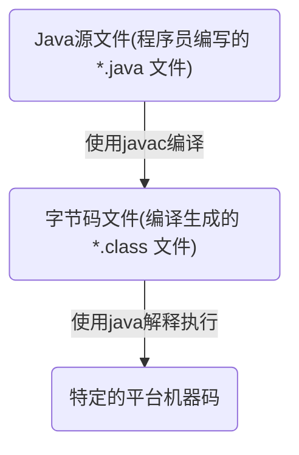
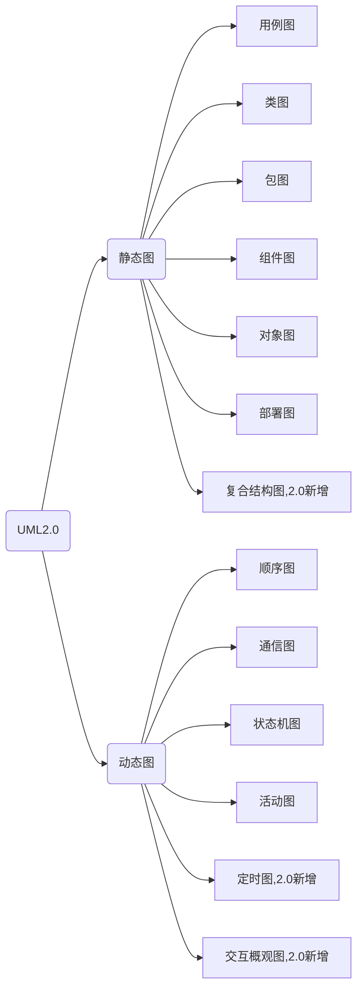
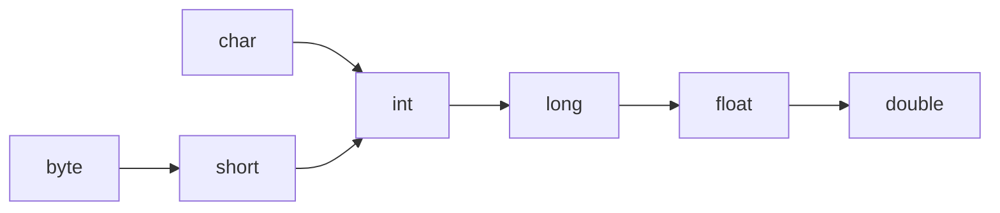
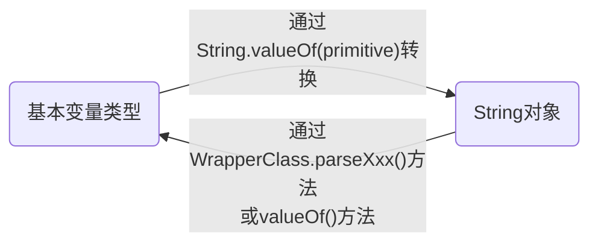

# Java

使用Java有段时间了，当初工作需要开始接触，摸着石头过河，绝大部分对Java的理解源自平时搬砖，说实话目前我所看到的Java并不符合我的审美，甚至某些Java项目（工作中涉及业务的Java项目，我不觉得自己有资格评价Java及被广泛使用的Java开源项目）的架构与我的技术观出入极大。即日起，我准备系统性地学习Java，很期待对Java理解渐渐深入的我回头看今日我的肤浅及粗糙。
2019/6/12


## Java语言概述与开发环境

### Java 程序运行机制

#### 编译型语言 vs 解释型语言

Java 是一种特殊的高级语言，Java 程序要经过先编译，后解释两个步骤，所以 Java 同时具有编译型语言和解释型语言的特性。

* 编译型语言（一次性”翻译“）
  * 使用专门的编译器，针对特定平台（操作系统）将某种高级语言代码一次性“翻译”成可被该平台硬件执行的机器码（包括机器指令和操作数），并包装成该平台所能识别的可执行性程序的格式，这个转换过程称为编译（Compile）。编译生成的可执行性程序可以脱离开发环境，在特定平台上独立运行。
  * 机器码可脱离开发环境独立运行，运行效率较高，无法移植到其他平台使用。
  * 典型编译型语言：C、C++、Object-C、Swift、Kotlin。
* 解释型语言（逐行”翻译“）
  * 使用专门的解释器对源程序逐行解释成特定平台的机器码并立即执行的语言。解释型语言通常不会进行整体性的编译和链接处理，解释型语言相当于把编译型语言中的编译和解释过程混合到一起同时完成。
  * 可以认为：每次执行解释型语言的程序都需要进行一次编译，因此解释型语言的程序运行效率通常较低，而且不能脱离解释器独立运行。但跨平台比较容易，只需特定平台的解释器即可。
  * 典型解释型语言：JavaScript、Python、Ruby。
* 伪编译型语言（半编译型语言）
  * 首先编译成特定的半机器码（介于语言和机器码中间的代码），并将解释引擎封装在可执行性程序内，当运行程序时，半机器码会被解析成真正的机器码。
  * 伪编译型语言看起来可以脱离开发环境，在特定平台上运行，实际上跟编译型语言还是有很大差别的。
  * 典型的伪编译语言：Visual Basic，他的半机器码：P-代码。

#### Java 程序的运行机制和 JVM

Java 语言比较特殊，由 Java 语言编写的程序需要经过编译步骤，但这个编译步骤并不会生成特定平台的机器码，而是生成一种与平台无关的字节码（也就是 *.class 文件）。当然，这种字节码不是可执行的，必须使用 Java 解释器来解释执行



Java 语言里负责执行字节码文件的是 Java 虚拟机，即 JVM（Java Virtual Machine）。JVM 是可运行 Java 字节码文件的虚拟计算机。所有平台上的 JVM 向编译器提供相同的编程接口，而编译器只需要面向虚拟机，生成虚拟机能理解的代码，然后由虚拟机来解释执行。在一些虚拟机的实现中，还会将虚拟机代码转换成特定系统的机器码执行，从而提高执行效率。

当使用 Java 编译器编译 Java 程序时，生成的是与平台无关的字节码，这些字节码不面向任何具体的平台，只面向 JVM。不同平台的 JVM 都是不同的，但他们提供了相同的接口。JVM 是 Java 程序跨平台的关键部分，只要为不同平台实现了相应的虚拟机，编译后的 Java 字节码就可以在该平台上运行。显然，相同的字节码程序需要在不同的平台上运行，这几乎是”不可能的“，只有通过中间的转换器才可以实现，JVM 就是这个转换器。

JVM 是一个抽象的计算机，和实际的计算机一样，它具有指令集并使用不同的存储区域。它负责执行指令，还要管理数据、内存和寄存器。

Oracle 公司制定的 Java 虚拟机规范在技术上规定了 JVM 的统一标准，具体定义了 JVM 的如下细节：

* 指令集
* 寄存器
* 类文件的格式
* 栈
* 垃圾回收堆
* 存储区

### Java 准备

安装并配置 JDK

#### JDK vs JRE

* JDK（Java SE Development Kit），即 Java 标准版开发包，提供了编译、运行 Java 所需要的各种工具和资源，包括 Java 编译器、Java 运行环境、及常用的 Java 类库等。
* JRE（Java Running Envirenment），即 Java 运行环境，包括 JVM（运行 Java 程序的核心虚拟机）、类加载器、字节码校验器以及大量的基础类库。

#### Java SE vs Java EE vs Java Me

* Java SE（Java Platform，Standard Edition）标准版本，桌面应用开发。
  Java EE（Java Platform，Enterprise Edition）企业版本，Web 程序开发。
  Java ME（Java Platform，Micro Edition）微型版本，手机应用开发。

#### 安装目录结构

* bin：JDK 的各种工具命令，例如 javac、java，一般安装成功后在PATH中加入该路径
* conf：JDK 的相关配置文件
* include：平台特定的头文件
* jmods：JDK 的各种模块
* legal：JDK 各种模块的授权文档
* lib：JDK 工具的一些补充 JAR 包
* README 和 COPYRIGHT 文档说明

###第一个 Java 程序

1. 编辑 Java 源代码

2. 编译 Java 程序

   ```shell
   javac -d destdir srcFile
   # -d destdir 是javac命令的选项，用以指定编译生成的字节码文件存放的路径
   # srcFile 是 Java 源文件所在的位置
   # 例如：
   javac -d HelloWorld.java
   ```

3. 运行 Java 程序

   ```shell
   java Java类名
   # 例如：
   java HelloWorld
   ```

### Java 程序的基本规则

#### 组织形式

Java 程序是一种纯粹的面向对象的程序设计语言，必须以类（Class）的形式存在，类是 Java 程序的最小程序单位。Java 程序不允许可执行性语句、方法等成分独立存在，所有的程序部分必须放在类里。

```java
public class HelloWorld{
	public static void main(String[] args){
    System.out.println("Hello World!");
  }
}
```

一个 Java 程序往往只需要一个入口，也就只有一个类包含 main 方法，而其他类都是被 main 方法直接或间接调用的。

#### 命名规则

* Java 文件的扩展名必须是 .java。
* 如果 Java 程序源代码里定义了一个 public 类，则该源文件的主文件名必须与该 public 类的类名相同，如果没定义 public 类，则主文件名可以任意，但推荐与类名相同。
* 一个 Java 源文件只能定义一个类，不同的类使用不同的源文件定义。

### 垃圾回收机制

Java 程序的内存分配和回收都是由 JRE 在后台自动进行的（隐式的），所有的 JVM 实现都有一个由垃圾回收器管理的堆内存，这种实现方式有以下优点：

* 提高编程效率
* 保护程序的完整性

垃圾回收特点：

* 垃圾回收器只回收内存资源，对其他物力资源，如数据库连接、磁盘I/O等资源则无能为力。
* 为了让垃圾回收器更快回收那些不再被使用的对象，可以将对象的引用变量设置为 null。
* 垃圾回收发生不可预知，不同 JVM 采用不同的垃圾回收机制和垃圾回收算法，可以调用对象的 gc() 或  System.gc() 等方法建议系统进行垃圾回收，但仅仅是建议，依旧不能精准控制垃圾回收机制的执行。
* 垃圾回收的精确性主要包括两个方面：
  * 能够精确地标记活着的对象
  * 能够精确地定位对象之间的引用关系
* 现在的 JVM 有多种不同的垃圾回收实现


## 理解面向对象

### 面向对象

目前软件开发领域有两种主流的开发方法：结构化开发方法和面向对象开发方法。

#### 结构化程序设计

结构化程序设计方法主张按功能来分析系统需求，其主要原则可概括为自订向下、逐步求精、模块化等，也称面向功能的程序设计、面向数据流的处理方式。

结构化程序设计里最小的程序单元是函数，程序入口为主函数，主函数调用普通函数、普通函数间相互调用，完成整个软件系统的功能。

#### 程序的三种基本结构

* 顺序
* 选择
* 循环
  * 当型循环
  * 直到型循环

#### 面向对象程序设计

面向对象的基本思想是使用类、对象、继承、封装、消息等基本概念进行程序设计。强调以现实世界中的的事物（即对象）为中心思考，并根据这些事物的本质特点，把它们抽象地表示为系统中的类。

成员变量（状态数据）+ 方法（行为）= 类定义

#### 面向对象的基本特征

面向对象三个基本特征：

* 封装（Encapsulation）
  * 将对象的实现细节隐藏起来，然后通过一些公用方法来暴露该对象的功能。
* 继承（Inheritance）
  * 子类继承父类后，子类作为一种特殊的父类，将直接获得父类的属性和方法。
* 多态（Polymorphism）
  * 子类对象可以直接赋给父类变量，但运行时依然表现出字类的行为特征，这意味着同一个类型的对象在执行统一方法时，可能表现出多种行为特征。
* 抽象（面向对象的重要部分，非特征，因为所有语言都需要抽象）
  * 忽略一个主题中与当前目标无关的那些方面。

面向对象还支持如下几个功能：

* 对象是面向对象方法中最基本的概念，他的基本特点有：标识唯一性、分类性、多态性、封装性、模块独立性等。
* 类是具有共同属性、共同方法的一类事物。类是对象的抽象；对象则是类的实例。
* 对象间相互合作需要一个机制协助进行，这个机制称为“消息”。消息是一个实例与另一个实例之间相互通信的机制。
* 面向对象方法中国呢，类之间共享属性和操作的机制称为继承。继承具有传递性，继承可分为单继承和多继承，由于多继承可能引起继承结构混乱，降低程序的可理解性，所以 Java 不支持多继承。

判断一门语言是否是面向对象的，通常可以用继承和多态特性。

### UML（统一建模语言）

面向对象的方式由 OOA（面向对象分析）、OOD（面向对象设计）、OOP（面向对象编程）三部分有机组成，OOA 和 OOD 的结构需要一种方式来描述并记录，目前业界统一采用 UML（统一建模语言）。

UML 是一种定义良好、易于表达、功能强大且普遍适用的建模语言，它的作用域不限于支持面向对象的分析与设计，还支持从需求分析开始的软件开发全过程。



### Java 的面向对象特征

Java 是纯粹的面向对象编程语言

#### 一切都是对象

在 Java 语言中，除8个基本数据类型值之外，一切都是对象。对象不仅能表示具体的事物，也能表示抽象的规则、计划或事件。

* 对象具有状态，Java 通过定义成员变量来描述对象的状态。
* 对象还有操作，这些操作可以改变对象的状态，操作也被称为行为，Java 通过定义方法来描述对象的行为。
* 对象实现了数据和操作的结合。
* 对象是 Java 程序的核心，所以 Java 里的对象具有唯一性，每个对象都有一个标识来引用它，某个对象失去了标识，这个对象将变成垃圾，只能等垃圾回收机制来回收它。
* Java 语言不允许直接访问对象，而是通过对对象的引用来操作对象。

#### 类和对象

具有相同或相似性质的一组对象的抽象就是类，类是对一类事物的描述，是抽象的、概念上的定义；对象是实际存在的该类事物的个体，因而也称为实例（instance）。

对象的抽象化是类，类的具象化是对象。

Java 语言使用 class 关键字定义类，定义类时可使用成员变量来描述该类对象的数据，可使用方法来描述该类对象的行为特征。

* 一般 → 特殊关系：典型继承关系。
* 整体 → 部分结构关系：组装结构，典型组合关系。


## 数据类型和运算符

Java 提供了丰富的基本数据类型

* 数值类型
  * 整型
  * 字符型
  * 浮点型
  * 所有数值类型之间可以进行类型转换
* 布尔类型

Java 提供了功能丰富的运算符

* 算数运算符
* 位运算符
* 比较运算符
* 逻辑运算符
* 运算符和操作数连接在一起就形成了表达式

### 注释

#### 添加注释的必要性

* 永远不要相信自己的理解力！
* 可读性第一，效率第二！
* 代码即文档！

#### 单行注释

在程序中注释一行代码，将 “//” 放在需要注释的内容前。

#### 多行注释

一次性地将多行代码注释掉，使用 “/\*” 和 “\*/“ 将程序中需要注释的内容包含起来。

#### 文档注释

如果编写 Java 源代码时添加了合适的文档注释，然后通过 JDK 提供的 javadoc 工具可以直接将源代码里的文旦注释提取成一份系统的 API 文档。

文档注释以 “/\*\*” 开，以 “\*/“ 结束，中间部分全部是文档注释，会被提取到 API 文档中。

常见的 javadoc 标记：

* @author：指定 Java 程序的作者
* @version：指定源文件的版本
* @deprecated：不推荐使用的方法
* @param：方法的参数说明
* @return：方法的返回参数说明
* @see：“参见”，用于指定交叉参考的被容
* @exception：抛出异常的类型
* @throws：抛出的异常，和 @exception 同义

### 标识符和关键字

#### 分隔符

Java 语言里的分号、花括号、方括号、圆括号、空格、句号 都具有特殊的分隔作用，统称为分隔符。

#### 标识符规则

* 可以由字母、数字、下划线和美元符组成，其中数字不能打头。
* 不能是 Java 关键字和保留字
* 不能包含空格
* 不能是单独的数字或下划线或美元符

#### Java 关键字

Java 一共包含50个关键字

| abstract | continue | for        | new       | switch       |
| -------- | -------- | ---------- | --------- | ------------ |
| assert   | default  | if         | package   | synchronized |
| boolean  | do       | goto       | private   | this         |
| break    | double   | implements | protected | throw        |
| byte     | else     | import     | public    | throws       |
| case     | enum     | instanceof | return    | transient    |
| catch    | extends  | int        | short     | try          |
| char     | final    | interface  | static    | void         |
| class    | finally  | long       | strictfp  | volatile     |
| const    | float    | native     | super     | while        |

### 数据类型分类

#### Java 是一门强类型（strongly typed）语言

- 所有变量必须先声明、后使用。
- 指定类型的变量只能接受类型与之匹配的值。

#### 声明变量

```java
type varName[= 初始值];
```

#### 数据类型分类

* 基本类型（Primitive Type）
  * 数字类型
  * 布尔类型
* 引用类型（Reference Type）
  * 类
  * 接口
  * 数组
  * null

空引用（null）只能被转换成引用类型，不能被转换成基本类型，因此不要把 null 赋给基本数据类型的变量。

### 基本数据类型

#### 整数类型

* byte
  * 1个字节（内存里占8位）
  * -2<sup>7 </sup> ~ 2<sup>7</sup>-1
* short
  * 2个字节
  * -2<sup>15</sup>  ~ 2<sup>15</sup>-1
* int
  * 4个字节
  * -2<sup>31</sup>  ~ 2<sup>31</sup>-1
* long：8个字节
  * -2<sup>63</sup>  ~ 2<sup>63</sup>-1
* 如果直接将一个较小的整数（在 byte 或 short 范围内）赋给一个 byte 或 short 变量，系统会自动把这个整数值当成 byte 或 short 类型来处理。
* 如果使用一个巨大的整数（超出了 int 范围）时，Java 不会自动把这个整数值当成 long 类型来处理。如果希望系统把一个整数型当成 long 类型来处理，应该在这个整数值后增加 l 或者 L 作为后缀，推荐使用 L，避免混淆。
* Java 中整数值有4种表示形式：十进制、二进制、八进制、十六进制。二进制以 0b 或 0B 开头；八进制以 0 开头；十六进制以 0x 或 0X 开头。

#### 字符类型

* char
  * 2个字节
  * 必须使用单引号括起来。
  * 字符型值有三种表达形式：
    * 单个字符
    * 转义字符
    * Unicode 值
* Java 没有提供表示字符串的基本数据类型，而是通过 String 类来表示字符串，由于字符串由多个字符组成，因此字符串要使用双引号括起来。

#### 浮点类型

* float：
  * 4个字节
  * 第1位是符号位，接下来8位表示指数，再接下来23位表示尾数。
* double
  * 8个字节
  * 第1位是符号位，接下来11位表示指数，再接下来52位表示尾数。
* 因为 Java 浮点数使用二进制数据的科学计算法表示浮点数，因此可能不能精确表示一个浮点数，使用 double 比 float 更准确，如要求精准，可以考虑 BigDecimal 类。
* Java 语言的浮点数有两种表达形式：
  * 十进制数形式
  * 科学计数法形式，例如：5.12e2（即 5.12*10<sup>2</sup>）
* 浮点数默认是 double 类型，如希望 float 类型，可在该浮点数后紧跟 f 或 F。
* Java 还提供三个特殊的浮点数：正无穷大（POSITIVE_INFINITY）、符无穷大（NEGATIVE_INFINITY）、非数（NaN）。

#### 布尔类型

* boolean
  * true
  * false

### 基本类型的类型转换

Java 语言所提供的7种数值类型之间可以相互转换，有两种转换方式：自动类型转换和强制类型转换。

#### 自动类型转换

* 系统支持把某种基本类型的值直接赋给另一种基本类型的变量，这种方式被称为自动类型转换。
* 当把一个表数范围小的数值或变量直接赋给另一个表数范围大的变量时，系统将可以进行自动类型转换；否则需要强制类型转换。



* 注意：是数的范围，并非占的空间。
* 当任何基本类型的值和字符串值进行连接运算时，基本类型的值将自动类型转换为字符串类型。

#### 强制类型转换

* 强制类型转换的语法格式：(targetType)value 。
* 当试图强制把表数范围大的类型转换为表数范围小的类型时，必须格外小心信息丢失。
* Java 为8种基本类型都提供了对应的包装类：boolean 对应 Boolean、byte 对应 Byte、short 对应 Short、int 对应 Integer、long 对应 Long、char 对应 Character、float 对应 Float、double 对应 Double。8个类都提供了一个 parseXxx(String str) 静态方法用于将字符串转换成基本类型。

#### 表达式类型的自动提升

* 所有的 byte 类型、short 类型和 char 类型将被提升到 int 类型。
* 整个算数表达式的数据类型自动提升到表达式中最高等级操作数相同的类型。

### 直接量

#### 直接量的类型

* 能指定直接量的通常只有三种类型：基本类型、字符串、null 类型。

#### 直接量的赋值

* 把一个直接量赋值给对应类型的变量是合法的。
* 在系统支持自动类型转换的前提下，允许把一个数值直接量直接赋值给另一种类型的变量。
* null 类型的直接量可以直接赋值给任何引用类型的变量。

### 运算符

#### 算数运算符

\+  -  *  /  %  ++  --

#### 位运算符

* &：按位与
* |：按位或
* ~：按位非
* ^：按位异或
* <<：左移
* \>\> ：右移
* \>\>\>：无符号右移

#### 扩展后的赋值运算符

+=  -=  *=  /= %=  &=  |=  ^=  <<=  >>=  >>>=

#### 比较运算符

\>  >=  <  <=  ==  !=

#### 逻辑运算符

* &&：与
* &：不短路与
* ||：或
* |：不短路或
* !：非
* ^：异或

#### 三目运算符

三目运算符的语法格式如下：

```java
(expression) ? if-true-statement : if-false-statement
```

#### 运算符的结合性和优先级

* 单目运算符、赋值运算符、三目运算符是从右向左结合的（从右向左运算），其他的都是从左向右结合的。
* 运算符优先级（上面优先）：

| 运算符说明         | Java 运算符                                    |
| ------------------ | ---------------------------------------------- |
| 分隔符             | .  ()  []  {}  ,  ;                            |
| 单目运算符         | ++  —  ~  !                                    |
| 强制类型转换运算符 | (type)                                         |
| 乘法/除法/求余     | *  /  %                                        |
| 加法/减法          | +  -                                           |
| 移位运算符         | <<  >>  >>>                                    |
| 关系运算符         | <  <=  >  >=  instanceof                       |
| 等价运算符         | ==  !=                                         |
| 按位与             | &                                              |
| 按位异或           | ^                                              |
| 按位或             | \|                                             |
| 条件与             | &&                                             |
| 条件或             | \|\|                                           |
| 三目运算符         | ?:                                             |
| 赋值               | =  +=  -=  *=  /=  &=  \|=  ^=  <<=  >>=  >>>= |

* 不要把一个表达式写得过于复杂，过于复杂就该分成几步来完成。
* 不要过多依赖运算符的优先级来控制执行顺序，可读性太差，尽量用 () 来控制。


## 流程控制与数组

### 顺序结构

从上到下依次执行。

### 分支结构

#### if 条件语句

```java
if (logic expression) {
	statement;
}

if (logic expression) {
	statement;
} else {
  statement;
}

if (logic expression) {
	statement;
} else if (logic expression) {
  statement;
}
```

* 如果执行体只有一行，可省略执行体的花括号，但不建议这样做。
* 使用 if…else 语句时，应先处理范围更小的情况。

#### switch 分支语句

```java
switch (expression){
	case condition1:
	{
		statement;
		break;
	}
	case condition2:
	{
		statement;
		break;
	}
	...
	case conditionN:
	{
		statement;
		break;
	}
	default:
	{
		statement;
	}
}
```

* switch 语句后面的控制表达式的数据类型只能是 byte、short、char、int 四种整数类型，String 和枚举类型。

### 循环结构

循环语句可能包含如下4个部分：

* 初始化语句（init_statement）
* 循环条件（test_expression）
* 循环体（body_statement）
* 迭代语句（interation_statement）

#### while 循环语句

```java
[init_statement]
while (test_expression) {
	statement;
	[iteration_statement]
}
```

#### do while 循环语句

```java
[init_statement]
do{
	statement;
	[interation_statement]
}while (test_expression)
```

#### for 循环语句

```java
for ([init_statement]; [test_expression]; [iteration_statement]) {
	statement;
}
```

#### 控制循环结构

* break ：结束循环。
* continue ：忽略本次循环剩下的语句。
* return ：结束方法。

### 数组类型

#### 理解数组

* Java 中，一个数组里只能存储同一种数据类型的数据。
* 一旦数组初始化完成，它在内存中所占的空间将被固定下来，因此数组的长度将不可改变。
* Java 数组即可存储基本类型的数据，也可以存储引用类型的数据。

#### 定义数组

```java
type[] arrayName;
type arrayName[];
```

* 推荐使用第一种定义方式。
* 定义数组时不能指定数组的长度。
* 定义数组只是定义了个引用变量，并未指向任何有效的内存空间，所以还不能使用，只有对数组进行初始化之后才能使用。

#### 初始化数组

* 静态初始化

  * 初始化时由程序员显示指定数组每个元素的初始值，由系统决定数组长度。

    ```java
    arrayName = new type[]{element1, element2...};
    ```

  * 在定义数组的同时执行初始化操作可简化成以下格式：

    ```java
    type[] arrayName = {element1, element2...};
    ```

* 动态初始化

  * 初始化时程序员只指定数组长度，由系统为数组元素分配初始值。

    ```java
    arrayName = new type[length];
    ```

  * 定义同时初始化：

    ```java
    type[] arrayName = new type[length];
    ```

    

  * 系统默认初始值

    * 整数类型（byte、short、int、long）：0
    * 浮点类型（float、double）：0.0
    * 字符类型（char）：'\u0000'
    * 布尔类型（boolean）：false
    * 引用类型（类、接口、数组等）：null

#### 使用数组

```java
objArr[idx];
```

#### foreach 循环

```
for (type variableName : array | collection) {
	variableName statement;
}
```

### 深入数组

数组是一种引用数据类型，数据引用变量只是一个引用，数组元素和数组变量在内存里是分开存放的。

#### 栈(stack)内存 vs 堆(heap)内存

* 实际的数组对象被存储在堆内存中，如果引用该数组对象的引用变量是一个局部变量，那么它被存储在栈内存中。
* 所有在方法中定义的局部变量都放在栈内存中，方法结束栈内存自然销毁。
* 在程序中创建对象时，对象被保存到栈内存，以便重复利用（因为对象创建成本较大），堆内存中的对象不会随方法结束而销毁，只有当没有任何引用变量引用该对象时，系统的垃圾回收器才会在合适的时候回收它。
* 为了让垃圾回收机制回收一个数组所占的内存空间，可以将该数组变量赋值为 null，也就切断了引用变量和实际数组间的引用关系，数组也就成了垃圾。

#### Java8 增强的工具类 Arrays

Arrays 类处于 java.util 包下，使用时必须导入 Java.util.Arrays 类。

Arrays 类包含如下几个 static 方法（static 修饰的方法可以直接通过类名调用）

* int binarySearch(type[] a, type key):
* int binarySearch(type[] a, int fromIndex, int toIndex, type key):
* type[] copyOf(type[] original, int length):
* type[] copyOfRange(type[] original, int from, int to):
* boolean equals(type[] a, type[] a2):
* void fill(type[], type val):
* void fill(type[] a, int fromIndex, int toIndex, type val):
* void sort(type[] a):
* void sort(type[] a, int fromIndex, int toIndex)
* String toString(type[] a):

Java8 为 Arrays 类增加的工具方法如下：

* void parallelPrefix(xxx[] a, XxxBinaryOperator op):
* void parallelPrefix(xxx[] a, int fromIndex, int toIndex, XxxBinaryOperator op):
* void setAll(xxx[] a, IntToXxxFunction generator):
* void parallelSetAll(xxx[] a, IntToXxxFunction generator):
* void parallelSort(xxx[] a):
* void parallelSort(xxx[] a, int fromIndex, int toIndex):
* Spliterator.OfXxx spliterator(xxx[] a):
* Spliterator.OfXxx spliterator(xxx[] a, int startInclusive, int endExclusive):
* XxxStream stream(xxx[] a):
* XxxStream stream(xxx[] a, int startInclusive, int endExclusive):


## 面向对象（上）

Java 是面向对象的程序设计语言，提供了定义类、成员变量、方法等最基本的功能。类可被认为是一种自定义的数据类型，可以使用类来定义变量，所有类定义的变量都是引用变量，它们将会引用到类的对象。Java 程序使用类的构造器来创建该类的对象。

Java 支持面向对象的三大特性：封装、继承、多态。

* Java 提供来 private、protected、public 三个访问控制修饰符来实现良好的封装。
* 提供了 extends 关键字来让子类继承父类，子类可以继承到父类的成员变量和方法。
* 使用继承关系来实现复用时，子类对象可以直接赋值给父类变量，这个变量具有多态性。

构造器用于对类实例进行初始化操作，构造器支持重载，如果多个重载的构造器包含了相同的初始化diamanté，则可以把这些初始化代码放置在普通初始化块里完成，初始化块总在构造器执行之前被调用。Java 还提供了一种静态初始化块，用于初始化类，在类初始化阶段被执行。如果继承树里的某一个类需要被初始化，系统将会同时初始化该类的所有父类。

### 类和对象

#### 定义类

##### Java 语言里定义类的简单语法如下：

```java
[修饰符] class 类名
{
	零到多个构造器定义...
	零到多个成员变量...
	零到多个方法...
}
```

对定义类的语法格式的详细说明如下：

* 修饰符可以是 public、final、abstract，或者完全省略这三个修饰符。
* 类名是合法标识符即可，但一般是由一个或多个有意义的单词连缀而成的，单词首字母大写，其余字母小写。
* 类里各成员之间的定义顺序没有任何影响，各成员之间可以相互调用，但 static 修饰的成员不能访问没有 static 修饰的成员。
* 成员变量用于定义该类或该类的实例所包含的状态数据。
* 方法则用于定义该类或该类的实例的行为特征或功能实现。
* 构造器用于构建该类的实例，Java 语言通过 new 关键字来调用构造器，从而返回该类的实例。
* 构造器是一个类创建对象的根本途径，Java 语言提供一个功能：如果程序员没有为一个类编写构造器，系统会为该类提供一个默认的构造器。

##### 定义成员变量的语法如下：

```java
[修饰符] 类型 成员变量名 [= 默认值];
```

对定义成员变量的语法格式的详细说明如下：

* 修饰符：修饰符可以省略，也可以是 public、protected、private、static、final，其中 public、protected、private 三个最多只能出现其中之一，可以与 static、final 组合起来修饰成员变量。
* 类型：可以是任何类型，包括基本类型和引用类型。
* 成员变量名：合法标识符即可，一般是驼峰式的单词（组合）
* 默认值：定义成员变量可指定一个可选的默认值。
* 成员变量由 field 意译而来，早期有些书籍称之为属性，但实际上在 Java 世界里属性（由 property 意译）是指一组 setter 和 getter 方法。

##### 定义方法的语句格式如下：

```java
[修饰符] 方法返回值类型 方法名[形参列表]
{
	// 零到多条可执行性语句组成的方法体
}
```

对定义方法的语法格式的详细说明如下：

* 修饰符：可省略，也可以是 public、protected、privite、static、final、abstrict，其中 public、protected、privite 最多出现一个；final、abstrict 最多出现一个；可以与 static 组合起来修饰方法。
* 方法返回值类型：任何类型，如果声明了返回值类型，则方法体内必需有一个有效的 return 语句，返回的类型必须与此处声明的类型匹配。如果没有返回值，则必须使用 void 来声明没有返回值。
* 方法名：与成员变量命名规则相同。
* 行参列表：用于定义该方法可接受的参数，由零到多组”参数类型 参数名“组成，多组参数间用英文逗号隔开，一旦定义方法时指定了行参列表，则调用该方法时必须传入对性的参数值。
* static 可用于修饰方法、成员变量等成员，表明所修饰的成员属于这个类本身，而不属于该类的单个实例，通常称为类变量、类方法，也称为静态变量、静态方法。

##### 构造器是一个特殊的方法，定义语法格式如下：

```java
[修饰符] 构造器名(行参列表)
{
	// 零到多条可执行性语句组成的构造器执行体
}
```

对定义构造器的语法格式的详细说明如下：

* 修饰符：可省略，也可是 public、protected、private 之一。
* 构造器名：必须和类名相同。
* 行参列表：与定义方法的行参列表格式相同。

##### Java 中类的大致作用

* 定义变量
* 创建对象
* 调用类方法或者访问类变量

#### 对象的产生和作用

创建对象的根本途径是构造器，通过 new 关键字来调用某个类的构造器即可创建这个类的实例。

```java
// 定义 Person 类型的变量
Person p;
// 通过 new 调用 Person 类的构造器，返回一个 Person 实例，赋给 p
p = new Person();

// 简写
Person p = new Person();
```

##### Java 中对象的大致作用

* 访问对象的实例变量
* 调用对象的方法

static 修饰的方法和成员变量，既可通过类来调用，也可通过实例来调用；没使用 static 修饰的普通方法和成员变量，只能通过实例来调用。

#### 对象、引用和指针

与数组相似，类也是一种引用数据类型。因此程序中定义的 Person 类型的变量实际上是一个引用，它被存放在栈内存里，指向实际的 Person 队形，真正的 Person 对象则存放在堆内存中。

当程序访问引用变量的成员变量或方法时，实际上是访问该引用变量所引用的数组、对象的成员变量或方法。

#### 对象的 this 引用

Java 提供了一个 this 关键字，this 关键字总是指向调用该方法的对象。根据 this 出现位置的不同，this 作为对象的默认引用有两种情形

* 构造器中引用构造器正在初始化的对象。
* 在方法中引用调用该方法的对象。

this 关键字的最大作用就是让类中的一个方法访问该类里的另一个方法或实例变量。

当 this 出现在某个方法体中时，它所代表的对象是不确定的，但他的类型是确定的，只能代表当前类的实例。谁调用这个方法，this 就代表谁。

大部分时候，一个方法访问该类中定义的其他方法、成员变量时加不加 this 前缀效果是完全一致的。

对于 static 修饰的方法而言，可以使用类来直接调用该方法，如果在 static 修饰的方法中使用的关键字，则这个关键字就无法指向合适的对象。所以 static 修饰的方法中不能使用 this 引用，所以 static 修饰的方法不能访问不使用 static 修饰的普通成员，因此 Java 语法规定：静态成员不能直接访问非静态成员。

Java 语法允许对象调用 static 修饰的成员变量、方法，但实际编程时应尽量避免。

如果某个方法把 this 作为返回值，则可以连续多次调用同一个方法从而使代码更加简洁，但可能造成实际意义的模糊。

### 方法详解

方法是类或对象的行为特征的抽象，是类和对象最重要的组成部分。

#### 方法 vs 函数

* 方法是由传统的函数发展而来的，定义语法和功能都很相似。
* 结构化编程语言中，系统是由函数组成，面向对象编程语言中系统是由类组成。因此，Java 里方法不能单独存在，必须属于类或对象。

#### 方法的所属性

* 方法不能独立定义，只能在类体里定义。
* 从逻辑上看，方法要么属于该类本身，要么属于该类的一个对象。
* 不能独立执行方法，执行方法必须使用类或对象作为调用者。
* 使用 static 修饰的方法属于类本身，类和对象都可以为调用者，但任何对象调用这个方法都会得到相同的执行结果。
* 没有 static 修饰的方法属于该类的对象，只能通过对象调用，不同对象调用可能得到不同结果。

#### 方法的参数传递机制

如果声明方法时包含了形参声明， 则调用方法时必须给这些行参指定参数值，调用方法时实际传给行参的参数值也被称为实参。

Java 里方法的参数传递方式只有一个：值传递。所谓值传递就是将实际参数值的副本（复制品）传入方法内，参数本身不会受到任何影响。

传引用变量时，传的是栈内存中引用变量（指针）的复制品，而两引用变量指向统一堆内存。

#### 参数个数可变的方法

定义方法时，在最后一个行参的类型后面加上三点(…)，则表明该行参可以接受多个参数值。多参数值传入后，方法内部当作数组处理。

```java
public void test1(int a, String... b);
public void test2(int a, String[] b);
// 两方法内部实现可以完全相同，但调用时存在差别。
test1(1, "a", "b");
test2(2, new String[]{"a", "b"});
// 对比两种调用代码，可见第一种形式更简洁。
```

#### 递归方法

一个方法体内调用它的自身，被称为方法递归。方法递归包含了一种隐式的循环，他会重复执行某段代码。

递归一定要向已知方向进行。

#### 方法重载

Java 允许同一个类里面定义多个同名方法，只要行参列表不同就行。称之为方法重载。

Java 中确定一个方法需要三个要素：

1. 调用者，也就是方法的所属者。
2. 方法名，方法的标识。
3. 行参列表，调用方法时，系统将会根据传入的实参列表匹配。

方法重载要求（两同一不同）：

* 同一类中方法名相同
* 行参列表不同

如果由于可变参数导致方法重载，系统会匹配只传一个参数的方法（类似于最小匹配原则）。一般情况下不推荐重载行参个数可变的方法。

### 成员变量和局部变量

#### 定义

成员变量指的是类里定义的变量，局部变量指的是方法里定义的变量

* 成员变量
  * 类变量（以 static 修饰），与类共存，类准备阶段起到类销毁止有效，无须显示初始化。
  * 实例变量（不以 static 修饰），与实例共存，实例被创建起到完全销毁止有效，无须显示初始化。
* 局部变量
  * 行参（方法签名中定义的变量），整个方法有效，无须显示初始化。
  * 方法局部变量（方法内定义的变量），从定义开始到方法结束截止有效，必须显示初始化。
  * 代码块局部变量（代码块内定义的变量），定义开始到代码块结束截止有效，必须显示初始化。

Java 允许局部变量和成员变量同名，局部变量会覆盖成员变量，成员变量可使用 this（对于实例变量）或类名（对于类变量）作为调用者来限定访问成员变量。

#### 成员变量的初始化和内存中的运行机制

当系统加载类或创建该类的实例时，系统自动为成员变量分配内存空间，并在分配内存空间后，自动为成员变量指定初始值。

#### 局部变量的初始化和内存中的运行机制

定义局部变量后，系统并没有为这个变量分配内存空间，直到程序为这个变量赋初始值，系统才会为局部变量分配内存，并将初始值保存到这块内存中。

局部变量总是保存在其所在方法的栈内存中。

#### 变量的使用规则

遵循物理规则的基础上，使用尽可能“小”的变量。

变量范围扩大的害处：

* 增大变量生存时间，导致更大的内存开销。
* 扩大变量作用域，不利于提高程序的内聚性。

应该考虑成员变量的情形：

* 用于描述某个类或某个对象的固有信息。
* 某个类中需要以一个变量保存该类或者实例运行时的状态信息。
* 某个信息需要在某个类的多个方法之间进行共享。

### 隐藏和封装

#### 理解封装

封装（Encapsulation）是面向对象的三大特性之一，指的是将对象的状态信息隐藏在对象内部，不允许外部程序直接访问对象内部信息，而是通过该类所提供的方法来实现对内部信息的操作和访问。

对类或对象实现良好的封装可实现一下目的：

* 隐藏类的实现细节。
* 让使用者只能通过事先预定的方法来访问数据，限制对成员变量的不合理访问。
* 可进行数据检查，有利于保证对象信息的完整性。
* 便于修改，提高代码的可维护性。

为了实现良好的封装，需要从两方面考虑：

* 将对象的成员变量和实现细节隐藏起来，不允许外部直接访问。
* 把方法暴露出来，让方法来控制这些成员变量，进行安全的访问和操作。

#### 使用访问控制符

Java 提供了三个访问控制符：private、protected、public，也可以不加访问控制符，所以提供了4个访问控制级别，从小到大分别是 private、default、protected、public。

* private（当前类访问权限）：适合用于修饰成员变量，可以把成员变量隐藏在该类内部。

* dafault（包访问权限）：可被相同包下的其他类访问。

* protected（子类访问权限）：即可被同一包中其他类访问，也可以被不同包中的子类访问，使用 protected 通常是希望子类重写这个方法。

* public（公共访问权限）

  访问控制级别表：

  |            | private | default | protected | public |
  | :--------: | :-----: | :-----: | :-------: | :----: |
  | 同一个类中 |    √    |    √    |     √     |   √    |
  | 同一个包中 |         |    √    |     √     |   √    |
  |   子类中   |         |         |     √     |   √    |
  | 全局范围内 |         |         |           |   √    |

如果 Java 源文件中没有 public 修饰的类，则这个 Java 源文件的文件名可以是一切合法的文件名，如果 Java 源文件中定义了一个 public 修饰的类，则这个源文件的文件名必须与 public 修饰的类的类名相同。

如果一个 Java 类的每个实例变量都被使用 private 修饰，并为每个实例变量都提供了 public 修饰符的 setter 和 getter 方法，那么这个类就是一个符合 JavaBean 规范的类（封装良好的类）。

访问控制符使用的基本规则：

* 类里的绝大部分成员变量都应该使用 private 修饰，只有一些 static 修饰的、类似全局变量的成员变量才可以考虑使用 public 修饰。
* 如果某个类主要用做其他类的父类，该类里包含的大部分方法可能仅希望被其子类重写，而不被外界直接调用，则应该使用 protected 修饰这些方法。
* 希望暴露出来给其他类自由调用的方法应该使用 public 修饰符。

#### package、import、import static

##### package

Java 引入包（package）机制，提供了类的多层命名空间，用于解决类的命名冲突、类文件管理等问题。

Java 允许将一组功能相关的类放在同一个 package 下，从而组成逻辑上的类库单元。如果希望把一个类放在指定的包结构下，应该在 Java 源程序的第一个非注释行放置如下格式的代码：

```java
package packageName;
```

一旦在 Java 源文件中使用了这个 package 语句，就意味着该源文件里定义的所有类都属于这个包。位于包中的每个类的完整类名都应该是包名和类名的组合。

Java 规定：位于包中的类，在文件系统中也必须有与包名层次相同的目录结构。

JVM 在装载带有包名的类时，会先搜索 CLASSPATH 下的子路径，然后在这些目录中按与包层次对应的目录结构去查找 class 文件。同一个包中的类不必位于相同的目录下，只要让 CLASSPATH 包含这些个路径即可。虽然如此，也应该把 Java 源文件放在一个目录下。

Oracle 建议使用公司 Internet 域名倒些来作为包名。

父包和子包之间确实表示了某种内在的逻辑关系，但用法上则不存在任何关系，如果父包的类需要使用子包的类，则必须使用子包的全名。

##### import

如果需要使用不同包中的其他类时，总是需要使用该类的全名，这是一件很繁琐的事情，为了简化编程，Java 引入 import 关键字，import 可以向某个 Java 文件中导入指定包层次下某个类或全部类，import 语句应该出现在 package 语句（如果有）之后、类定义之前，import 用法如下：

```java
// 导入单个类
import package.subpackage...ClassName;
// 导入指定包下的全部类
import package.subpackage...*;
// * 只能代表类，不能代表包
```

Java 默认为所有源文件导入 java.lang 包下的所有类。

JDK 1.5 以后增加了静态导入的语法，用于导入指定类的某个（或全部）静态成员变量、方法，语法如下：

```java
// 导入单个静态成员变量、方法
import static package.subpackage...ClassName.fieldName|methodName;
// 导入指定包下的全部静态成员变量、方法
import static package.subpackage...ClassName.*;
```

使用 import 可以省略写包名，而使用 import static 则可以连类名都省略。

现在可以总结出 Java 源文件的大体结构如下：

```java
// 0或1个，必须放在文件开始
package 语句
// 0或多个，必须放在类定义之前
import | import static 语句
// 0或1个publilc类、接口或枚举定义
public classDefinition | interfaceDefinition | enumDefinition
// 0或多个普通类、接口或枚举定义
classDefinition | interfaceDefinition | enumDefinition
```

#### Java 的常用包

* java.lang：Java 语言的核心类，如 String、Math、System、Thread 等，系统自动导入，无需 import。
* java.util：大量工具类/接口和集合框架类/接口，例如 Arrays、List、Set 等。
* java.net：网络编程相关类/接口。
* java.io：输入输入相关类/接口。
* java.text：格式化相关类。
* java.sql：JDBC 数据库编程相关类/接口。
* java.awt：抽象窗口工具集（Abstract Window Toolkits）相关类/接口，主要用于构建图形用户界面（GUI）程序。
* java.swing：Swing 图形用户界面编程的相关类/接口，可用来构建平台无关的 GUI 程序。

### 深入构造器

构造器是一个特殊的方法，用于创建实例时执行初始化。是创建对象的重要途径（即便使用工厂模式、反射等方式创建对象，其实质依然是依赖于构造器），因此 Java 类必须至少包含一个构造器。

构造器名必须与类名相同包。

如果程序员没有为 Java 类提供任何构造器，则系统会为这个类提供一个无参数的、执行体为空的构造器。一旦程序员提供了自定义的构造器，系统就不再提供默认的构造器了。

如果希望有多个初始化过程，可以重载多个构造器。因为构造器主要用于被其他方法调用以返回该类的实例，所以一般使用 public 修饰符。

使用 this 调用另一个重载的构造器只能在构造器中使用，而且必须作为构造器执行体的第一条语句。

### 类的继承

继承是面向对象的三大特征之一，也是实现软件复用的重要手段。Java 的继承具有单继承的特点，每个子类只有一个直接父类。

#### 继承的特点

Java 的继承通过 extends 关键字来实现，实现继承的类被称为子类，被继承的类被称为父类（基类、超类）。

父类和子类是中一般和特殊的关系，子类是种特殊的父类，父类的范围总比子类要大。

Java 子类继承父类的语法如下：

```java
修饰符 class SubClass extends SupperClass
{
	// 类定义部分
}
```

extends 是扩展的意思，子类是父类的扩展。

Java 的子类不能获得父类的构造器。

从子类角度来看，子类扩展（extends）了父类；从父类的角度来看，父类派生（derive）出了子类。也就是说扩展和派生描述的是同一个动作，只是观察角度不同。

#### 重写父类的方法

子类包含与父类同名方法的现象被称为方法重写（Override），也被称为方法覆盖。

方法的重写要遵循“两同两小一大”规则：

* 两同：方法名称相同、行参列表相同。
* 两小：子类方法的返回值类型应小于等于父类方法，子类方法声明抛出的异常类应小于等于父类方法的。
* 一大：子类方法的访问权限应大于等于父类方法的。
* 覆盖和被覆盖的方法要么都是类方法，要么都是实例方法。

当子类覆盖了父类方法后，子类的对象将无法访问父类中被覆盖的方法，但可以在子类方法中调用父类中被覆盖的方法。使用 super（被覆盖的是实例方法），使用父类名称（被覆盖的是类方法）作为调用者来调用父类中被覆盖的方法。

如果父类方法有 private 访问权限，则该方法对子类是隐藏的，子类定义同名方法不属于重写，只是定义了个新方法。

##### 重载（overload）vs 重写（override）

* 没啥对比的意义。
* 重载发生在一个类的多个同名方法之间，多个不同方法。当然子类和父类方法直接也可能重载。
* 重写发生在子类和父类的同名方法之间，覆盖方法。

#### super 限定

supper 是 Java 提供的一个关键字，用于限定该对象从父类继承得到的变量或方法。正如 this 一样，supper 也不能出现在 static 修饰的方法中。static 修饰的方法是属于类的，该方法的调用者可能是一个类，而不是对象，因而 super 限定也就失去了意义。

如果在构造器中使用 super，则 super 用于限定该构造器初始化的是该对象从父类继承得到的实例变量，而不是该类自己定义的。

如果在某个方法中访问名为 a 的成员变量，但没有显示指定调用者，则系统查找 a 的顺序为：

1. 查找该方法中是否有名为 a 的局部变量。
2. 查找当前类中是否包含名为 a 的成员变量。
3. 依次上溯当前类的所有父类，直到 java.land.Object 类，查找名为 a 的成员变量，如未找到则系统出现编译错误。

#### 调用父类的构造器

子类不会获得父类的构造器，但子类构造器里可以调用父类构造器的初始化代码，类似于前面介绍的一个构造器调用另一个重载的构造器。在一个构造器中调用另一个重载的构造器使用 this，子类构造器中调用父类构造器使用 super。与 this 调用一样，super 调用也必须出现在子类构造器执行体的第一行。

当调用子类构造器来初始化子类对象时，父类构造器总会在子类构造器之前执行，递归，创建任何 Java 对象，最先执行的总是 Java.land.Object 类的构造器。

### 多态

Java 引用变量有两个类型：

* 编译时类型，由声明该变量时使用的类型决定。
* 运行时类型，由实际赋给该变量的对象决定。

如果编译时类型和运行时类型不一致，就可能出现所谓的多态（Polymorphism）。

#### 多态性

因为子类其实是一种特殊的父类，因此 Java 允许把一个子类对象直接赋给一个父类引用变量，无须任何类型转换，或者被称为向上转型（upcasting），向上转型由系统自动完成。当运行时调用该引用变量的方法时，其方法行为总是变现出子类方法的行为特征，这就可能出现：相同类型的变量、调用同一方法时呈现出多种不同的行为特征，这就是多态。

与方法不同，对象的实例变量不具备多态性。

引用变量在编译阶段只能调用其编译时类型所具有的方法，但运行时则执行它运行时类型所具有的方法，因此，编写 Java 代码时只能调用声明该变量所用类里包含的方法。

通过引用变量来访问其包含的实例变量时，系统总是试图访问它编译时类型所定义的成员变量，而不是它运行时类型所定义的成员变量。

#### 引用变量的强制类型转换

强制类型转换需要借助于类型转换运算符，小括号，用法：`(type)variable`，这种用法可以将 variable 变量转换成一个 type 类型的变量。当进行强制类型转换时应注意：

* 基本类型之间的转换只能在数值类型之间进行。
* 引用类型之间的转换只能在具有继承关系的两个类型之间进行。
* 在进行强制类型转换之前，应先用 instanceof 运算符判断是否可以转换成功，从而避免出现 ClassCastException 异常。

#### instanceof 运算符

instanceof 运算符的前一个操作数通常是一个引用变量，后面一个操作数通常是一个类（也可以是接口，可以把接口理解成一种特殊的类），它用于判断前面的对象是否是后面的类，或者其子类、实现类的实例。

使用时应注意：运算符前面的操作数的编译时类型要么与后面的类型相同，要么与后面的类具有父子继承关系，否则会引起编译错误。

### 继承与组合

继承是实现类复用的重要手段，但继承带来了一个最大坏处：破坏封装。相比之下，组合也是实现类复用的重要方式，而采用组合方式来实现类复用则能提供更好的封装性。

#### 使用继承的注意点

设计父类通常应遵循如下规则：

* 尽量隐藏父类的内部数据。
* 不要让子类可以随意访问、修改父类的方法。不希望子类访问应使用 private，不希望子类重写可以使用 final 修饰符，希望子类重写，不希望其他类自由访问可使用 protected。
* 尽量不要在父类构造器中调用将要被子类重写的方法。

何时需要从父类派生子类：

* 保证子类是一种特殊的父类。
* 子类需要额外增加属性，而不是仅仅改变属性值。
* 子类需要增加自己独有的行为方式（包括增加新的方法或重写父类的方法）。

#### 利用组合实现复用

通过把该类当成另一个类额组合部分来实现复用，从而允许新类直接复用该类的 public 方法。

把旧类对象作为新类的成员变量组合进来，用以实现新类的功能。

继承设计与组合设计的系统开销不会有本质的差别。

选择继承还是选择组合实现复用最好遵循物理逻辑。

### 初始化块

#### 使用初始化块

初始化块是 Java 类里可出现的第4种成员（前面依次有成员变量、方法和构造器），一个类里可以有多个初始化块，相同类型的初始化块之间有顺序：前面定义的先执行，后面定义的后执行。初始化块语法格式如下：

```java
[修饰符] {
	// 初始化块的可执行性代码
	...
}
```

初始化块的修饰符只能是 static，使用 static 修饰的初始化块被称为静态初始化块。初始化块里的代码可以包含任何可执行性语句，包括定义局部变量、调用其他对象的方法，以及使用分支、循环语句等。

当创建 Java 对象时，系统总是先调用该类里定义的初始化块。

初始化块虽然也是 Java 类的一种成员，但它没有名字，也没有标识，因此无法通过类、对象来调用。初始化块只有在创建 Java 对象时隐式执行，而且在执行构造器之前执行。

虽然 Java 允许一个类里定义两个初始化块，但这没有任何意义，完全可以将多个初始化块合并，从而让程序更加简洁，可读性更强。

当 Java 创建一个对象时，系统先为该对象的所有实例变量分配内存（前提是该类已经被加载过了），接着开始对这些实例变量执行初始化，其初始化顺序是：先执行初始化块或声明实例变量时指定的初始值（这两个地方指定初始值的执行允许与它们在源代码中的排列顺序相同），再执行构造器里指定的初始值。

#### 初始化块和构造器

初始化块是一段固定的代码，它不能接收任何参数。因此初始化块对同一个类的所有对象所进行的初始化处理完全相同。基于这个原因，不难发现初始化块的基本用法，如果有一段初始化处理代码对所有对象完全相同，且无需接收任何参数，就可以把这段初始化处理代码提取到初始化块中。

实际上初始化块是一个假象，使用 javac 命令编译 Java 类后，该 Java 类中的初始化块会消失——初始化块中的代码会被“还原”到每个构造器中，且位于构造器所有代码的前面。

与构造器类似，创建一个 Java 对象时，不仅会执行该类的普通初始化块和构造器，而且会一直上溯到 Java.lang.Object 类，依次向下执行初始化块、构造器。

#### 静态初始化块

如果定义初始化块时使用了 static 修饰符，则这个初始化块就变成了静态初始化块，也被称为类初始化块（普通初始化块负责对对象执行初始化，类初始化块则负责对类进行初始化）。静态初始化块是类相关的，系统将在类初始化阶段执行静态初始化块，因此静态初始化块总比普通初始化块先执行。上溯到 java.lang.Object，自上向下，所有静态初始化块执行完后，才开始自上向下执行普通初始化块和构造器。

静态初始化块也属于类的静态变量，不能访问非静态成员。

当 JVM 第一次主动使用某类时，系统会在类准备阶段为该类的所有静态成员变量分配内存；在初始化阶段则负责初始化这些静态成员变量，初始化静态成员变量就是执行类初始化代码或者声明类成员变量时指定的初始值，它们的执行顺序与源代码中的排列顺序相同。


## 面向对象（下）

### Java8 增强的包装类

Java 是面向对象的编程语言，但它也包含了8种不支持面向对象编程机制的基本类型，为了解决8种基本类型的变量不能当成 Object 类型变量使用的问题，Java 提供了包装类（Wrapper Class）的概念，为8种基本类型分别定义了相应的引用类型，并称之为基本数据类型的包装类。

基本数据类型和包装类型的对应关系如下：

| 基本数据类型 |  包装类   |
| :----------: | :-------: |
|     byte     |   Byte    |
|    short     |   Short   |
|     int      |  Integer  |
|     long     |   Long    |
|     char     | Character |
|    float     |   Float   |
|    double    |  Double   |
|   boolean    |  Boolean  |

JDK1.5 提供了自动装箱（Autoboxing）和自动拆箱（AutoUnboxing）功能，

* 自动装箱：可以把一个基本类型直接赋给对应的包装类变量，或者赋给 Object 变量（Object 是所有类的父类，子类对象可以直接赋给父类变量）。
* 自动拆箱：允许直接把包装类对象赋给一个对应的基本类型变量。

包装类还可以实现基本类型变量和字符串之间的转换，把字符串转换为基本类型有两种方式：

* 利用包装类提供的 parseXxx(String s) 静态方法（处 Character 外所有包装类都提供了该方法）。
* 利用包装类提供的 valueOf(String s) 静态方法。

String 类也提供了多个重载的 valueOf() 方法，用于将基本类型转换成字符串。



如果希望把基本类型变量转换成字符串，还有一种更简单的方法：将基本类型变量和空字符串("")进行连接运算，系统会自动把基本类型变量抓换成字符串。

Q：同样两个 int 类型的数值自动装箱成 Integer 实例后，如果两个2装箱后就相等，但两个128就不相等，原因如下：

A：查看 Integer 源代码发现，系统把一个 -128~127 之间的整数自动装箱成 Integer 实例，并放入一个名为 cache 的数组中缓存起来。如果以后把一个 -128~127 之间的整数自动装箱成一个 Integer 实例时，实际上是直接指向对应的数组元素，因此 -128~127 之间的同一个整数自动装箱成 Integer 实例时，永远都是引用 cache 数组的同一个数组元素，所以它们全部相等；每次把一个不在 -128~127 范围内的整数自动装箱成 Integer 实例时，系统总是重新创建一个 Integer 实例，所以它们不相等。

Q：Java 为什么要对这些数据进行缓存？

A：Java 把一些创建成本大、需要频繁使用的对象缓存起来，从而提高程序的运行性能。

Java7 增强了包装类的功能，所有包装类都提供了一个静态的 conpare(xxx val1, xxx val2)，同来比较两个基本类型“值”的大小。Java7 还为 Character 包装类增加了大量的工具方法来对一个字符串进行判断。

Java8 再次增强包装类，为整形包装类增加了支持无符号的运算方法。

### 处理对象

#### 打印对象和 toString 方法

toString() 方法是 object 类里的一个实例方法，是个非常特殊的方法，用于“自我描述”。如果用户需要自定义类能实现“自我描述”的功能，就必须重写 Object 类的 toString() 方法。

#### == 和 eqluals 方法

均用类测试两个变量是否相等。

* ==
  * 对于基础类型变量，用来比较两变量值是否相等。
  * 对于引用变量，用来比较它们是否指向同一对象（值相等不一定==）。
* equals
  * Object 提供的一个实例方法，与 == 作用完全相同。
  * 如果希望采用自定义标准，可以重写该方法。
  * String、Integer 等类已经重写了 Object 的 equals() 方法，通常是判断两变量值是否相等。
  * 通常而言，正确地重写 equals() 方法应满足系列条件：
    * 自反性：对任意 x，x.equals(x) 一定返回 true。
    * 对称性：对任意 x 和 y，如果 y.equals(x) 返回 true，则 x.equals(y) 也返回 true。
    * 传递性：对任意 x、y、z，如果 x.equals(y) 返回 true，y.equals(z) 返回 true，则 x.equals(z) 一定也返回 true。
    * 一致性：对任意 x、y，如果对象中用于等价比较的信息没有改变，那么无论调用 x.equals(y) 多少次，返回的结果应保持一致。
    * 对任何不是 null 的 x，x.equals(null) 一定返回 false。

### 类成员

#### 理解类成员

Java 类里只能包括成员变量、方法、构造器、初始化块、内部类（包括接口、枚举）5种成员，其中 static 可以修饰处构造器外的4种成员，以 static 修饰的成员就是类成员。类成员属于整个类，不属于单个对象。

当系统第一次准备使用该类时，系统会为该类变量分配内存空间，类变量开始生效，直到该类被卸载，该类的类变量所占的内存才被系统的垃圾回收机制回收。类变量生存范围几乎等同于该类的生存范围。

类变量既可以通过类来访问，也可以通过对象来访问，但本质上都是通过类访问。           

类方法也是类成员的一种，属于类，即可通过类访问，也可通过对象访问，本质上都是通过类访问的。即使某个实例为 null，它也可以访问它所属类的类成员。

如果一个 null 对象访问实例成员（包括实例变量和实例方法），将会引发 NullPointerException 异常，因为 null 表示该实例根本不存在，那么它的实例变量和实例变量方法自然也不存在。

静态初始化块也是类成员的一种，用于执行类的初始化动作。一旦类初始化结束后，静态初始化块将永远不会获得执行机会。

对 static 关键字而言，有一条非常重要的规则：类成员不能访问实例成员。因为类成员是属于类的，类成员的作用域比实例成员的更大，完全可能出现类成员已经初始化完，实例成员还不曾初始化的情况，如果允许类成员访问实例成员将会引起大量错误。

#### 单例（Singleton）类

大部分时候都把类的构造器定义为 public 访问权限，允许任何类创建该类的对象。但某些时候，允许其他类自由创建该类的对象没有意义，还可能造成系统性能下降，例如系统可能只有一个窗口管理器、一个数据库引擎访问点等。

如果一个类始终只能创建一个实例，则这个类被称为单例类。

为了避免其他类自由创建该类的实例，应该把该类的构造器使用 private 修饰。根据良好封装的原则：一旦把该类的构造器隐藏起来，就需要提供一个 public 方法作为该类的访问点，用于创建该类的对象，且该方法必须用 static 修饰符（因为调用该方法前还不存在对象，因此只能是类方法）。

此外，该类必须缓存已创建的对象，否则无法知道是否曾经创建过对象，也就无法保证只创建一个对象。为此需要一个 static 修饰的成员变量来保存曾经创建的对象。

### final 修饰符

final 关键字可用于修饰类、变量和方法，用来表示不可改变。

final 修饰变量时，表示该变量一旦获得了初始值就不可被改变。

#### final 成员变量

final 修饰的成员变量必须由程序员显式地指定初始值，指定初始值的地方如下：

* 类变量：静态初始化块或声明该类变量时指定初始值。
* 实例变量：非静态初始化、声明该实例变量或构造器中指定初始值。

尽量避免在 final 变量显示初始化之前访问它。

#### final 局部变量

使用 final 修饰局部变量时，既可以在定义时指定默认值，也可以在后面代码中指定默认值，但只能一次。

final 修饰行参，因为行参在调用该方法时，由系统根据传入的参数来完成初始化，因此使用 final 修饰的行参不能在方法执行体中被赋值。

#### final 修饰基本类型变量和引用类型变量的区别

* 基本类型：不能改变。
* 引用类型：引用的地址不能改变，引用的对象可以改变。

#### 可执行“宏替换”的 final 变量

对于一个 final 变量来说（不管是类变量、实例变量还是局部变量），只要变量满足三个条件，这个 final 变量就不再是一个变量，而是相当于一个直接量。

* 使用 final 修饰符修饰。
* 在定义该 final 变量时指定了初始值。
* 该初始值在编译时就被确定下来。

这个 final 变量本质上就是一个“宏变量”，编译器会把程序中所有用到该变量的地方直接替换成该变量的值。

除符合上述条件的 final 变量外，如果变量被赋的表达式只是基本的算术表达式或字符串连接运算，没有访问普通变量、调用方法，Java 编译器同样会将这种 final 变量当成“宏变量”理解。

#### final 方法

final 修饰的方法不可被重写。例如 Object 类里的 getClass() 就是 final 方法。

#### final 类

final 修饰的类不可以有子类。例如 java.lang.Math 类就是一个 final 类，它不可以有子类。

#### 不可变类

不可变（immutable）类的意思是创建该类的实例后，该实例的实例变量是不可变的。Java 提供的8个包装类和 java.lang.String 类都是不可变，当创建它们的实例后，其实例的实例变量不可改变。

如果需要创建自定义的不可变类，可遵守如下规则：

* 使用 private 和 final 修饰符来修饰该类的成员变量。
* 提供代参数的构造器，用于根据传入参数来初始化类里的成员变量。
* 仅为该类的成员变量提供 getter 方法，不提供 setter 方法。
* 如果必要，重写 Object 类的 hashCode() 和 equals() 方法。

如果需要设计一个不可变类，尤其要注意其引用类型的成员变量，如果引用类型的成员变量的类是可变的，就必须采取必要的措施来保护该成员变量所引用的对象不会被修改，这样才能创建真正的不可变类。

#### 缓存实例的不可变类

不可变类的实例状态不可改变，可以很方便地被多个对象所共享，如果程序经常需要使用相同的不可变类实例，可以考虑将其缓存。

### 抽象类

#### 抽象类和抽象方法

抽象方法和抽象类必须使用 abstract 修饰符来定义，有抽象方法的类只能被定义为抽象类，抽象类里可以没有抽象方法。

抽象方法和抽象类的规则如下：

* 必须使用 abstract 修饰符修饰，抽象方法不能有方法体。
* 抽象类不能被实例化，无法使用 new 关键字来调用抽象类的构造器。
* 抽象类可以包含成员变量、方法（普通方法和抽象方法）、构造器、初始化块、内部类（接口、枚举）5种成分。抽象类的构造器不能用于创建实例，主要是用于被其子类调用。
* 含有抽象方法的类（包括直接定义了一个抽象方法；或继承了一个抽象父类，但没有完全实现父类包含的抽象方法；或实现了一个接口，但没有完全实现接口包含的抽象方法三种情况）能被定义成抽象类。 

归纳起来，抽象类：

* 可以定义抽象方法。
* 不能创建实例。

抽象方法和空方法不是同一个概念。

final 和 abstrict 不能同时使用。

static 和 abstric 并不是绝对互斥的，它们虽然不能同时修饰某个方法，但可以同时修饰内部类。

private 和 abstric 不能同时修饰方法。

#### 抽象类的作用

从语义的角度来看，抽象类是从多个具体类中抽象出来的父类，它具有更高层次的抽象。抽象类作为其子类的模版，避免了子类设计的随意性。

抽象类体现的就是一种模版模式的设计，抽象类作为多个子类的通用模版，子类在抽象类的基础上进行扩展、改造，但子类会大致保留抽象类的行为方式。

模版模式在面向对象的软件中很常用，下面是其一些规则：

* 抽象父类可以只定义需要使用的一些方法，把不能实现的部分抽象成抽象方法，留给其子类去实现。
* 父类中可能包含需要调用其他系列方法的方法，这些被调方法既可以由父类实现，也可以由其子类实现。父类里提供的方法只是定义了一个通用算法，其实现也许并不完全由自身实现，而是必须依赖其子类的辅助。

### Java 9 改进的接口

#### 接口的概念

接口定义了一种规范，接口定义了某一批类所需要遵守的规范，接口不关心这些类的内部状态数据，也不关心这些类里方法的实现细节，只规定这批类里必须提供某些方法，提供这些方法的类就可以满足实际需要。

* 接口是从多个相似类中抽取出来的规范。
* 接口不提供任何实现。
* 接口体现的是规范和实现分离的设计哲学。

#### Java9 中接口的定义

定义接口使用 interface 关键字，定义的基本语法如下：

```java
[修饰符] interface 接口名 extends 父接口1, 父接口2...
{
  零到多个常量定义...
  零到多个抽象方法定义...
  零到多个内部类、接口、枚举定义...
  零到多个私有方法、默认方法或类方法定义...
}
```

对定义接口的语法格式的详细说明如下：

* 修饰符可以是 public 或者省略，如果省略了 public 访问控制符，则默认采用包权限访问控制符，即只有在相同包结构下才可以访问控制该接口。
* 接口名应与类名采用相同的命名规则，接口名称通常能够使用形容词。
* 一个接口可以有多个直接父接口，但接口只能继承接口，不能继承类。
* 在上面的语法定义中，只有在 Java8 以上的版本中才允许接口中定义默认方法、类方法。

由于接口是一种规范，因此接口里不能包含构造器和初始化块定义。接口里可以包含以下成员（全部成员都必须是 public 修饰的，public 可省略不写）：

* 成员变量
  * 静态变量
    * 接口相关，默认 static 和 final 修饰（当然也包括 public），修饰符可省略不写。
* 方法
  * 抽象实例方法
    * 默认 abstract 修饰
    * 不能有方法体。
  * 类方法
    * Java8 新增。
    * 必须使用 static 修饰。
    * 不能使用 default 修饰。
    * 必须有方法体。
  * 默认方法
    * Java8 新增。
    * 必须使用 default 修饰。
    * 不能使用 static 修饰。
    * 必须有方法体。
    * 接口的默认方法其实就是实例方法，但由于早期 Java 设计：接口的实例方法不能有方法体，Java8 不能直接推倒以前的规则，只好重新定义一个“默认方法”
  * 私有方法
    * Java9 新增。
    * 不能用 default 修饰。
    * 可以使用 static 修饰，也就是说，即可是类方法、也可是实例方法。
    * 必须有方法体。
* 内部类
  * 内部接口
    * 默认 public、static 修饰，可省略。
  * 枚举
    * 默认 public、static 修饰，可省略。

从某个角度来看，接口可以被当成一个特殊的类，因此一个 Java 源文件里最多只能有一个 public 接口，该接口名必须与该源文件的主文件名相同。

#### 接口的继承

接口支持多继承

#### 使用接口

接口不能用于创建实例，主要有以下用途：

* 定义变量，也可用于进行强制类型转换。
* 调用接口中定义的常量。
* 被其他类实现。

一个类可以实现多个接口，继承使用 extends 关键字，实现则使用 implements。实现接口继承的语法如下：

```java
[修饰符] class 类名 extends 父类 implements 接口1, 接口2...
{
  类体部分...
}
```

实现接口与继承父类相似，一样可以获得接口里定义的常量（成员变量）、方法（抽象方法、默认方法）。

类实现一个或多个接口后，必须完全实现这些接口里所定义的全部抽象方法（也就是重写这些抽象方法），否则，该类将保留父接口那里继承到的抽象方法，该类也必须定义成抽象类。

实现接口方法时，必须使用 public 访问控制修饰符，因为接口里的方法都是 public 的，而子类重写父类方法时访问权限只能大于或等于。

接口不能显式继承任何类，但所有接口类型的引用变量都可以直接赋给 Object 类型的引用变量。

#### 接口和抽象类

接口和抽象类很像，都有如下特征：

* 接口和抽象类都不能被实例化，它们都位于继承树的顶端，用于被其他类继承和实现。
* 接口和抽象类都可以包含抽象方法，实现接口或继承抽象类的普通子类都必须实现这些抽象方法。

接口和抽象类设计目的的区别：

* 接口作为系统与外界交互的窗口，接口体现的是一种规范。
* 抽象类作为系统中多个子类的共同父类，体现的是一种设计模式。

接口和抽象类用法区别：

* 接口里只能包含抽象方法、静态方法、默认方法和私有方法，不能为普通方法提供方法实现；抽象类可以包含普通方法。
* 接口里只能定义静态变量，不能定义普通成员变量；抽象类里都可以定义。
* 接口里不包含构造器和初始化块；抽象类里可以包含，用于让子类调用它们完成初始化操作。
* 接口支持多继承；抽象类不支持。

#### 面向接口编程

接口体现的是一种规范和实现分离的设计哲学，充分利用接口可以极好地降低程序各模块之间的耦合，从而提高系统的可扩展性和可维护性。基于这种原则，很多软件架构设计理论都倡导“面向接口”编程。

#### 设计模式

对经常出现的软件设计问题的成熟解决方案，对待问题的一种惯性思维。

### 内部类

大部分时候，类被定义成一个独立的程序单元。在某些情况下，也会把一个类放在另一个类的内部定义，这个定义在其他类内部的类就被称为内部类，包含内部类的类也被称为外部类。内部类主要作用如下：

* 内部类提供了更好的封装，可以把内部类隐藏在外部类之内，只有在外部类里才有意义。
* 内部类成员可以直接访问外部类的私有数据，因为内部类被当成其外部类的成员变量，同一个类的成员变量之间可以互相访问。但外部类不能访问内部类的实现细节，例如内部类的成员变量。
* 匿名内部类适合用于创建那些仅需要一次使用的类。
* 内部类比外部类可以多使用三个修饰符：private、protected、static。
* 非静态内部类不能拥有静态成员。

#### 非静态内部类

定义内部类非常简单，只要把一个类放在另一个类内部定义即可（外部类中的任何位置，包括方法中），定义语法格式如下：

```
public class OuterClass
{
	// 此处可以定义内部类
}
```

大部分时候，内部类都被作为成员内部类定义，而非局部内部类。成员内部类是一种与成员变量、方法、构造器和初始化块相似的类成员；局部内部类和匿名内部类则不是类成员。

成员内部类可分为两种：静态内部类和非静态内部类。

外部类的上级程序是包，所以只能有两个作用域：同一包内或任意位置；内部类上级程序是外部类，所以能有四个作用域：同一个类、同一个包、父子类和任意位置。

非静态内部类对象必须寄生在外部类对象里，而外部类对象则不必一定有非静态内部类对象寄生。

#### 静态内部类

如果使用 static 修饰内部类，这个内部类就属于外部类本身，称为类内部类或静态内部类。

static 关键字的作用是把类的成员变量变成类相关，而不是实例相关，即 static 修饰的成员属于整个类，而不属于单个对象。所以内部类可以使用 static 关键字。

接口中可定义内部类和内部接口，系统默认添加 public static 两个修饰符，内部接口一般没什么意义，很少见。

#### 使用内部类

定义类的主要作用是定义变量、创建实例、和作为父类被继承。定义内部类的主要作用也如此，但使用内部类定义变量和创建实例与外部类存在一些差异，下面分三种情况讨论内部类的用法。

* 在外部类内部使用内部类

  * 与普通类没有太大区别，直接通过内部类类名来定义变量。

* 在外部类以外使用非静态内部类

  * 省略访问控制符的内部类，只能与外部类处于同一包中的其他类所访问。

  * 使用 protected 修饰的内部类，可被与外部类处于同一包中的其他类和外部类的子类所访问。

  * 使用 public 修饰的内部类，可以在任何地方被访问。

  * 在外部类以外的地方定义内部类变量的语法格式如下：

  * ```java
    OuterClass.InnerClass varName;
    ```

  * 在外部类以外的地方创建非静态内部类实例的语法如下：

  * ```java
    OuterInstance.new InnerConstructor();
    ```

  * 非静态内部类的子类可能是个外部类，但其子类实例需要保留一个引用，指向其父类所在外部类的对象。

* 在外部类以外使用静态内部类

  * 静态内部类是外部类类相关的，因此创建对象时无需创建外部类对象。语法如下：

  * ```java
    new OuterClass.InnerConstructor();
    ```

  * 因为创建静态内部类对象时无需创建外部类对象，所以创建静态内部类的子类也比较简单，语法如下：

  * ```java
    public class StaticSubClass extends StaticOut.StaticIn();
    ```

  * 使用静态内部类比非静态内部类简单很多，只要把外部类当成静态内部类的包空间即可，因此需要内部类时，优先考虑静态内部类。

#### 局部内部类

如果把一个内部类放在方法里定义，那它就是一个局部内部类，仅在该方法里有效，局部内部类不能使用访问控制符和 static 修饰符。

局部内部类是一个非常“鸡肋”的语法。

#### Java8 改进的匿名内部类

匿名内部类适合创建那种只需要使用一次的类。匿名内部类的语法有点奇怪，创建匿名内部类时会立即创建一个该类的实例，这个类定义立即消失，匿名内部类不能重复使用。语法如下：

```java
new 实现接口() | 父类构造器(实参列表)
{
	// 匿名内部类的类体部分
}
```

从上面的定义可以看出额，匿名内部类必须且只能继承一个父类或实现一个接口。

关于匿名内部类还有如下两条规则：

* 匿名内部类不能是抽象类，因为需要立即创建实例。
* 匿名内部类不能定义构造器，因为没有类名。

### Java8 新增的 Lambda 表达式

Lambda 表达式支持将代码块作为方法参数，Lambda 表达式允许使用更简洁的代码来创建只有一个抽象方法的接口（这种接口被称为函数式接口）的实例。

#### Lambda 表达式入门

Lambda 表达式的主要作用是代替匿名内部类的繁琐语法，此时，Lambda 表达式的代码块将会代替实现抽象方法的方法体，Lambda 表达式就相当于一个匿名方法，它由三部分组成：

* 行参列表：行参列表允许省略行参类型，如果只有一个行参，连圆括号也可省略。
* 箭头(->)
* 代码块：如果代码块只包含一条语句，可省略花括号，如果代码块只有一条 return 语句，甚至可以省略 return 关键字。Lambda 表达式需要返回值，而它的代码块中仅有一条省略了 return 的语句，Lambda 表达式会自动返回这条语句的值。

#### Lambda 表达式与函数式接口

Lambda 表达式的类型，也被称为“目标类型（target type）”，Lambda 表达式的目标类型必须是“函数式接口（functional interface）”。函数式接口代表只能包含一个抽象方法的接口。函数式接口可以包含多个默认方法、类方法，但只能声明一个抽象方法。

Java8 专门为函数式接口提供了 @FunctionalInterface 注解，该注解通常放在接口定义前面，对程序没有任何作用，用于告诉编译器执行更严格的检查。

Lambda 表达式实现的是匿名方法，因此它只能实现特定函数式接口中的唯一方法。这意味着 Lambda 表达式有如下两个限制：

* Lambda 表达式目标类型必须是明确的函数式接口。
* Lambda 表达式只能为函数式接口创建对象。

为保证 Lambda 表达式的目标类型是一个明确的函数式接口，有如下三种常见方式：

* 将 Lambda 表达式赋值给函数式接口类型的变量。
* 将 Lambda 表达式作为函数式接口类型的参数传给某个方法。
* 使用函数式接口对 Lambda 表达式进行强制类型转换。

Java8 在 java.util.function 包下预定义了大量函数式接口，典型地包含如下4类接口：

* XxxFunction：通常用于对指定数据进行转换处理。通常包含一个 apply() 抽象方法，该方法对参数进行处理、转换（apply()方法的处理逻辑由 Lambda 表达式来实现），然后返回一个新的值。
* XxxConsumer：通常包含一个 accept() 抽象方法，负责对参数进行处理，通常不会返回处理结果。
* XxxPredicate：通常用于判断参数是否满足特定条件，经常用于筛选数据。通常包含一个 test() 抽象方法，通常用于对参数进行某种判断，然后返回一个 Boolean 值。 
* XxxSupplier：通常包含一个 getAsXxx() 抽象方法，该方法不需要输入参数，会按某种逻辑算法返回一个数据。

#### 方法引用与构造器引用

如果 Lambda 表达式的代码块只有一条代码，可以在代码块中使用方法引用和构造器引用。这可使 Lambda 表达式的代码块更加简洁。方法引用和构造器引用都需要使用两个英文冒号。Lambda 表达式支持一下几种引用方式：

* 引用方法
  * 示例：类名::类方法
  * 说明：函数式接口中被实现方法的全部参数传给该类方法作为参数
  * 对应的 Lambda 表达式：`(a,b,…)-> 类名.方法名)(a,b,…)`
* 引用特定对象的实例方法
  * 示例：特定对象::实例方法
  * 说明：函数式接口中被实现方法的全部参数传给该方法作为参数
  * 对应的 Lambda 表达式：`(a,b,…)-> 特定对象.实例方法(a,b,...)`
* 引用某类对象的实例方法
  * 示例：类名::实例方法
  * 说明：函数式接口中被实现方法的第一个参数作为调用者，后面的参数全部传给该方法作为参数
  * 对应的 Lambda 表达式：`(a,b,...)->a.实例方法(b,...)`
* 引用构造器
  * 示例：类名::new
  * 函数式接口中被实现方法的全部参数传给该构造器作为参数
  * 对应的 Lambda 表达式：`(a,b,...)->new 类名(a,b,...)`

 #### Lambda 表达式与匿名内部类的联系和区别

相同点：

* 都可以访问”effectively final“的局部变量，以及外部类的成员变量。
* 创建的对象一样，都可以调用从接口中继承的默认方法。

主要区别：

* 匿名内部类可以为任意接口创建实例，不管接口包含多少个抽象方法，只要匿名内部类实现所有的抽象方法即可；但 Lambda 表达式只能为函数式接口创建实例。
* 匿名内部类可以为抽象类甚至普通类创建实例；但 Lambda表达式只能为函数式接口创建实例。
* 匿名内部类实现的抽象方法的方法体允许调用接口中定义的默认方法；但 Lambda 表达式的代码块不允许调用接口中定义的默认方法。

### 枚举类

在某些情况下，一个类的对象是有限而且固定的，比如季节类。这种实例有限而且固定的类，在 Java 里被称为枚举类。

#### 手动实现枚举类

在早期代码中，可能会直接使用简单的静态常量来表示枚举，这种定义方法简单明了，但会存在如下几个问题：

* 类型不安全
* 没有命名空间
* 打印输出的意义不明确

枚举确实有存在的意义，因此早期也可以采用通过定义类的方式来实现，可以采用如下设计方式：

* 通过 private 将构造器隐藏起来。
* 把这个类的所有可能实例都使用 public static final 修饰的类变量来保存。
* 如果有必要，可以提供一些静态方法，允许其他程序根据特定参数来获取与之匹配的实例。
* 使用枚举类可以使程序更加健壮，避免创建对象的随意性。

但通过定义类来实现枚举的代码量比较大，实现起来也比较麻烦，Java 从 JDK1.5 后增加了对枚举类的支持。

#### 枚举类入门

Java5 新增了一个 enum 关键字（它与 class、interface 关键字的地位相同），用以定义枚举类。枚举类是一种特殊的类，它可以有自己的成员变量、方法，可以实现一个或多个接口，也可以定义自己的构造器。一个 Java 源文件中最多只能定义一个 public 访问权限的枚举类，且该 Java 源文件也必须和该枚举类的类名相同。

枚举类与普通类有如下简单区别：

* 枚举类可以实现一个或多个接口，使用 enum 定义的枚举类默认继承类 java.land.Enum 类，而不是 Object 类，因此枚举类不能显式继承其他父类。其中 java.lang.Enum 类实现了 java.lang.Serializable 和 Java.land.Comparable 两个接口。
* 使用 enum 定义非抽象的枚举类默认会使用 final 修饰，因此枚举类不能派生子类。
* 枚举类的构造器只能且默认使用 private 访问控制符。
* 枚举类的所有实例必须在枚举类的第一行显式列出，否则这个枚举类永远都不能产生实例。列出这些实例时，系统会自动添加 public  static final 修饰，无需程序员1显式添加。

枚举类默认提供了一个 values() 方法，该方法可以很方便地便利所有枚举值。

所有枚举值之间以英文逗号(,)隔开，枚举值列举结束后以英文分号作为结束。这些枚举值代表了该枚举类的所有可能的实例。

所有的枚举类都继承了 java.land.Enum 类，所以枚举类可以直接使用 java.land.Enum 类中所包含的方法，包括如下几个方法：

* int  compareTo(E o)：该方法用于与指定枚举对象比较顺序，同一个枚举实例只能与相同类型的枚举实例进行比较。若果该枚举对象位于指定枚举对象之后，则放回正整数；如果该枚举对象位于指定枚举对象之前，则返回负整数，否则返回零。
* String name()：返回次枚举实例的名称，这个名称就是定义枚举类时列出的所有枚举值之一。与此方法相比，大多数程序员应该优先考虑使用 toString() 方法，因为 toString() 方法返回更加友好的名称。
* int ordinal()：返回枚举值在枚举类中的索引值(就是枚举值在枚举声明中的位置，第一个枚举值的索引值为零)。
* String toString()：返回枚举常量的名称，与 name 方法相似，但更常用。
* public static <T extends Enum<T>> T valueOf(Class<T> enumType, String name)：这是一个静态方法，用于返回指定枚举类中指定名称的枚举值。名称必须与在该枚举类中声明枚举值时所用的标识符完全匹配，不允许使用额外的空白字符。

#### 枚举类的成员变量、方法和构造器

枚举是种特殊的类，因此一样可定义成员变量、方法和构造器。

枚举类的实例只能是枚举值，而不是随意地通过 new 来创建枚举类对象。它的成员变量值不应该允许改变，因此建议将枚举类的成员变量都用 private final 修饰。如果都用 final 修饰，那么必须在构造器中为这些成员变量指定初始值，因此应该为枚举类显式定义带参数的构造器。

#### 实现接口的枚举类

枚举类实现接口与普通类实现接口方式完全相同。

如果由枚举类来实现接口里的方法，则每个枚举值在调用该方法时都有相同的行为方式，如果需要每个枚举值在调用该方法时呈现出不同的行为，则可以让每个枚举值分别来实现该方法，每个枚举值提供不同的实现方式。

### 对象与垃圾回收

Java 的垃圾回收是 Java 语言的重要功能之一。当程序创建对象、数组等引用类型实体时，系统都会在堆内存中为之分配一块内存区，对象就保存在这块内存区中，当这块内存不再被任何引用变量引用时，这块内存都变成垃圾，等待垃圾回收机制进行回收。垃圾回收机制具有如下特征：

* 垃圾回收机制只负责回收堆内存中的对象，不会回收任何物力资源（如数据库连接、网络 IO 等资源）。
* 程序无法精确控制垃圾回收的运行，垃圾回收会在合适的时候进行。当对象永久性地失去引用后，系统就会在合适的时候回收它所占的内存。
* 在垃圾回收机制回收任何对象之前，最会先调用它的 finalize() 方法，该方法可能使对象重新复活（让一个引用变量重新引用该对象），从而导致垃圾回收机制取消回收。

#### 对象在内存中的状态

当一个对象在堆内存中运行时，根据它被引用变量所引用的状态，可以把它所处的状态分成如下三种：

* 可达状态

  * 有引用变量引用
  * 程序可通过引用变量调用该对象的实例变量和方法

* 可恢复状态

  * 没有引用变量引用
  * 系统的垃圾回收机制准备回收该对象所占用的内存，在回收该对象之前，系统会用所有可恢复状态对象的 finalize() 方法进行资源清理。如果此过程中有引用变量重新引用该对象，对象回到可达状态，否则对象进入不可达状态

* 不可达状态

  * 没有引用变量引用，且系统已经调用所有对象的 finalize() 方法，那么这个对象将永久性地失去引用，最后变成不可达状态
  * 只有当对象处于不可达状态时，系统才会真正回收该对象所占有的资源

  ```mermaid
  graph LR
  	S((开始))-->kd("可达状态")
  	kd--失去引用-->kh("可恢复状态")
  	kh--重新获得引用-->kd
  	kh--彻底失去引用-->bk("不可达状态")
  	bk--垃圾回收-->E((结束))
  ```

#### 强制垃圾回收

程序无法精确控制 Java 垃圾回收的时机，但依然可以强制系统进行垃圾回收。这种强制机制只是通知系统进行垃圾回收，但系统是否进行垃圾回收依然不确定。大部分时候，程序强制系统垃圾回收后总会有一些效果。强制系统垃圾回收有如下两种方式：

* 调用 System 类的 gc() 静态方法：System.gc()
* 调用 Runtime 对象的 gc() 实例方法：Runtime.getRuntime().gc()

#### finalize 方法

在垃圾回收机制回收某个对象所占用的内存之前，通常要求程序调用适当的方法来清理资源，在没有明确指定清理资源的情况下，Java 提供了默认机制来清理该对象的资源，这个机制就是 finalize() 方法。该方法是定义在 Object 里的实例方法，方法原型为：

```java
protected void finalize() throws Throwable
```

任何 Java 类都可以重写 Object 类的 finalize() 方法，在该方法中清理该对象占用的资源。垃圾回收机制何时调用对象的 finalize() 方法是完全透明的，只有当程序认为需要更多的额外内存时，垃圾回收机制才会进行垃圾回收。

finalize() 方法具有如下4个特点：

* 永远不要主动调用某个对象的 finalize() 方法，该方法应交给垃圾回收机制调用。
* finalize() 方法何时被调用，是否被调用具有不确定性，不要把 finnaliz() 方法当成一定会被执行的方法。
* 当 JVM 执行可恢复对象的 finalize() 方法时，可能使该对象或系统中其他对象重新变成可达状态。
* 当 JVM 执行 finalize() 方法时出现异常时，垃圾回收机制不会报告异常，程序继续执行。

#### 对象的软、弱、虚引用

对于大部分对象而言，程序里会有一个引用变量引用该对象，这是最常见的引用方式。除此之外， java.lang.ref 包下提供了3个类：SoftReference、PhantomReference 和 WeakReference，它们分别代表了系统对对象的3种引用方式：软引用、虚引用和弱引用。因此，Java 语言对对象的引用有如下4种方式。

* 强引用（StrongReference）
  * 创建一个对象，并把这个对象赋值给一个引用变量，程序通过该引用变量来操作实际的对象。
* 软引用（SoftReference）
  * 通过 SoftReference 类来实现，当一个对象只有软引用时，它有可能被垃圾回收机制回收。对于软引用的对象而言，当系统内存空间足够时，它不会被系统回收，程序也可以使用该对象；当系统内存不足时，系统可能会回收它。软引用通常用于对内存敏感的程序中。
* 弱引用（WeakReference）
  * 弱引用通过 WeakReference 类来实现，弱引用和软引用很像，但弱引用的引用级别更低。对于只有弱引用的对象而言，当系统垃圾回收机制运行时，不管系统内存是否足够，总会回收该对象所占用的内存。
* 虚引用（PhantomReference）
  * 虚引用通过 PhantomReference 类实现，虚引用完全类似于没有引用。虚引用对对象本身没有太大影响，对象甚至感觉不到虚引用的存在。如果一个对象只有一个虚引用时，那么它和没有引用的效果大致相同。虚引用主要用于跟踪对象被垃圾回收的状态，虚引用不能单独使用，必须和引用队列（ReferenceQueue）联合使用。

### 修饰符的适用范围

|              | 外部类/接口 | 成员属性 | 方法 | 构造器 | 初始化块 | 成员内部类 | 局部成员 |
| ------------ | ----------- | -------- | ---- | ------ | -------- | ---------- | -------- |
| public       | √           | √        | √    | √      |          | √          |          |
| protected    |             | √        | √    | √      |          | √          |          |
| 包访问控制符 | √           | √        | √    | √      | o        | √          | o        |
| private      |             | √        | √    | √      |          | √          |          |
| abstract     | √           |          | √    |        |          | √          |          |
| final        | √           | √        | √    |        |          | √          | √        |
| static       |             | √        | √    |        | √        | √          |          |
| strictfp     | √           |          | √    |        |          | √          |          |
| synchronized |             |          | √    |        |          |            |          |
| native       |             |          | √    |        |          |            |          |
| transient    |             | √        |      |        |          |            |          |
| volatile     |             | √        |      |        |          |            |          |
| default      |             |          | √    |        |          |            |          |

* 包访问控制符是一个特殊的修饰符，不用任何访问控制符就是包访问控制。对于初始化块和局部成员而言，它们不能使用任何访问控制符，所以看起来像使用了包访问控制符。
* strictfp 关键字的含义是 FP-strict，也就是精确浮点的意思。在 Java 虚拟机进行符点运算时，如果没有指定 strictfp 关键字，Java 的编译器和运行时环境在浮点运算上不一定令人满意。一旦使用了 strictfp 来修饰类、接口、方法时，那么在所修饰的范围内 Java 的编译器和运行时环境会完全依照符点规范 IEEE-754 来执行。
* native 关键字主要用于修饰一个方法，使用 native 修饰的方法类似于一个抽象方法。与抽象方法不同的是，native 方法通常采用 C语言来实现。如果某个方法需要利用平台相关特性，或者访问系统硬件等，则可以使用 native 修饰该方法，再把该方法交给 C 去实现。一旦 Java 程序中包含了 native 方法，这个程序将失去跨平台的功能。
* 修饰符 synchronized、transient 后续将会介绍。

### Java9 的多版本 JAR 包

JAR 文件的全程是 Java Archive File，意思就是 Java 档案文件。通常 JAR 文件是一种压缩文件，与常见的 ZIP 压缩文件兼容，通常也被称为 JAR 包。JAR 文件与 ZIP 文件区别就是在 JAR 文件中默认包含了一个名为 METE-INF/MANIFEST.MF 的清单文件，这个清单文件是在生成 JAR 文件时由系统自动创建的。

当开发一个应用程序后，这个应用程序包含了很多类，如果需要把这个应用程序提供给别人使用，通常将会降这些类文件打包成一个 JAR 文件，把这个 JAR 文件提供给别人使用。只要别人在系统的 CLASSPATH 环境变量中添加这个 JAR 文件，则 Java 虚拟机就可以自动在内存中解压这个 JAR 包，把这个 JAR 文件当成一个路径，在这个路径中查找所需要的类或包层次对应的路径结构。

使用 JAR 文件有以下好处。

* 安全。能够对 JAR 文件进行数字签名，只让能够识别数字签名的用户使用里面的东西。
* 加快下载速度。
* 压缩。
* 包封装。能够让  JAR 包里面的文件依赖于同一版本的类文件。
* 可移植性。JAR 包作为内嵌在 Java 平台内部处理的标准，能够在各种平台上直接使用。

#### jar 命令详解

jar 是随 JDK 自动安装的，在 JDK 安装目录下的 bin 目录中，Windows 下文件名为 jar.exe，Linux 下文件名为 jar。

`jar -h` 命令用来提示 jar 命令的用法，一些常用用法如下：

* 创建 JAR 文件：`jar cf test.jar -C dist/ .`
  * 该命令没有显示压缩过程，执行结果是将当前路径下的 dist 路径下的全部内容生成一个 test.jar 文件。如果当前目录中已存在 test.jar 文件，那么该文件将被覆盖。
* 创建 JAR 文件，并显示压缩过程：`jar cvf test.jar -C dist/ .`
* 不使用清单文件：`jar cvfM test.jar -c dist/ .`
  * M 选项表明不生成清单文件。因此生成的 test.jar 中没有包含 META-INF/MANIFEST.MF 文件，打包过程的信息也略有差别。
* 自定义清单文件内容：`jar cvfm test.jar manifest.mf -C dist/ .`
  * m 选项指定读取用户清单文件信息。
* 查看 JAR 包内容：`jar tf test.jar`
* 查看 JAR 包详细内容：`jar tvf test.jar`
* 解压缩：`jar xf test.jar`
* 带提示信息解压缩：`jar xvf test.jar`
* 更新 JAR 文件：`jar uf test.jar Hello.class`
  * 更新 test.jar 中的 Hello.class 文件
* 更新时显示详细信息：`jar uvf test.jar Hello.class`
* 创建多版本 JAR 包：`jar cvf test.jar -C dist7/ . --release 9 -C dist/ .`
  * JDK9 新功能，允许同一个 JAR 包内包含针对多个 Java 版本的 class 文件。

#### 创建可执行的 JAR 包

当一个程序开发成功后，大致有如下三种发布方式：

* 使用平台相关的编译器将整个应用变异成平台相关的可执行性文件。这种方式通常需要第三方编译器的支持，而且编译器生成的可执行性文件丧失了跨平台特性，甚至可能有一定的心更能下降。
* 为应用编辑一个批处理文件。
* 将一个应用程序制作成可执行的 JAR 包，通过 JAR 包来发布应用程序。

把应用程序压缩成 JAR 包来发布是比较典型的做法。下面介绍如何制作可执行的 JAR 包。

创建可执行的 JAR 包的关键在于：让 javaw 命令知道 JAR 包中哪个类是主类，javaw 命令也可以通过运行该主类来运行程序。

jar 命令的 -e 选项用来指定 JAR 包中作为程序入口的主类的类名，因此只做一个可执行的 JAR 包命令如下：

```shell
jar cvfe test.jar test.Test test
```

上面命令把 test 目录下的所有文件都压缩到 test.jar 包中，并指定使用 test.Test 类作为程序入口，运行这个 JAR 包有两种方式：

* 使用 java 命令：`java -jar test.jar`
* 使用 javaw 命令：`java test.jar`


## Java 基础类库

Oracle 为 Java 提供了丰富的基础类库，Java8 提供了4000多个基础类，通过这些基础类可以提高开发效率，降低开发难度。

Java 提供 String、StringBuffer 和 StringBuildear 处理字符串，提供 Date 和 Calendar 处理时间，提供 Pattern 和 Matcher 支持正则表达式。

### 与用户互动

#### 运行 Java 程序的参数

main() 方法的方法签名：

```java
// Java 程序入口：main() 方法
public static void main(String[] args){...}
```

下面详细介绍 main() 方法为什么采用这个方法签名。

* public 修饰符：Java 类由 JVM 调用，为了让 JVM 可以自由调用这个 main() 方法，所以使用 public 修饰符把这个方法暴露出来。
* static 修饰符：JVM 调用这个主方法时，不会先创建该主类的对象，然后通过对象来调用该主方法。JVM 直接通过该类来调用主方法，因此使用 static 修饰该主方法。
* void 返回值：因为主方法被 JVM 调用，该方法的返回值将返回给 JVM，这没有任何意义，因此 main() 方法没有返回值。
* 字符串数组形参：谁调用方法，谁负责为行参赋值，也就是说 args 行参应该由 JVM 负责赋值。
  * 如果运行 Java 程序时在类名后紧跟一个或多个字符串（多个字符串之间以空格隔开），JVM 就会把这些字符串依次赋给 args 数组元素。
  * 如果某参数本身包含了空格，则应该将该参数用双引号（""）括起来。

#### 使用 Scanner 获取键盘输入

 使用 Scanner 类可以很方便地获取用户的键盘输入，Scanner 是一个基于正则表达式的文本扫描器，它可以从文件、输入流、字符串中解析出基本类型和字符串值。Scanner 类提供了多个构造器，不同的构造器可以接收文件、输入流、字符串中解析数据。

Scanner 主要提供类两个方法来扫描输入：

* hasNextXxx()：是否还有下一个输入项，其中 Xxx 可以是 Int、Long 等代表基础数据类型的字符串。如果只判断是否包含下一个字符串，则直接使用 hasNext()。
* nextXxx()：或取下一个输入项。

事实上，Scanner 提供了两个简单的方法来逐行读取：

* boolean hasNextLine()：返回输入源中是否还有下一行。
* String nextLine()：返回输入源中下一行的字符串。

### 系统相关

Java 程序在不同操作系统上运行时，可能需要取得平台相关的属性，或者调用平台命令来完成特定功能。Java 提供了 System 类和 Runtime 类来与程序的运行平台进行交互。

#### System 类

System 类代表当前 Java 程序的运行平台，程序不能创建 System 类的对象，System 类提供了一些类变量和类方法，允许直接通过 System 类来调用这些类变量和类方法。

System 类提供了代表标准输入、标准输出和错误输出的类变量，并提供了一些静态方法用于访问环境变量、系统属性的方法，还提供了加载文件和动态链接库的方法。

#### Runtime 类与 Java9 的 ProcessHandle

Runtime 类代表 Java 程序的运行时环境，可以访问 JVM 的相关信息，如处理器数量、内存信息等。每个 Java 程序都有一个与之对应的 Runtime 实例，应用程序通过该对象与其运行时环境相连。应用程序不能创建自己的 Runtime 实例，但可以通过 getRuntime() 方法获取与之相关的 Runtime 对象。

Java9 还新增了一个 ProcessHandle 接口，通过该接口可获取进程的 ID、父进程和后代进程；通过该接口的 onExit() 方法可在进程结束时完成某些行为。

### 常用类

#### Object 类

Object 类是所有类、数组、枚举类的父类，也就是说，Java 允许把任何类型的对象赋给 Object 类型的变量。当定义一个类时没有使用 extends 关键字为它显示指定父类，则该类默认继承 Object 父类。

因为所有的 Java 类都是 Object 类的子类，所以任何 Java 对象都可以调用 Object 类的方法。Object 类提供了如下几个常用方法：

* boolean equals(Object obj)：判断指定对象与该对象是否相等。此处相等的标准是两个对象是同一个对象，因此该 equals() 方法通常没有太大的价值。
* protected void finalize()：当系统中没有引用变量引用到该对象时，垃圾回收器调用次方法来清理该对象的资源。
* Class<?> getClass()：返回该对象的运行时类。
* int hashCode()：返回该对象的 hashCode 值。在默认情况下，Object 类的 hashCode() 方法根据该对象的地址来计算（即与 System.identityHashCode(Object x) 方法的计算结果相同）。但很多类都重写了 Object 类的 hashCode() 方法。
* String toString()：返回该对象的字符串表示，当程序使用 System.out.println() 方法输出一个对象，或者把某个对象和字符串进行连接运算时，系统会自动调用该对象的 toString() 方法返回该对象的字符串表示。Object 类的 toString() 方法返回“运行时类名@十六进制 hashCode 值”格式的字符串，很多类都重写了 Object 类的 toString() 方法。
* Object 类还提供了 wait()、notify()、notifyAll() 几个方法，通过这几个方法可以控制线程的暂停和运行。
* Object 类还提供了一个 protected 修饰的 clone() 方法，该方法用于帮助其他对象实现“自我克隆”，即得到一个当前对象的副本，且二者完全隔离。
  * 由于 Object 类的 clone() 方法使用了 protected 修饰，因此该方法只能被子类重写或调用。
  * clone() 方法十分高效，比如 clone 一个包含 100 个元素的  int[] 数组，系统默认的 clone 方法比静态 copy 方法快近2倍。
  * Object 类的 clone() 方法只是一种“浅克隆”，只克隆该对象的所有成员变量值，不会对引用变量的成员变量值所引用的对象进行克隆。

#### Java7 新增的 Objects 类

Java7 新增类一个 Objects 工具类，它提供了一些工具方法来操作对象，这些工具方法大多是“空指针”安全的。

#### Java9 改进的 String、StringBuffer 和 StringBuilder 类


