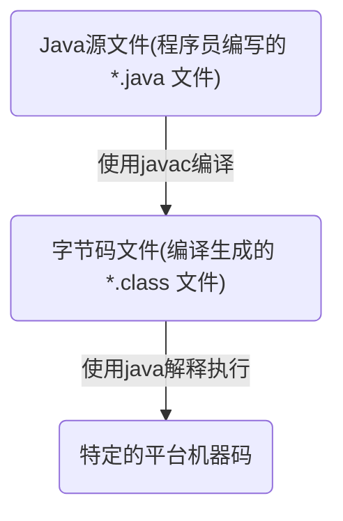
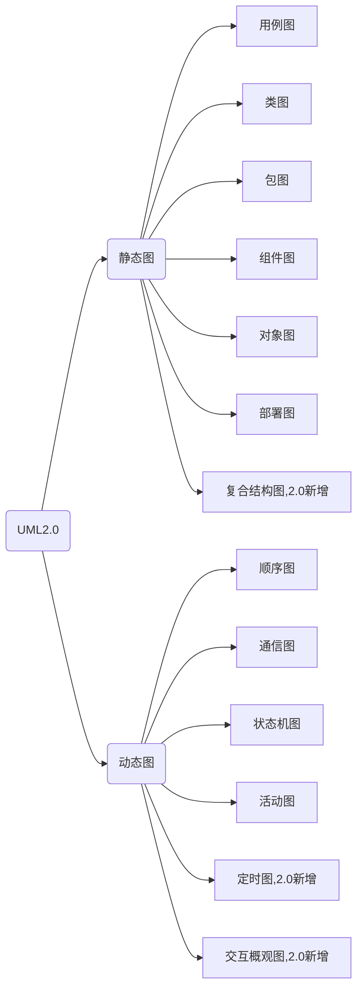
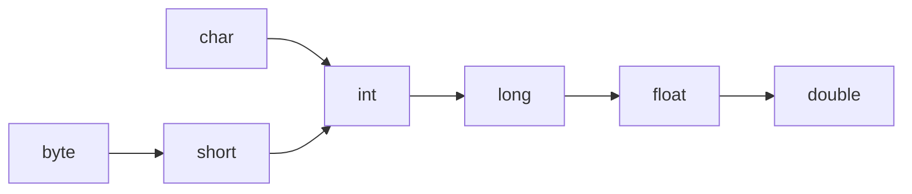

# Java

使用Java有段时间了，当初工作需要开始接触，摸着石头过河，绝大部分对Java的理解源自平时搬砖，说实话目前我所看到的Java并不符合我的审美，甚至某些Java项目（工作中涉及业务的Java项目，我不觉得自己有资格评价Java及被广泛使用的Java开源项目）的架构与我的技术观出入极大。即日起，我准备系统性地学习Java，很期待对Java理解渐渐深入的我回头看今日我的肤浅及粗糙。
2019/6/12


## Java语言概述与开发环境

### Java 程序运行机制

#### 编译型语言 vs 解释型语言

Java 是一种特殊的高级语言，Java 程序要经过先编译，后解释两个步骤，所以 Java 同时具有编译型语言和解释型语言的特性。

* 编译型语言（一次性”翻译“）
  * 使用专门的编译器，针对特定平台（操作系统）将某种高级语言代码一次性“翻译”成可被该平台硬件执行的机器码（包括机器指令和操作数），并包装成该平台所能识别的可执行性程序的格式，这个转换过程称为编译（Compile）。编译生成的可执行性程序可以脱离开发环境，在特定平台上独立运行。
  * 机器码可脱离开发环境独立运行，运行效率较高，无法移植到其他平台使用。
  * 典型编译型语言：C、C++、Object-C、Swift、Kotlin。
* 解释型语言（逐行”翻译“）
  * 使用专门的解释器对源程序逐行解释成特定平台的机器码并立即执行的语言。解释型语言通常不会进行整体性的编译和链接处理，解释型语言相当于把编译型语言中的编译和解释过程混合到一起同时完成。
  * 可以认为：每次执行解释型语言的程序都需要进行一次编译，因此解释型语言的程序运行效率通常较低，而且不能脱离解释器独立运行。但跨平台比较容易，只需特定平台的解释器即可。
  * 典型解释型语言：JavaScript、Python、Ruby。
* 伪编译型语言（半编译型语言）
  * 首先编译成特定的半机器码（介于语言和机器码中间的代码），并将解释引擎封装在可执行性程序内，当运行程序时，半机器码会被解析成真正的机器码。
  * 伪编译型语言看起来可以脱离开发环境，在特定平台上运行，实际上跟编译型语言还是有很大差别的。
  * 典型的伪编译语言：Visual Basic，他的半机器码：P-代码。

#### Java 程序的运行机制和 JVM

Java 语言比较特殊，由 Java 语言编写的程序需要经过编译步骤，但这个编译步骤并不会生成特定平台的机器码，而是生成一种与平台无关的字节码（也就是 *.class 文件）。当然，这种字节码不是可执行的，必须使用 Java 解释器来解释执行



Java 语言里负责执行字节码文件的是 Java 虚拟机，即 JVM（Java Virtual Machine）。JVM 是可运行 Java 字节码文件的虚拟计算机。所有平台上的 JVM 向编译器提供相同的编程接口，而编译器只需要面向虚拟机，生成虚拟机能理解的代码，然后由虚拟机来解释执行。在一些虚拟机的实现中，还会将虚拟机代码转换成特定系统的机器码执行，从而提高执行效率。

当使用 Java 编译器编译 Java 程序时，生成的是与平台无关的字节码，这些字节码不面向任何具体的平台，只面向 JVM。不同平台的 JVM 都是不同的，但他们提供了相同的接口。JVM 是 Java 程序跨平台的关键部分，只要为不同平台实现了相应的虚拟机，编译后的 Java 字节码就可以在该平台上运行。显然，相同的字节码程序需要在不同的平台上运行，这几乎是”不可能的“，只有通过中间的转换器才可以实现，JVM 就是这个转换器。

JVM 是一个抽象的计算机，和实际的计算机一样，它具有指令集并使用不同的存储区域。它负责执行指令，还要管理数据、内存和寄存器。

Oracle 公司制定的 Java 虚拟机规范在技术上规定了 JVM 的统一标准，具体定义了 JVM 的如下细节：

* 指令集
* 寄存器
* 类文件的格式
* 栈
* 垃圾回收堆
* 存储区

### Java 准备

安装并配置 JDK

#### JDK vs JRE

* JDK（Java SE Development Kit），即 Java 标准版开发包，提供了编译、运行 Java 所需要的各种工具和资源，包括 Java 编译器、Java 运行环境、及常用的 Java 类库等。
* JRE（Java Running Envirenment），即 Java 运行环境，包括 JVM（运行 Java 程序的核心虚拟机）、类加载器、字节码校验器以及大量的基础类库。

#### Java SE vs Java EE vs Java Me

* Java SE（Java Platform，Standard Edition）标准版本，桌面应用开发。
  Java EE（Java Platform，Enterprise Edition）企业版本，Web 程序开发。
  Java ME（Java Platform，Micro Edition）微型版本，手机应用开发。

#### 安装目录结构

* bin：JDK 的各种工具命令，例如 javac、java，一般安装成功后在PATH中加入该路径
* conf：JDK 的相关配置文件
* include：平台特定的头文件
* jmods：JDK 的各种模块
* legal：JDK 各种模块的授权文档
* lib：JDK 工具的一些补充 JAR 包
* README 和 COPYRIGHT 文档说明

###第一个 Java 程序

1. 编辑 Java 源代码

2. 编译 Java 程序

   ```shell
   javac -d destdir srcFile
   # -d destdir 是javac命令的选项，用以指定编译生成的字节码文件存放的路径
   # srcFile 是 Java 源文件所在的位置
   # 例如：
   javac -d HelloWorld.java
   ```

3. 运行 Java 程序

   ```shell
   java Java类名
   # 例如：
   java HelloWorld
   ```

### Java 程序的基本规则

#### 组织形式

Java 程序是一种纯粹的面向对象的程序设计语言，必须以类（Class）的形式存在，类是 Java 程序的最小程序单位。Java 程序不允许可执行性语句、方法等成分独立存在，所有的程序部分必须放在类里。

```java
public class HelloWorld{
	public static void main(String[] args){
    System.out.println("Hello World!");
  }
}
```

一个 Java 程序往往只需要一个入口，也就只有一个类包含 main 方法，而其他类都是被 main 方法直接或间接调用的。

#### 命名规则

* Java 文件的扩展名必须是 .java。
* 如果 Java 程序源代码里定义了一个 public 类，则该源文件的主文件名必须与该 public 类的类名相同，如果没定义 public 类，则主文件名可以任意，但推荐与类名相同。
* 一个 Java 源文件只能定义一个类，不同的类使用不同的源文件定义。

### 垃圾回收机制

Java 程序的内存分配和回收都是由 JRE 在后台自动进行的（隐式的），所有的 JVM 实现都有一个由垃圾回收器管理的堆内存，这种实现方式有以下优点：

* 提高编程效率
* 保护程序的完整性

垃圾回收特点：

* 垃圾回收器只回收内存资源，对其他物力资源，如数据库连接、磁盘I/O等资源则无能为力。
* 为了让垃圾回收器更快回收那些不再被使用的对象，可以将对象的引用变量设置为 null。
* 垃圾回收发生不可预知，不同 JVM 采用不同的垃圾回收机制和垃圾回收算法，可以调用对象的 gc() 或  System.gc() 等方法建议系统进行垃圾回收，但仅仅是建议，依旧不能精准控制垃圾回收机制的执行。
* 垃圾回收的精确性主要包括两个方面：
  * 能够精确地标记活着的对象
  * 能够精确地定位对象之间的引用关系
* 现在的 JVM 有多种不同的垃圾回收实现


## 理解面向对象

### 面向对象

目前软件开发领域有两种主流的开发方法：结构化开发方法和面向对象开发方法。

#### 结构化程序设计

结构化程序设计方法主张按功能来分析系统需求，其主要原则可概括为自订向下、逐步求精、模块化等，也称面向功能的程序设计、面向数据流的处理方式。

结构化程序设计里最小的程序单元是函数，程序入口为主函数，主函数调用普通函数、普通函数间相互调用，完成整个软件系统的功能。

#### 程序的三种基本结构

* 顺序
* 选择
* 循环
  * 当型循环
  * 直到型循环

#### 面向对象程序设计

面向对象的基本思想是使用类、对象、继承、封装、消息等基本概念进行程序设计。强调以现实世界中的的事物（即对象）为中心思考，并根据这些事物的本质特点，把它们抽象地表示为系统中的类。

成员变量（状态数据）+ 方法（行为）= 类定义

#### 面向对象的基本特征

面向对象三个基本特征：

* 封装（Encapsulation）
  * 将对象的实现细节隐藏起来，然后通过一些公用方法来暴露该对象的功能。
* 继承（Inheritance）
  * 子类继承父类后，子类作为一种特殊的父类，将直接获得父类的属性和方法。
* 多态（Polymorphism）
  * 子类对象可以直接赋给父类变量，但运行时依然表现出字类的行为特征，这意味着同一个类型的对象在执行统一方法时，可能表现出多种行为特征。
* 抽象（面向对象的重要部分，非特征，因为所有语言都需要抽象）
  * 忽略一个主题中与当前目标无关的那些方面。

面向对象还支持如下几个功能：

* 对象是面向对象方法中最基本的概念，他的基本特点有：标识唯一性、分类性、多态性、封装性、模块独立性等。
* 类是具有共同属性、共同方法的一类事物。类是对象的抽象；对象则是类的实例。
* 对象间相互合作需要一个机制协助进行，这个机制称为“消息”。消息是一个实例与另一个实例之间相互通信的机制。
* 面向对象方法中国呢，类之间共享属性和操作的机制称为继承。继承具有传递性，继承可分为单继承和多继承，由于多继承可能引起继承结构混乱，降低程序的可理解性，所以 Java 不支持多继承。

判断一门语言是否是面向对象的，通常可以用继承和多态特性。

### UML（统一建模语言）

面向对象的方式由 OOA（面向对象分析）、OOD（面向对象设计）、OOP（面向对象编程）三部分有机组成，OOA 和 OOD 的结构需要一种方式来描述并记录，目前业界统一采用 UML（统一建模语言）。

UML 是一种定义良好、易于表达、功能强大且普遍适用的建模语言，它的作用域不限于支持面向对象的分析与设计，还支持从需求分析开始的软件开发全过程。



### Java 的面向对象特征

Java 是纯粹的面向对象编程语言

#### 一切都是对象

在 Java 语言中，除8个基本数据类型值之外，一切都是对象。对象不仅能表示具体的事物，也能表示抽象的规则、计划或事件。

* 对象具有状态，Java 通过定义成员变量来描述对象的状态。
* 对象还有操作，这些操作可以改变对象的状态，操作也被称为行为，Java 通过定义方法来描述对象的行为。
* 对象实现了数据和操作的结合。
* 对象是 Java 程序的核心，所以 Java 里的对象具有唯一性，每个对象都有一个标识来引用它，某个对象失去了标识，这个对象将变成垃圾，只能等垃圾回收机制来回收它。
* Java 语言不允许直接访问对象，而是通过对对象的引用来操作对象。

#### 类和对象

具有相同或相似性质的一组对象的抽象就是类，类是对一类事物的描述，是抽象的、概念上的定义；对象是实际存在的该类事物的个体，因而也称为实例（instance）。

对象的抽象化是类，类的具象化是对象。

Java 语言使用 class 关键字定义类，定义类时可使用成员变量来描述该类对象的数据，可使用方法来描述该类对象的行为特征。

* 一般 → 特殊关系：典型继承关系。
* 整体 → 部分结构关系：组装结构，典型组合关系。


## 数据类型和运算符

Java 提供了丰富的基本数据类型

* 数值类型
  * 整型
  * 字符型
  * 浮点型
  * 所有数值类型之间可以进行类型转换
* 布尔类型

Java 提供了功能丰富的运算符

* 算数运算符
* 位运算符
* 比较运算符
* 逻辑运算符
* 运算符和操作数连接在一起就形成了表达式

### 注释

#### 添加注释的必要性

* 永远不要相信自己的理解力！
* 可读性第一，效率第二！
* 代码即文档！

#### 单行注释

在程序中注释一行代码，将 “//” 放在需要注释的内容前。

#### 多行注释

一次性地将多行代码注释掉，使用 “/\*” 和 “\*/“ 将程序中需要注释的内容包含起来。

#### 文档注释

如果编写 Java 源代码时添加了合适的文档注释，然后通过 JDK 提供的 javadoc 工具可以直接将源代码里的文旦注释提取成一份系统的 API 文档。

文档注释以 “/\*\*” 开，以 “\*/“ 结束，中间部分全部是文档注释，会被提取到 API 文档中。

常见的 javadoc 标记：

* @author：指定 Java 程序的作者
* @version：指定源文件的版本
* @deprecated：不推荐使用的方法
* @param：方法的参数说明
* @return：方法的返回参数说明
* @see：“参见”，用于指定交叉参考的被容
* @exception：抛出异常的类型
* @throws：抛出的异常，和 @exception 同义

### 标识符和关键字

#### 分隔符

Java 语言里的分号、花括号、方括号、圆括号、空格、句号 都具有特殊的分隔作用，统称为分隔符。

#### 标识符规则

* 可以由字母、数字、下划线和美元符组成，其中数字不能打头。
* 不能是 Java 关键字和保留字
* 不能包含空格
* 不能是单独的数字或下划线或美元符

#### Java 关键字

Java 一共包含50个关键字

| abstract | continue | for        | new       | switch       |
| -------- | -------- | ---------- | --------- | ------------ |
| assert   | default  | if         | package   | synchronized |
| boolean  | do       | goto       | private   | this         |
| break    | double   | implements | protected | throw        |
| byte     | else     | import     | public    | throws       |
| case     | enum     | instanceof | return    | transient    |
| catch    | extends  | int        | short     | try          |
| char     | final    | interface  | static    | void         |
| class    | finally  | long       | strictfp  | volatile     |
| const    | float    | native     | super     | while        |

### 数据类型分类

#### Java 是一门强类型（strongly typed）语言

- 所有变量必须先声明、后使用。
- 指定类型的变量只能接受类型与之匹配的值。

#### 声明变量

```java
type varName[= 初始值];
```

#### 数据类型分类

* 基本类型（Primitive Type）
  * 数字类型
  * 布尔类型
* 引用类型（Reference Type）
  * 类
  * 接口
  * 数组
  * null

空引用（null）只能被转换成引用类型，不能被转换成基本类型，因此不要把 null 赋给基本数据类型的变量。

### 基本数据类型

#### 整数类型

* byte
  * 1个字节（内存里占8位）
  * -2<sup>7 </sup> ~ 2<sup>7</sup>-1
* short
  * 2个字节
  * -2<sup>15</sup>  ~ 2<sup>15</sup>-1
* int
  * 4个字节
  * -2<sup>31</sup>  ~ 2<sup>31</sup>-1
* long：8个字节
  * -2<sup>63</sup>  ~ 2<sup>63</sup>-1
* 如果直接将一个较小的整数（在 byte 或 short 范围内）赋给一个 byte 或 short 变量，系统会自动把这个整数值当成 byte 或 short 类型来处理。
* 如果使用一个巨大的整数（超出了 int 范围）时，Java 不会自动把这个整数值当成 long 类型来处理。如果希望系统把一个整数型当成 long 类型来处理，应该在这个整数值后增加 l 或者 L 作为后缀，推荐使用 L，避免混淆。
* Java 中整数值有4种表示形式：十进制、二进制、八进制、十六进制。二进制以 0b 或 0B 开头；八进制以 0 开头；十六进制以 0x 或 0X 开头。

#### 字符类型

* char
  * 2个字节
  * 必须使用单引号括起来。
  * 字符型值有三种表达形式：
    * 单个字符
    * 转义字符
    * Unicode 值
* Java 没有提供表示字符串的基本数据类型，而是通过 String 类来表示字符串，由于字符串由多个字符组成，因此字符串要使用双引号括起来。

#### 浮点类型

* float：
  * 4个字节
  * 第1位是符号位，接下来8位表示指数，再接下来23位表示尾数。
* double
  * 8个字节
  * 第1位是符号位，接下来11位表示指数，再接下来52位表示尾数。
* 因为 Java 浮点数使用二进制数据的科学计算法表示浮点数，因此可能不能精确表示一个浮点数，使用 double 比 float 更准确，如要求精准，可以考虑 BigDecimal 类。
* Java 语言的浮点数有两种表达形式：
  * 十进制数形式
  * 科学计数法形式，例如：5.12e2（即 5.12*10<sup>2</sup>）
* 浮点数默认是 double 类型，如希望 float 类型，可在该浮点数后紧跟 f 或 F。
* Java 还提供三个特殊的浮点数：正无穷大（POSITIVE_INFINITY）、符无穷大（NEGATIVE_INFINITY）、非数（NaN）。

#### 布尔类型

* boolean
  * true
  * false

### 基本类型的类型转换

Java 语言所提供的7种数值类型之间可以相互转换，有两种转换方式：自动类型转换和强制类型转换。

#### 自动类型转换

* 系统支持把某种基本类型的值直接赋给另一种基本类型的变量，这种方式被称为自动类型转换。
* 当把一个表数范围小的数值或变量直接赋给另一个表数范围大的变量时，系统将可以进行自动类型转换；否则需要强制类型转换。



* 注意：是数的范围，并非占的空间。
* 当任何基本类型的值和字符串值进行连接运算时，基本类型的值将自动类型转换为字符串类型。

#### 强制类型转换

* 强制类型转换的语法格式：(targetType)value 。
* 当试图强制把表数范围大的类型转换为表数范围小的类型时，必须格外小心信息丢失。
* Java 为8种基本类型都提供了对应的包装类：boolean 对应 Boolean、byte 对应 Byte、short 对应 Short、int 对应 Integer、long 对应 Long、char 对应 Character、float 对应 Float、double 对应 Double。8个类都提供了一个 parseXxx(String str) 静态方法用于将字符串转换成基本类型。

#### 表达式类型的自动提升

* 所有的 byte 类型、short 类型和 char 类型将被提升到 int 类型。
* 整个算数表达式的数据类型自动提升到表达式中最高等级操作数相同的类型。

### 直接量

#### 直接量的类型

* 能指定直接量的通常只有三种类型：基本类型、字符串、null 类型。

#### 直接量的赋值

* 把一个直接量赋值给对应类型的变量是合法的。
* 在系统支持自动类型转换的前提下，允许把一个数值直接量直接赋值给另一种类型的变量。
* null 类型的直接量可以直接赋值给任何引用类型的变量。

### 运算符

#### 算数运算符

\+  -  *  /  %  ++  --

#### 位运算符

* &：按位与
* |：按位或
* ~：按位非
* ^：按位异或
* <<：左移
* \>\> ：右移
* \>\>\>：无符号右移

#### 扩展后的赋值运算符

+=  -=  *=  /= %=  &=  |=  ^=  <<=  >>=  >>>=

#### 比较运算符

\>  >=  <  <=  ==  !=

#### 逻辑运算符

* &&：与
* &：不短路与
* ||：或
* |：不短路或
* !：非
* ^：异或

#### 三目运算符

三目运算符的语法格式如下：

```java
(expression) ? if-true-statement : if-false-statement
```

#### 运算符的结合性和优先级

* 单目运算符、赋值运算符、三目运算符是从右向左结合的（从右向左运算），其他的都是从左向右结合的。
* 运算符优先级（上面优先）：

| 运算符说明         | Java 运算符                                    |
| ------------------ | ---------------------------------------------- |
| 分隔符             | .  ()  []  {}  ,  ;                            |
| 单目运算符         | ++  —  ~  !                                    |
| 强制类型转换运算符 | (type)                                         |
| 乘法/除法/求余     | *  /  %                                        |
| 加法/减法          | +  -                                           |
| 移位运算符         | <<  >>  >>>                                    |
| 关系运算符         | <  <=  >  >=  instanceof                       |
| 等价运算符         | ==  !=                                         |
| 按位与             | &                                              |
| 按位异或           | ^                                              |
| 按位或             | \|                                             |
| 条件与             | &&                                             |
| 条件或             | \|\|                                           |
| 三目运算符         | ?:                                             |
| 赋值               | =  +=  -=  *=  /=  &=  \|=  ^=  <<=  >>=  >>>= |

* 不要把一个表达式写得过于复杂，过于复杂就该分成几步来完成。
* 不要过多依赖运算符的优先级来控制执行顺序，可读性太差，尽量用 () 来控制。


## 流程控制与数组

### 顺序结构

从上到下依次执行。

### 分支结构

#### if 条件语句

```java
if (logic expression) {
	statement;
}

if (logic expression) {
	statement;
} else {
  statement;
}

if (logic expression) {
	statement;
} else if (logic expression) {
  statement;
}
```

* 如果执行体只有一行，可省略执行体的花括号，但不建议这样做。
* 使用 if…else 语句时，应先处理范围更小的情况。

#### switch 分支语句

```java
switch (expression){
	case condition1:
	{
		statement;
		break;
	}
	case condition2:
	{
		statement;
		break;
	}
	...
	case conditionN:
	{
		statement;
		break;
	}
	default:
	{
		statement;
	}
}
```

* switch 语句后面的控制表达式的数据类型只能是 byte、short、char、int 四种整数类型，String 和枚举类型。

### 循环结构

循环语句可能包含如下4个部分：

* 初始化语句（init_statement）
* 循环条件（test_expression）
* 循环体（body_statement）
* 迭代语句（interation_statement）

#### while 循环语句

```java
[init_statement]
while (test_expression) {
	statement;
	[iteration_statement]
}
```

#### do while 循环语句

```java
[init_statement]
do{
	statement;
	[interation_statement]
}while (test_expression)
```

#### for 循环语句

```java
for ([init_statement]; [test_expression]; [iteration_statement]) {
	statement;
}
```

#### 控制循环结构

* break ：结束循环。
* continue ：忽略本次循环剩下的语句。
* return ：结束方法。

### 数组类型

#### 理解数组

* Java 中，一个数组里只能存储同一种数据类型的数据。
* 一旦数组初始化完成，它在内存中所占的空间将被固定下来，因此数组的长度将不可改变。
* Java 数组即可存储基本类型的数据，也可以存储引用类型的数据。

#### 定义数组

```java
type[] arrayName;
type arrayName[];
```

* 推荐使用第一种定义方式。
* 定义数组时不能指定数组的长度。
* 定义数组只是定义了个引用变量，并未指向任何有效的内存空间，所以还不能使用，只有对数组进行初始化之后才能使用。

#### 初始化数组

* 静态初始化

  * 初始化时由程序员显示指定数组每个元素的初始值，由系统决定数组长度。

    ```java
    arrayName = new type[]{element1, element2...};
    ```

  * 在定义数组的同时执行初始化操作可简化成以下格式：

    ```java
    type[] arrayName = {element1, element2...};
    ```

* 动态初始化

  * 初始化时程序员只指定数组长度，由系统为数组元素分配初始值。

    ```java
    arrayName = new type[length];
    ```

  * 定义同时初始化：

    ```java
    type[] arrayName = new type[length];
    ```

    

  * 系统默认初始值

    * 整数类型（byte、short、int、long）：0
    * 浮点类型（float、double）：0.0
    * 字符类型（char）：'\u0000'
    * 布尔类型（boolean）：false
    * 引用类型（类、接口、数组等）：null

#### 使用数组

```java
objArr[idx];
```

#### foreach 循环

```
for (type variableName : array | collection) {
	variableName statement;
}
```

### 深入数组

数组是一种引用数据类型，数据引用变量只是一个引用，数组元素和数组变量在内存里是分开存放的。

